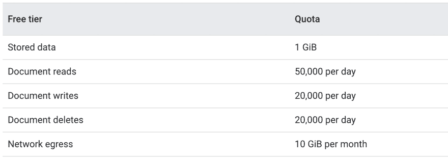
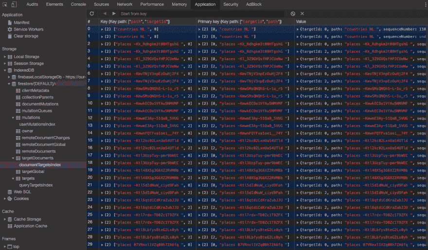

# 创建永不离线的 web 应用程序！

> 原文：<https://dev.to/paco_ita/break-the-cache-api-limits-in-our-pwa-oo3>

欢迎阅读关于渐进式 web 应用的第五篇文章。🙋
如果你阅读了[这个系列的第一篇文章](https://dev.to/paco_ita/a-gentle-introduction-to-progressive-web-apps-step-1-24da)，你现在应该有了一个坚实的基础，即使 PWAs 是完全未知的。
像`service workers`、`web app manifest`、`cache API`这些名词你应该很熟悉。在前面的文章中，我们发现了可以用来轻松地从头构建 PWA 的不同工具。因此，您可能已经开始使用学习到的渐进式功能升级您现有的 web 应用程序。

这已经是为我们的用户提供更好体验的一个进步。然而，我们还可以做些别的事情来进一步利用渐进式网络应用程序的功能，并将它们带到一个新的水平。我将向您展示，如今，借助现代技术，我们可以为用户提供永不离线的应用程序。

所以拿杯咖啡，让自己舒服一点，让我们开始吧！！

[](https://i.giphy.com/media/l0IyjiXOXTX6Yemsg/giphy.gif)T3】

## 缓存 API 的限制

我们之前了解到`Cache API`只允许缓存`GET Requests`，但是目前还不能缓存 [`POST nor PUT`](https://w3c.github.io/ServiceWorker/#cache-put) 。
如果你试图缓存一个不是`GET`的请求，你会收到下面的错误:`TypeError: Invalid request method POST.`(这里是我们提交帖子的情况)。

因此，我们的网络应用仍然离线工作，它允许导航和阅读内容，但它只提供了被动的体验。尽管这在很多情况下都很好，但是如果我们能够提供完整的 CRUD(创建、读取、更新、删除)功能，甚至是离线的，那就更好了。

为此，有必要开发定制的解决方案来克服这一限制。例如，我们可以检测客户端何时离线，在这种情况下，将用户在表单中输入并试图发送到服务器的值存储在索引数据库中。
然后，当用户的网络连接恢复时，我们的应用程序必须推送所有待定的更改。我们还必须计划如何处理 POST 失败时的异常，以及这会如何影响其他缓存的请求。

另一种可能性由`Cloud Firestore`给出。

## 云火店

[](https://res.cloudinary.com/practicaldev/image/fetch/s--ccCMPZpR--/c_limit%2Cf_auto%2Cfl_progressive%2Cq_auto%2Cw_880/https://thepracticaldev.s3.amazonaws.com/i/9uhu47s2cfwho07z1dbc.png)

> Cloud Firestore 是一个灵活、可扩展的 NoSQL 数据库，用于 Firebase 和 Google 云平台的移动、web 和服务器开发。它通过实时监听器使您的数据在客户端应用程序之间保持同步，并为移动和 web 提供离线支持，因此您可以构建响应迅速的应用程序，无论网络延迟或互联网连接如何都可以工作。

[](https://res.cloudinary.com/practicaldev/image/fetch/s--ePddTFqJ--/c_limit%2Cf_auto%2Cfl_progressive%2Cq_auto%2Cw_880/https://thepracticaldev.s3.amazonaws.com/i/r26hmpckf4r3qgtkzxje.png)
Firestore 数据库中的数据保存为名为`Documents`的 json 对象(key:value 结构)并包含在`Collections`中。这种组织使得以类似于我们的 web 应用程序 DTOs 的方式设计领域对象(保存在数据库中)变得更加容易。

Firebase platform 还提出了一个慷慨的*免费层*:

[](https://res.cloudinary.com/practicaldev/image/fetch/s--p4eRDKFQ--/c_limit%2Cf_auto%2Cfl_progressive%2Cq_auto%2Cw_880/https://thepracticaldev.s3.amazonaws.com/i/e0c1c5o73li16443h4bu.png)

因此，我们可以将它用于我们的个人项目或演示，而不必担心初始成本。

我将保留一篇单独的文章来更详细地描述 Firebase 平台和其他云 Firestore 特性。这里我们集中讨论它的`offline persistence`功能。

#### 离线暂留

默认情况下，为移动开发启用脱机存储，但不为 web 启用。我们必须通过调用`enablePersistence`方法来显式激活它:

```
// Register Firebase Keys
firebase.initializeApp({
  apiKey: '### FIREBASE API KEY ###',
  authDomain: '### FIREBASE AUTH DOMAIN ###',
  projectId: '### CLOUD FIRESTORE PROJECT ID ###',
} ,"myDemoApp");

// Enable offline support
firebase.firestore().enablePersistence()
  .catch(function(err) {
      if (err.code == 'unimplemented') {
          // The current browser does not support all of the
          // features required to enable persistence
      }
  });
}); 
```

Enter fullscreen mode Exit fullscreen mode

从这一刻起，从服务器接收的任何文档都存储在本地的索引数据库中。现在，即使没有网络连接，我们也可以阅读、编辑或删除任何缓存的文档。如果缓存不包含请求的文档，将返回一个错误。用户一恢复在线，所有待决的本地更改就会自动与服务器上的数据库同步。

让我们想象一下，我们在一个中断网络连接的火车上旅行，不断地离线和在线。听起来很熟悉，不是吗？

[](https://res.cloudinary.com/practicaldev/image/fetch/s---IJemlL_--/c_limit%2Cf_auto%2Cfl_progressive%2Cq_auto%2Cw_880/https://thepracticaldev.s3.amazonaws.com/i/a53s0n41slya7y73z6r9.jpg)

然而，我们的应用程序仍然是可访问的，甚至允许修改其内容(只要我们在缓存中有请求的文档)。我们设计了一个无论在线还是离线都能无缝运行的 PWA。

我们可以在 DevTools 的“应用程序”选项卡中分析缓存的数据(如果使用 Chrome):

[](https://res.cloudinary.com/practicaldev/image/fetch/s--_TDUkyIZ--/c_limit%2Cf_auto%2Cfl_progressive%2Cq_auto%2Cw_880/https://thepracticaldev.s3.amazonaws.com/i/jfrak95w4fr0d77baldc.png)

默认情况下，缓存限制为 40MB。超过此限额后，Firestore 会尝试清理旧文档，直到缓存大小恢复到限制设置以下。可以指定不同的阈值(最小值必须是 1MB)或完全禁用驱逐过程:

```
firebase.firestore().settings({
  cacheSizeBytes: firebase.firestore.CACHE_SIZE_UNLIMITED
}); 
```

Enter fullscreen mode Exit fullscreen mode

#### Firestore 限制

但是，在决定在我们的应用程序中使用 Firestore 之前，我们必须了解一些限制:

*   **待定更改的限制设置为 500。**
    谷歌工程师明确设计了这样一个限制，因为离线持久化是为了覆盖暂时的连接中断，不会被长时间使用。

*   **并发更新策略是“最后写入者优先”。**
    如果数据库中的同一个文档有多次更新，将保存到达服务器的最后一次写入。如果旧的数据来自离线的客户端，并且现在正在同步其挂起的更改，这可能会导致潜在的保存旧的*数据。* 

在这一点上，选择权在你。离线时不一定要提供编辑功能，这取决于您的业务需求。如果你决定去做，那么要么你开发一个完整的定制解决方案，要么选择 Firestore。我发现后一种选择不费吹灰之力就能带来很多好处。

在这篇文章中，我们看到了如何进一步改进我们的 PWA，我希望能够说服你，现在实现潜在的永不离线的 web 应用程序是可能的！

[T4】](https://i.giphy.com/media/OOSp3kMb3IL4lE27Ar/giphy.gif)

你可以关注我:

[](https://twitter.com/paco_ita)