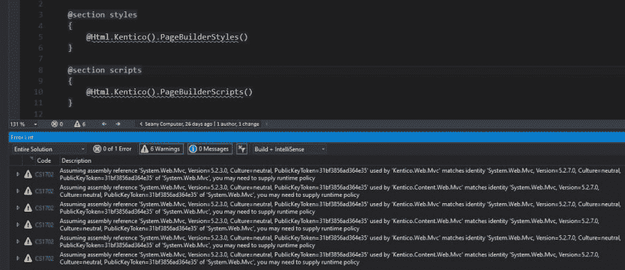
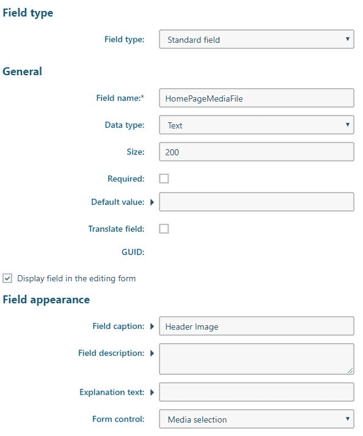
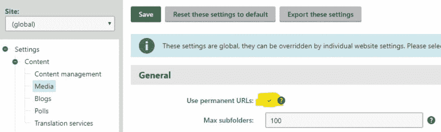

# Kentico 技术支持问答:2019 年夏季

> 原文：<https://dev.to/wiredviews/kentico-technical-support-q-a-summer-2019-3k4f>

<figure>

[](https://res.cloudinary.com/practicaldev/image/fetch/s--xGkFPF52--/c_limit%2Cf_auto%2Cfl_progressive%2Cq_auto%2Cw_880/https://thepracticaldev.s3.amazonaws.com/i/6f2jx4awqc8wl67ynwuy.jpg)

<figcaption>Photo by [jose aljovi](https://unsplash.com/@josealjovin) on [Unsplash](https://unsplash.com)</figcaption>

</figure>

* * *

对于作为 Kentico 合作伙伴的代理商来说，( [WiredViews](https://www.kentico.com/partners/wiredviews-inc) 是黄金合作伙伴)，Kentico 的技术支持服务非常有帮助。

合作伙伴往往会建立许多网站，并深入挖掘 Kentico 提供的特性和功能。

Kentico 的支持团队随时准备为遇到技术障碍的开发人员提供答案、见解和故障排除。🙏

无论是[官方文档](https://docs.kentico.com/k12sp)不太关注的领域，还是独特的用例，发电子邮件支持肯定能让你摆脱困境。

下面我想列出过去 6 个月我发送给 Kentico support 的问题以及我收到的回答，以便其他人可以从我学到的知识中受益。👐

> 我喜欢尽我们所能确保我们的集体知识不被储存在聊天信息或电子邮件中的想法——学习一些东西，分享一些东西！
> 
> 这个帖子的想法来自为 [Wakefly](https://www.wakefly.com/) 工作的[克里斯·巴斯](https://chrisbass.wakeflyexperts.com/blog)。他是一个多产的作家和一个知识渊博的 Kentico 开发者。⚡
> 
> 查看他的帖子 [Kentico 支持综述，2018 年夏季](https://chrisbass.wakeflyexperts.com/blog/july-2018/kentico-support-roundup-summer-2018)。

* * *

## 问&答

*   当 Razor(.cshtml)文件被打开
*   [`Kentico.Web.Mvc`和`Kentico.Content.Web.Mvc`是开源的吗？](#open-source)
*   [目前不支持定制 MVC Razor 视图引擎](#custom-view-engine)
*   [使用“媒体选择”表单控件的页面类型“文本”字段](#text-fields-media-selection)
*   [没有集成测试的单元测试自定义页面类型](#unit-test-page-type)
*   [PageBuilders 浏览器错误`[JsonReaderException: Error reading JObject from JsonReader. Path '', line 0, position 0.]`](#page-builder-error)

### 在 Visual Studio 中刮胡刀时的怪异警告(。cshtml)文件被打开

如果你使用的是 MVC 5 最新的 NuGet 包，那么当你打开 Razor 文件时，你可能会在 Visual Studio 的输出标签中看到警告。

[](https://res.cloudinary.com/practicaldev/image/fetch/s--IMUzIcXS--/c_limit%2Cf_auto%2Cfl_progressive%2Cq_auto%2Cw_880/https://thepracticaldev.s3.amazonaws.com/i/iid813t03i0ytd1gkg8e.jpg)

> `Warning CS1702 Assuming assembly reference 'System.Web.Mvc, Version=5.2.3.0, Culture=neutral, PublicKeyToken=31bf3856ad364e35' used by 'Kentico.Web.Mvc' matches identity 'System.Web.Mvc, Version=5.2.7.0, Culture=neutral, PublicKeyToken=31bf3856ad364e35' of 'System.Web.Mvc', you may need to supply runtime policy`

这是因为 Kentico 的 MVC 集成 NuGet 包，`Kentico.Web.Mvc`和`Kentico.Content.Web.Mvc`严格定义了对旧版本`System.Web.Mvc`的依赖。具体来说，他们需要`5.2.3`，而在这个截图中，我使用的是`5.2.7`。

可以在 Visual Studio 的开发者社区论坛上找到解决方案。

所需要做的就是将警告编号`1702`添加到`web.config`底部的`<configuration><system.codedom><compilers><compiler lang="c#;cs;csharp">`元素中的`/nowarn`列表中。

应该是这样的`compilerOptions="/langversion:default /nowarn:1659;1699;1701;1702"`

然后重新构建您的项目，警告就会消失！😉

* * *

### `Kentico.Web.Mvc`和`Kentico.Content.Web.Mvc`是开源的吗？

我喜欢 Kentico 在 GitHub 上的表现，特别是有了 Kentico Cloud，开发者可以查看源代码，打开 PRs，并为他们正在使用的工具做出贡献。

这种类型的开放协作建立了开发者的信任并发展了社区。

在 Kentico 11 中，MVC 集成得到了更多的关注，虽然它远没有像今天这样功能齐全，但你可以用它来构建站点。

集成库是开源的，可以在 GitHub 上的 [Kentico 的组织](https://github.com/Kentico/Mvc)下找到。

这个项目跟 [Kentico 不一样。AspNet.Mvc](https://www.nuget.org/packages/Kentico.AspNet.Mvc/) 集成包，我们现在将它与 Kentico 12 MVC 一起使用。

不幸的是，这个新项目不是开源的，尽管 Kentico support 告诉我，他们将来会考虑开源。

目前，我使用类似于 [dotpeek](https://www.jetbrains.com/decompiler/) 的工具来查看这个项目的反编译 C#，目的是为了理解 MVC 集成架构和解决问题。

如果你想看到这个项目开源，请投票支持我创建的 UserVoice 创意。😎

* * *

### 目前不支持定制 MVC Razor 视图引擎

ASP.NET MVC 在其视图引擎中提供了一个定制点。这个类有助于查找和呈现一个视图，给出当前请求、控制器和动作的信息。

开发人员可能想要定制它(通过替换或覆盖默认文件)的原因是改变 MVC 寻找 Razor 视图(`.cshtml`)文件的方式。

自定义视图引擎的两种常见情况如下:

MVC 中文件和文件夹结构的“特性文件夹”方法，要求将视图文件放在与控制器和模型类相同的位置。这里有一篇[博客文章](https://bojanv91.github.io/posts/2016/05/feature-folders-structure-in-asp-net)解释了如何只用几行代码就完成这项工作。💪

预编译 MVC Razor 文件以加快加载速度，这可以通过像[https://github.com/RazorGenerator/RazorGenerator](https://dev.toRazorGenerator)这样的库来完成。💪

目前，Kentico 12 不支持自定义视图引擎——我猜是因为 Kentico 的 PageBuilder 功能严重依赖 MVC 的开箱即用的视图位置约定。

> Kentico 支持部门确实测试了`RazorGenerator`，并在快速点击测试中没有发现任何问题，但它肯定没有得到任何形式的官方支持。

如果你希望看到这些场景成为 Kentico 的可能性，请为我的 [UserVoice 想法](http://ideas.kentico.com/forums/239189-kentico-product-ideas/suggestions/36877402-official-support-for-feature-folders-pattern-in)投票。💯

* * *

### 页面类型“文本”字段使用【媒体选择】表单控件

Kentico 中的文档附件很灵活，但有时并不完全符合您的需要，因为它们并没有赋予开发人员了解其内容或限制其使用方式的权力。

可以使用定制页面类型“文件”类型的字段来代替。您可以选择“直接上传”控件作为字段的表单控件，然后修改其设置以限制字段中放置的内容。🤔

其他时候，您希望能够将媒体库中的文件连接到自定义页面类型字段，因为媒体内容将在整个站点中重复使用，或者内容编辑器需要从媒体的精选列表中选择。🧐

以下是实现这一功能的字段设置示例:

[](https://res.cloudinary.com/practicaldev/image/fetch/s--LJTUV3HT--/c_limit%2Cf_auto%2Cfl_progressive%2Cq_auto%2Cw_880/https://thepracticaldev.s3.amazonaws.com/i/d0kw7srqvevxjnbjrjmm.jpg)

但是当使用外部存储时有一个问题(比如 Kentico 的 Azure 存储集成)...

“媒体选择”控件生成并存储在字段中的“直接 Url”在 MVC 站点上呈现时不起作用。😫

使用外部存储时的直接 Url 看起来会像这样`/CMSPages/GetAzureFile.aspx?path=~\azurestorage\...`。

> 由于 MVC 站点中没有`/CMSPages`文件夹，而且 Kentico 没有注册 MVC 路由来处理这样的请求，所以这肯定是行不通的。

当将 Kentico 12 MVC 与外部存储和媒体库结合使用时，您需要遵循 Kentico 的 MVC 文档中的指南。

那一页的结尾解释了这个问题:

> 由 GetDirectUrl 方法为外部存储文件生成的 Url 在 MVC 应用程序上不起作用。

由于“媒体选择”控件是由 Kentico 预先构建的，确保 Kentico 的代码使用永久 URL 的方法是在设置模块中设置该选项。

[](https://res.cloudinary.com/practicaldev/image/fetch/s--TDzbAzEL--/c_limit%2Cf_auto%2Cfl_progressive%2Cq_auto%2Cw_880/https://thepracticaldev.s3.amazonaws.com/i/xkoggh0bk2m2ie9lsdla.jpg)

确保“设置>内容>媒体>使用永久 URL”已选中。

现在，由“媒体选择”控件生成的 URL 被放置到自定义页面类型文本字段中，将成为永久的 URL，如下所示:`~/getmedia/3086a16e-7b07...`。

这些永久的 URL 将在你的 MVC Razor 视图中呈现时工作！😅

* * *

### 单元测试自定义页面类型无集成测试

因为你们都在对应用程序和库代码进行单元测试，所以你们可能想知道如何对与定制页面类型类交互的类和方法进行单元测试。

> 你**正在**写测试，不是吗...？😒 ...如果你不是-别担心😊-我很久没有写测试了，但是在尝试之后，我一直在做。
> 
> 如果你需要帮助，你可以在我之前的文章中阅读 Kentico 中的单元测试: **Kentico 12:设计模式第 2 部分——编写单元测试**
> 
> [](/seangwright) [## Kentico 12:设计模式第 2 部分——编写单元测试
> 
> ### Sean g . Wright 6 月 1 日 197 分钟阅读
> 
> #kentico #unittesting #dotnet #aspnet](/seangwright/kentico-12-design-patterns-part-2-writing-unit-tests-1f8n)

在使用 Kentico `*Info`和`*InfoProvider`类时，我尝试使用标准解决方案进行单元测试。

> 如何做到这一点的细节可以在 Kentico 的文档中找到。

基本步骤是:

1.  让您的测试类从`CMS.Tests.UnitTests`继承。
2.  在与任何`*Info`或`*InfoProvider`类型的人一起工作之前，打电话给`Fake<>()`。
3.  测试吧！

不幸的是，这不适用于定制页面类型类——在运行我的单元测试时，我一直看到这个错误:

> `Message: System.Exception : [CMSTest.Fake]: Cannot fake type 'CMS.DocumentEngine.Types.App.MyCustomPageType', no type info was found for this type.`

当我换成一个[集成测试](https://docs.kentico.com/k12sp/custom-development/writing-automated-tests/creating-integration-tests-with-a-connection-string)时，一切都正常了...除了现在我不得不连接到一个活动的数据库，尽管没有进行任何数据库调用。

答案*是 Kentico 文档中的*，只是与其他自动化测试信息不在同一个地方。

相反，看看这个页面[https://docs . kentico . com/k12sp/developing-websites/testing-MVC-controllers](https://docs.kentico.com/k12sp/developing-websites/testing-mvc-controllers)，在这里我们可以看到一个如何“伪造”定制页面类型的例子:

```
// Allows creating of articles without accessing the database
Fake().DocumentType<Article>(Article.CLASS_NAME); 
```

Enter fullscreen mode Exit fullscreen mode

我们仍然必须从`CMS.Tests.UnitTest`继承，但是我们使用了`Fake().DocumentType<T>()`扩展方法。

现在我们可以继续编写我们的测试了！🤗

* * *

### PageBuilders 浏览器错误`[JsonReaderException: Error reading JObject from JsonReader. Path '', line 0, position 0.]`

如果你看到下面的错误，那么你可能最近修复了你的网站:

```
[JsonReaderException: Error reading JObject from JsonReader. Path '', line 0, position 0.]
 Newtonsoft.Json.Linq.JObject.Load(JsonReader reader, JsonLoadSettings settings) +267
   Newtonsoft.Json.Linq.JObject.Parse(String json, JsonLoadSettings settings) +83
   Kentico.PageBuilder.Web.Mvc.PageBuilderPostDataRetriever`1.GetDataFromBody() +83 
```

Enter fullscreen mode Exit fullscreen mode

当您将 CMS 页面模块中的“页面”选项卡用于已选中“使用页面选项卡”选项的自定义页面类型时，会出现此问题。

Kentico 在 MVC 站点中使用大量 JavaScript 来制作小部件、页面模板(MVC)和所有其他很酷的东西。

如果这些 JavaScript 文件丢失或过期，那么当在 CMS 中呈现时，从 MVC 站点前端发送到后端的请求将会失败。😕

这些请求看起来总是像这样:

`https://localhost:44397/cmsctx/pv/...`

> 这将是对我的 MVC 网站的请求

这个`cmsctx`请求将您的 CMS 身份传递给 MVC 站点，以便呈现页面生成器 UI 并为您显示最新的(可能是未发布的)内容。

这些请求需要被正确解析。网。Kentico 的`Kentico.AspNet.Mvc`包中的 dll 期望一种形式的数据，但是 JavaScript 发送另一种形式，嘣！💥

所以这个故事的寓意是确保你的 MVC 代码库中的`\Kentico\Content\`和`\Kentico\Scripts`下的文件是最新的，并且匹配最新的 [Kentico。AspNet.Mvc](https://www.nuget.org/packages/Kentico.AspNet.Mvc/) 包内容。

如果您仍然看到问题，尝试打开您的浏览器开发工具时，查看 CMS 中的“页面”标签，并清除浏览器缓存。

> 如果你有兴趣阅读更多，有几篇 [DevNet 帖子](https://devnet.kentico.com/questions/cannot-create-new-pages-after-installing-service-pack)也在讨论这个问题。

* * *

## 几个月后见！

好了，这就是我现在要分享的全部内容。您现在可以:

1.  等待 6 个月，直到我有更多的肯蒂科支持问答张贴。
2.  深入了解我在 DEV 上的其他 Kentico 博客帖子(链接如下)。

我希望你选择 2 号！！

我也希望更多的开发人员受到 Chris Bass 的启发，与社区分享您对 Kentico 支持的见解。

感谢阅读！😉

* * *

如果您正在寻找更多的 Kentico 内容，请在 DEV:

## # [肯蒂科](https://dev.to/t/kentico) <button name="button" type="button" data-info="{&quot;className&quot;:&quot;Tag&quot;,&quot;style&quot;:&quot;full&quot;,&quot;id&quot;:5339,&quot;name&quot;:&quot;kentico&quot;}" class="crayons-btn follow-action-button whitespace-nowrap c-btn--secondary fs-base " aria-label="Follow tag: kentico" aria-pressed="false">跟随</button>

或者我的 Kentico 博客系列:

*   [Kentico 12:设计模式](https://dev.to/search?q=Kentico%2012%20-%20Design%20Patterns)
*   [Kentico CMS 快速提示](https://dev.to/search?q=Kentico%20CMS%20Quick%20Tip)