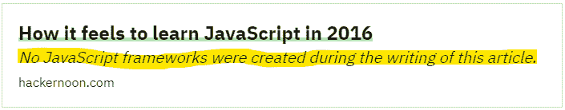
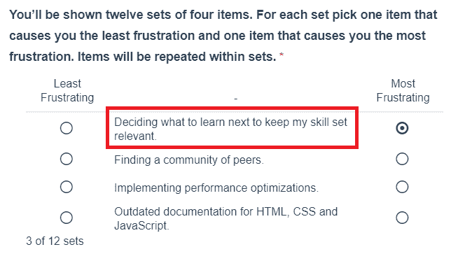

# 编程疲劳。2019/2022 学编码是什么感觉

> 原文：<https://dev.to/fanmixco/programming-fatigue-how-it-feels-to-learn-to-code-in-2019-olo>

不久前，我在阅读几篇关于 JavaScript 和 TypeScript 的文章时，发现了这个特别的预览:

我个人对现在的编程也有类似的印象。过去几年，我有多个学员，他们提出了许多问题，例如:

*   我应该学什么？
*   学 Java 好吗？C 呢？
*   Python 是下一个大事件吗？或者你对 WebAssembly 有什么看法？
*   我应该学习 React Native 还是 Xamarin？
*   Angular 和 React 呢？哪个最好？
*   Azure 好还是 Google 好？
*   你为什么喜欢 UiPath 胜过自动化 Anywhere？

还有很多很多。他们提出各种问题的原因之一是:**在过去的 13 年里，我探索了多种技术和技巧，例如，JavaScript、PHP、VB6、C#、Xamarin、HTML5/CSS3、ASP.NET、ITIL、Automation Anywhere、Azure、SQL Server、MySQL、REST 等。**

然而，我很难建议或学习什么，因为一切都发生了巨大的变化，从桌面开发到 Web 开发，从 Web 开发到云，从云到移动开发，从移动开发到增强现实，从增强现实到机器人流程自动化，从 RPA 到 AI，等等。

目前，如果你诚实的话，我们生活在一个[高度专业化](https://hbr.org/2011/07/the-big-idea-the-age-of-hyperspecialization)的世界里，让你不断地处于观望状态。如果你诚实，大多数公司会认为你是 Java 11、Oracle、UiPath、EC2016+等的“大师”。你已经知道了 React Native + AWS 的大师级水平，以及“一点点”区块链，只为了达到第一次面试。这种情况毫无疑问会造成**疲劳**，因为你很难知道去哪里或者选择什么。你需要从一个分支跳到另一个分支，并尝试在 2 周内重新掌握技能，因为他们认为正确的下一件大事可能明天就会失败，但你必须仍然是这方面的专家！

我最近读过的为数不多的几篇文章中，有一篇能给你提供你应该学习的线索:来自*埃森哲*的 [DARQ skills](https://www.accenture.com/_acnmedia/PDF-94/Accenture-TechVision-2019-Tech-Trends-Report.pdf) 。然而，我仍然有一些严重的疑问，你应该建议某人新鲜。就我个人而言，我做了一种类似于**的工作面试**，以深入了解他们的兴趣，他们对编程世界的期望，他们如何看待未来 5 年的生活，他们对 IT 的哪些领域感兴趣，等等。如果我认识某人，或者根据统计数据提供一些他们应该学习的线索，这有助于我将他们重定向到正确的人，因为我甚至在我们的网页上看到了这个讨论[开发人员是 2018 年的下一个蓝领工作](https://dev.to/stereobooster/developer-is-the-next-blue-collar-job-269b)，我相信这是一个严肃的话题。

# 我想知道你的想法和**你对新人有什么建议？**

**更新:**

我在 Mozilla 的一项调查中得到了这个问题:

看来英雄所见略同。