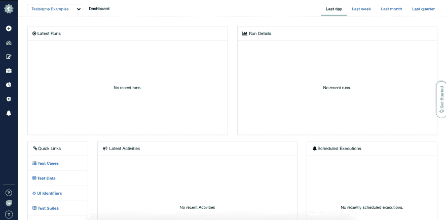
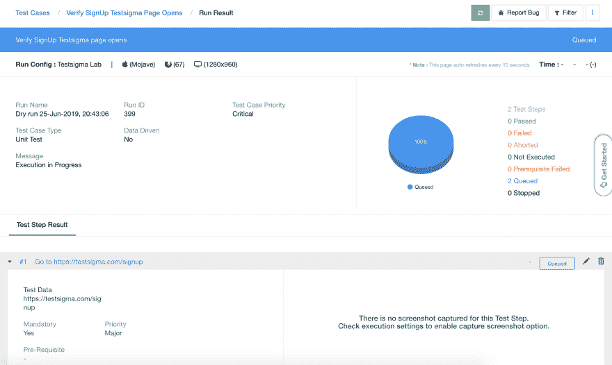

# 使用 Testsigma 的无脚本测试自动化

> 原文：<https://dev.to/tamarajovanovic93/scriptless-test-automation-with-testsigma-55hi>

无脚本测试自动化现在是一个新术语。许多人可能会问“什么是无脚本测试？我需要投入多少时间才能开始无脚本自动化？有没有什么工具/框架可以解决这个问题，或者它是如何工作的？”等。在这篇文章中，我将探索无脚本测试自动化，它的优点和缺点，以及使用我最近遇到的无脚本测试工具 Testsigma 的好处，它有一个移交记录和回放工具。

无脚本测试工具减少并消除了自动化测试创建中涉及的脚本数量。无脚本测试方法加速了自动化测试过程，并最大化了代码的可重用性。有了无脚本测试，测试人员和业务用户能够在没有任何编码知识的情况下自动化测试用例。

#### 无脚本测试自动化的好处

*   **自动化时间减少 70%** -使用无脚本测试，大型测试套件可以更快地自动化。交付速度提高了，测试团队有更多的时间来完成更多的测试覆盖，这导致我们在软件开发生命周期的早期阶段早期检测到错误。
*   **可维护且可靠**–无脚本测试自动化允许更容易地维护无脚本测试套件。这非常重要，因为维护阶段通常是软件产品生命周期中最长也是最关键的阶段。
*   **节省构建脚本技能的成本**–公司在脚本技能的培训资源上花费大量成本和时间，或者需要雇佣熟悉编码和自动化测试的资源。手动测试人员可以轻松地完成无脚本测试自动化，并且您可以节省培训费用。
*   **消除特定于工具的编码**——如果自动化测试是独立于工具的，它会更有效。无脚本测试使手动测试人员能够使用对象和动作构建脚本。
*   **业务分析师和主题专家的参与**–编码既不容易也不容易学。然而，通过无脚本测试，您可以授权非技术人员、BAs 和 SME 协作并参与自动化测试方法。

我现在将向您介绍 [Testsigma](https://testsigma.com) ，这是一个基于 NLP(自然语言处理)的测试自动化工具，使用简单的英语。

### Testsigma

Testsigma 是一个强大的无脚本测试工具。一旦我报名并开始探索，我就爱上了它！Testsigma 有一个易于理解的 UI，一切都清晰易懂。使用它不需要任何编码知识或自动化经验。

使用 Testsigma，您可以:

*   使用简单的英语创建自动化测试
*   将测试分组为测试套件
*   收到包含失败测试的电子邮件
*   观看测试执行的视频
*   配置将在哪些操作系统和浏览器上执行测试
*   安排测试执行的时间
*   做回归测试，跨浏览器测试
*   AI 驱动的维护是最棒的部分！

### 硒 vs Testsigma

Selenium 和 Testsigma 都允许您执行自动化测试，但是这两者之间有很多不同之处:

*   对于 Selenium，你需要编程知识。Testsigma 无需任何编程知识即可使用。
*   对于使用 Selenium 的自动化测试，您需要雇用具有编程知识的测试人员，这意味着更多的财务资源。另一方面，如果测试人员没有足够的知识来编写 Selenium 测试，您将需要为他们提供一些培训、资料、指导等等。
*   Testsigma 不需要额外的培训、指导或任何类似的东西。您只需要浏览文档就可以了解全貌，之后您就可以立即开始使用它了。
*   如果您需要进行自动化测试，并且您是项目中唯一的 QA 测试人员，并且您没有编程知识，那么从头开始建立 Selenium 项目将会非常困难。这将需要大量的时间、精力和编程技巧。另一方面，您可以在 Testsigma 中创建一个不到 5 分钟的自动化测试。
*   您可以在 Testsigma 中配置您的测试在多个操作系统(Mac、Windows、Linux)、多个操作系统版本和多个浏览器(Mozilla Firefox、Google Chrome、Safari)上执行。这一点非常重要！没有时间在每个回归周期中测试所有浏览器和操作系统上的所有东西。此外，我们需要记住的是，公司很少会拥有装有各种操作系统的笔记本电脑。
*   如果您想要在多种浏览器上配置您的测试执行，您将需要为每种浏览器配置一个驱动程序，并且分别配置它们。在 Testsigma 中，你只需一次点击就可以完成。不要忘记，为此你肯定需要编程知识。
*   有些页面在不同的浏览器中可能看起来不同，功能也可能不一样。这就是为什么测试应该在多种浏览器上进行。Testsigma 使这成为可能，而且非常简单。您可以创建测试套件，用于在不同的操作系统和不同的浏览器上运行测试。
*   在测试执行之后，您可以观看测试执行的视频。硒不可能做到这一点。您可以轻松地配置在测试失败后接收电子邮件。这在 Selenium 中也是可能的，但是实现它需要时间。

我现在将向您展示如何在 Testsigma 中简单地创建一个自动化测试:

1.  前往 [Testsigma](https://testsigma.com/signup) 并注册。
2.  你会看到 **Testsigma 示例**项目的仪表板，就像截图上的一样:
3.  点击左下角的**测试用例**快速链接。一个包含所有现有测试用例的页面打开。
4.  点击右上角的**+测试用例**按钮。
5.  在 Name 字段中，输入您的自动化测试的名称，并根据需要添加描述。点击**创建**。
6.  出现一个新页面，您将看到按钮 **+添加第一个测试步骤**。单击该按钮添加第一个测试步骤。一个新的表单将会出现。在**行动文本**字段开始输入“转到”,将出现一个下拉列表，显示建议的行动。
7.  点击“转到测试数据”并在“测试数据”处输入“[https://app.testsigma.com/signup](https://app.testsigma.com/signup)”。**点击创建&继续**。
8.  第二步，在**动作文本**字段开始输入“验证”并从下拉列表中选择:“验证当前页面显示文本测试数据”。在“测试数据”处，键入“免费试用 Testsigma 天”。点击**创建**。
9.  点击右上角的**运行**按钮。配置操作系统、操作系统版本、浏览器、屏幕分辨率和其他字段。点击**创建并运行**。你会看到截图中的页面:
10.  测试完成后，您将在页面顶部看到测试是通过还是失败。

您还可以观看测试执行的视频。进入**测试用例>你的测试用例>运行结果**标签页。您将会看到一个关于您的自动化测试数据的表格。点击你的测试**执行名称**的链接。点击**观看视频**标签，视频将会播放。

正如你所看到的，创建一个自动化测试是非常容易的，我假设你从来没有想到会这么容易！如果你正在寻找一个测试自动化工具，这是容易的，而不是片状，这是一个必须尝试！这是到[测试西格玛](https://testsigma.com/signup)的链接。