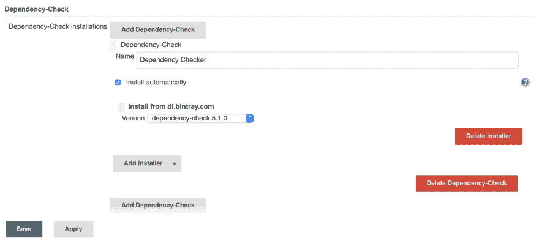
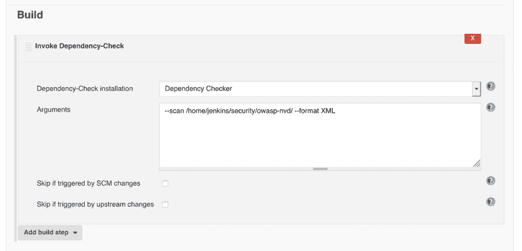

# 与 Jenkins 一起检查依赖性

> 原文：<https://dev.to/kinoba/dependencies-check-with-jenkins-5537>

精彩的 OWASP 依赖检查 Jenkins 插件最近发布了一个更新，介绍了我的管道的突破性变化。
所以我写了一个快速指南，教你如何升级管道来修复这些问题:

原文在此:[https://medium . com/@ gr 3g oire/dependencies-check-with-Jenkins-4e 73 c 451 CB 34](https://medium.com/@Gr3g0ire/dependencies-check-with-jenkins-4e73c451cb34)

升级插件后，在 Jenkins 实例的全局工具配置中创建新的依赖检查安装:
新的依赖检查安装

[](https://res.cloudinary.com/practicaldev/image/fetch/s--pCtvY5M8--/c_limit%2Cf_auto%2Cfl_progressive%2Cq_auto%2Cw_880/https://thepracticaldev.s3.amazonaws.com/i/xkve5tuzl7e7y0fi1lpo.png)

我们有一个每天运行的 Jenkins 作业，其唯一目的是更新 NVD 数据库。由于这不是一个流水线作业，我们不得不从用户界面重新配置它。

[](https://res.cloudinary.com/practicaldev/image/fetch/s--9tbtJQBg--/c_limit%2Cf_auto%2Cfl_progressive%2Cq_auto%2Cw_880/https://thepracticaldev.s3.amazonaws.com/i/zdr5gpy3wsmyvjrc8eac.png)

该作业每天凌晨 4 点运行

接下来，我们必须更改所有用于检查和发布依赖项检查结果的管道脚本:

*   检查

更改自

```
dependencyCheckAnalyzer datadir: ‘/home/jenkins/security/owasp-nvd/’, hintsFile: ‘’, includeCsvReports: false, includeHtmlReports: true, includeJsonReports: true, includeVulnReports: true, isAutoupdateDisabled: true, outdir: ‘build/owasp’, scanpath: ‘’, skipOnScmChange: false, skipOnUpstreamChange: false, suppressionFile: ‘’, zipExtensions: ‘’ 
```

到

```
sh(‘mkdir -p build/owasp’)
dependencycheck additionalArguments: ‘ — project [project_name]— scan /home/jenkins/security/owasp-nvd/ — out build/owasp/dependency-check-report.xml — format XML — noupdate’, odcInstallation: ‘Dependency Checker’ 
```

*   发布结果

更改自

```
dependencyCheckPublisher canComputeNew: false, defaultEncoding: '', healthy: '', pattern: 'build/owasp/dependency-check-report.xml', unHealthy: '' 
```

到

```
dependencyCheckPublisher pattern: 'build/owasp/dependency-check-report.xml' 
```