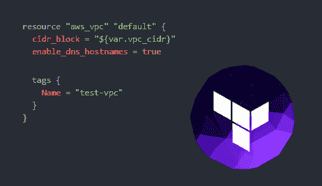
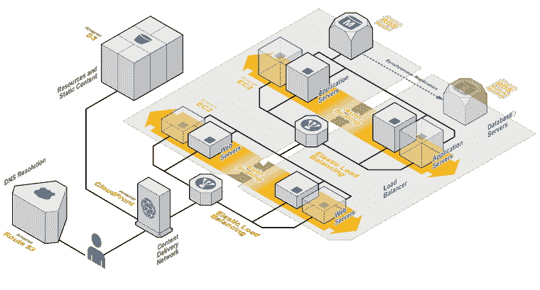
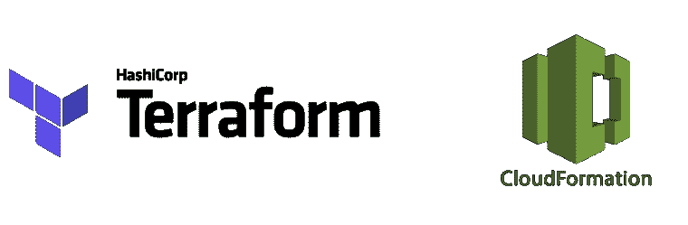

# 作为代码的基础设施:快速简单的解释。

> 原文：<https://dev.to/loujaybee/infrastructure-as-code-a-quick-and-simple-explanation-56ln>

当你是一个[云原生软件工程师](https://dev.to/loujaybee/what-is-a-cloud-native-software-engineer-4fhm-temp-slug-4843097)时，最重要的话题之一是一个叫做基础设施即代码的概念。昨天，当我开始写[整体到微服务系列](https://thedevcoach.co.uk/restful-api-serverless-framework/)的第二部分时，我意识到我不能开始这篇文章，除非我已经解决了基础设施作为代码的基本主题。

就像技术中的许多概念一样，基础设施作为代码听起来很可怕。但是在现实中，这是一个任何软件工程师(或者可能是软件工程师)都很容易理解的简单概念。我保证。一旦你克服了最初的几个障碍，你会奇怪为什么不早点探索它。

到本文结束时，你将理解什么是代码基础设施，为什么你需要它，为什么你应该总是用代码而不是手工创建基础设施。

## 什么是基础设施？

在我们进入什么是代码基础设施(这个概念)之前，我们需要简单地了解一下基础设施本身。我们需要知道什么是基础设施，以及它为什么与云原生软件工程师相关。

很长一段时间，作为一名软件工程师，我没有接触过任何基础设施。似乎总是有人在处理这件事，而我生活在一个幸福的无知的世界里。但是在这个过程中的某个地方，轮到我理解我的代码实际上是如何在服务器上运行的了。回顾我对基础设施的天真，让我有点畏缩。但你不会犯和我一样的错误，对吗？

好了，序言说够了，让我们开始吧，回答我们的第一个问题:什么是基础设施？… ***在软件中，基础设施的概念就是运行软件的硬件。**T3】*

是的，真的是这样。

## 基础设施实例

但是，让我们看几个常见基础架构的例子，让我们的对话更具体一些。

**主机/ Web 服务器** —主机是运行我们代码的物理机器。想象一下你的笔记本电脑 24/7 都连接着互联网。网络服务器只是一种特定类型的优化计算机，它连接到互联网，用于提供网络内容，如您当前正在阅读的页面！

**DNS 服务器** — DNS 服务器(或者有时只是 DNS 记录)将友好的 URL 域名映射到我们代码所在的原始 IP(机器地址)。当我们有一台服务器时，我们通常需要某种形式的 DNS。

**数据库** —数据库是保存应用程序数据的存储系统。它是你在 facebook 上的名字，是你在网飞的支付信息，甚至是你在银行里的存款金额！

这些只是更传统类型的基础设施。云提供商服务的激增意味着我们也有许多其他类型的基础设施，如[容器、](https://dev.to/loujaybee/containers-benefits-and-making-a-business-case-22ol-temp-slug-6945730) [无服务器](https://dev.to/loujaybee/setting-up-a-rest-api-on-serverless-framework-5b9l-temp-slug-9273665)以及所有配套基础设施，如[监控](https://dev.to/loujaybee/serverless-error-monitoring-strategies-41c2-temp-slug-1962472)、警报等。

[资料来源:AWS](https://media.amazonwebservices.com/architecturecenter/AWS_ac_ra_web_01.pdf)

好了，这是对什么是基础架构和一些示例的快速浏览。简而言之:正是这些基本的东西让我们的应用程序出现在互联网上。没有它，我们就没有地方运行我们的代码，这样人们就可以访问它。

这给了我们一个很好的起点，来看看什么是代码基础设施，以及我为什么对它赞不绝口。

## 什么是基础设施即代码？

[资料来源:黑客月(中)](https://hackernoon.com/your-infrastructure-as-code-cloudformation-vs-terraform-34ec5fb5f044)

基础设施作为代码就是用代码写基础设施的过程！字面上。好吧，我意识到这有点不精确，所以让我们深入研究一下…

说你要办一个网站，像 WordPress(就像这个网站)。为此，你需要一个网络服务器。那么，你有什么选择？你可以买一台自己的服务器，接上电源，连上互联网，上传一些文件到上面，然后修修补补，瞧！听起来不错，对吧？我是说，会有用的。或者——或者——你可以开一个云托管账户，在界面上戳一下，你就可以开始运行了。这两个选项都可行，但还有第三个选项…

那就是…将基础设施写成代码。首先，在一个文件中写下您想要的配置，然后执行一个命令，基础设施(在我们的例子中，是一个 web 服务器)就创建好了。这个过程通常(但不是必须)通过云账户来完成。

简而言之:作为代码的基础设施允许我们将我们想要应用到我们的基础设施资产的指令编码(而不是手工完成)。

但是，这里有什么不同呢？为什么将我们的基础设施写成代码与以前的手工选项如此不同？

现在让我们来讨论这个问题。

## 基础设施作为代码为什么有用？

我们想把基础设施写成代码有很多原因。事实上，我肯定会就这个话题写一整篇文章。但今天，我想涵盖基础设施作为代码有用的几个主要原因，只是为了给我们的对话增添一些色彩。我想确保你今天离开时不仅知道什么是代码基础设施，而且对它为什么如此重要充满信心！

### 协作

基础结构，当写在一个文本文件，然后可以存储在版本控制系统。它允许许多人同时在同一个代码库上协作，并利用很酷的工具，如代码审查、分支、版本控制、历史、自动构建管道等。

### 溯源

与协作密切相关的是可追溯性。有时候，知道发生了什么变化以及为什么发生变化是很重要的。也许将来会有一个新的软件工程师加入我们的团队，并质疑我们的决策。通过将我们的基础设施作为代码，我们获得了谁做了什么更改、何时做的以及为什么做的历史记录(如果它与带有良好描述的工作单相关联的话)。

### 灾难恢复

如果我们的软件发生了非常糟糕的事情，我们的服务器在火灾中被毁坏了(例如),我们通常需要恢复它——而且要快！通过将我们的基础设施写成代码，我们甚至可以非常快速地恢复大型系统。我们需要做的只是重新运行我们的基础架构创建计划，瞧，我们在很短的时间内就恢复并运行了。

### 顺从

在软件公司，遵守特定的规章制度是很重要的。例如，如果您为一家银行工作，可能需要确保所有服务器都应用了一定级别的安全性。当我们将基础设施写成代码时，我们可以很容易地分析我们是否对软件应用了正确的控制和限制。

啊！希望我们现在开始描绘一幅更具体的图画，为什么作为代码的基础设施如此重要，以及为什么它通常优于手动配置我们的软件。事实上，基础设施作为代码是如此强大，你应该…

## 将你所有的基础设施写成代码

[来源:Hackernoon](https://hackernoon.com/manage-aws-vpc-as-infrastructure-as-code-with-terraform-55f2bdb3de2a)

随着时间的推移，我在软件中袖手旁观并采用的规则很少。但是我的一个原则是:总是测试你的软件。我的另一个原则是:将所有基础设施设置为代码。我对这些规则很少有例外。因为如果你不这样做……十有八九你会将自己置于一个非常困难的境地，基础架构很难改变，管理起来也很麻烦。为了你自己的健康和幸福，你不想成为那样的人。

既然您已经很好地理解了什么是基础设施即代码，为什么不看看[整体到微服务系列](https://dev.to/loujaybee/setting-up-a-rest-api-on-serverless-framework-5b9l-temp-slug-9273665)的第一篇文章，看看我们如何在现实生活场景中将基础设施即代码付诸实践。

***你是否曾经没有把自己的基础设施写成代码而感受到痛苦？下面想听一些恐怖故事！*T3】**

作为代码的基础设施:快速简单的解释。最早出现在[的 Dev 蔻驰](https://www.thedevcoach.co.uk)上。