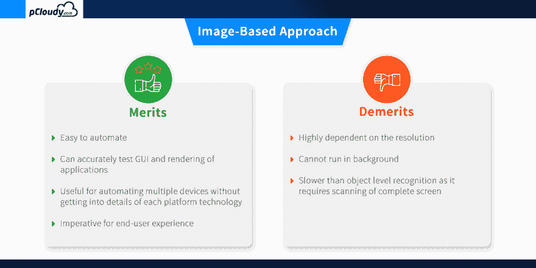
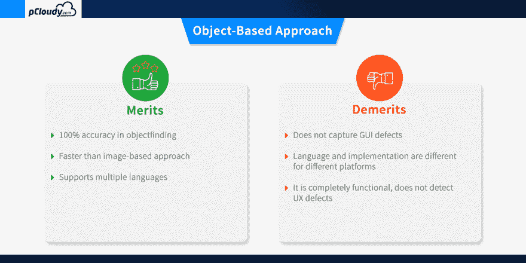
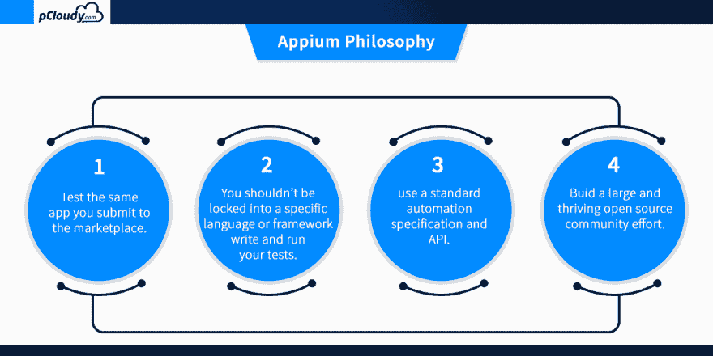

# Appium 移动测试基础

> 原文：<https://dev.to/bala27/basics-of-appium-mobile-testing-23dc>

Appium 是一个开源的移动应用 UI 测试框架。您可以测试所有类型的移动应用程序，并在物理设备以及仿真器和模拟器上执行自动化测试。Appium 移动测试不依赖于移动设备操作系统，它支持跨平台应用测试，因为单个 API 既适用于 Android，也适用于 iOS。Appium 支持许多流行的语言，如 C、PHP、Python、C#、Java、Ruby、JavaScript 等。

什么是 Appium 移动测试？

安装 Appium 后，您的机器上就会设置一个服务器来公开 REST API。它接收来自客户端的命令请求，并在 Android 或 iOS 移动设备上执行该命令。然后它用一个 HTTP 响应来回应。它使用像 Apple instruments 或 UIAutomator2 这样的移动测试自动化框架来驱动应用程序的 UI。

测试自动化的方法

移动测试自动化有两种方法，基于图像和基于对象的方法。我们来详细了解一下这两者。

基于图像的测试自动化方法

这种对象识别技术基于被测应用(AUT)中对象的图像处理属性。示例:自动化用户选项，如“点击、键入、拖放、鼠标动作等”

预期输出的视觉验证

不依赖于底层平台
可用于[自动化仿真器](https://www.pcloudy.com/problems-with-online-android-emulator-and-how-to-solve-it/)以及真实设备。

基于对象的测试自动化方法

这种测试自动化的技术是基于在 AUT 中识别对象的原生性。应用程序中每个对象的本机重组过程是使用分配给该对象的不同属性来执行的。

它用于从实际的本机操作系统源代码中提取应用程序对象标识符及其属性，就像开发人员使用的一样。这是一种准确而快速的方法来识别应用程序使用的按钮、列表和其他对象。

基于对象的方法的一个缺点是，对所涉及对象的单个属性的识别限制了这些技术在需要第三方应用程序访问的测试场景中发挥作用的能力。这降低了利用这种技术的自动化覆盖率。

我们应该选择哪种方法？

正如我们所看到的，这两种方法各有利弊。为了获得更好的结果，您可以合并这两种方法，并考虑设计一个混合的测试自动化解决方案。

OCR(基于图像)和 native(基于对象)方法的结合允许用户构建可跨不同设备移植的单个脚本。它将使您的自动化更加健壮和高效，并允许用户自信地检测移动应用程序中相关的本机和 GUI 缺陷。

Appium 概述和架构

Appium 是一个管理 WebDriver 会话的 HTTP 服务器。在 iOS 设备上，Appium 将命令代理给在 Mac Instruments 环境上运行的 UI 自动化脚本。苹果提供了一个名为 instruments 的应用程序，用于完成许多活动，如分析、控制和构建 iOS 应用程序。它还提供了一个自动化组件，您可以使用 JavaScript 编写一些命令，这些命令使用 UIAutomation APIs 与应用程序用户界面进行交互。Appium mobile automation 使用这些相同的库来自动化 iOS 应用程序。

Appium 概述和架构
web driver 脚本以 HTTP (JSWP)的形式向 Appium 服务器发送命令。然后 Appium 服务器将根据请求决定应该启动哪个驱动程序。因此，在这种情况下，Appium 服务器将启动 XCUITest 驱动程序，并将请求传递给脸书开发的 IPA(web driver agent . xcproj)web driver agent。WebdriverAgent 负责向被测应用程序(AUT)发送命令，以执行应用程序中的操作。然后，响应将通过 Appium 服务器发送到 Webdriver 脚本。

XCUITest 驱动程序仅支持 iOS 9.3 及以上版本。您可以在下面提到的链接中找到 XCUITest 驱动程序的所有功能。

[https://github.com/appium/appium-xcuitest-driver](https://github.com/appium/appium-xcuitest-driver)

Android 的情况与此非常相似，Appium 代理设备上运行的 UIAutomator2 测试用例的命令。UIAutomator2 是 Android 的 UI 自动化框架，支持在命令行中将 JUnit 测试用例直接运行到设备中。它使用 Java 作为编程语言，但 Appium 将使它运行于任何网络驱动程序支持的语言。

要回答“什么是 Appium 自动化？”，我们来看看 Appium 哲学。

Appium mobile testing 是正确执行持续集成所必需的，因为它可以加速整个测试过程。Appium mobile testing 有助于运行重复测试，而手动执行重复测试会花费更多时间。这就是为什么 appium mobile testing 是开发人员在测试自动化方面的首选。

在下一篇博客中，我们将了解更多关于 Appium 移动测试以及如何在 windows 机器上安装/配置 Appium 设置。