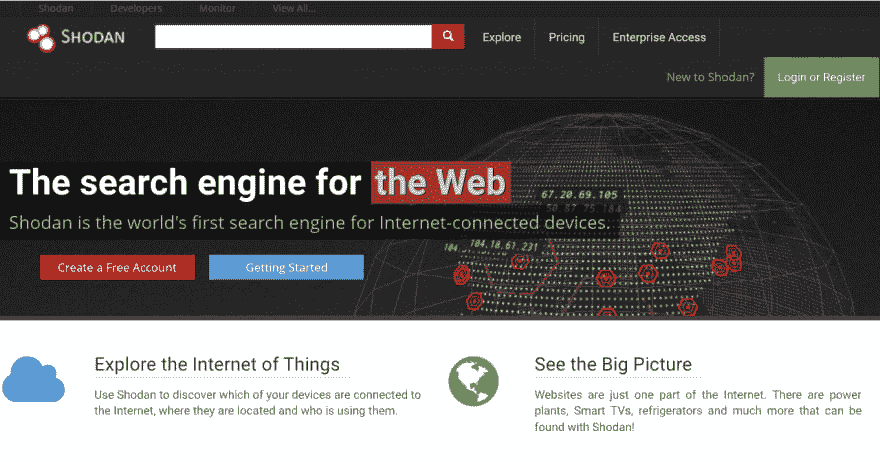

# 世界上最危险的搜索引擎:Shodan

> 原文：<https://dev.to/powerexploit/the-world-s-most-dangerous-search-engine-shodan-1ja5>

大约一年前，我开始学习网络安全和黑客技术。

我正在开发一个工具，它可以帮助我在互联网上找到特定的路由器，但我越来越难找到它。一分钟后，我打开浏览器，搜索如何在互联网上找到网络摄像头和路由器？

哇！！我在 shodan 搜索引擎上看到了让我惊叹的东西。

肖丹:

Shodan 世界上最危险的互联网搜索引擎，它让用户找到特定类型的计算机(网络摄像头、路由器、服务器等)。)使用各种过滤器连接到互联网。

Shodan 也可以作为 Linux 工具使用，这意味着我们可以使用 Linux 终端来使用这个危险的搜索引擎。

欲了解更多信息，请访问 Shodan 官方网站。