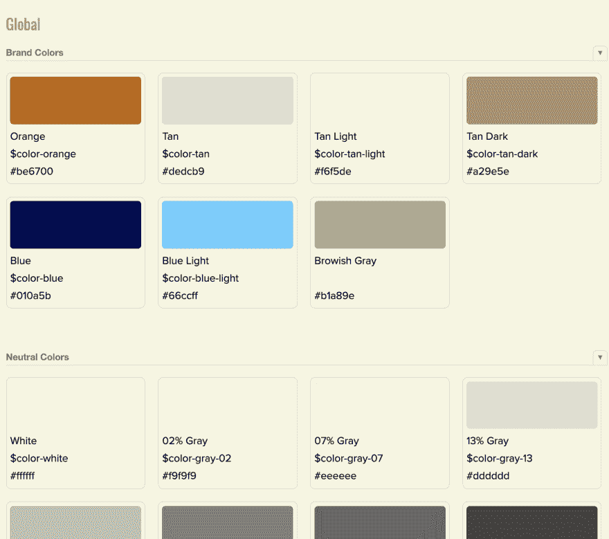
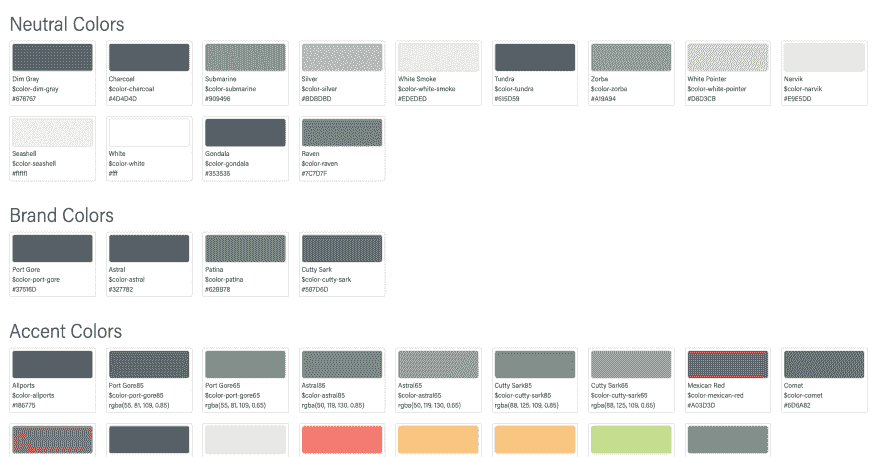

# 故事书中的颜色样本

> 原文：<https://dev.to/benrobertson/color-swatches-in-storybook-4aa9>

我在故事书中想要的一件东西是我们在项目中使用的所有颜色的颜色样本。

我们在 style tile 中有颜色样本，但那是一个非常静态的文档，一旦我们启动 dev，它就不会真正得到更新，即使颜色开始改变。此外，我希望能够显示我们在十六进制代码旁边使用的颜色变量名，这样希望当我们在项目中讨论颜色时，我们可以使用一致的名称。

真的，我想要的东西和布拉德·弗罗斯特在他网站的[模式实验室](http://pl.bradfrost.com/)里的东西一模一样:

[](https://res.cloudinary.com/practicaldev/image/fetch/s--BE4LsWOF--/c_limit%2Cf_auto%2Cfl_progressive%2Cq_auto%2Cw_880/https://benrobertson.io/assets/img/color-swatches/brad-frost-pattern-lab.png)

不过，如果它是可维护的，我只想添加它。我不希望我们不得不单独更新故事书，而不去改变颜色。

## 导出 SCSS 变量用于 JavaScript

通过一些搜索，我发现你可以用 Webpack 从 SCSS 导出变量用于 JS。事实上，为了做到这一点，我根本不需要改变 Storybook 的 Webpack 配置。

我们的`_colors.scss`部分看起来是这样的:

```
// Defining color variables.
$color-dim-gray: #676767;
$color-zorba: #A19A94;
$color-white-sand: $F1F0ED;
// ... other colors

// Export color variables for use in Webpack.
:export {
  dimGray: $color-dim-gray;
  zorba: $color-zorba;
  whiteSand: $color-white-sand;
  // ... other colors
} 
```

现在我们已经定义了导出，我们可以将这个对象导入到一个 JS 文件中，并对每种颜色进行循环以创建一个样本。

```
// Import colors object.
import colors from './_colors.scss';

const colors = () => {
  return (
    <ul>
      {Object.keys(colors).map((color) => (
        <li>
          <span
            style={
              backgroundColor: colors[color],
              display: 'block',
              height: '4em',
              marginBottom: '0.3em',
              borderRadius: '5px',
              border: '1px solid lightgray'
            }
          />
        <span>{color}</span><br /> // color name
        <span>{colors[color]}</span> <br /> // hex value
      </li>
      )
    )
  )
} 
```

这会生成一个非常漂亮的颜色列表。但是有几样东西不见了:

*   颜色名称显示在 camelCase 中，但这不是我们在 SCSS 使用颜色时引用的方式。
*   颜色在一个大列表中，可以更好地组织。

## 计算颜色名称

基于上面的样本，我们将得到如下所示的输出:

```
{swatch color}
dimGray
#676767 
```

我的目标是这个:

```
{swatch color}
Dim Gray (color name)
$color-dim-gray (variable name)
#676767 (actual color variable) 
```

在 Stackoverflow 的帮助下，我找到了一个代码片段，它可以帮助我拆分大写字母上的茶色名称:

```
let color = 'dimGray';
color.split(/(?=[A-Z])/);
// returns ['dim', 'Gray']; 
```

这让我在颜色文本上做一些转换。

```
const colorVariable = (color) => {
    // make an array of the separate words in the color name
  const array = color.split(/(?=[A-Z])/);
  // add a dash in between each word, lowercase everything, and
  // prefix with '$color-'
  return `$color-${array.join('-').toLowerCase()}`;
};

colorVariable('dimGray')
// returns '$color-dim-gray' 
```

我用类似的方法创建了颜色名称:

```
const colorName = (color) => {
  const array = color.split(/(?=[A-Z])/);
  return `${array.join(' ').toLowerCase()}`;
};

colorName('dimGray')
// returns 'dim gray' (I use css to capitalize this in the component) 
```

这样就得到我想要的每种颜色的所有值。

## 分组颜色

我想做的另一件事是将颜色组合在一起。我想一起展示所有的中性色，一起展示所有的品牌色，一起展示强调色。

我发现当你从 SCSS 导出你的值时，你可以在对象中嵌套值:

```
// Before, without nesting
:export {
  dimGray: $color-dim-gray;
  zorba: $color-zorba;
  whiteSand: $color-white-sand;
  // ... other colors
}

// After, with nesting
:export {
    neutral: {
        dimGray: $color-dim-gray;
      zorba: $color-zorba;
      whiteSand: $color-white-sand;
      // ... other colors
    };
  brand: {
   // brand colors
  };
  accent: {
    // accent colors
    };
} 
```

现在，当您将颜色导入 JavaScript 时，每个颜色键都将以嵌套的对象键名为前缀。举个例子——dim gray 将出演`neutral-dimGray`。

这意味着我需要调整我在上面创建的用于解析颜色名称的方法。当我显示名字时，我想去掉前缀，所以我需要在一个'-'上拆分，并抓取连字符后面的内容，就像这样:

```
color.split('-')[1] 
```

所以我的`colorVariable`函数现在变成了这个:

```
const colorVariable = (color) => {
  const array = color.split('-')[1].split(/(?=[A-Z])/);
  return `$color-${array.join('-').toLowerCase()}`;
}; 
```

类似地调整`colorName`功能。

```
// Convert the color key to the color proper name.
const colorName = (color) => {
  const array = color.split('-')[1].split(/(?=[A-Z])/);
  return `${array.join(' ').toLowerCase()}`;
}; 
```

## 组件

最后一步是创建 Storybook 中的渲染组件。

我创建了一个显示一组`<Color />`组件的`<ColorGroup />`组件。

这是我在故事书里看到的展示:

[](https://res.cloudinary.com/practicaldev/image/fetch/s--XUlDWCHM--/c_limit%2Cf_auto%2Cfl_progressive%2Cq_auto%2Cw_880/https://benrobertson.io/assets/img/color-swatches/final-swatches.png)

这里是我的整个`stories.js`文件，供大家参考，它是如何组合在一起的:

```
import React from 'react';
import PropTypes from 'prop-types';
import { storiesOf } from '@storybook/react';
import colors from './_colors.scss';

const filterGroup = (filter) =>
  Object.keys(colors).filter((color) => color.indexOf(filter) === 0);

storiesOf('Global|Colors', module).add('all', () => (
  <div style={ padding: '20px' }>
    <>
      <h3>Neutral Colors</h3>
      <ColorGroup group={filterGroup('neutral')} />
    </>
    <>
      <h3>Brand Colors</h3>
      <ColorGroup group={filterGroup('pbr')} />
    </>
    <>
      <h3>Accent Colors</h3>
      <ColorGroup group={filterGroup('accent')} />
    </>
  </div>
));

// Convert the color key to the color variable name.
const colorVariable = (color) => {
  const array = color.split('-')[1].split(/(?=[A-Z])/);
  return `$color-${array.join('-').toLowerCase()}`;
};

// Convert the color key to the color proper name.
const colorName = (color) => {
  const array = color.split('-')[1].split(/(?=[A-Z])/);
  return `${array.join(' ').toLowerCase()}`;
};

// A component for displaying individual color swatches.
const Color = ({ color }) => (
  <li
    style={
      borderRadius: '5px',
      border: '1px solid lightgray',
      padding: '5px'
    }
  >
    <span
      style={
        backgroundColor: colors[color],
        display: 'block',
        height: '4em',
        marginBottom: '0.3em',
        borderRadius: '5px',
        border: '1px solid lightgray'
      }
    />
    <span style=>{colorName(color)}</span>{' '}
    <br />
    <span>{colorVariable(color)}</span> <br />
    <span>{colors[color]}</span> <br />
  </li>
);

Color.propTypes = {
  color: PropTypes.string.isRequired
};

// A component for displaying a group of colors.
const ColorGroup = ({ group }) => (
  <ul
    style={
      display: 'grid',
      gridTemplateColumns: 'repeat(auto-fill, minmax(120px, 175px))',
      gridGap: '20px',
      marginBottom: '40px'
    }
  >
    {group.map((color) => {
      return <Color color={color} key={color} />;
    })}
  </ul>
);

ColorGroup.propTypes = {
  group: PropTypes.array.isRequired
}; 
```

我在考虑把这个打包成故事书的附件。如果你觉得有用，请通过电子邮件或 Twitter 告诉我！