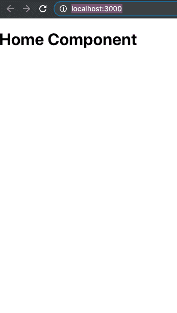
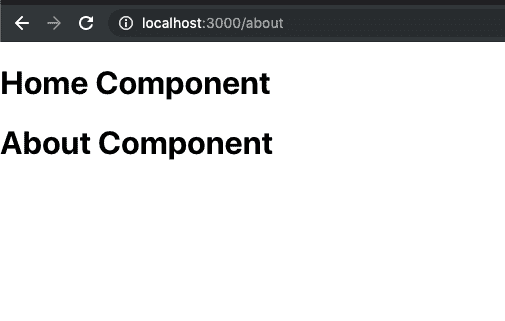
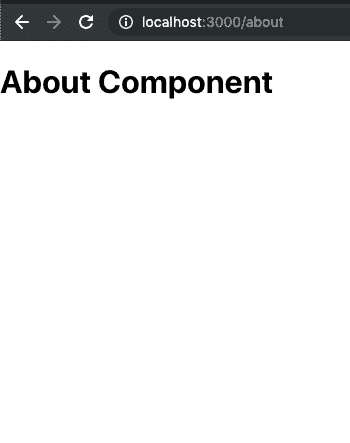
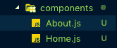
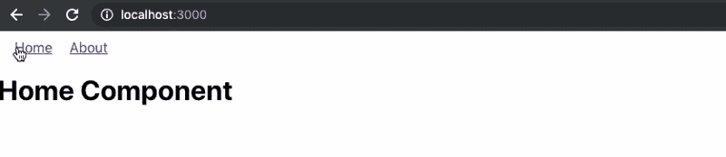
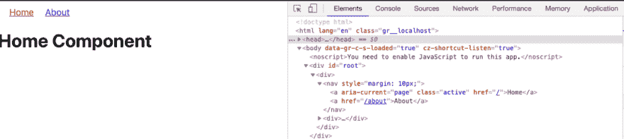
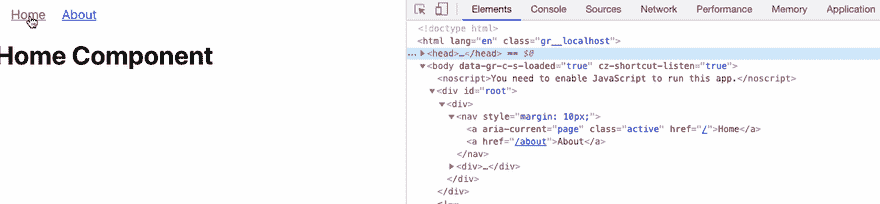
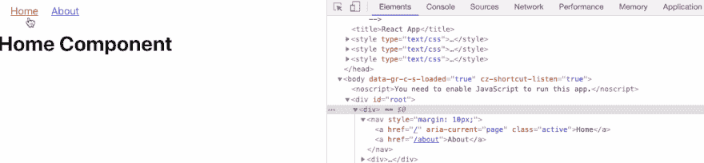
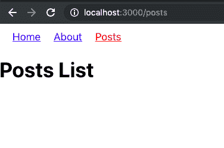
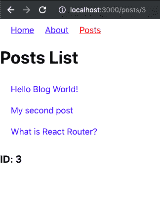

# 使用 React 路由器优化单页面应用程序

> 原文：<https://dev.to/amanhimself/using-react-router-to-optimize-single-page-applications-4mim>

React 通常用于构建单页面应用程序(spa)。spa 往往有多个页面浏览量。当从一个页面视图导航到另一个页面视图时，重新加载整个页面视图是一项乏味且效率不高的任务。事实上，它减少了水疗的好处。为了正常工作，SPA 必须在需要时呈现部分视图，而不是重新加载整个页面。

在 SPA 应用程序中，从一个页面导航到另一个页面时，会涉及到路由问题。路由可以分为两类。静态和动态。水疗遵循动态方法。在本教程中，我们将讨论一个用于 React 应用程序的流行路由库，称为 [React Router](https://reacttraining.com/react-router/web/guides/quick-start) 。

[**本帖最初发表在这里**](https://blog.crowdbotics.com/introduction-to-react-router-v4-with-reactjs/) 。

**目录**

*   要求
*   入门指南
*   使用 React 路由器的第一条路由
*   什么是 BrowserRouter？
*   链接组件
*   使用 NavLink 的活动链接
*   向路线添加参数
*   结论

**要求**

*   与 npm/yarn 一起安装的 NodeJS `v8.x.x`或更高版本
*   在本地开发机器上全局安装生成一个新的 React 项目

*奖励*:你也可以在不安装`create-react-app`的情况下，使用`npx`生成一个新的 React 项目。

## 入门

要创建新的 React 项目，请在本地计算机上的所需位置运行以下命令。

```
create-react-app react-router-v4-demo 
```

Enter fullscreen mode Exit fullscreen mode

生成项目后，遍历新创建的目录。这种策略是生成新 React 应用程序的默认方式。

[React 路由器](https://reacttraining.com/react-router/web/guides/quick-start)作为一个库包含三个不同的 npm 包。

*   反应路由器
*   反应-路由器-dom
*   react-路由器-本机

每个包都有不同的用例。第一个包`react-router`是核心包，与上面列出的另外两个包一起使用。构建 web 应用程序时必须使用`react-router-dom`。这是我们将在本教程中使用的。最后一个，`react-router-native`倾向于在一个 [React 本地](https://hackernoon.com/getting-started-with-react-native-in-2019-build-your-first-app-a41ebc0617e2)应用程序中使用。

要在 React 应用程序中添加 React 路由器，请从终端窗口执行以下命令。

```
yarn add react-router-dom 
```

Enter fullscreen mode Exit fullscreen mode

请注意，在本教程的剩余部分，我们将使用`yarn`作为 JavaScript 包管理器来添加或删除依赖项。如果你想使用`npm`，没有人会阻止你。

要运行 React 应用程序，请转到终端窗口并执行命令 npm start。这将启动开发服务器。您将在 URL `http://localhost:3000/`的 web 浏览器窗口中看到默认的样板项目屏幕。

[](https://res.cloudinary.com/practicaldev/image/fetch/s--0eTKEdkr--/c_limit%2Cf_auto%2Cfl_progressive%2Cq_auto%2Cw_880/https://blog.crowdbotics.com/conteimg/2019/05/ss1-1.png)

## 使用 React 路由器的第一条路由

为了在 React 应用程序中创建第一条路线，让我们从`react-router`库中导入`BrowserRouter`。

```
import React from "react"
import { BrowserRouter as Router, Route } from "react-router-dom" 
```

Enter fullscreen mode Exit fullscreen mode

为了创建一条路线，我们使用来自`react-router-dom`的`<Route>`。这就是路由逻辑的位置。它呈现组件的用户界面。一个`<Route>`有一个道具叫`path`，总是和 app 当前位置匹配。在这个道具的基础上，所需的组件被渲染。当组件没有被渲染时，`Route`返回 null。组件名也作为属性`component`传递。看看下面的片段。

```
function App() {
    return (
        <Router>
            <Route path='/' component={Home} />
        </Router>
    )
} 
```

Enter fullscreen mode Exit fullscreen mode

有一个函数性的`App`组件，它返回一个保存第一个`Route`组件的`BrowserRouter`。`path`当前指向`Home`组件，该组件具有以下 UI 逻辑。

```
function Home() {
    return (
        <div>
            <h1>Home Component</h1>
        </div>
    )
} 
```

Enter fullscreen mode Exit fullscreen mode

现在，访问端口`3000`上的 URL，您将看到`Home`组件正在呈现。

[](https://res.cloudinary.com/practicaldev/image/fetch/s--QL35rb5D--/c_limit%2Cf_auto%2Cfl_progressive%2Cq_auto%2Cw_880/https://blog.crowdbotics.com/conteimg/2019/05/ss2.png)

这是一个最简单的例子。现在让我们添加另一条与`Home`相同道具的路线。用类似于`Home`的渲染逻辑来调用这条路线`About`。

```
function About() {
    return (
        <div>
            <h1>About Component</h1>
        </div>
    )
} 
```

Enter fullscreen mode Exit fullscreen mode

现在将此功能组件添加为第二条路线，位于`Home`路线下方。另外，在一个`div`元素中添加两条路线。路由器组件可以包含一个子元素，添加一个`div`可以解决这个问题，并允许路由器组件拥有我们想要的任意多个子元素。

```
function App() {
    return (
        <Router>
            <div>
                <Route path='/' component={Home} />
                <Route path='/about' component={About} />
            </div>
        </Router>
    )
} 
```

Enter fullscreen mode Exit fullscreen mode

尝试访问网址`http://localhost:3000/about`。您会注意到两个组件现在都在路径`/about`上呈现。

[](https://res.cloudinary.com/practicaldev/image/fetch/s--qb9ELInu--/c_limit%2Cf_auto%2Cfl_progressive%2Cq_auto%2Cw_880/https://blog.crowdbotics.com/conteimg/2019/05/ss3-1.png)

原因是 React Router 内部使用的正则表达式引擎认为以正斜杠`/`开始的两条路由是相等的。为了解决这个问题，我们可以使用另一个回家路上必不可少的道具，叫做`exact`。

```
<Router>
    <div>
        <Route path='/' exact component={Home} />
        <Route path='/about' component={About} />
    </div> </Router> 
```

Enter fullscreen mode Exit fullscreen mode

这种精确也称为限定符，它规定路径必须与`/`精确匹配，并且后面没有任何内容，例如`/about`。现在，如果您访问位于 URL `http://localhost:3000/about`的浏览器窗口，您会注意到这次只呈现了 about 组件。

[](https://res.cloudinary.com/practicaldev/image/fetch/s--D_rSUWpG--/c_limit%2Cf_auto%2Cfl_progressive%2Cq_auto%2Cw_880/https://blog.crowdbotics.com/conteimg/2019/05/ss4.png)

## 什么是 BrowserRouter？

你还记得之前读到过`react-router-dom`只在 web 应用程序中使用吗？嗯，`react-router-dom`库包含两种路由器 API 供 React 应用程序使用。一个叫做`BrowserRouter`，你已经在前面的章节中看到了。另一个叫`HashRouter`。

一个`BrowserRouter`将总是监听像`http://localhost:3000/about`这样的 URL，而一个`HashRouter`将有`http://localhost:3000/#/about`，顾名思义，在它们之间使用一个散列`#`。那么我们为什么要用`BrowserRouter`？

是现代网络应用中的一个流行选择。背后的主要原因是，它使用 HTML5 历史 API 来跟踪您的 React 应用程序的路由器历史。`HashRouter`有一个遗留浏览器的用例，其中`window.location.hash`仍然被用来跟踪温泉中的路线。

## DIY 练习👇

这是给你的一个小任务。修改目录结构，如下图所示，并将两个功能组件`Home`和`about`分离到它们自己的组件文件中，这样，将来，如果它们随着更多 JSX 的渲染而增长。

[](https://res.cloudinary.com/practicaldev/image/fetch/s--vvjuxBi_--/c_limit%2Cf_auto%2Cfl_progressive%2Cq_auto%2Cw_880/https://blog.crowdbotics.com/conteimg/2019/05/ss5.png)

如果你愿意，你完全可以跳过这一步，进入下一部分。但是执行这个小任务将有助于您理解上述概念。

## 链接组件

为了在 HTML 中的网页之间导航，有一个`<a href=""></a>`锚标记可用。但是，使用这种传统方法会导致浏览器刷新。为了克服这个问题，React Router API 提供了一个`Link`组件，可以用来导航到特定的 URL 或组件。

让我们试着用这些新知识创建一个导航菜单。从`App.js`文件中的`react-router-dom`导入链接。下面是修改后的 App 组件片段。

```
// App.js

import React from "react"
import { BrowserRouter as Router, Route, Link } from "react-router-dom"

import Home from "./components/Home"
import About from "./components/About"

function App() {
    return (
        <Router>
            <div>
                <nav style={{ margin: 10 }}>
                    <Link to='/' style={{ padding: 10 }}>
                        Home
                    </Link> 
                    <Link to='/about' style={{ padding: 10 }}>
                        About
                    </Link>
                </nav>
                <Route path='/' exact component={Home} />
                <Route path='/about' component={About} />
            </div>
        </Router>
    )
}

export default App 
```

Enter fullscreen mode Exit fullscreen mode

在上面的代码片段中，请注意，所有链接都是在所有路由组件之前添加的。`style`内的样式属性现在是可选的。启动开发服务器并访问浏览器窗口，您会注意到顶部弹出了一个导航菜单。尝试单击链接在不同组件之间导航。

[](https://res.cloudinary.com/practicaldev/image/fetch/s--CA1pbVhZ--/c_limit%2Cf_auto%2Cfl_progressive%2Cq_66%2Cw_880/https://blog.crowdbotics.com/conteimg/2019/05/ss6-1.gif)

无论在 React 项目中的什么地方呈现一个`Link`,应用程序的 HTML 中都会呈现一个锚点`<a>`。

## 与 NavLink 的主动链接

在 React 路由器 API 中，`NavLink`是`Link`组件的扩展版本。你可以说这是一种特殊类型的`Link`,当匹配当前路线时，它可以将自己设计成表示活动状态的样式。

为了演示这一点，首先，让我们用`App.js`文件中的`NavLink`替换所有的`Link`标签。

```
// App.js
import React from "react"
import { BrowserRouter as Router, Route, NavLink } from "react-router-dom"

import Home from "./components/Home"
import About from "./components/About"

function App() {
    return (
        <Router>
            <div>
                <nav style={{ margin: 10 }}>
                    <NavLink to='/' style={{ padding: 10 }}>
                        Home
                    </NavLink> 
                    <NavLink to='/about' style={{ padding: 10 }}>
                        About
                    </NavLink>
                </nav>
                <Route path='/' exact component={Home} />
                <Route path='/about' component={About} />
            </div>
        </Router>
    )
}

export default App 
```

Enter fullscreen mode Exit fullscreen mode

此时，每个`NavLink`链接将像普通的`Link`组件一样运行，这意味着到目前为止没有任何变化。要激活一个链接，添加一个`activeClassName`道具。比如下面。

```
<NavLink to='/' style={{ padding: 10 }} activeClassName='active'> 
```

Enter fullscreen mode Exit fullscreen mode

要为此设置相应的 CSS，打开`App.css`文件并添加下面的。

```
a {
    padding: 10px;
}

a,
a:visited {
    color: blue;
}

a.active {
    color: red;
} 
```

Enter fullscreen mode Exit fullscreen mode

不要忘记在`App.js`中导入这个文件。此外，修改`about`路线，使其具有一个`activeClassName`。

```
import "./App.css"

// ...

return (
  {/* */}
  <nav style={{ margin: 10 }}>
      <NavLink to='/' activeClassName='active'>
          Home
      </NavLink> 
      <NavLink to='/about' activeClassName='active'>
          About
      </NavLink>
  </nav> 
 {/* */}
) 
```

Enter fullscreen mode Exit fullscreen mode

回到浏览器，打开如下所示的开发工具，你会注意到，首先，`Home`路径有一个类名`active`。

[](https://res.cloudinary.com/practicaldev/image/fetch/s--mbDeWUfX--/c_limit%2Cf_auto%2Cfl_progressive%2Cq_auto%2Cw_880/https://blog.crowdbotics.com/conteimg/2019/05/ss7.png)

尝试导航到`About`路线，看看会发生什么。

[](https://res.cloudinary.com/practicaldev/image/fetch/s--2lmK78Ls--/c_limit%2Cf_auto%2Cfl_progressive%2Cq_66%2Cw_880/https://blog.crowdbotics.com/conteimg/2019/05/ss8.gif)

导航到`About`路线时，您是否注意到活动的类名也被添加到相应的路线中？然而，即使 URL 与`/about`匹配，`Home`路由仍然有活动类。为什么？

`NavLink`的工作方式与 React 路由器 API 中的路由组件几乎相似。要确保只有一条路由的类别处于活动状态，请尝试在导航菜单中修改归属路由，如下所示。

```
// App.js

<NavLink to='/' exact activeClassName='active'>
    Home
</NavLink> 
```

Enter fullscreen mode Exit fullscreen mode

这一次您将获得期望的输出。

[](https://res.cloudinary.com/practicaldev/image/fetch/s--ToM5Cgjt--/c_limit%2Cf_auto%2Cfl_progressive%2Cq_66%2Cw_880/https://blog.crowdbotics.com/conteimg/2019/05/ss9.gif)

## 给路线添加参数

在本节中，您将学习如何基于查询参数(如`:id`)创建和管理动态路线。我们首先在`App.js`文件中创建一个静态数组，作为模拟数据。

这个想法是演示一个路由为`/posts`，它显示来自数组的所有帖子。但是，数组中的每个帖子都有一个 id 或唯一的标识符。使用这个惟一的标识符，您将通过编写 URL 的逻辑来接近动态内容呈现的概念，比如`/posts/:id`，其中`:id`将由一篇文章的特定 id 来表示。

首先，让我们在一个名为`components/posts.js`的新组件文件中添加一些模拟帖子。

```
// Posts.js
import React from "react"
import "../App.css"

class Posts extends React.Component {
    state = {
        posts: [
            { id: 1, title: "Hello Blog World!" },
            { id: 2, title: "My second post" },
            { id: 3, title: "What is React Router?" }
        ]
    }

    render() {
        return (
            <div className='posts'>
                <h1>Posts List</h1>
            </div>
        )
    }
}

export default Posts 
```

Enter fullscreen mode Exit fullscreen mode

为简洁起见，在`App.css`文件中添加了上述对应的样式。

```
.posts ul {
    list-style: none;
    margin: 0;
    margin-bottom: 20px;
    padding: 0;
}

.posts ul li {
    padding: 10px;
}

.posts a {
    text-decoration: none;
} 
```

Enter fullscreen mode Exit fullscreen mode

现在，将新建的组件导入到已经存在其他路由的`App.js`中。

```
//App.js
// ...
import Posts from "./components/Posts"

function App() {
    return (
        <Router>
            <div>
                <nav style={{ margin: 10 }}>
                    <NavLink to='/' exact activeClassName='active'>
                        Home
                    </NavLink>
                    <NavLink to='/about' activeClassName='active'>
                        About
                    </NavLink>
                    <NavLink to='/posts' activeClassName='active'>
                        Posts
                    </NavLink>
                </nav>
                <Route path='/' exact component={Home} />
                <Route path='/about' component={About} />
                <Route path='/posts' component={Posts} />
            </div>
        </Router>
    )
}

export default App 
```

Enter fullscreen mode Exit fullscreen mode

现有的导航菜单有一个新的路线及其所谓的职位。

[](https://res.cloudinary.com/practicaldev/image/fetch/s--zNJy3tbJ--/c_limit%2Cf_auto%2Cfl_progressive%2Cq_auto%2Cw_880/https://blog.crowdbotics.com/conteimg/2019/05/ss10.png)

打开`Posts.js`以呈现文章列表，并在 web 浏览器中的当前位置与`/posts`匹配时将其显示为列表。

```
import React from "react"
import { Link, Route } from "react-router-dom"
import "../App.css"

function Child({ match }) {
    return (
        <div>
            <h3>ID: {match.params.id}</h3>
        </div>
    )
}

class Posts extends React.Component {
    state = {
        posts: [
            {
                id: 1,
                title: "Hello Blog World!"
            },
            {
                id: 2,
                title: "My second post"
            },
            {
                id: 3,
                title: "What is React Router?"
            }
        ]
    }

    render() {
        const { posts } = this.state
        return (
            <div className='posts'>
                <h1>Posts List</h1>
                <ul>
                    {posts.map(post => (
                        <li key={post.id}>
                            <Link to={`/posts/${post.id}`}>{post.title}</Link>
                        </li>
                    ))}
                </ul>
                <Route path='/posts/:id' component={Child} />
            </div>
        )
    }
}

export default Posts 
```

Enter fullscreen mode Exit fullscreen mode

另外，`Child`组件读取来自 URL 参数的任何内容，比如，在上面的例子中，每篇文章的`id`。一个`match`对象包含关于一个`<Route path>`如何匹配 URL 的信息，因此，在我们的例子中，是每篇文章的 id。

[](https://res.cloudinary.com/practicaldev/image/fetch/s--8GUJPbxF--/c_limit%2Cf_auto%2Cfl_progressive%2Cq_auto%2Cw_880/https://blog.crowdbotics.com/conteimg/2019/05/ss11.png)

## 结论

希望到现在为止，您已经熟悉了 React 路由器库如何工作的基本概念。这是一个强大的库，可以帮助您构建更好的 React 应用程序。如果你想了解更多关于 React 路由器的信息，请访问它的官方文档[这里](https://reacttraining.com/react-router/)。

* * *

[**本帖最初发表在这里**](https://blog.crowdbotics.com/introduction-to-react-router-v4-with-reactjs/) 。

我经常在 Nodejs、Reactjs 和 React Native 上写。你可以通过**[aman his . dev](https://amanhimself.dev)**访问我，或者你可以 **[订阅我的每周简讯](https://tinyletter.com/amanhimself)** 直接在你的收件箱里接收我所有的教程和更新💌。