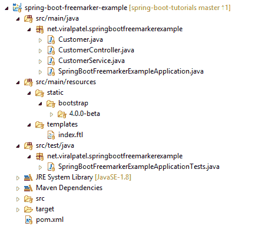
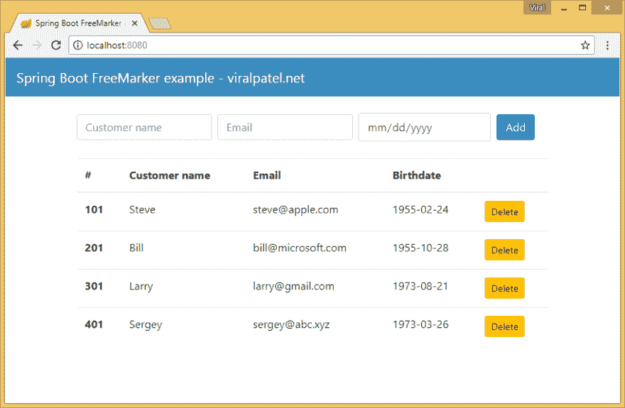

# Spring Boot FreeMarker 教程示例

> 原文：<https://dev.to/viralpatel/spring-boot-freemarker-tutorial-with-example-1752>

**Spring Boot FreeMarker Hello World 教程**–在 Spring Boot 使用 FreeMarker 模板非常简单。Spring Boot 的自动配置(spring starters)加速了在任何基于 Spring 的项目中集成任何新技术。在本教程中，我们将学习 Spring Boot 和 FreeMarker 集成，并创建一个 hello world 应用程序。

这个 Spring Boot 应用程序将显示一个表格来捕捉用户输入(姓名，电子邮件和出生日期)。使用 Freemarker 在表中显示一些默认值，并允许用户从表中删除条目。没什么特别的，基本的东西。

对于这个项目，我们将使用以下技术:

*   Spring Boot
*   Java 8(也可以用 Java 11 编译)
*   专家

[](https://res.cloudinary.com/practicaldev/image/fetch/s--b232874g--/c_limit%2Cf_auto%2Cfl_progressive%2Cq_auto%2Cw_880/https://www.viralpatel.net/app/uploads/2017/09/spring-boot-freemarker-example-project-structure.png)

## 1。Spring Boot 与 FreeMarker 的 Maven 依赖关系

目录结构类似于标准的 Spring Boot 项目。您可以使用 Spring Initializer([start . Spring . io](https://start.spring.io/))来生成这个库，或者直接克隆这个库。请注意，我们包括了`spring-boot-starter-freemarker`来自动配置 Spring Boot web 项目的 Freemarker 视图。

pom.xml

```
<?xml version="1.0" encoding="UTF-8"?>
<project xmlns="http://maven.apache.org/POM/4.0.0" xmlns:xsi="http://www.w3.org/2001/XMLSchema-instance"
         xsi:schemaLocation="http://maven.apache.org/POM/4.0.0 http://maven.apache.org/xsd/maven-4.0.0.xsd">
    <modelVersion>4.0.0</modelVersion>

    <groupId>net.viralpatel</groupId>
    <artifactId>spring-boot-freemarker-example</artifactId>
    <version>0.0.1-SNAPSHOT</version>
    <packaging>jar</packaging>

    <name>spring-boot-freemarker-example</name>
    <description>Spring Boot FreeMarker (FTL) Hello World example</description>

    <parent>
        <groupId>org.springframework.boot</groupId>
        <artifactId>spring-boot-starter-parent</artifactId>
        <version>2.1.6.RELEASE</version>
        <relativePath/> <!-- lookup parent from repository -->
    </parent>

    <properties>
        <java.version>1.8</java.version>
    </properties>

    <dependencies>
        <!-- Compile -->
        <dependency>
            <groupId>org.springframework.boot</groupId>
            <artifactId>spring-boot-starter-freemarker</artifactId>
        </dependency>
        <dependency>
            <groupId>org.springframework.boot</groupId>
            <artifactId>spring-boot-starter-web</artifactId>
        </dependency>

        <!-- Test -->
        <dependency>
            <groupId>org.springframework.boot</groupId>
            <artifactId>spring-boot-starter-test</artifactId>
            <scope>test</scope>
        </dependency>
    </dependencies>

    <build>
        <plugins>
            <plugin>
                <groupId>org.springframework.boot</groupId>
                <artifactId>spring-boot-maven-plugin</artifactId>
            </plugin>
        </plugins>
    </build>
</project> 
```

## 2。Spring Boot 应用程序类

Spring Boot 应用程序类是标准的。用于引导服务器和配置默认 beans 的 Spring Boot Jar 项目。`@SpringBootApplication`是一个包装了`@Configuration`、`@EnableAutoConfiguration`和`@ComponentScan`的方便的注释。

SpringBootFreemarkerExampleApplication.java

```
package net.viralpatel.springbootfreemarkerexample;

import org.springframework.boot.SpringApplication;
import org.springframework.boot.autoconfigure.SpringBootApplication;

@SpringBootApplication
public class SpringBootFreemarkerExampleApplication {

    public static void main(String[] args) {
        SpringApplication.run(SpringBootFreemarkerExampleApplication.class, args);
    }
} 
```

## 型号和控制器–带 FreeMarker 的 Spring Boot

让我们从一个简单的 Customer pojo 类开始，它包含属性 customerId、customerName、dateOfBirth 和 email。还让我们添加构造函数、getter 和 setter 方法。

Customer.java

```
package net.viralpatel.springbootfreemarkerexample;

import java.time.LocalDate;

import org.springframework.format.annotation.DateTimeFormat;

public class Customer {

    private int customerId;
    private String customerName;

    @DateTimeFormat(iso = DateTimeFormat.ISO.DATE)
    private LocalDate dateOfBirth;
    private String email;

    public Customer() {
        super();
    }

    public Customer(int customerId, String customerName, String email, LocalDate dateOfBirth) {
        super();
        this.customerId = customerId;
        this.customerName = customerName;
        this.dateOfBirth = dateOfBirth;
        this.email = email;
    }

    // Getter and setters
} 
```

现在让我们检查 CustomerController 类。同样，这是使用`@Controller`注释定义的标准 Spring MVC 控制器。这个类定义了方法`index()`、`add()`和`delete()`，分别映射到/、/add 和/delete URL。注意，我们使用`@GetMapping`注释来映射这些 URL。

注意，在 index()方法中，我们返回“index”字符串。这将呈现我们即将创建的 index.ftl freemarker 模板。index()方法中的@ModelAttribute 注释也绑定了 modelmap，我们可以使用它将值传递回 freemarker 模板。

CustomerController.java

```
package net.viralpatel.springbootfreemarkerexample;

import org.springframework.beans.factory.annotation.Autowired;
import org.springframework.stereotype.Controller;
import org.springframework.ui.ModelMap;
import org.springframework.web.bind.annotation.GetMapping;
import org.springframework.web.bind.annotation.ModelAttribute;
import org.springframework.web.bind.annotation.PathVariable;
import org.springframework.web.bind.annotation.PostMapping;

@Controller
public class CustomerController {

    private CustomerService customerService;

    public CustomerController(CustomerService customerService) {
        this.customerService = customerService;
    }

    @GetMapping("/")
    public String index(@ModelAttribute("model") ModelMap model) {
        model.addAttribute("customers", customerService.findAll());
        return "index";
    }

    @PostMapping("/add")
    public String add(Customer customer) {
        customerService.add(customer);
        return "redirect:/";
    }

    @GetMapping("/delete/{customerId}")
    public String delete(@PathVariable int customerId) {
        customerService.remove(customerId);
        return "redirect:/";
    }
} 
```

## 服务–Spring Boot FreeMarker

CustomerService 还是标准的 Spring `@Service`类。我们定义了一个静态的客户列表。这只是保存客户列表的临时本地数据存储。理想情况下，我们会使用数据库或内存数据库。然而，现在让我们保持事情简单。

CustomerService.java

```
package net.viralpatel.springbootfreemarkerexample;

import java.time.LocalDate;
import java.util.ArrayList;
import java.util.List;
import java.util.Optional;
import java.util.Random;

import org.springframework.stereotype.Service;

@Service
public class CustomerService {

    private static List<Customer> customers = new ArrayList<>();
    static {
        customers.add(new Customer(101, "Steve", "steve@apple.com", LocalDate.of(1955, 2, 24)));
        customers.add(new Customer(201, "Bill", "bill@microsoft.com", LocalDate.of(1955, 10, 28)));
        customers.add(new Customer(301, "Larry", "larry@gmail.com", LocalDate.of(1973, 8, 21)));
        customers.add(new Customer(401, "Sergey", "sergey@abc.xyz", LocalDate.of(1973, 3, 26)));
    }

    public List<Customer> findAll() {
        return customers;
    }

    public void add(Customer customer) {
        customer.setCustomerId(generateRandomId());
        customers.add(customer);
    }

    private int generateRandomId() {
        return new Random().nextInt(1000);
    }

    public List<Customer> remove(int customerId) {
        customers.removeIf(c -> c.getCustomerId() == customerId);
        return findAll();
    }

    public Optional<Customer> find(int customerId) {
        return customers.stream().filter(c -> c.getCustomerId() == customerId).findFirst();
    }
} 
```

## FreeMarker 模板或。超光速文件

最后，让我们创建 freemarker 模板文件来呈现我们的视图。在 src/resources 文件夹下创建 index.ftl 文件。该视图将呈现客户列表和添加新客户的表单。注意，我们使用 freemarker 模板标签`<#list>`来遍历客户，并将他们呈现在我们的视图上。

索引. ftl

```
<!DOCTYPE html>
<html lang="en">
<head>
<title>Spring Boot FreeMarker example - viralpatel.net</title>

<link href="/bootstrap/4.0.0-beta/css/bootstrap.min.css"
    rel="stylesheet">
<style>
.container {
    margin-top: 80px;
}
.bg-dark {
    background-color: #3b8dbd !important;
}
</style>
</head>
<body>
    <nav class="navbar navbar-expand-md navbar-dark bg-dark fixed-top">
        <a class="navbar-brand" href="https://www.viralpatel.net">Spring Boot
            FreeMarker example - viralpatel.net</a>
        <button class="navbar-toggler" type="button" data-toggle="collapse"
            data-target="#navbarsExampleDefault"
            aria-controls="navbarsExampleDefault" aria-expanded="false"
            aria-label="Toggle navigation">
            <span class="navbar-toggler-icon"></span>
        </button>
    </nav>
    <div class="container">

        <form class="form-inline" method="post" action="/add">
            <input
                type="text" class="form-control mb-2 mr-sm-2 mb-sm-0"
                id="customerName" name="customerName" placeholder="Customer name" />
            <input
                type="text" class="form-control mb-2 mr-sm-2 mb-sm-0" id="email"
                placeholder="Email" name="email" /> 

            <input type="date"
                 class="form-control mb-2 mr-sm-2 mb-sm-0" id="dateOfBirth"
                placeholder="Birthdate" name="dateOfBirth" />
            <button type="submit" class="btn btn-primary">Add</button>
        </form>
        <br/>
        <table class="table">
            <thead>
                <tr>
                    <th>#</th>
                    <th>Customer name</th>
                    <th>Email</th>
                    <th>Birthdate</th>
                    <th></th>
                </tr>
            </thead>
            <tbody>
                <#list model["customers"] as customer>
                <tr>
                    <th scope="row">${customer.customerId}</th>
                    <td>${customer.customerName}</td>
                    <td>${customer.email}</td>
                    <td>${customer.dateOfBirth}</td>
                    <td><a class="btn btn-sm btn-warning" role="button"
                        href="/delete/${customer.customerId}">Delete</a></td>
                </tr>
                </#list>
            </tbody>
        </table>
    </div>
</body>
</html> 
```

## 这就是所有的乡亲

通过将 Spring Boot 应用程序类作为 Java 类运行或在 Windows 中使用 maven `.\mvnw.cmd spring-boot:run`命令或在 Mac 和 Linux 中使用`./mvnw spring-boot:run`来运行 Spring Boot Freemarker 示例项目。一旦应用程序启动，启动浏览器并打开:`http://localhost:8080/`

[](https://res.cloudinary.com/practicaldev/image/fetch/s--jREm0Zgz--/c_limit%2Cf_auto%2Cfl_progressive%2Cq_auto%2Cw_880/https://www.viralpatel.net/app/uploads/2017/09/spring-boot-freemarker-tutorial-example-demo.png)

## 下载源代码–Spring Boot FreeMarker 示例

这个 Spring Boot FreeMarker Hello World 教程的源代码可以在 Github 上找到。

github-[spring-boot-freemarker-示例](https://github.com/viralpatel/spring-boot-tutorials/tree/master/spring-boot-freemarker-example)

**也读作:**

*   【Freemarker 入门
*   [Spring Boot——开始行动](https://www.viralpatel.net/spring-boot-jsp-hello-world-example/)