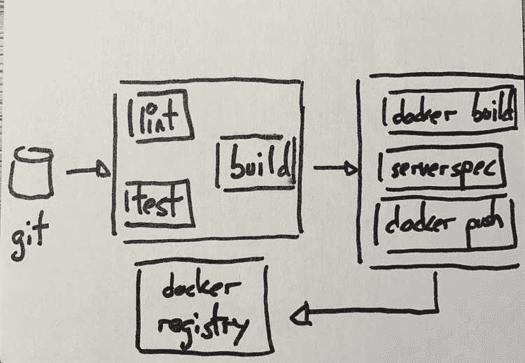
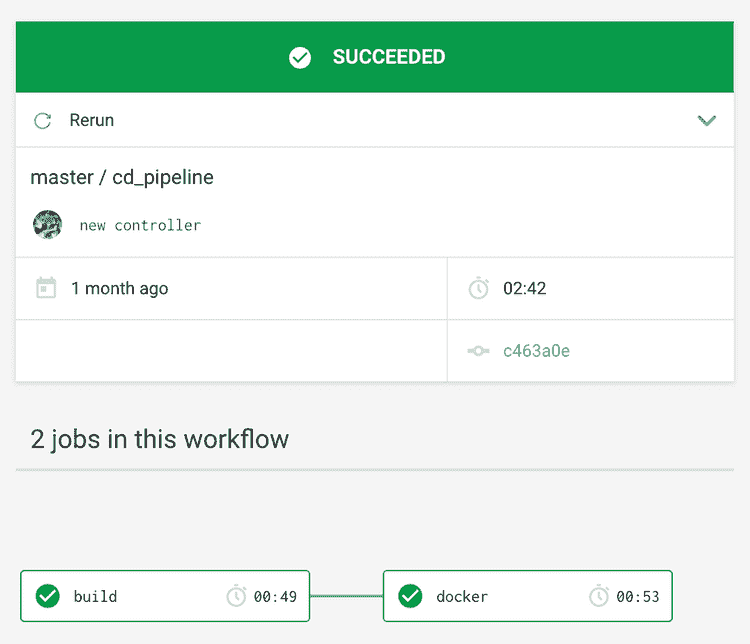
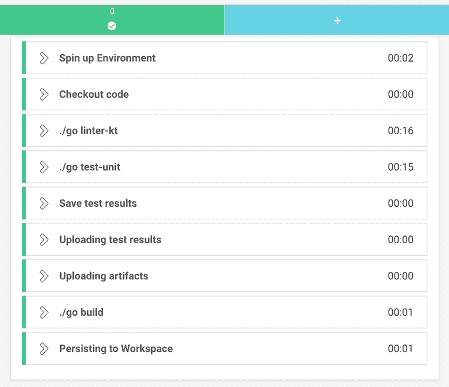

# 用 CircleCI 编写 JVM 应用程序

> 原文：<https://dev.to/sirech/dockerizing-a-jvm-app-with-circleci-5fnf>

很长一段时间以来，我一直在用特拉维斯做我的个人项目，直到大规模裁员的消息吓得我开始寻找替代方案。我听说过关于 [CircleCI](https://circleci.com/) 的好消息，所以我决定试一试。具体来说，我希望构建一个管道来完成以下任务:

*   封装一个用 [Kotlin](https://kotlinlang.org/) 编写的 [SpringBoot](https://spring.io/) 应用程序作为`jar`，运行 linters 和之前的测试，保存测试结果。
*   构建一个 [Docker](https://www.docker.com/) 映像来运行应用程序，首先运行 [ServerSpec](https://serverspec.org/) ，并将其推送到 *Docker* 注册表。

按照我自己对管道的想法，我希望它快速、可视化、易于维护并且可靠地构建我的玩具应用。成功了吗？休息之后更精彩！

## 转圈跑

CircleCI 有一个[免费计划](https://circleci.com/pricing/usage/)，非常适合实验，与 [Github](https://github.com/) 无缝集成，让开始变得轻而易举。

这些基础知识在[他们自己的网站](https://circleci.com/docs/2.0/getting-started/)上有深入的介绍，所以我将跳过它。让我们直接进入细节。这是要实现的管道的草图:

[](///static/c5a919c0b5c8347dda325547052febec/65a1e/sketch.jpg)

我将讨论一些我感兴趣的细节，以及实现部分管道的代码。TLDR: [这是完整的管道](https://github.com/sirech/echo/blob/master/.circleci/config.yml)。

## 使用工作流

工作流是 CircleCI 组织工作间依赖关系的方式。在我的例子中，这只是一种说法，即一个作业应该在另一个作业之后执行，如下图所示:

[](///static/315918ecce43a06aad2be9d7b540b891/709cb/circle-workflow.png)

看起来很简单，对吧？然而，这幅图并没有展示全部的真相。我使用一个过滤器将`docker`作业限制在`master`分支。工作流定义如下:

```
workflows:
  version: 2
  pipeline:
    jobs:
      - build
      - docker:
          filters:
            branches:
              only: master
          requires:
            - build 
```

<svg width="20px" height="20px" viewBox="0 0 24 24" class="highlight-action crayons-icon highlight-action--fullscreen-on"><title>Enter fullscreen mode</title></svg> <svg width="20px" height="20px" viewBox="0 0 24 24" class="highlight-action crayons-icon highlight-action--fullscreen-off"><title>Exit fullscreen mode</title></svg>

为什么有限制？嗯，我使用[dependent bot](https://dependabot.com/)来自动检查依赖关系的新版本，我希望工具生成的 PRs 运行我的测试，但不要生成新的 docker 映像。

## 构建步骤

我总是在某个码头工人的形象下工作。对于构建，我使用了由 *CircleCI* 提供的 *OpenJDK* 图像，这是他们维护的中的[图像之一。这些是步骤。](https://circleci.com/docs/2.0/circleci-images/) 

```
build:
  docker:
    - image: circleci/openjdk:8-jdk

  steps:
    - checkout
    - run: ./gradlew detekt
    - run: ./gradlew clean test
    - run: ./gradlew assemble 
```

<svg width="20px" height="20px" viewBox="0 0 24 24" class="highlight-action crayons-icon highlight-action--fullscreen-on"><title>Enter fullscreen mode</title></svg> <svg width="20px" height="20px" viewBox="0 0 24 24" class="highlight-action crayons-icon highlight-action--fullscreen-off"><title>Exit fullscreen mode</title></svg>

[检测器](https://github.com/arturbosch/detekt)是[基本上是一个棉绒](https://www.thoughtworks.com/radar/tools/detekt)，可以在管道内独立运行。除此之外，执行单元测试，如果一切正常，就构建一个`jar`。

### 坚持不懈

与[广场](https://concourse-ci.org/)不同的是， *CircleCI* 允许你在工作之间保存工件，这非常方便。在这种情况下，当我构建 *Docker* 映像时，我需要我们刚刚生成的`jar`文件。为了持久化它，您在`build`作业的步骤列表中添加了一个额外的指令:

```
- persist_to_workspace:
    root: build/libs
    paths:
      - echo.jar 
```

<svg width="20px" height="20px" viewBox="0 0 24 24" class="highlight-action crayons-icon highlight-action--fullscreen-on"><title>Enter fullscreen mode</title></svg> <svg width="20px" height="20px" viewBox="0 0 24 24" class="highlight-action crayons-icon highlight-action--fullscreen-off"><title>Exit fullscreen mode</title></svg>

### 你必须保存测试

我发现的另一个漂亮的特性是[存储测试结果](https://circleci.com/docs/2.0/collect-test-data/)，它出现在仪表板中，让你更容易理解你的工作在做什么。

测试结果和执行摘要都被存储为工件。为此，需要添加一些额外的步骤:

```
- run:
    name: Save test results
    command: |
      mkdir -p ~/junit/
      find . -type f -regex ".*/build/test-results/.*xml" -exec cp {} ~/junit/ \;
    when: always

- store_test_results:
    path: ~/junit
- store_artifacts:
    path: ~/junit 
```

<svg width="20px" height="20px" viewBox="0 0 24 24" class="highlight-action crayons-icon highlight-action--fullscreen-on"><title>Enter fullscreen mode</title></svg> <svg width="20px" height="20px" viewBox="0 0 24 24" class="highlight-action crayons-icon highlight-action--fullscreen-off"><title>Exit fullscreen mode</title></svg>

总而言之，构建有一堆步骤，正如在这个截图中可以看到的。

[](///static/117bfc521c13e320f2be63327bb1732c/bb051/detailed.png)

## Docker 步骤

### 图像本身

因此，如果我想对我们的应用程序进行 dockerize，我需要一个 docker file(T4 )(废话！).这个映像运行了建立在前一个任务
上的`jar`

```
FROM openjdk:8-jre-alpine3.9

WORKDIR /app
EXPOSE 4000

RUN apk add --update --no-cache dumb-init \
  && rm -rf /var/cache/apk/*

COPY build/libs/echo.jar .

RUN adduser -D runner

USER runner
ENTRYPOINT ["/usr/bin/dumb-init", "--"]
CMD ["java", "-jar", "echo.jar"] 
```

<svg width="20px" height="20px" viewBox="0 0 24 24" class="highlight-action crayons-icon highlight-action--fullscreen-on"><title>Enter fullscreen mode</title></svg> <svg width="20px" height="20px" viewBox="0 0 24 24" class="highlight-action crayons-icon highlight-action--fullscreen-off"><title>Exit fullscreen mode</title></svg>

没什么异常。这里有一篇关于提高你的 *Docker* 图片质量的最新文章。

### 运行 ServerSpec

我是用 [ServerSpec](https://serverspec.org/) 测试容器的忠实粉丝，因为[我在](//../testing-containers-serverspec-and-localstack/)之前写过，也多次提到过。

由于臭名昭著的 [docker in docker](https://jpetazzo.github.io/2015/09/03/do-not-use-docker-in-docker-for-ci/) 问题，在 CI 中运行这些测试往往会很痛苦。当我试图把他们安排到 *CircleCI* 的时候，我还以为会有另一轮的痛苦。

没那么多！令人惊讶的是，它进行得相当迅速。也许我现在已经习惯了，谁知道呢。但是，如何去做呢？

我为此设立了一份新工作。我用红宝石图像创建并上传了我自己的 [dind，这样我就可以访问更新的`ruby`版本。它的简化版看起来是这样的:](https://hub.docker.com/r/sirech/dind-ruby/tags) 

```
docker:

  docker:
    - image: sirech/dind-ruby:2.6.3

  steps:

    - checkout
    - attach_workspace:
        at: build/libs
    - setup_remote_docker
    - run: docker build . -t echo
    - run:
        name: ServerSpec Tests
        command: |
          bundle install
          bundle exec rspec spec 
```

<svg width="20px" height="20px" viewBox="0 0 24 24" class="highlight-action crayons-icon highlight-action--fullscreen-on"><title>Enter fullscreen mode</title></svg> <svg width="20px" height="20px" viewBox="0 0 24 24" class="highlight-action crayons-icon highlight-action--fullscreen-off"><title>Exit fullscreen mode</title></svg>

多亏了 [setup_remote_docker](https://circleci.com/docs/2.0/building-docker-images/) 指令，常规的`docker`命令可用于这项工作。安装完依赖项后，[测试](https://github.com/sirech/echo/blob/master/spec/container_spec.rb)可以在管道内部运行。

通过使用`attach_workspace`指令，可以获得前一个作业中生成的`jar`。

### 建筑形象

一旦容器测试通过，就该构建映像并将其发布到某个注册中心了。这将是我们最终可以用于部署的工件。部署可以在同一个管道中进行，也可以在单独的管道中进行，这并不重要。

从和以前一样的工作开始，是时候登录到我们应该保存图像的注册表中了。然后我们用正确的标签构建图像，并推它:

```
- run:
    name: Publish docker image
    command: |
      echo $DOCKER_PASSWORD | docker login -u $DOCKER_USER $DOCKER_REGISTRY --password-stdin
      docker build . --tag $DOCKER_REGISTRY/echo
      docker push $DOCKER_REGISTRY/echo 
```

<svg width="20px" height="20px" viewBox="0 0 24 24" class="highlight-action crayons-icon highlight-action--fullscreen-on"><title>Enter fullscreen mode</title></svg> <svg width="20px" height="20px" viewBox="0 0 24 24" class="highlight-action crayons-icon highlight-action--fullscreen-off"><title>Exit fullscreen mode</title></svg>

你可以看到我没有对图像进行版本控制。对于严肃的应用程序，不要这样做。您可以通过使用`CIRCLE_SHA1`变量来附加`git`提交，这是许多现成可用的[内置](https://circleci.com/docs/2.0/env-vars/#built-in-environment-variables)变量之一。

## 缓存

隔离非常有助于保持我们的构建的可靠性。不过，这通常与性能不一致。我不想像过去那样缓存整个工作空间，但是避免每次都下载依赖项非常方便，并且保持管道快速，这正是我喜欢的方式。

在 *CircleCI* 中，你可以通过保存一个基于密钥的特定文件夹来实现。例如，如果我想缓存我用于容器测试的`ruby`依赖项，我使用这样一个块:

```
- restore_cache:
    key: bundle-2-{{ checksum "Gemfile.lock" }}
- run: bundle check || bundle install --without ops development
- save_cache:
    key: bundle-2-{{ checksum "Gemfile.lock" }}
    paths:
      - vendor/bundle 
```

<svg width="20px" height="20px" viewBox="0 0 24 24" class="highlight-action crayons-icon highlight-action--fullscreen-on"><title>Enter fullscreen mode</title></svg> <svg width="20px" height="20px" viewBox="0 0 24 24" class="highlight-action crayons-icon highlight-action--fullscreen-off"><title>Exit fullscreen mode</title></svg>

在此之后，同一作业中的所有步骤都将可用，并且它们将被缓存，直到`Gemfile.lock`文件发生变化。

## 定义变量

我在整个管道中使用变量来编码某些值，比如我的 *Docker* 凭证。[它们通过用户界面](https://circleci.com/docs/2.0/env-vars/)进行管理，坦白地说，这并不理想。老实说，我更喜欢更程序化的解决方案。不用说，将秘密直接放入`config.yml`是不可能的，所以这是必须的。

如果您想要管理多个项目的一组变量，一个选项可以是使用上下文的[。](https://circleci.com/docs/2.0/contexts/)

## 怎么看都在一起？

那也没那么糟。我发现 CircleCI 非常直观，对于业余爱好项目，他们的标准账户已经足够了。事实上，管道运行速度非常快。开始时，我等了一会儿去检查它们，当我看的时候，它们已经完成了一会儿。

整条管道都在 [github](https://github.com/sirech/echo/blob/master/.circleci/config.yml) 中。这应该是构建您自己的应用程序的良好开端。事实上，流水线并没有停止在 *Docker* 阶段，而是有一个基于定制脚本的部署步骤。