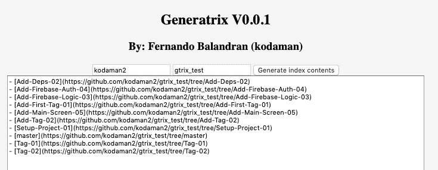
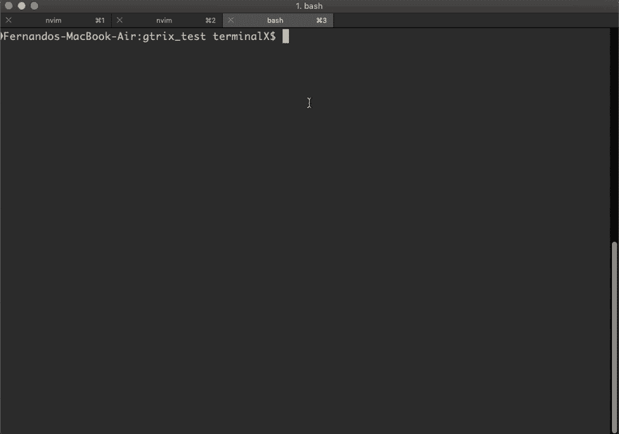

# Git 分支的展示母线实用程序

> 原文：<https://dev.to/thefern/showcase-generatrix-utility-for-git-branches-tags-markdown-1gbo>

我上周写了这个工具，我称之为[母线](https://github.com/kodaman2/generatrix_py)。它为回购分支/标签生成降价。我不知道这对其他人来说是个多大的问题，但我还是想分享一下。如果你正在做一个教程，并且需要向你的用户提供代码，并且你在整个教程或课程中把代码分成分支或标签，你也可以使用 generatrix。然后将输出复制并粘贴到您的自述文件中。

## 背景故事

我实际上已经开始在 github 页面、[库](https://github.com/kodaman2/generatrix)上做[静态站点](https://kodaman2.github.io/generatrix/)了，但是我有点失败了，因为我在 JS 上很烂，其实不是，我只是在异步代码上很烂。我从来没有做过任何 JS，我感到沮丧，我寻求帮助，一些人提供了可怕的帮助，我仍然必须努力。网站工作，但分支被吐出没有按照日期顺序，有时，这是一个问题。我敢肯定我的 JS 代码是一个烂摊子 lol。

出了故障的 mkdown
[T3】](https://res.cloudinary.com/practicaldev/image/fetch/s--cj3Utp05--/c_limit%2Cf_auto%2Cfl_progressive%2Cq_auto%2Cw_880/https://kodaman2.github.io/blimg/gtrix/gtrix_site.png)

## Python 版本

我在静态网站上花了几天时间，然后在几个小时内完成了 python 版本。

[](https://res.cloudinary.com/practicaldev/image/fetch/s--wU8rymq8--/c_limit%2Cf_auto%2Cfl_progressive%2Cq_66%2Cw_880/https://kodaman2.github.io/blimg/gtrix/gtrix.gif)

它适用于所有平台，因为它是管道 git 命令。

```
pip install Generatrix 
```

<svg width="20px" height="20px" viewBox="0 0 24 24" class="highlight-action crayons-icon highlight-action--fullscreen-on"><title>Enter fullscreen mode</title></svg> <svg width="20px" height="20px" viewBox="0 0 24 24" class="highlight-action crayons-icon highlight-action--fullscreen-off"><title>Exit fullscreen mode</title></svg>

git 回购内部:

```
gtrix
  or
gtrix --help
  or
gtrix --tags 
```

<svg width="20px" height="20px" viewBox="0 0 24 24" class="highlight-action crayons-icon highlight-action--fullscreen-on"><title>Enter fullscreen mode</title></svg> <svg width="20px" height="20px" viewBox="0 0 24 24" class="highlight-action crayons-icon highlight-action--fullscreen-off"><title>Exit fullscreen mode</title></svg>

可选，如果你没有。gitconfig 已配置:

```
gtrix --user "username" 
```

<svg width="20px" height="20px" viewBox="0 0 24 24" class="highlight-action crayons-icon highlight-action--fullscreen-on"><title>Enter fullscreen mode</title></svg> <svg width="20px" height="20px" viewBox="0 0 24 24" class="highlight-action crayons-icon highlight-action--fullscreen-off"><title>Exit fullscreen mode</title></svg>

所有的参数也有简短的版本，帮助文档在回购开始时发布。如果您曾经不得不为自述文件手动生成该文件，请告诉我。我也欢迎反馈。:)