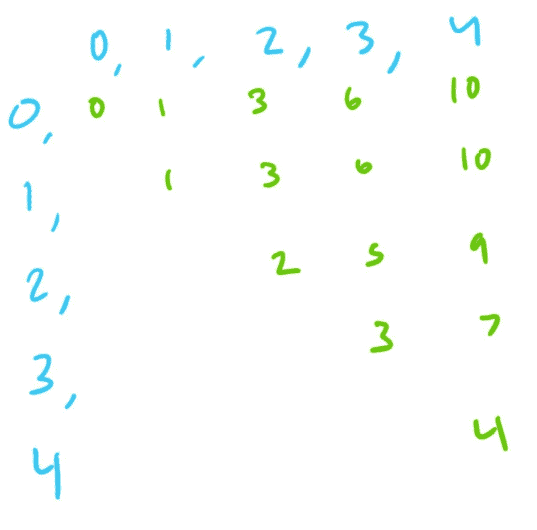

# 算法:范围和查询

> 原文：<https://dev.to/tttaaannnggg/algorithms-range-sum-query-2hcf>

又到算法时间了！

这是一本简单的书，但是从中可以学到很多东西。

问题是这样的:

> **范围和查询**:
> 
> *给定一个整数数组 nums，求索引 I 和 j (i ≤ j)之间的元素之和，含。*

因此，如果我们有一个数组，比如说`[1,2,3,4,5]`，和索引`2`和`4`，我们将加上`3 + 4 + 5`得到`12`。

很简单，对吧？我们可以遍历我们的数组，对我们得到的索引之间的内容求和。

```
function NumArr(arr){
  this.data = arr;
}

NumArr.prototype.rangeSum = function(i, j){
  let output = 0;
  for(i; i<=j;i++){
    output+=this.data[i];
  }
  return output;
} 
```

Enter fullscreen mode Exit fullscreen mode

这不是一个可怕的解决方案。如果我们只查询我们的数组一次或两次，或者如果我们期望得到各种各样的数组，这是可行的。计算机非常擅长加法- [这可能是 CPU 能做的最快的运算](https://streamhpc.com/blog/2012-07-16/how-expensive-is-an-operation-on-a-cpu/)。事实上，它是如此之快，以至于通过了 leetcode 测试。

但是，有两个规定，这给了我们改进和优化解决方案的空间。

> 1.  You can assume that the array is unchanged.
> 2.  There are many calls to the sum function.

所以，让我们想想这是如何工作的。如果我们做足够多的求和，其中一些可能会达到相同的范围，对吗？我们可以缓存我们的解决方案并查找它，而不是重新计算它。让我们在构造函数上放一个缓存。

### 缓存

缓存应该采用什么形状？
如果我们想一想，二维数组似乎最有意义——我们添加了一个从`i`到`j`的范围，这样我们就可以将缓存的结果转储到`this.cache[i][j]`

```
function NumArray(arr){
  this.data = arr;
  this.cache = arr.map(()=>[]); //fill cache with one empty array per item in arr
}

NumArray.prototype.sumRange = function(i, j){
  if(!this.cache[i][j]){
    let output = 0;
    for(let k = i; k<=j;k++){
      output+=this.data[k];
    }
    this.cache[i][j] = output;
  }
  return this.cache[i][j];
} 
```

Enter fullscreen mode Exit fullscreen mode

这是可行的，但是在缓存中存储内容的额外任务使得对某个范围的初始查询慢得多。每次连续的查询都会非常快，但这也需要我们再次回到准确的范围。

### 有没有更好的解决方案？

简而言之:是的。非常好。

到达那里有点痛苦。最初，我浏览了 leetcode 解决方案，看到了一些关于预计算结果的内容。我认为这意味着我们应该预先计算并缓存整个东西——为什么不呢？

如果我们计算任何范围和，我们在做重复的工作。即，如果我们将从索引`0`到索引`5`的值相加，我们已经计算出`arr[0]+arr[1]`、`arr[0]+arr[1]+arr[2]`等。这意味着我们可以简单地缓存一些中间值。

我可以直觉地知道，我至少可以得到第一组这样的和:

```
function NumArray(arr){
  this.data = arr;
  this.cache = []
  arr.reduce((acc,val)=>{
    acc += val;
    cache.push(val)
    return acc;
  },0)
} 
```

Enter fullscreen mode Exit fullscreen mode

当计算完成时，我们的缓存将是一个数组，包含从`0`到`n`的所有总和。`[(sum of index 0), (sum of index 0 to index 1), (sum of index 0 to index 2), ...., (sum of index 0 to index n)]`

这是一个很好的小计算，让我们的生活变得更容易，但我们如何考虑得到所有的总和`index 1 to index n`，然后`index 2 to index n`，一直到`index n-1 to index n`？

我试图找出是否有一种简单的方法来计算所有可能的总和，但一直得到的`O(n^2)`解在 leetcode 上会超时。

所以我试图找出我在一个测试用例中能看到什么样的模式，用一个非常简单的`[0,1,2,3,4]`数组手工建模

[](https://res.cloudinary.com/practicaldev/image/fetch/s--WuABavVa--/c_limit%2Cf_auto%2Cfl_progressive%2Cq_auto%2Cw_880/https://thepracticaldev.s3.amazonaws.com/i/osyy89xwo4dx8xzf17ud.jpg)

有一些有趣的事情正在发生。我们可以看到，每一个连续的行基本上都是由前一行减去我们跳过的整数组成的。

第一行由所有数字相加而成。
取第一行减去第一个数字即可得到第二行
取第二行减去第二个数字即可得到第三行
取第三行减去第三个数字即可得到第四行
...诸如此类。

这需要一点时间来理解，但这里的秘密取决于重新安排之前的洞察力:

换句话说，我们可以通过取索引`0`到`j`的数之和，再减去索引`0`到`i`的数之和，找到从`i`到`j`的任意范围。

在这种情况下，我们需要的所有数据都是在我们进行初始传递时创建的。我们保证为指数`0`到`i`提供适当的总和，同样，为指数`0`到`j`提供适当的总和。我们甚至不必缓存每一个可能的答案来进行`O(1)`运算。

下面是我最后的结果:

```
const NumArray = function(nums){
  this.cache = [0]; // done to avoid an "if" check for the first number
  for (let i = 0; i < nums.length; i++){
    this.cache.push(this.cache[i]+nums[i]);
  }
}

NumArray.prototype.sumRange = function(i,j){
  return this.cache[j+1]-this.cache[i];
} 
```

Enter fullscreen mode Exit fullscreen mode

这极大地节省了时间复杂度——我们最初遍历数组的时间是`O(n)`，这与首先计算单个范围和的时间复杂度相同(即，如果你想从`0`到`arr.length-1`求和)。之后得到任何连续的答案都是一个`O(1)`操作！

唯一真正的代价是这种解决方案的空间复杂度也是`O(n)`，但这是非常值得的。