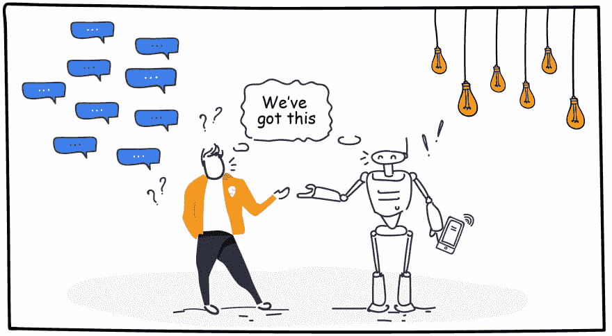
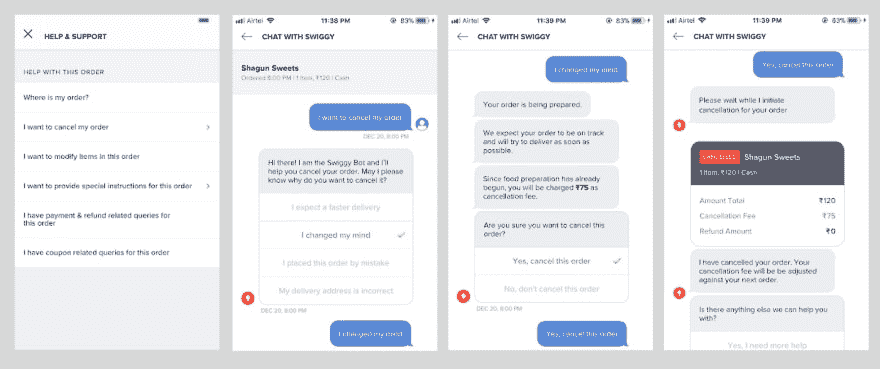
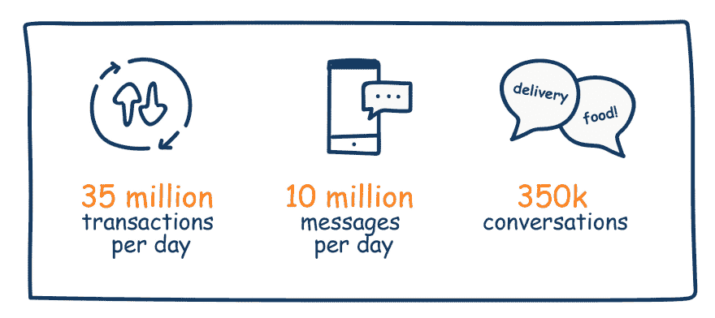

# Swiggy 的聊天机器人

> 原文：<https://dev.to/abeyalex/chatbots-at-swiggy-9bp>

在 [Swiggy](https://www.swiggy.com) ，聊天仍然是客户联系我们的主要方式之一。事实上，我们大约 70%的客户更喜欢通过聊天而不是电话进行交流，因为这是获得帮助的最无障碍的方式。

回到 2018 年，我们使用第三方消息软件进行聊天，在大多数情况下，它对我们很有效。它帮助我们的客户与支持主管建立联系。但是，在几个月的时间里，Swiggy 从 9 个城市发展到 200 多个城市。这导致每天创建的对话数量增加了 10 倍。

第三方聊天开始觉得不够用了。首先，它对我们来说是一个黑匣子。提取查询的隐私意识趋势、客户满意度得分等并不容易。我们正在寻找一些具体的数据流，我们的内部数据科学和分析工具可以轻松地挂钩，从而推动业务决策以改善客户的整体体验。

对于客户来说，聊天体验不如 Swiggy 高度认可的 UX。我们希望对 UX 有更大的控制，能够构建交互式消息传递组件，并监控客户与每个组件的交互。

支持主管对增加的流量也不太满意。他们每次都在解决类似的重复投诉——无论是订单取消还是更新客户的订单状态。

这时候我们开始思考——如果我们可以自动化其中的一些片段会怎么样？如果我们建立一个聊天机器人，可以独立地帮助客户，而不需要支持人员的帮助，会怎么样？

只是为了设置一些背景，聊天机器人是一种计算机程序，可以根据一组预定义的条件或事件自动模拟与客户的交互。然而，他们并不意味着取代客户支持主管，而是提供转换过程中的第一步。大多数情况下，聊天机器人将能够解决客户的疑问，增加对话的透明度，并为支持主管提供缓冲。但是，如果客户更愿意与人工支持主管交谈，我们不会阻止。

我们评估了市场上的许多系统，但没有满足我们的要求和用户体验标准的一站式解决方案。最后，我们决定构建一个内部聊天平台，该平台将是健壮的、可伸缩的、可扩展的，并将为我们的客户和支持管理人员等提供统一的无缝体验。

当我们开始考虑订单后的客户体验时，我们意识到基于传统票务的 CRM 系统对我们不起作用。如果我们要为我们的超本地业务提供出色的客户体验，它必须是一个实时对话界面。但与此同时，我们不可能扩大我们的联络中心，以跟上我们业务规模的步伐。这要求我们从一开始就考虑自动化。

### 设计聊天机器人流程

我们开始时在我们的对话中有一个受控的流程。这意味着客户不需要输入任何文本，而是可以选择进入下一步。这实际上是一个运行在后端的[‘决策树’](https://en.wikipedia.org/wiki/Decision_tree)。决策树是一种树状数据结构，其中每个节点都有子节点，这些子节点与条件控制语句相关联，也称为子节点有效性规则。在聊天机器人流程的每一步，我们都向客户显示有效子节点的列表，作为进一步处理的选项。

考虑这样的事情。

聊天机器人自动化的最佳用例是订单取消。从想要取消正在进行的订单的客户创建的数千个对话中，我们收集了取消订单的常见原因，并创建了一个简单的聊天机器人流程:

*   询问客户取消的原因。
*   显示预测的交货时间作为威慑。
*   显示取消费用(如果适用)。
*   请客户确认取消。
*   使用丰富的可视化显示退款的详细信息。

整个任务现在变成了客户的自助服务，10 秒钟就能完成。客观地说，早期的取消过程需要大约 5 分钟和多次电话。

从经验上来看，这是一种更加进化的方法。客户总是离人工帮助只有一步之遥。在同一个对话中，聊天机器人和代理流之间的转换是毫不费力和无缝的。

### 会话即服务

从早期开始，我们就知道了为此需要构建的核心组件。

*   Webview—Swiggy 移动和 web 应用程序使用的聊天客户界面。
*   Orchestrator——客户、聊天机器人和支持主管之间的对话路由控制器。
*   座席工作台-支持主管的界面，用于解决客户查询、定义分配逻辑和规则。
*   Bot——一个决策树解析器，它与 Swiggy 中的多个系统连接以验证节点。
*   通知系统。

所有这些都是高度可靠的微服务。聊天平台的所有组件都采用内包模式。Swiggy 的任何其他团队都可以不费吹灰之力地加入他们的对话工作流。除了常规的食物订单， [Swiggy Daily](https://blog.swiggy.com/news-updates/introducing-swiggy-daily) 和 [Swiggy Stores](https://blog.swiggy.com/news-updates/need-it-now-introducing-swiggy-stores) 也使用聊天平台。

### 欺诈检测

虽然新推出的聊天机器人让客户的生活更加轻松，但我们也看到系统中的欺诈活动有所增加。这包括一些客户每天取消几十个订单，以及要求所有订单 100%退款。一些护栏必须安装到位，以防止系统被误用。

作为一家 AI first 公司，Swiggy 创建了一个欺诈模型-一个机器学习模型，它将几个信号作为输入，以定义所有客户的欺诈细分。这被集成到聊天机器人中，以做出更加明智和个性化的决定。结果很有希望。

### 规模和关键程度

聊天已经成为 Swiggy 整体订购体验中的一个关键子系统。我们已经看到聊天平台在没有任何服务中断或降级的情况下处理了令人难以置信的大量查询。

同时，聊天平台依赖于多个系统——Swiggy 内部和外部。这意味着当事情变得混乱时，我们必须考虑非理想的情况。

用业务术语来说，这叫做业务连续性计划，也叫 BCP 计划。我们在聊天平台中建立了两个级别的 BCP 场景，这有助于我们即使在系统受到胁迫的情况下也能继续为客户服务。

*   自助机器人流程:消息传递模块的任何问题都将导致发送和接收消息的体验下降。在这种情况下，我们在聊天机器人流程中使用请求-响应模型。客户仍将获得同样出色的体验，机器人将能够解决大多数问题。
*   第三方代理聊天—这是当聊天平台本身停机时，更多的是一种备份。这种情况发生的几率极小。

### 业务影响和铺开

我们严格跟踪的一个关键指标是机器人功效百分比。这比较了机器人与支持主管解决的对话的百分比。随着各种正在进行的优化，在未来几周内，超过 75%的对话将由聊天机器人积极解决。

聊天机器人改善的客户体验和整体影响鼓励我们加入更多的工作流。Swiggy 的订单体验非常透明，这要归功于它的实时跟踪。除此之外，聊天机器人能够减少焦虑，并向联系我们查看订单状态的客户提供保证。

我们还自动完成了以下客户查询。

*   报告已交付订单的问题。
*   添加交货说明。
*   查看退款状态或失败交易的详细信息。
*   任何商品缺货时选择替代品。

所有这些都极大地增强了客户对其订单采取快速行动的能力，同时要求我们的支持主管进行更少的手动干预。这也有助于支持高管关注更重要的问题。

### 接下来是什么？

我们已经开始投资自然语言处理(NLP)、情感分析、智能回复和多语言支持。这些平台功能将使聊天机器人更上一层楼。我们的配送主管和餐厅合作伙伴的支持系统也正在加入聊天平台。我们希望为每个人提供同样出色的体验，同时提供数据隔离和多租户。

*最初发布在 Swiggy 的工程博客-[Swiggy Bytes](https://bytes.swiggy.com/chatbots-at-swiggy-6299116f9e69)T3】*