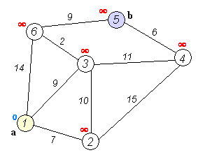
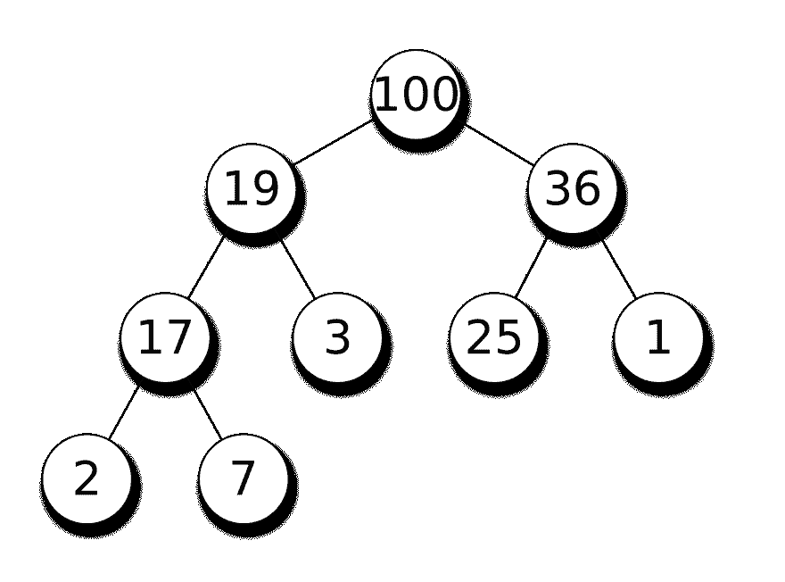

# 在 Go 中使用堆实现 Dijkstra

> 原文：<https://dev.to/douglasmakey/implementation-of-dijkstra-using-heap-in-go-6e3>

# 在 Go 中使用堆简单实现 Dijkstra。

## 什么是迪杰斯特拉？

[](https://res.cloudinary.com/practicaldev/image/fetch/s--dCyH0Avt--/c_limit%2Cf_auto%2Cfl_progressive%2Cq_66%2Cw_880/https://upload.wikimedia.org/wikipedia/commons/5/57/Dijkstra_Animation.gif)

*MEGA SHORT DESCRIPTION:Dijkstra 寻找 a 和 b 之间最短路径的算法，它挑选距离最小的未访问节点，计算通过它到每个未访问邻居的距离，如果邻居的距离更小，就更新邻居的距离。*

*   将所有节点标记为未访问。创建所有未访问节点的集合，称为未访问集合，在我们的例子中，我们将使用已访问节点的集合，而不是未访问节点的集合。

*   给每个节点分配一个暂定的距离值:对于初始节点，将其设置为零。将初始节点设置为当前节点。

*   对于当前节点，考虑其所有未访问的邻居，并计算它们通过当前节点的暂定距离。将新计算的暂定距离与当前指定值进行比较，并指定较小的值。例如，如果当前节点 A 被标记为距离 6，并且连接它和邻居 B 的边的长度为 2，那么通过 A 到 B 的距离将是 6 + 2 = 8。如果 B 之前标记的距离大于 8，则将其更改为 8。否则，保持当前值。

*   当我们考虑完当前节点的所有未访问邻居后，将当前节点标记为已访问。被访问的节点将不再被检查。

*   选择下一个标有最小暂定距离的未访问节点，将其设置为新的“当前节点”，并返回步骤 3。

[维基百科](https://en.wikipedia.org/wiki/Dijkstra%27s_algorithm)

## 什么是堆？

[](https://res.cloudinary.com/practicaldev/image/fetch/s--7pOHEIgV--/c_limit%2Cf_auto%2Cfl_progressive%2Cq_auto%2Cw_880/https://upload.wikimedia.org/wikipedia/commons/thumb/3/38/Max-Heap.svg/2560px-Max-Heap.svg.png)

在计算机科学中，堆是一种专门的基于树的数据结构，本质上是满足堆属性的几乎完整的树:在最大堆中，对于任何给定的节点 C，如果 P 是 C 的父节点，则 P 的键(值)大于或等于 C 的键。在最小堆中，P 的键小于或等于 C 的键。堆“顶部”的节点(没有父节点)称为根节点。

[维基百科](https://en.wikipedia.org/wiki/Heap_(data_structure))

一个堆可以被认为是一个优先级队列；最重要的节点将永远在顶部，当删除时，它的替换将是最重要的。当编码算法需要以完整的顺序处理某些内容时，但当您不想执行完整的排序或需要了解关于其余节点的任何信息时，这可能很有用。例如，一个著名的寻找图中节点间最短距离的算法，Dijkstra 算法，可以通过使用优先级队列来优化。

[c 编程](https://www.cprogramming.com/tutorial/computersciencetheory/heap.html)

## 为什么？

我正在努力学习图形和它的算法，因为我从来没有上过大学，所以我对图形了解不多，因此我试图在我的空闲时间阅读和学习这方面的知识，我最近看了一个关于使用堆在 python 中实现 Dijkstra 的视频，这很有趣，所以我决定用 go 做同样的事情。

我知道有很多关于相同主题的文章，这些文章很好地解释了什么是 Dijkstra 或什么是 heap，这篇文章很短，只关注实现，我想向您展示一个在 Golang 中使用 heap 实现 Dijkstra 的非常简单的方法。

如果你想读更多关于 Dijkstra 的东西，你应该读读这篇文章，我觉得它很棒。

一篇优秀的文章

## 实现

Dijkstra 是一种算法，用于搜索两个节点之间的最短路径，访问每个节点的邻居，并计算成本和从源节点开始的路径，始终保持最小值，为此，我们可以使用最小堆来保持每次迭代中的最小值，使用 push 和 pop 操作，两种操作都是 O(log n)。

首先，我们需要实现 min-heap，golang 的标准库中有一个包。

包堆为实现 heap.Interface 的任何类型提供堆操作。堆是一棵树，其属性是每个节点都是其子树中值最小的节点。

[Godoc - heap](https://golang.org/pkg/container/heap/)

heap.go

```
package main

import hp "container/heap"

type path struct {
    value int
    nodes []string
}

type minPath []path

func (h minPath) Len() int           { return len(h) }
func (h minPath) Less(i, j int) bool { return h[i].value < h[j].value }
func (h minPath) Swap(i, j int)      { h[i], h[j] = h[j], h[i] }

func (h *minPath) Push(x interface{}) {
    *h = append(*h, x.(path))
}

func (h *minPath) Pop() interface{} {
    old := *h
    n := len(old)
    x := old[n-1]
    *h = old[0 : n-1]
    return x
}

type heap struct {
    values *minPath
}

func newHeap() *heap {
    return &heap{values: &minPath{}}
}

func (h *heap) push(p path) {
    hp.Push(h.values, p)
}

func (h *heap) pop() path {
    i := hp.Pop(h.values)
    return i.(path)
} 
```

<svg width="20px" height="20px" viewBox="0 0 24 24" class="highlight-action crayons-icon highlight-action--fullscreen-on"><title>Enter fullscreen mode</title></svg> <svg width="20px" height="20px" viewBox="0 0 24 24" class="highlight-action crayons-icon highlight-action--fullscreen-off"><title>Exit fullscreen mode</title></svg>

其次，我们需要实现图的逻辑，为此，我们使用一个包含映射的结构来保存节点之间的边，并使用函数来添加边并从一个节点获取所有边。

函数 getPath 实现了 Dijkstra 算法来获得起点和终点之间的最短路径。

graph.go

```
package main

type edge struct {
    node   string
    weight int
}

type graph struct {
    nodes map[string][]edge
}

func newGraph() *graph {
    return &graph{nodes: make(map[string][]edge)}
}

func (g *graph) addEdge(origin, destiny string, weight int) {
    g.nodes[origin] = append(g.nodes[origin], edge{node: destiny, weight: weight})
    g.nodes[destiny] = append(g.nodes[destiny], edge{node: origin, weight: weight})
}

func (g *graph) getEdges(node string) []edge {
    return g.nodes[node]
}

func (g *graph) getPath(origin, destiny string) (int, []string) {
    h := newHeap()
    h.push(path{value: 0, nodes: []string{origin}})
    visited := make(map[string]bool)

    for len(*h.values) > 0 {
        // Find the nearest yet to visit node
        p := h.pop()
        node := p.nodes[len(p.nodes)-1]

        if visited[node] {
            continue
        }

        if node == destiny {
            return p.value, p.nodes
        }

        for _, e := range g.getEdges(node) {
            if !visited[e.node] {
                // We calculate the total spent so far plus the cost and the path of getting here
                h.push(path{value: p.value + e.weight, nodes: append([]string{}, append(p.nodes, e.node)...)})
            }
        }

        visited[node] = true
    }

    return 0, nil
} 
```

<svg width="20px" height="20px" viewBox="0 0 24 24" class="highlight-action crayons-icon highlight-action--fullscreen-on"><title>Enter fullscreen mode</title></svg> <svg width="20px" height="20px" viewBox="0 0 24 24" class="highlight-action crayons-icon highlight-action--fullscreen-off"><title>Exit fullscreen mode</title></svg>

main.go

```
package main

import (
    "fmt"
)

func main() {
    fmt.Println("Dijkstra")
    // Example
    graph := newGraph()
    graph.addEdge("S", "B", 4)
    graph.addEdge("S", "C", 2)
    graph.addEdge("B", "C", 1)
    graph.addEdge("B", "D", 5)
    graph.addEdge("C", "D", 8)
    graph.addEdge("C", "E", 10)
    graph.addEdge("D", "E", 2)
    graph.addEdge("D", "T", 6)
    graph.addEdge("E", "T", 2)
    fmt.Println(graph.getPath("S", "T"))
} 
```

<svg width="20px" height="20px" viewBox="0 0 24 24" class="highlight-action crayons-icon highlight-action--fullscreen-on"><title>Enter fullscreen mode</title></svg> <svg width="20px" height="20px" viewBox="0 0 24 24" class="highlight-action crayons-icon highlight-action--fullscreen-off"><title>Exit fullscreen mode</title></svg>

```
$ go run .
Dijkstra
12 [S C B D E T] 
```

<svg width="20px" height="20px" viewBox="0 0 24 24" class="highlight-action crayons-icon highlight-action--fullscreen-on"><title>Enter fullscreen mode</title></svg> <svg width="20px" height="20px" viewBox="0 0 24 24" class="highlight-action crayons-icon highlight-action--fullscreen-off"><title>Exit fullscreen mode</title></svg>

[Github](https://github.com/douglasmakey/dijkstra-heap)