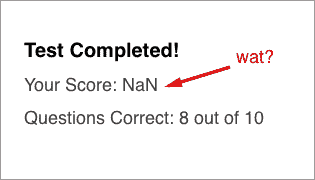
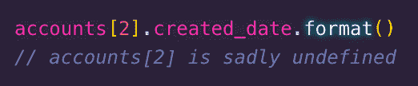
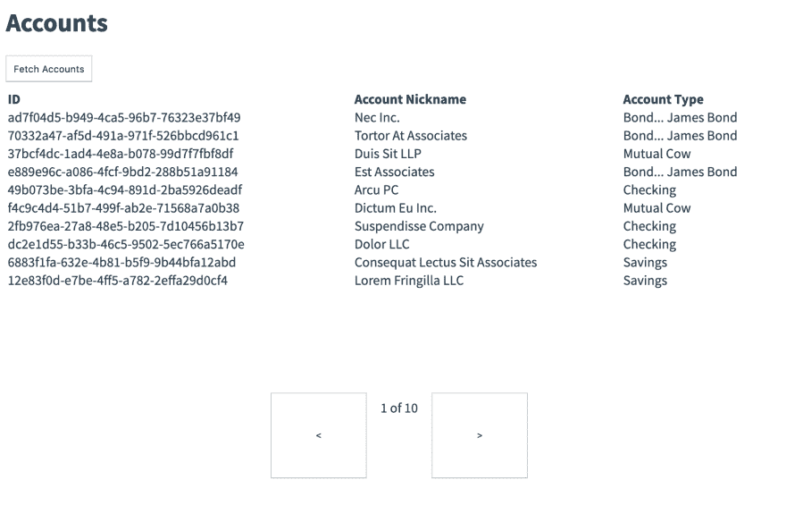
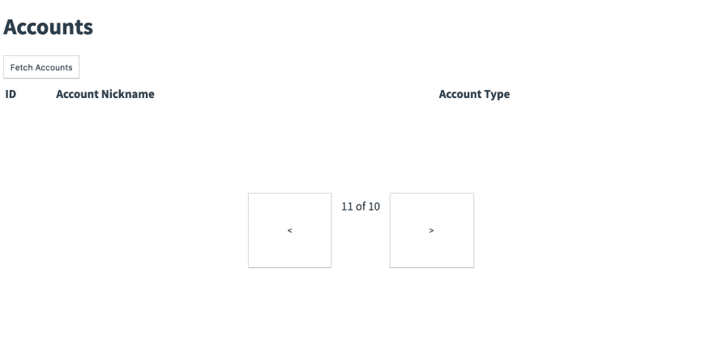
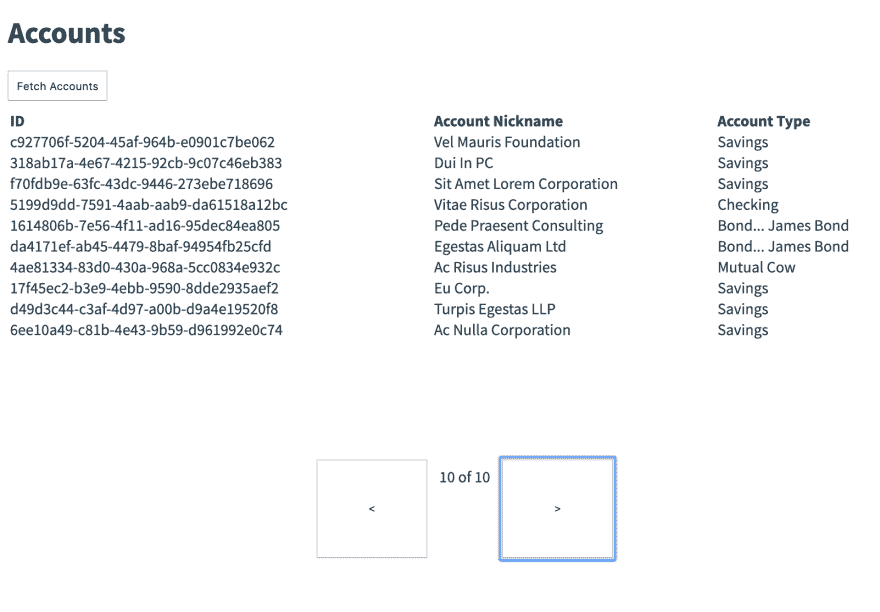

# 也许是一个默认的好主意

> 原文：<https://dev.to/jesterxl/maybe-a-default-good-idea-2leh>

## 简介

你已经知道使用`Maybe‘s`可以让你摆脱空指针异常(即“未定义的不是一个函数”)。但是，现在您的应用程序失败了，并且没有给出任何原因。至少错误会留下一个堆栈跟踪，它可以提供问题起源的线索。这是如何发生的，你应该怎么做？

## Python vs Ruby、Lua、JavaScript 中的空指针

让我们先定义一下什么是空指针，以及你通常是如何遇到它们的。作为一名开发人员，您会遇到的大多数空指针要么来自访问屏幕上显示的`Object`的属性，要么来自调用`Object`或类实例上的方法。

### 巨蟒的严格

访问对象(Python 中的字典)非常严格。如果字典存在，但是名字不存在或者你拼错了，你会得到一个异常:

```
# Python cow = { "firstName" : "Jesse" }
print(cow["fistName"])
KeyError: 'firstNam' 
```

Enter fullscreen mode Exit fullscreen mode

### Ruby、Lua、JavaScript 并不严格

然而，Ruby、Lua 和 JavaScript 会返回一个`nil`或`undefined`如果你访问一个在 Hash/Table/Object 上不存在的属性:

```
// JavaScript
cow = { firstName: "Jesse" }
console.log(cow["fistName"]) // undefined 
```

Enter fullscreen mode Exit fullscreen mode

### 获得 Null/Nil 与异常的好处

所有 3 种语言都将返回各自版本的“nothing”。对于某些应用程序，这种方法非常有效:

1.  显示数据时的 UI 应用程序
2.  API 是为了组织许多 API 或者仅仅是为了绕过 CORS 而存在的
3.  任何处理 NoSQL 类型数据的代码

对于 UI，你通常不能控制你的数据；你经常从一些 API 中加载它。即使是您自己编写的，如果您更改了内容，名称也会与 UI 不同步。

对于 API，你通常会为 UI 的编写[编排 API 来访问一个或多个 API，为你的 UI 提供一个更简单的 API。使用您的方法，您将使用高效的格式化数据发出 1 个请求，这是您的 UI 所需要的，而在 3 个请求中，您必须在客户端完成所有的错误处理和数据格式化。其他时候你想使用一个 API，但是它不支持 CORS。你的网站可以访问它的唯一方法是你建立自己的 API 来调用，因为 API 不会像 UI 应用程序那样被阻止访问域外的数据。](https://samnewman.io/patterns/architectural/bff/)

对于 NoSQL 类型的数据，通常会有许多具有相同或相似类型字段的对象，但要么质量低，要么不一致，要么两者兼而有之。这通常是用户输入的，因此不能保证记录中有“名字”属性。

### 小心你的愿望

然而，这有下游影响。有时代码会期待一个`String`或一个`Number`，而不是得到`undefined`并爆炸。更糟糕的是，它抛出的异常指示了错误的位置；错误发生在上游，但 stacktrace 可能不会显示出来。

虽然灵活的好处是好的，但是使用一个`Maybe`来强迫开发者处理返回`undefined`的情况会更好。

## 也许夏侯惇来救援了

解决这个问题的方法要使用代数数据类型，`Maybe`。这为您提供了两种处理空数据的方法。你可以得到一个默认值:

```
// Lodash/fp's getOr
getOr('unknown name', 'fistName', cow) // unknown name 
```

Enter fullscreen mode Exit fullscreen mode

或者，您可以进行匹配，无论是使用库提供的[匹配语法](https://folktale.origamitower.com/api/v2.3.0/en/folktale.maybe.html)，还是使用严格模式下的[类型脚本](https://www.typescriptlang.org/)的 switch 语句，以确保您已经处理了所有可能的值:

```
// Folktale's Maybe
cowsFirstNameMaybe.matchWith({
  Just: ({ value }) => console.log("First name is:", value),
  Nothing: () => console.log("unknown name")
}) 
```

Enter fullscreen mode Exit fullscreen mode

从理论上讲，这是确保不会出现空指针异常的关键之一，因为您可以确保在任何情况下，您通常会获得一个类型，并强制您的代码处理如果它获得空值会发生的情况，即使这碰巧会引发自定义错误。

## 下游仍遭殃

然而，也许它仍然会像`undefined`一样给下游带来痛苦。他们通过默认值来实现这一点。在上面的`getOr`例子中，我们只是提供了“未知名称”。如果我们得不到任何回报，我们就默认为“未知名称”，以后再处理问题，或者如果是数据库数据质量问题，我们无法修复，就不处理。对于 UI 开发人员来说，这通常是完美的，因为他们通常可以将问题归咎于后端开发人员，并且他们的代码运行良好，因此避免了消防演习，转移了责任。💪🏻

[](https://res.cloudinary.com/practicaldev/image/fetch/s--G1D_qoMR--/c_limit%2Cf_auto%2Cfl_progressive%2Cq_auto%2Cw_880/https://thepracticaldev.s3.amazonaws.com/i/ibhindcptaxasyq8iej4.png)

嘿，至少没爆炸，对吧？我的意思是，用户完成了测试，他们的结果被提交，他们可以忽略奇怪的分数…
然而，其他时候，它最终隐藏了错误。对于非 FP 代码库，下游的函数/类方法将获得空数据并中断。

[](https://res.cloudinary.com/practicaldev/image/fetch/s--_J-lyTMS--/c_limit%2Cf_auto%2Cfl_progressive%2Cq_auto%2Cw_880/https://thepracticaldev.s3.amazonaws.com/i/lv5tn9bcanzc29d7hy11.png)

对于函数式编程代码库，他们会得到开发人员从未想过的默认数据，这样就会出错。这是我们下面要重点关注的。

## 默认值引发 UI 剧的例子

让我们来定义一下我们所说的默认值是什么意思，因为在命令式版本中，如果用户不提供值，函数参数就会有默认值，或者通过 [Lodash](https://lodash.com/docs/4.17.14) 中的`getOr`、[民间故事](https://folktale.origamitower.com/api/v2.3.0/en/folktale.maybe.html)中的`getOrElse`或 [Elm](https://package.elm-lang.org/packages/elm/core/latest/Maybe#withDefault) 中的`withDefault`来定义默认值。

### 为函数参数的默认值

当方法有内部使用的公共值时，开发人员使用默认值。他们将在函数中公开参数，但是如果用户没有提供任何东西，就给它一个默认值。

日期图书馆时刻做到了这一点。如果你提供一个日期，它会格式化:

```
moment('2019-02-14').format('MMM Do YY')
// Feb 14th 19 
```

Enter fullscreen mode Exit fullscreen mode

但是，如果您没有提供日期，它们将默认为“现在”，也就是`new Date()` :

```
moment().format('MMM Do YY')
// Jul 14th 19 
```

Enter fullscreen mode Exit fullscreen mode

把函数定义想成这样。如果他们不提供一个`maybeDate`参数，JavaScript 将立即默认这个参数。

```
function moment(maybeDate=new Date()) { 
```

Enter fullscreen mode Exit fullscreen mode

### 默认值为可能

虽然很有用，但是当您不知道默认值是什么，或者是否有多个默认值，或者它们之间的关系是什么时，事情可能会变得很危险。在 Moment 的例子中，没有输入意味着什么是非常清楚的:现在。然而其他时候，一点都不清楚。让我们重温一下上面的默认值:

```
getOr('unknown name', 'fistName', cow) // unknown name 
```

Enter fullscreen mode Exit fullscreen mode

我们将默认值设为“未知名称”的原因可能是什么？开发人员让产品知道后端数据是坏的，这是一种被动的攻击方式吗？是不是一个[棕 M & M](https://www.snopes.com/fact-check/brown-out/) 让开发商以后搞清楚？关于一个字符串的好处是你有很大的自由来详细解释为什么这个字符串在那里。

```
getOr('Bad Data - our data is user input without validation plus some of it is quite old being pulled from another database nightly so we cannot guarantee we will ever have first name', 'fistName', cow) 
```

Enter fullscreen mode Exit fullscreen mode

哦…好的。原因就更清楚了。然而，这种清晰突然激发了想法和问题的解决。如果你不知道名字，设计者可以想出一种方法来显示“未知的名字”,这实际上是错误的。事实上，我们知道下游数据库从未收到用户输入的名字。没有名字不是我们的错，是用户的错。也许是一个只读的 UI 元素让用户知道这一点？这是否正确并不重要，这里的重点是您正在投入团队的资源来解决这些默认值。你们都在主动攻击通常对空指针的反应。

### 下游功能没有正确处理默认值

UI 元素的字符串通常不会导致中断，但是其他数据类型(附加代码稍后会处理它们)会导致中断。

```
const phone = getOr('no default phone number', 'address.phoneNumber[0]', person)
const formatted = formatPhoneNumber(phone)
// TypeError 
```

Enter fullscreen mode Exit fullscreen mode

上面的代码失败是因为`formatPhoneNumber`不能处理不是电话号码的字符串。使用 JSVerify 的 [TypeScript](https://www.typescriptlang.org/) 或 [Elm](https://elm-lang.org/) 或[属性测试中的类型可以更早发现这一点。](https://github.com/jsverify/jsverify)

### 默认值为可能导致 bug

让我们举一个更大的例子，即使是超强的类型和属性测试也救不了我们。我们有一个查看许多帐户的应用程序。注意底部的分页按钮。

[](https://res.cloudinary.com/practicaldev/image/fetch/s--lFe0GcT2--/c_limit%2Cf_auto%2Cfl_progressive%2Cq_auto%2Cw_880/https://thepracticaldev.s3.amazonaws.com/i/nm9014m6fsnxgizhjn07.png)

我们有 100 个帐户，一次可以查看 10 个。我们写了两个函数来处理分页，两个函数都有错误。我们可以通过翻到第 11 页来触发这个 bug。

[](https://res.cloudinary.com/practicaldev/image/fetch/s--7EJNOHst--/c_limit%2Cf_auto%2Cfl_progressive%2Cq_auto%2Cw_880/https://thepracticaldev.s3.amazonaws.com/i/qm2miraawm0aqfe2lktp.png)

我以为你刚才说我们有 10 页，不是 11 页？为什么屏幕是空白的？怎么说 10 个中的 11 个？我以为强类型和函数式编程意味着没有错误？

第一个 bug 允许您在总页数之外进行分页，这是一个容易解决的问题。下面是 Elm 代码和等价的 JavaScript 代码:

```
-- Elm
nextPage currentPage totalPages =
  if currentPage < totalPages then
    currentPage + 1
  else
    currentPage 
```

Enter fullscreen mode Exit fullscreen mode

```
// JavaScript
const nextPage = (currentPage, totalPages) => {
  if(currentPage < totalPages) {
    return currentPage + 1
  } else {
    return currentPage
  }
} 
```

Enter fullscreen mode Exit fullscreen mode

我们将 100 个账户[分块](https://lodash.com/docs/4.17.14#chunk)到一个包含 9 个子数组的`Array`中，或者说是我们的“页面”。我们使用当前页面作为一个`Array`索引。因为 JavaScript 中的数组是基于 0 的，所以我们会遇到 currentPage 被设置为 10 的情况。我们的`Array`只有 9 项。在 JavaScript 中，那是`undefined` :

```
accountPages[9] // [account91, account92, ...]
accountPages[10] // undefined 
```

Enter fullscreen mode Exit fullscreen mode

如果你用的是 Maybe 的，那么就是`Nothing` :

```
accountPages[9] // Just [account91, account92, ...]
accountPages[10] // Nothing 
```

Enter fullscreen mode Exit fullscreen mode

好吧，这是可以预防的，只要确保`currentPage`永远不会高于`totalPages`？而不是:

```
-- Elm
if currentPage < totalPages - 1 then 
```

Enter fullscreen mode Exit fullscreen mode

```
// JavScript
if(currentPage < totalPages - 1) { 
```

Enter fullscreen mode Exit fullscreen mode

太好了，这修复了错误；除了第 10 页，也就是最后一页，你不能点击下一页。

[](https://res.cloudinary.com/practicaldev/image/fetch/s--VSryiAkB--/c_limit%2Cf_auto%2Cfl_progressive%2Cq_auto%2Cw_880/https://thepracticaldev.s3.amazonaws.com/i/za1zae70ti7acthuykb9.png)

…但是第二个错误呢？你是怎么得到空白页面的？我们的 UI 代码，如果得到一个空的`Array`，将不会呈现任何东西。酷，这么空`Array` ==空白屏幕，但是为什么我们得到了一个空的`Array`？下面是令人不快的缩写 Elm 或 JavaScript 代码:

```
-- Elm
getCurrentPage totalPages currentPage accounts =
  chunk totalPages accounts
  |> Array.get currentPage
  |> Maybe.withDefault [] 
```

Enter fullscreen mode Exit fullscreen mode

```
// JavaScript
const getCurrentPage = (totalPages, currentPage, accounts) => {
  const pages = chunk(totalPages, accounts)
  const currentPageMaybe = pages[currentPage]
  if(currentPageMaybe) {
      return currentPageMaybe
  }
  return []
} 
```

Enter fullscreen mode Exit fullscreen mode

如果得到了`undefined`，两者都提供一个空的`Array`作为默认值。这可能是坏数据指数`currentPage`，但在我们的情况下，我们越界了；在只有 9 个条目的`Array`中访问索引 10。

这就是懒惰的想法，关于`Nothing`如何会导致下游的痛苦。这也是类型真正可以帮助防止这些情况的地方，即使在 JavaScript 中没有类型，但可以用库来增强。我鼓励你去看理查德·费尔德曼的《让不可能的状态成为不可能》，了解如何做到这一点，并防止这些情况发生。

## 结论

当你使用`Maybes`并返回一个`Nothing`时，请认真考虑 4 件事情。

如果它真的是你无法控制的东西，它真的是上游的某人来处理它，这是完美的用例，也是为什么`Object`属性访问和`Array`索引访问是你看到它使用最多的两个地方。

第二，你对`Nothing`如何发生有足够的思考吗？下面很明显:

```
const list = []
console.log(list[2]) // undefined 
```

Enter fullscreen mode Exit fullscreen mode

但是这个呢？

```
const listFromServerWith100Items = await getData()
console.log(list[34]) // undefined 
```

Enter fullscreen mode Exit fullscreen mode

如果访问数据确实是应用程序工作方式的一部分，那么您可能更适合更彻底地解析数据，并在数据错误出现时显示错误。让一个解析错误清楚地指出数据丢失的地方要比之后出现一个意外的`Nothing`好得多，但是“嘿，一切都表明它解析得很好……”

第三，认识到你的默认值。如果您不打算使用`Result`，它可以提供更多关于失败原因的信息，那么您可能应该使用更好的嵌入了信息的数据类型。观看 Jeremy Fairbank 的[“解决布尔身份危机”](https://www.youtube.com/watch?v=6TDKHGtAxeg),了解原始数据类型如何不能真正帮助我们理解方法在做什么，以及创建自定义类型如何有所帮助。具体来说，不要用上面的`getCurrentPage`函数的`[]`，而是用类型来描述你是如何拥有空白页面的。也许你应该返回一个描述访问一个不存在的页面的`Result Error`，或者一个`EmptyPage`类型对一个空的`Array`，让我们怀疑我们的解析是否被破坏了，我们有一个如上的默认值，或者其他一些问题。

第四，这些默认值会产生下游效应。即使你不是在练习函数式编程，使用默认值意味着你的函数会假设一些东西。这个函数将会在许多其他函数/类方法中使用。她将提供一些缺省值，其他人在函数调用栈中不会想到。你的函数是整个机器的一部分，最好明确你返回的默认值是什么。无论是解释问题的冗长的`String`，还是不会对数学产生负面影响的`Number`(比如用 0 代替常见的-1)，还是像`DataDidntLoadFromServer`这样的自定义类型。

做出假设来帮助自己或其他开发人员是强大的，但是一定要对这种力量负责，并考虑这些默认值的下游影响。