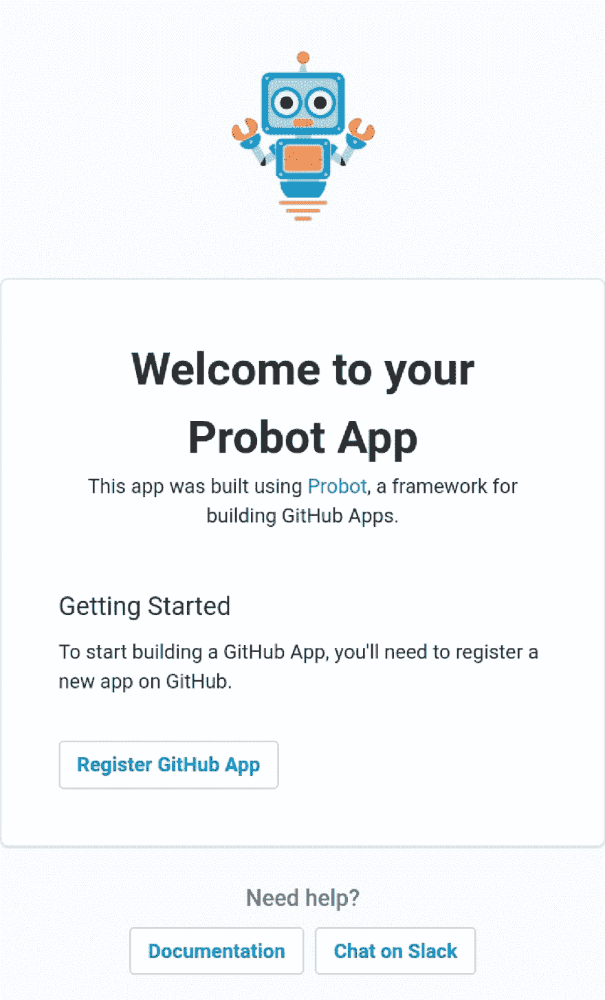

# 使用 Probot 制作您的第一个 GitHub 应用程序

> 原文：<https://dev.to/athulcajay/make-your-first-github-app-with-probot-567d>

### 带 Probot 的 GitHub 应用

有没有在 GitHub 的任何问题或拉请求中看到机器人对公关/问题进行评论或给公关/问题添加标签？如果你有，他们通常被称为 GitHub 应用程序，可以相对容易地制作。

这些应用大部分都是用 JavaScript (Node.js)使用 **Probot** 编写的，这是一个为 GitHub 构建应用的框架。Probot 是用 Typescript 编写的，Typescript 是 JavaScript 的超集。你可以在他们的[网站](https://probot.github.io)上找到更多信息。

* * *

在这里，我们将制作一个**简单的问题，并在 Glitch 上制作和部署请求评论者**机器人。

#### 先决条件

*   GitHub 帐户
*   使用 GitHub 对 Glitch 的描述
*   基本的 JavaScript 知识，如变量、字符串和函数

#### 制作 Glitch 上的应用

Glitch 是一个免费的在线代码编辑平台。它用所有必需的包和东西建立了我们的环境。你所需要做的就是点击这个按钮👇你会得到一个完整的工作环境来进行你的“再混合”。
 [](https://glitch.com/edit/#!/remix/twilight-marquis) 

Probot 所做的是，它抽象了所有 GitHub 应用程序都必须遵循的认证系统——让您专注于编写 API 请求，而不用担心 API 令牌或权限。

Probot 附带了一个在`index.js`中设置问题评论机器人的例子。
我们将把`index.js`编辑成下面的

```
//index.js
 module.exports = app => {
  // Your code here
  app.log('Yay, the app was loaded!')
  app.on('issues.opened', async context =>({
    const issue=context.payload.issue //getting issue details
    const user=issue.login.user //Getting the username
    const message=`Thanks @${user} for opening this issue!:tada:
    You are awesome..`
    const params = context.issue({ message })
    return context.github.issues.createComment(params)
)
  })
} 
```

上面的代码是一个对新问题进行评论的机器人。它也提到了用户。*“机器人”*特征从第 4 行开始，以`app.on`函数开始。传递的第一个参数是机器人要听的动作。这些是 GitHub 的 **webhook** 事件——你可以从 [Webhook 文档](https://developer.github.com/webhooks/)中了解更多。

Probot 使用节点的`async/await` API 返回数据。我们使用了 *`* 字符来包含字符串/注释体，因为我们不需要使用转义字符，并且我们还可以插入[模板文字](https://flaviocopes.com/javascript-template-literals/)。

现在我们需要检查我们的应用程序是否工作，我们可以这样做**点击 Glitch 上的“太阳镜”按钮**，它应该看起来像这样
[](https://res.cloudinary.com/practicaldev/image/fetch/s--N0PVL54---/c_limit%2Cf_auto%2Cfl_progressive%2Cq_auto%2Cw_880/https://raw.githubusercontent.com/Athul-CA/blog/master/content/blog/probot/glitch_show.png)

然后你会看到这样一个页面 [](https://res.cloudinary.com/practicaldev/image/fetch/s--v9brgi9c--/c_limit%2Cf_auto%2Cfl_progressive%2Cq_auto%2Cw_880/https://raw.githubusercontent.com/Athul-CA/blog/master/content/blog/probot/wp.jpg) 
点击**注册 GitHub App** 按钮，提供一个名称并安装在一个存储库中。

> 提示:创建一个新的私有存储库，因为我们会为测试制造很多噪音

现在，如果您检查`.env`文件，您会看到变量值自动填充了必要的数据。Glitch 会自动部署我们的应用程序，我们的应用程序会监听要接收的 webhooks。

> 通过在 GitHub 上的测试报告中制作一个新问题来测试应用程序。

它工作正常吗？

祝贺你🎉🎉你刚刚给自己做了一个 GitHub 应用👌👌

### 送还 Webhook⤴️

我们可以查看由存储库触发的任何事件的所有 webhooks，并可以通过进入您个人资料中的**设置- >开发者设置- > GitHub 应用- >“您的应用名称”- >高级选项卡**来重新交付它们。

### 评论 PRs

我们需要为我们的应用程序添加一个额外的权限来评论 PRs，我们可以通过前往`Settings->Developer Settings-><Your_app_name> -> Permissions and Events -> Pull Requests`提供读写访问来提供。

现在我们需要编辑`index.js`以在最后一个“}”之前添加对拉请求的支持。

``javascript
app.on('pull_request.opened', async context =>{
const pr =context.payload.pull_request
const user = pr.user.login //Collecting Details of the person who created the PR
const msg=context.issue({body:`嘿@${user}👋，感谢公关！！！你太棒了。`})
return context.github.issues.createComment(msg)
})`` 

 ``这里我们通过传递一个名为 *pull_request.opened* 的 webhook 动作来添加一个新的*“机器人”*特征。现在我们的应用程序监听 PR webhook，一旦收到它就向 GitHub 发出`context.issue({body})`。你可以看到我们仍然将主体传递给了 *createComment* 函数。这是因为 PRs 在 GitHub 中被认为是另一种类型的问题。为了测试这是否有效，制作一个新的 PR 并检查机器人是否对此有意见。

* * *

恭喜你做了一个 GitHub app。因为它有故障，我们可以把它安装在任何存储库中，它也可以在任何时候工作。

> 你可以用图片和 gif 自定义评论，但是要记住评论是减价的。您可以随时通过 Glitch 将这些文件导入 GitHub 库。

现在前进，探索并制作一些令人兴奋的 GitHub apps,❤️❤️

### 感谢

*   杰森·埃特科维奇，负责校对这个❤️
*   Musthaq Ahamad ，谢谢你教我如何制作 GitHub 应用程序

原发于我的个人[博客](//blog.athulcyriac.me)。``