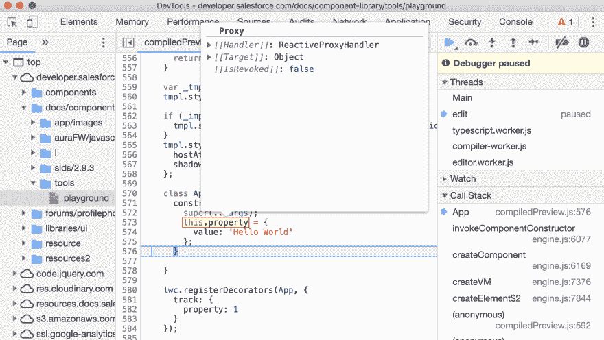
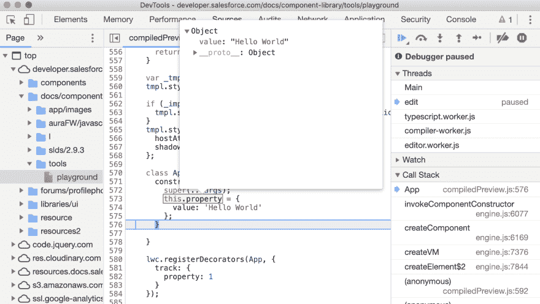
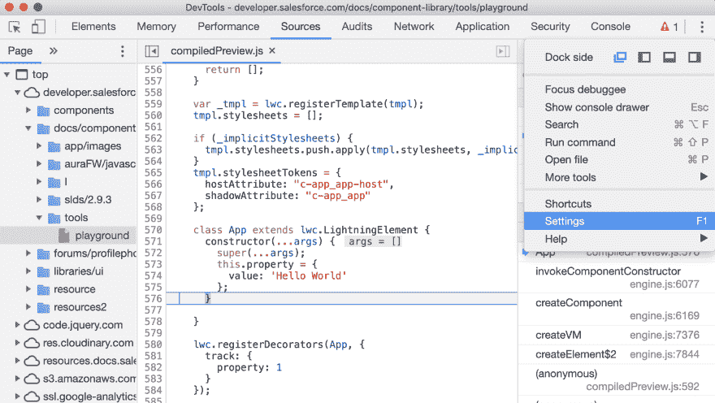
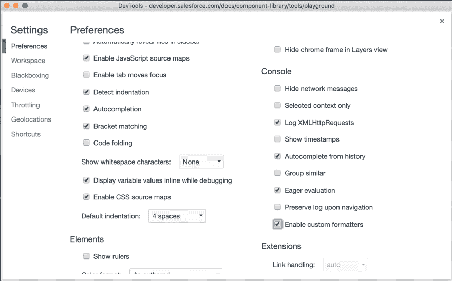

# 使用 Chrome 开发工具格式化程序调试 Lightning Web Components(LWC)中的@track 和@api 属性

> 原文：<https://dev.to/daveturissini/debug-lightning-web-components-lwc-track-and-api-properties-using-chrome-dev-tools-formatter-49c5>

Lightning Web Components (LWC) `@api`和`@track`decorator 让组件渲染变得轻而易举，但是调试起来却很棘手。它们之所以棘手，是因为它们是使用 [ES6 代理](https://developer.mozilla.org/en-US/docs/Web/JavaScript/Reference/Global_Objects/Proxy)实现的。代理允许 LWC 透明地知道你的模板中呈现了什么属性，但是在 Chrome 开发工具中很难检查。调试`@api`和`@track`属性的最佳方法是启用 LWC 自带的[自定义开发格式化程序](https://docs.google.com/document/d/1FTascZXT9cxfetuPRT2eXPQKXui4nWFivUnS_335T3U/preview#!)。

## 在禁用开发格式化程序的情况下检查

例如，[假设我们有一个简单的组件，它包含一个单独的 *@track* 属性](https://developer.salesforce.com/docs/component-library/tools/playground/7HPESVkxh/1/edit) :

```
import { LightningElement, track } from 'lwc';

export default class App extends LightningElement {
    @track property = { value: 'Hello World' }
} 
```

<svg width="20px" height="20px" viewBox="0 0 24 24" class="highlight-action crayons-icon highlight-action--fullscreen-on"><title>Enter fullscreen mode</title></svg> <svg width="20px" height="20px" viewBox="0 0 24 24" class="highlight-action crayons-icon highlight-action--fullscreen-off"><title>Exit fullscreen mode</title></svg>

当我们检查`property`时，Chrome 会包含关于用于实现`@track`的*代理*的各种信息:

[](https://res.cloudinary.com/practicaldev/image/fetch/s--8AuL9E_m--/c_limit%2Cf_auto%2Cfl_progressive%2Cq_auto%2Cw_880/https://thepracticaldev.s3.amazonaws.com/i/ohzywn6j87gqb7d5j3ca.png)

## 启用开发格式化程序进行检查

启用自定义 dev 格式化程序后，我们的调试体验变得更好:

[](https://res.cloudinary.com/practicaldev/image/fetch/s--JqVZR88o--/c_limit%2Cf_auto%2Cfl_progressive%2Cq_auto%2Cw_880/https://thepracticaldev.s3.amazonaws.com/i/ptu6h3f5negjjxjsqyfa.png)

## 启用自定义开发格式化程序

启用自定义开发格式化程序很容易:

| 1)打开网页检查器
2)打开网页检查器设置 |  |
| 3)向下滚动到“控制台”部分，并选中“启用自定义格式化程序” |  |

编码快乐！