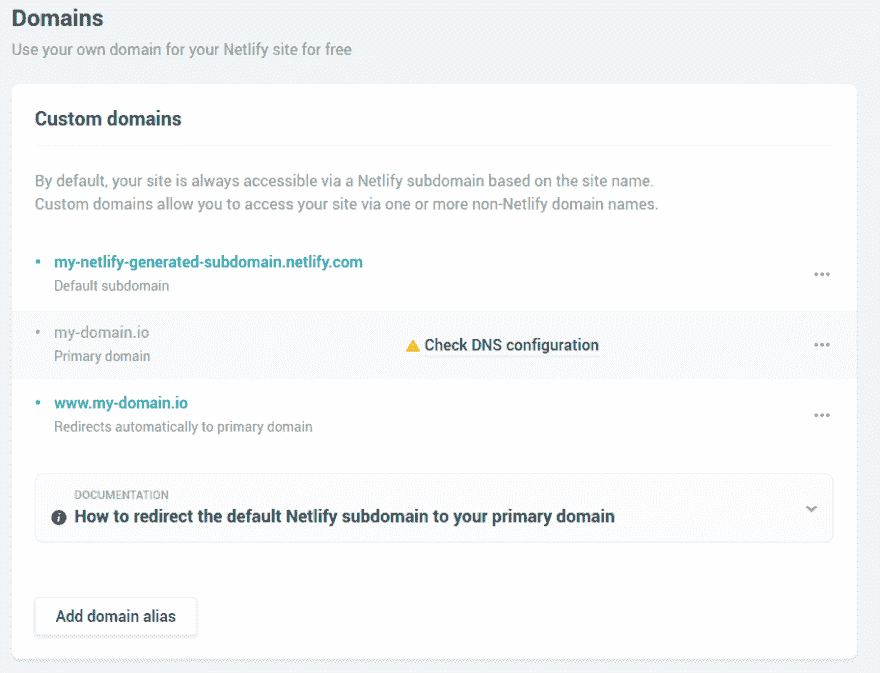
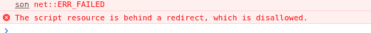
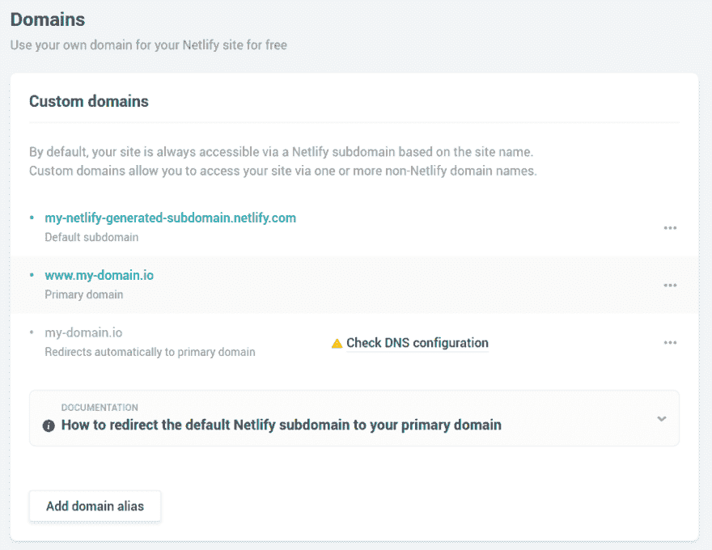

# 混合网络域名和其他子域

> 原文：<https://dev.to/vittoriozamboni/mix-netlify-dns-and-other-subdomains-5f11>

*封面图片:爱尔兰威克洛郡威克洛山脉*

我上一次创建博客是在几年前，WordPress 仍然是最受欢迎的选择，它可以减少工作量，并具有不错的功能。最近，在学习了一些 React 和跟随社区选择之后，我真的很喜欢[盖茨比](https://www.gatsbyjs.org/)。

创建静态博客可以降低架构的复杂性:不再需要数据库，不再需要运行 PHP 的主机，Nginx 的配置更简单。

还有一个好处是可以使用像 [Netlify](https://app.netlify.com) 这样的服务来托管你的博客。要点是:它是免费的，在一个新的提交被推送到你的首选分支后，它会自动构建，并为你管理 DNS。

如果你已经拥有一个域名，并且已经有其他应用程序在不同的子域名上运行，那么最后一部分就有点棘手了。

## 部署到网络

只需几个简单的步骤，就可以将您的存储库直接部署到 Netlify。他们网站上的一篇博文很好地解释了如何做到这一点。
总之，您将:

*   通过点击“从 GIT 新建站点”(并选择 Github、GitLab 或 Bitbucket 中的一个)，从您的 Netlify 仪表板添加您的存储库；
*   授予 Netlify 的应用程序所需的权限；
*   继续使用默认设置并部署。

这将为你生成一个子域，就像`my-netlify-generated-subdomain.netlify.com`:如果你导航到这个 URL，你的博客将会在那里！

## DNS 提供商设置

按照 Netlify 的指南，我将域名(my-domain.io)设置为主域，将 WWW 子域设置为域别名。这对他们两个来说都很完美，但不幸的是，我失去了对不同子域(second-app.my-domain.io)可达的其他应用程序的访问。

然后，我将我的主要配置转移到我的 DNS 提供商内置服务中(我使用[甘地](https://www.gandi.net)作为 DNS 提供商，使用[利诺德](https://www.linode.com)作为虚拟机提供商)。

我想让我的域(没有子域)，`blog`和`www`子域指向 Netlify，但所有其他子域指向我的 Linode 实例(用`1.2.3.4`作为 IP 地址)。

这是结果:

```
@ 10800 IN A 1.2.3.4
@ 10800 IN MX 10 spool.mail.gandi.net.
@ 10800 IN MX 50 fb.mail.gandi.net.
@ 10800 IN TXT "v=spf1 include:_mailcust.gandi.net ?all"
blog 1800 IN CNAME my-domain.io.
second-app 1800 IN CNAME my-domain.io.
www 10800 IN CNAME my-netlify-generated-subdomain.netlify.com. 
```

<svg width="20px" height="20px" viewBox="0 0 24 24" class="highlight-action crayons-icon highlight-action--fullscreen-on"><title>Enter fullscreen mode</title></svg> <svg width="20px" height="20px" viewBox="0 0 24 24" class="highlight-action crayons-icon highlight-action--fullscreen-off"><title>Exit fullscreen mode</title></svg>

*   第一个条目说我的主域必须被路由到我的 Linode 实例(其他以@开头的只是甘地配置的默认示例)。
*   `blog`和`second-app`子域路由到 my-domain . io；
*   `www`子域被路由到我的网络子域。

*注意:您需要在测试前传播 DNS 条目，这可能需要几个小时*

## 配置 Nginx 进行重定向

仅配置的第一行不允许我们将主域指向 Netlify 的实例:我们需要告诉它路由到我们的`www`子域目的地。

这是用于重定向的简单 Nginx 配置:

```
server {
    server_name my-domain.io;
    rewrite ^/(.*)$ http://www.my-domain.io/$1 permanent;
} 
```

<svg width="20px" height="20px" viewBox="0 0 24 24" class="highlight-action crayons-icon highlight-action--fullscreen-on"><title>Enter fullscreen mode</title></svg> <svg width="20px" height="20px" viewBox="0 0 24 24" class="highlight-action crayons-icon highlight-action--fullscreen-off"><title>Exit fullscreen mode</title></svg>

如果你也想让你的`blog`子域指向 Netlify，添加:

```
server {
    server_name blog.my-domain.io;
    return 301 https://www.my-domain.io$request_uri;
} 
```

<svg width="20px" height="20px" viewBox="0 0 24 24" class="highlight-action crayons-icon highlight-action--fullscreen-on"><title>Enter fullscreen mode</title></svg> <svg width="20px" height="20px" viewBox="0 0 24 24" class="highlight-action crayons-icon highlight-action--fullscreen-off"><title>Exit fullscreen mode</title></svg>

附加规则将处理您的`second-app`子域。
标准配置可能是这样的:

```
upstream second-app {
    server 127.0.0.1:8085;  # stram to a different port
}

server {
    server_name second-app.my-domain.io;
    listen 80;
    location / {
        proxy_set_header Host $host;
        proxy_set_header X-Real-IP $remote_addr;
        proxy_set_header X-Forwarded-For $proxy_add_x_forwarded_for;
        proxy_pass http://127.0.0.1:8085;
    }
} 
```

<svg width="20px" height="20px" viewBox="0 0 24 24" class="highlight-action crayons-icon highlight-action--fullscreen-on"><title>Enter fullscreen mode</title></svg> <svg width="20px" height="20px" viewBox="0 0 24 24" class="highlight-action crayons-icon highlight-action--fullscreen-off"><title>Exit fullscreen mode</title></svg>

## 网络域名系统配置

最后一步是在 Netlify 中配置您的域。
默认情况下，guides 告诉你将主域设置为主域(显然！).

这样做时，还会添加一个`www`子域配置:

[](https://res.cloudinary.com/practicaldev/image/fetch/s--lXvWQAsu--/c_limit%2Cf_auto%2Cfl_progressive%2Cq_auto%2Cw_880/https://thepracticaldev.s3.amazonaws.com/i/o50qmvlq6kgjkrfpaiio.png)

但是，通过这种方式，由于我们的配置，您会在控制台中看到一些错误，如下所示:

[](https://res.cloudinary.com/practicaldev/image/fetch/s--exZISWpn--/c_limit%2Cf_auto%2Cfl_progressive%2Cq_auto%2Cw_880/https://thepracticaldev.s3.amazonaws.com/i/6n6ihok5t20m5iippyul.png)

为了避免这种情况，我们需要交换 Netlify 中的配置，将我们的`www`域设置为主域:

[](https://res.cloudinary.com/practicaldev/image/fetch/s--iHUEQebY--/c_limit%2Cf_auto%2Cfl_progressive%2Cq_auto%2Cw_880/https://thepracticaldev.s3.amazonaws.com/i/lu5hqc8kdr1ynobwphpn.png)

瞧啊！通过混合我们的主机和网络，我们所有的 DNS 都可以正常工作。