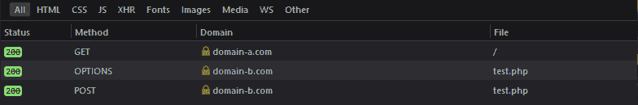
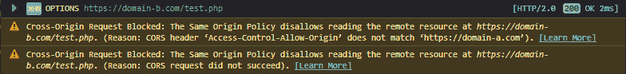

# 关于 CORS 你应该知道什么

> 原文：<https://dev.to/nicolus/what-you-should-know-about-cors-48d6>

如果您和我一样，第一次遇到 CORS(或跨源资源共享)时，您所希望的只是服务器接受那些该死的 ajax 请求并完成它。所以你去栈溢出，复制粘贴一段代码来设置一些头，它的工作。

不过，有几件事你可能想知道。

# CORS 是什么，又不是什么

这对新来的人来说常常是一个困惑的来源，因为 CORS 应该达到什么目标并不明显。首先，CORS 本身不是一种安全措施，它实际上是相反的:CORS 是一种绕过“同源策略”的方式，同源策略是一种防止你向不同域发出 ajax 请求的安全措施。

同源策略规定一个域上的网站不能向另一个域发出 xhr 请求。这可以防止恶意网站向已知网站(比如脸书或谷歌)发出请求，希望用户已经登录，这样就可以冒充他们。这个策略是由浏览器实现的(它们都实现 SOP，尽管有细微的差别)，这意味着它不适用于来自服务器或任何其他 HTTP 客户端(如 cURL 或 POSTman)的请求。此外，服务器对此完全没有控制:它将处理每个请求，就好像它来自一个受信任的域，阻止请求完全取决于浏览器。

SOP 绝不意味着阻止攻击者向您的服务器发出请求(因为攻击者显然不会使用浏览器)。这只是为了防止合法用户使用有信誉的浏览器在不知不觉中向您的网站发出请求。

现在，CORS 是一种绕过 SOP 的方法，在某些情况下，您希望允许一个特定的网站向您的服务器发出请求，即使它通常会被阻止。(通常，允许您的前端应用程序向您的 API 发出请求)。

# CORS 是如何工作的。

像 HTTP 的其他部分一样，CORS 基本上是浏览器和服务器之间的对话。假设你的前端在 domain-a.com，你的 API 在 Domain-b.com，它会是这样的:

- **浏览器:**“嘿 Domain-B，Domain-A.com 上的这个脚本让我对你做一个 ajax 查询，但是我应该阻止它，除非你告诉我可以。”
- **服务器:**“我不知道，但我可以告诉你，只有`https://domain-a.com`被允许发出 GET、POST、OPTIONS 和 DELETE 请求，而且这个需要每 10 分钟验证一次。
*浏览器心想“是啊，没错域名，我马上发送请求！"*
- **浏览器:**"嗨 domain-b，我想在这个端点上发帖。
- **服务器:**没问题，这里有 200

或者，如果用户在不同的域上，则对话会更短，如下所示:

- **浏览器:**“嘿，domain-b.com，malicious-domain.com 上的这个脚本让我对你做一个 ajax 查询，但是我应该阻止它，除非你告诉我可以。”
- **服务器:**“我不知道，但我可以告诉你，只有`https://domain-a.com`被允许发出 GET、POST、OPTIONS 和 DELETE 请求，而且这个需要每 10 分钟验证一次。
*浏览器心想“哦，这不是正确的域，我们最好不要发出请求”并继续在控制台中发送错误。*

# 它在浏览器中的样子

在我上面的小场景中，浏览器发出的第一个问题叫做**预检请求**，对应的 HTTP 动词是`OPTIONS`。服务器应该总是用 200 响应来回答预检请求，这个响应没有正文，但是包含了`Access-Control-Allow-Origin`和一些其他的头。在我们的例子中，标题是:

```
HTTP/1.1 200 OK
Access-Control-Allow-Origin: https://domain-a.com
Access-Control-Allow-Methods: GET, POST, OPTIONS, DELETE
Access-Control-Max-Age: 3600 
```

Enter fullscreen mode Exit fullscreen mode

它告诉浏览器，它只能执行来自 domain-A.com 的请求，它只能发出`GET`、`POST`、`OPTIONS`或`DELETE`请求(例如，一个`PUT`请求将被阻止)，它可以缓存这个信息 3600 秒，这样它就不需要每次都发出一个新的`OPTIONS`请求。

[](https://res.cloudinary.com/practicaldev/image/fetch/s--w80pS3wX--/c_limit%2Cf_auto%2Cfl_progressive%2Cq_auto%2Cw_880/https://thepracticaldev.s3.amazonaws.com/i/ssdeztu45pcqvrzntgmw.png)

当然，如果我们在不同的领域，那就不行了。浏览器将发送一个`OPTIONS`请求，在控制台中抛出一个错误，并且从不发送`POST`请求:

[](https://res.cloudinary.com/practicaldev/image/fetch/s--vs0Ltg9Q--/c_limit%2Cf_auto%2Cfl_progressive%2Cq_auto%2Cw_880/https://thepracticaldev.s3.amazonaws.com/i/q7vqfhefuzqh9jcz28yx.png)

很直接，对吧？

是的，除了有一些问题...

# 关于 CORS 的棘手事情

### 所有响应都应包含 CORS 报头

您可能会认为，如果您的服务器用 200 和正确的头来响应选项请求，您就安全了，您将看到浏览器发送选项请求，然后发送您的实际请求，然后悲惨地失败...这是因为每个请求(GET、POST 或其他)应该*也*包含相同的“访问控制允许头”。

### 并非所有请求都会触发预检请求

有一些请求不会触发预检请求，例如 GET 请求，或 POST 请求，其标题`Content-Type`设置为`application/x-www-form-urlencoded`。这些都是浏览器一直允许的“简单请求”(你总是可以制作一个链接或发布一个表格到不同的网站，甚至在 CORS 存在之前)，你可以在这里找到完整的列表。
在 POST 请求的情况下，结果有点反直觉:浏览器**将**发出 POST 请求(因此您的服务器可能会保存一些数据)，然后忽略响应！

在传统的 web 应用程序中，你会使用`application/json`作为内容类型，所以会有一个预检请求，但请记住，你的服务器可能仍然会收到来自其他域的 POST 请求，所以不要盲目接受它们。

### 允许的域必须包含协议

不能只把`mydomain.com`作为一个域，它需要包含协议(如`https://mydomain.com`)。有趣的是，你不能同时接受 http 和 https，因为...

### 你只能允许一个域

您可以允许每个带有`Access-Control-Allow-Origin: *`的域，也可以只允许一个域。这意味着如果您需要几个域来访问您的 api，您将需要自己处理它。

处理这个问题最简单的方法是在服务器上维护一个允许域的列表，如果该域在列表中，就动态地更改头的内容。下面是它在普通 PHP 中的样子:

```
$allowedDomains = [
    "http://www.mydomain.com",
    "https://www.mydomain.com",
    "http://www.myotherdomain.com",
    "http://www.myotherdomain.com",
];

$originDomain = $_SERVER['HTTP_ORIGIN'];

if (in_array($originDomain, $allowedDomains)) {
    header("Access-Control-Allow-Origin: $originDomain");
}; 
```

Enter fullscreen mode Exit fullscreen mode

或者在 Node.js(改编自 [this SO anwser](https://stackoverflow.com/a/32481816/1578702) )

```
app.use(function(req, res, next) {
  const allowedOrigins = [
    "http://www.mydomain.com",
    "https://www.mydomain.com",
    "http://www.myotherdomain.com",
    "http://www.myotherdomain.com",
  ];
  const origin = req.headers.origin;
  if(allowedOrigins.indexOf(origin) > -1){
    res.setHeader('Access-Control-Allow-Origin', origin);
  }
  return next();
}); 
```

Enter fullscreen mode Exit fullscreen mode

### 同源策略适用于 Chrome 和 Safari 上的文件系统，不适用于 Firefox。

如果你向一个本地文件发出请求，Firefox 会认为它总是在同一个域中，并允许这个请求。Chrome 或 Safari 等基于 Webkit 的浏览器会认为这是一个安全风险，并阻止对本地文件的 ajax 查询。解决这个问题的唯一方法是使用 Firefox，或者安装一个 web 服务器来发送一个`Access-Control-Allow-Origin: *`头。
正如 [@brianjenkins94](https://dev.to/brianjenkins94) 在评论中指出的，你也可以用`--disable-web-security`标志启动 Chrome。

### iOS wk webview 需要 CORS

如果你正在开发一个使用 webview 的移动应用程序(使用 Cordova 或 Ionic)，Android 不会给你带来任何麻烦，但 iOS 上的新 WKWebview 将需要 CORS。这意味着你必须总是将`Access-Control-Allow-Origin`头设置为`*`，这并不理想。
另一个选择是不要在你的应用程序中使用 ajax 请求，而是使用 cordova 插件来进行本地 http 请求，这将很乐意忽略同源策略。

感谢阅读！如果你想更深入地了解 CORS，请前往 MDN:[https://developer.mozilla.org/docs/Web/HTTP/CORS](https://developer.mozilla.org/docs/Web/HTTP/CORS)。