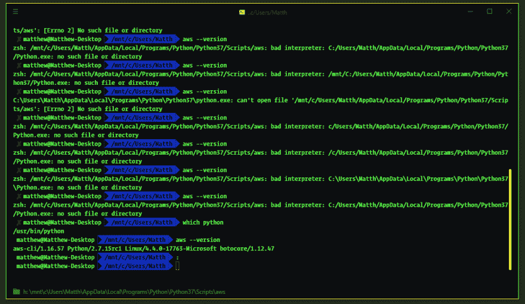
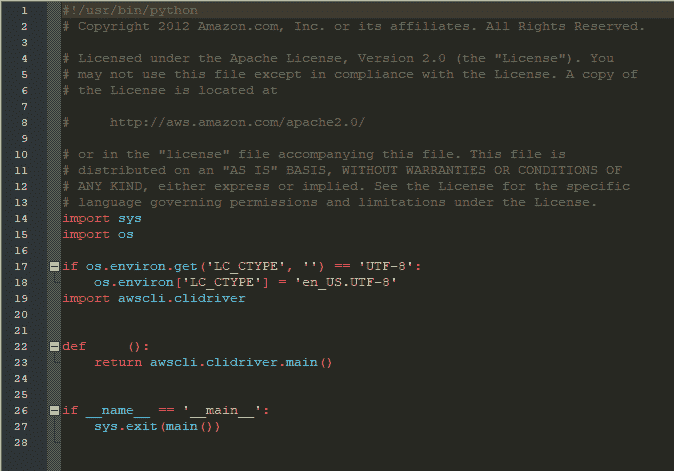

# Windows 子系统 Linux 上的 AWS-CLI

> 原文：<https://dev.to/ciphercoder/aws-cli-on-windows-subsystem-linux-29pl>

# 给 Windows 子系统 Linux 添加 awscli

首先，我用的是 Windows 10 操作系统，它已经更新到了最新版本，我还安装了 Windows 子系统 Linux(WSL)。在 WSL 上，我使用的是 Ubuntu 版本 18.04，尽管这对我们将要做的事情不会有任何影响。我挣扎了一会儿，试图找到正确的答案，为什么我在 WSL 上安装了 [Amazon Web Services 命令行接口](https://aws.amazon.com/cli/)或 awscli 后，总是出错。我不断得到的错误是:

 
*错误消息进展*

当我第一次使用这台机器作为我的主要开发机器时，我来自 Linux，它默认安装了许多 Windows 没有的工具。例如，Python 已经安装好了，可以在 Linux 上使用。我使用 Python 做各种事情，也使用 Python 包安装程序 pip，所以当我开始使用这台计算机时，我马上安装了它们。不知道这是否有所不同，但我至少希望能够复制我的环境，以防其他人在这方面遇到困难。安装 python 后，两个版本，2。X.X 和 3。X.X 和 pip，因为它们是两个不同的程序，所以我确保做得正确，并把它添加到我的“path”或 Windows 环境变量中，这样就可以找到它。之后，我安装了 NPM 和各种其他工具，包括 awscli、WSL、GIT 和其他一些工具。在通过 PowerShell 安装了所有这些之后，我发现我可以拥有一个名为 Windows 子系统 Linux 的 Linux“环境”。因为 Linux 是我所习惯和感觉最舒服的，所以我开始安装 WSL。我想将 WSL 用于我刚刚通过 PowerShell 加载到我的机器上的所有东西，所以我必须重复很多工作。我确保 python 2。X.X 和 3。X.X 安装在 WSL 上。因为 WSL 类似于一个虚拟机或者一个发行版——或者一个“子系统”——我不确定我是否能在两个环境之间共享这些工具。我以前安装过双引导机器和虚拟机，我读到的解释让我觉得它更喜欢这种环境。我在 WSL 上安装了 pip、Node、NPM、GIT 和我当时使用的所有其他东西。我使用的程序之一是 awscli。这允许您与 AWS 或 Amazon Web 服务进行交互。我使用他们的 [S3 存储](https://aws.amazon.com/s3/)以及 [CloudFront](https://aws.amazon.com/cloudfront/) 和 [Route 53](https://aws.amazon.com/route53/) 以及其他一些服务。能够通过 CLI 与这些服务交互对我来说是必不可少的。

在将 awscli 安装到 Ubuntu WSL 之后，我继续得到与上面截图所示相同的错误。无论我做什么，我似乎继续得到这个错误。错误最后说的是:`no such file or directory`，所以这里是我开始的地方。我追踪了文件的位置，确认确实有这样一个文件。现在我查看了错误消息的`bad interpreter:`部分。我的第一个想法是这到底意味着什么！错误的解释器-没有这样的文件-什么？文件在那里。我能看见它在那里。那是我登陆谷歌的时候。我得到了很多与 Mac 相关的结果，还有一些是关于 Windows 的。试图破译这些结果是困难的，因为似乎有这么多不同的“解决方案”取决于所有不同的环境设置。正如你从截图中看到的，我选择 ZSH 作为我的 shell，而不是 Bash，所以这也让我有些困惑。

我能够识别出所有“解决方案”共有的一些模式，并开始尝试不同的东西。Windows 文件系统显示文件路径的方式与 Linux 不同。在 Windows 上，路径是这样表示的:`C:\Users\Matth\AppData\Local`而在 Linux 上，路径是用`/usr/bin/python`表示的。这是扔掉的东西，它找不到文件。正如你从截图中看到的，我尝试了几乎所有不同的组合来找到文件。最后，我意识到我已经在 Windows 和 WSL 上安装了 python。一旦我通过发出`which python`命令发现它试图使用哪个 python 实例，它就返回`/usr/bin/python`。这告诉我它使用的是安装了 WSL 的 python 版本。

此时，我能够追踪到实际 awscli 文件所在的路径`C:\Users\Matth\AppData\Local\Programs\Python\Python37\Scripts\aws`。文件的第一行(见下面的截图)以`#!/mnt/c/Users/Matth/AppData/Local/Programs/Python/Python37/Scripts/aws`开始。光看这条路，我就知道这就是问题所在。我使用 Hyper 作为终端，在这个终端中，我将它设置为默认安装在 WSL 上的 zsh shell。这就是为什么在路径中有第一个“/mnt ”,其余的是不言自明的。一旦在文件中，我只是不停地改变网址，直到我可以让它正常工作。在我发现它试图使用来自 WSL `/usr/bin/python`的 python 安装后，我只是在 awscli 文件的第 1 行使用了这个 URL，然后它立即工作了。

 
*AWS 配置文件*

这是一个非常复杂的工作方式。我相信还有其他方法可以做到这一点。事实上，可能有更“经济”的方法来做到这一点。你也许可以从主机操作系统使用 python 安装，因为是 Windows，但这似乎是最简单的方法来完成这个，这样我就可以继续工作了。