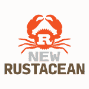

# 将 Rocket 添加到我的 Rust Web 应用程序

> 原文：<https://dev.to/jculverhouse/my-next-step-in-rust-web-application-dev-2dgl>

<figure>[](https://res.cloudinary.com/practicaldev/image/fetch/s--EjWqf6gV--/c_limit%2Cf_auto%2Cfl_progressive%2Cq_auto%2Cw_880/https://i1.wp.com/rust.graystorm.com/wp-content/uploads/2019/07/bridge_day_2017.jpg%3Ffit%3D840%252C555%26ssl%3D1) 

<figcaption>[桥日](https://officialbridgeday.com/) 2017，新河峡，WV——一个框架重要！</figcaption>

</figure>

我的[上一篇关于开发 Rust web 应用程序外壳的文章](https://rust.graystorm.com/2019/07/13/piecing-together-a-rust-web-application/)涵盖了全局、静态应用程序设置和日志记录。可能仍然会有一个变化来允许结构化日志记录。然而，这次让我们从我使用的实际框架开始。首先我下载了[铁](https://crates.io/crates/iron)，但是感觉不太对，我注意到它已经两年没有被开发了。这是一个可以继续寻找的直接线索，所以我继续寻找另一个我听过的线索:[火箭](https://crates.io/crates/rocket)。

<figure>[](https://res.cloudinary.com/practicaldev/image/fetch/s--70kDS_UY--/c_limit%2Cf_auto%2Cfl_progressive%2Cq_auto%2Cw_880/https://i0.wp.com/rust.graystorm.com/wp-content/uploads/2019/07/new_rustacean.png%3Fresize%3D150%252C150%26ssl%3D1) 

<figcaption>查看[播客档案](https://newrustacean.com/show_notes/)！</figcaption>

</figure>

我一直在听几乎已经停播的播客[新 Rustacean](https://newrustacean.com/) 的档案，作者是[克里斯·克里乔](https://v4.chriskrycho.com/)，尽管它们现在已经有几年的历史了(考虑到生锈的速度，这已经很老了)，我仍然知道生锈是从哪里开始的，以及它已经发展了多远。我刚刚听了两集——2016 年《T4》关于 Diesel 的一集和 2017 年关于 Rocket 的一集——甚至对我正在开发的这个 web 应用程序示例有所帮助。令人印象深刻的是，这两个板条箱在几年后继续得到更新和支持。我将在下一篇文章中讨论 Diesel，但现在让我们看看 Rocket，以及一些用于模板、静态 web 服务、web 安全和交互式通信的附加组件。

## 火箭——铁锈框架

在克里乔的[“你应该知道的板条箱”第三集](https://newrustacean.com/show_notes/cysk/rocket/)中，火箭板条箱得到了他的高度赞扬，看来维护者们继续使用给他留下深刻印象的东西。Rocket 有一个[神奇的网站](https://rocket.rs/)和[文档指南](https://rocket.rs/v0.4/guide/)，让它变得轻而易举。内置的[路由](https://rocket.rs/v0.4/guide/overview/#routing)处理让我想起了 perl Catalyst(它能有多大的不同？).这感觉很熟悉。下面是我在 web 应用程序中快速入门的实现(在早期被简化了)。上次谈到的全局静态配置 I [在这里继续有帮助:](https://rust.graystorm.com/2019/07/13/piecing-together-a-rust-web-application/) 

```
pub fn start_webservice() {
    // start rocket webservice
    let bind_address = &CONFIG.webservice.bind_address;
    let bind_port = &CONFIG.webservice.bind_port;
    let version = include_str!("version.txt");

    rocket::ignite()
        .attach(Template::fairing())
        .attach(SpaceHelmet::default())
        .mount("/", routes![routes::index])
        .mount("/img", StaticFiles::from("src/view/static/img")}
        .mount("/css", StaticFiles::from("src/view/static/css"))
        .mount("/js", StaticFiles::from("src/view/static/js")) 
        .launch();

    warn!( "Listening on {}:{} as version {}",
        bind_address, bind_port, version );
} 
```

在我看来，与 Rocket 同样重要的是 rocket_contrib 机箱所增加的功能。在我上面的代码中，你可以看到在函数链中引用了其中的一些。到目前为止，我已经拉进了[车把 _ 模板](https://api.rocket.rs/v0.4/rocket_contrib/templates/index.html)、[发球](https://api.rocket.rs/v0.4/rocket_contrib/serve/index.html)、[头盔](https://api.rocket.rs/v0.4/rocket_contrib/helmet/index.html)和 [JSON](https://api.rocket.rs/v0.4/rocket_contrib/json/index.html) 功能。

## rocket _ contrib::handlebars _ templates

我非常熟悉用于 Perl 的 [Template::Toolkit](http://www.template-toolkit.org/) ，但是我刚刚开始使用[手柄](https://handlebarsjs.com/)。此外，还有另一个名为 [tera 模板的 rocket_contrib::templates 选项。](https://docs.rs/tera/1.0.0-beta.12/tera/)我多半是随便挑了两个中的一个。我还没有到为这个示例应用程序使用 HTML 模板的地步，所以这个选择将来可能会改变。谁知道呢——也许我们还需要一个模板::工具包插件选项！？

## rocket_contrib::发球

由于 Rocket 内置了 webserver 功能(我不确定我是否喜欢这样——我认为我可以用 [Nginx](https://www.nginx.com/) 或[一些其他的](https://httpd.apache.org/)服务作为 web 应用程序的前端，所以我需要研究一下)，我还需要它来服务本地的静态文件(比如 CSS、Javascript 和图像)。Rocket_contrib::serve 为我处理这项工作，只需要在 Rocket 链中进行一些挂载调用(见上文)。再说一次，我刚刚开始设置，但这似乎是让我开始的良好的第一步。

## 火箭 _ 贡献::头盔

当然，安全性需要扩展到编码语言之外，而 [rocket_contrib::helmet](https://api.rocket.rs/v0.4/rocket_contrib/helmet/index.html) 让您从几个 HTTP 问题开始。网络是一个绝对疯狂的地方——读了迈克尔·扎莱夫斯基的[纠结的网络](https://amzn.to/2lawY4W),我更加敏锐地意识到网络服务器、网络浏览器和我们最终使用的网络语言的错综复杂和充满争议的历史，我很惊讶事情竟然能够成功！如果头盔能阻挡哪怕一两类危险，它就会消失。

## [T1】rocket _ contrib::JSON](#rocketcontribjson)

JSON 可以方便地让客户端浏览器(使用 Javascript)通过 AJAX 调用与服务器来回通信。我包含了 [rocket_contrib::json](https://api.rocket.rs/v0.4/rocket_contrib/json/index.html) 就是为了应对这种可能性。也许有一个更土气的设备，或者也许这仍然只是“一种方法”。到那一步我会了解更多。

好了，接下来，我们来谈谈最重要的 ORM 部分。到目前为止，Diesel 给我留下了深刻的印象，尤其是它的指南和文档…但是我们将在下一篇文章中讨论这个问题。

帖子[我在 Rust Web 应用开发中的下一步](https://rust.graystorm.com/2019/07/14/my-next-step-in-rust-web-application-dev/)首先出现在[学习 Rust](https://rust.graystorm.com) 上。