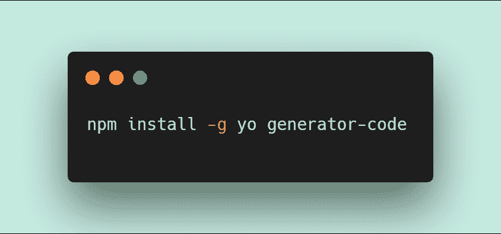
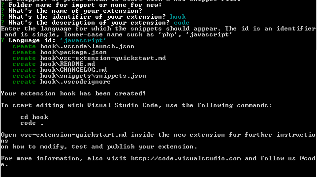
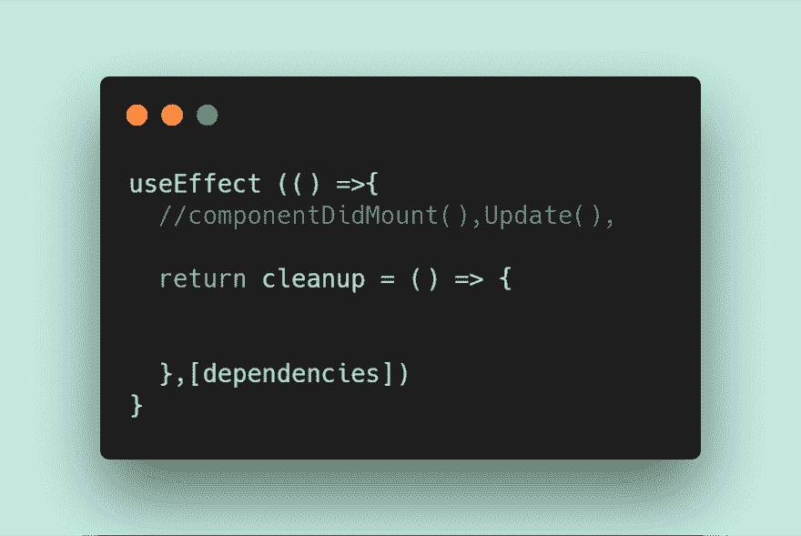
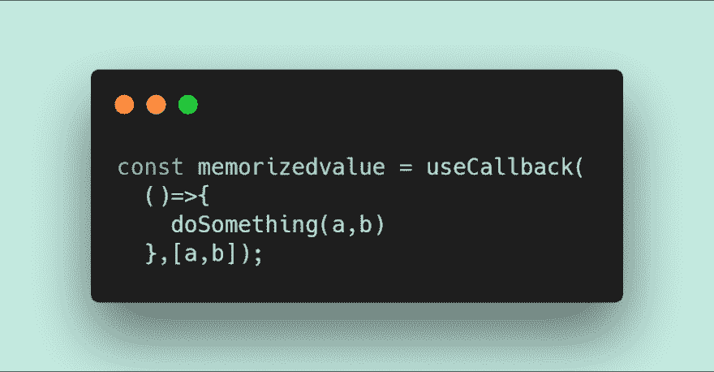
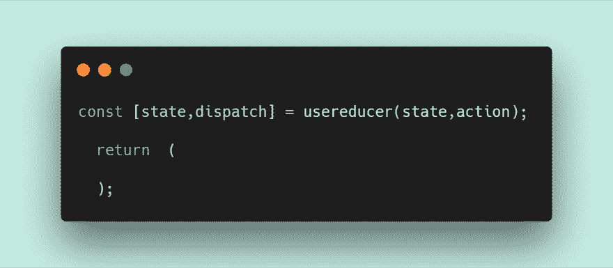

# 我如何为 React 创建我的第一个 Vs 代码片段？？和 boom React 挂钩片段。

> 原文：<https://dev.to/yashwanthambati/how-i-created-my-first-vs-code-snippet-for-react-and-boom-react-hooks-snippet-461c>

每个人对自己的代码编辑器都有特殊的，也许是特别的喜好。react 有成百上千的代码片段，理由很充分:提高生产率以获得更快的代码。当你想重复编写代码时，代码片断在代码编辑器中扮演了一个方便的角色，它会使事情变得更糟。

这是我想成为 vscode 发布者的事情之一，所以我为 react hooks 创建了一个扩展，这对 react devs 来说很方便，并且受到了 vscode 中的 Live server 扩展的启发。

# #开火吧

在您做任何事情之前，您将安装 vsce(Visual Studio Code Extensions 的缩写),并使自己成为发布者。所有这样做的说明都在这里。我知道这看起来很多，但它需要 5-10 分钟，然后你就再也不用为你创建的任何扩展做同样的事情了。

现在你已经明白了，下面是你开始工作需要的步骤。

首先，您需要运行:

这使得生成器在您的机器上全局可用(意味着您现在可以在任何目录中创建代码片段)。然后，您可以执行此命令来启动您的代码片段:

您将会看到如下屏幕提示:

当选择此项时，它会询问这是一个新的代码片段还是我们想要从一个现有的代码片段导入。我们想创造一个新的。

接下来，你必须回答其他几个问题，包括:

*   分机叫什么名字？
*   标识符是什么？(我只是跟着名字走，那大概就是典型。)
*   描述是什么？(我只是在开始的时候放了一些愚蠢的东西。不用担心，以后可以在你的 package.json 中更新这个。)
*   出版商叫什么名字？(参见前面的说明。)
*   语言 id:“JavaScript”(你喜欢的偏好)

它将为您设置一个代码片段，开始在 **snippets.json** 文件上创建您自己的代码片段。完整的独家新闻和[所有的细节都在这里](https://code.visualstudio.com/api/get-started/your-first-extension)。

# #研究

研究代码片段？大概吧！但我真的很好奇:什么对大多数人最有效，同时又是我喜欢的东西？所以我认为 react hooks 已经成为一种趋势，所以我尝试了一下。

# 特性

支持的挂钩:`useState`、`useEffect`、`useContext`、`useCallback`、`useMemo`、`useRef`、`useReducer`。

### 1 导入使用状态

键入`imrus`以“导入 React，{ useState }”

### 2 进口用途效果

键入`imrue`以“导入 React，{ use effect }”

### 3 导入使用上下文

键入`imruc`以“导入 React，{ use context }”

### 4 使用状态

键入`ust`以使用状态

### 5 使用效果

键入`uef`以使用效果

### 6 使用上下文

键入`uct`以使用上下文

### 7 使用回调

键入`ucb`以使用回调

### 8 用途备忘录

键入`umo`以使用备忘录

### 9 useReducer

输入`urd`到用户减少
到[到到](https://res.cloudinary.com/practicaldev/image/fetch/s--fAei9-0S--/c_limit%2Cf_auto%2Cfl_progressive%2Cq_auto%2Cw_880/https://thepracticaldev.s3.amazonaws.com/i/ji7wgysy9nqtmber53mx.png)

### 10 useRef

键入`urf`到 useRef

# #结论

*   如果你想下载这个扩展[，这里有链接](https://marketplace.visualstudio.com/items?itemName=AYashwanth.react-hooks)和我的 github repo [链接](https://github.com/yashwanthambati/react-hook-snippet)。
*   几天之内你就变成了一个 vscode 发布者，这不是很疯狂吗？
*   如果你对 Vs 代码市场上的代码和发布有任何疑问，这里有[链接](https://code.visualstudio.com/api/working-with-extensions/publishing-extension)。如果你被困在任何地方，如果自由讨论，否则 ping 我。
*   丹·阿布拉莫夫是 react hooks 的创造者，他进一步检查了 react hooks 的链接，并在开发社区上发布了 React hooks(T2)的帖子(T3)。

感谢您的阅读

**爱爱**