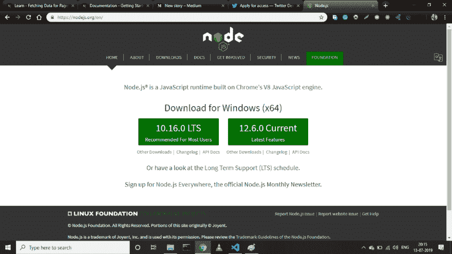
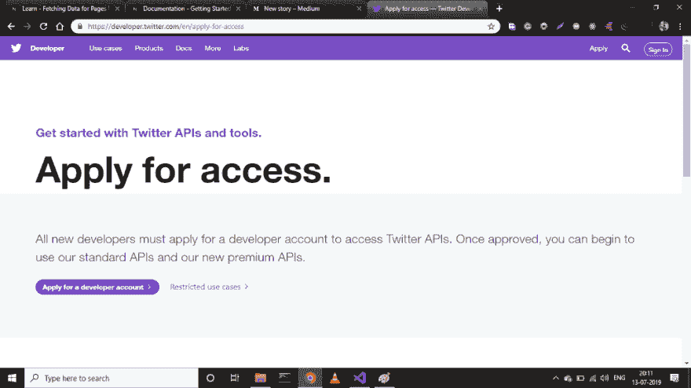
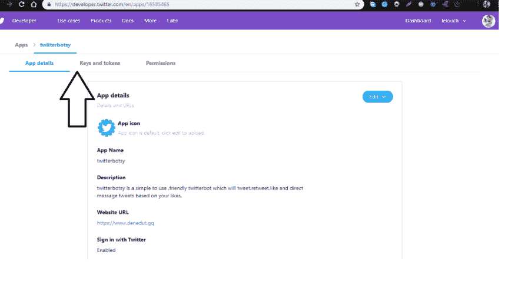
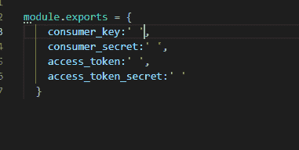
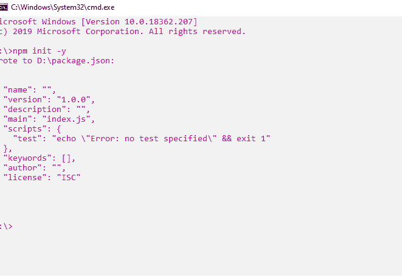
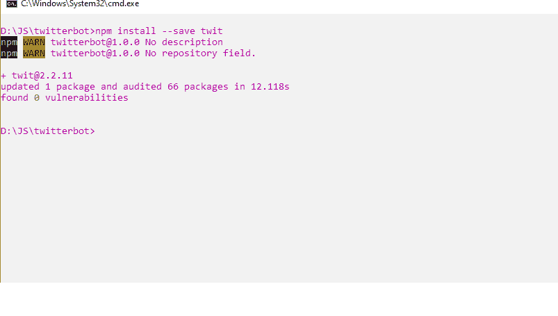
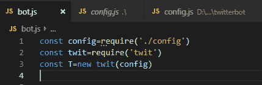
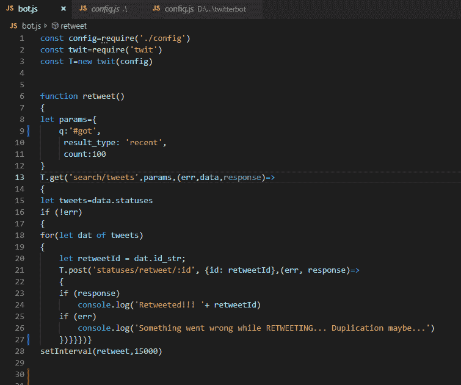
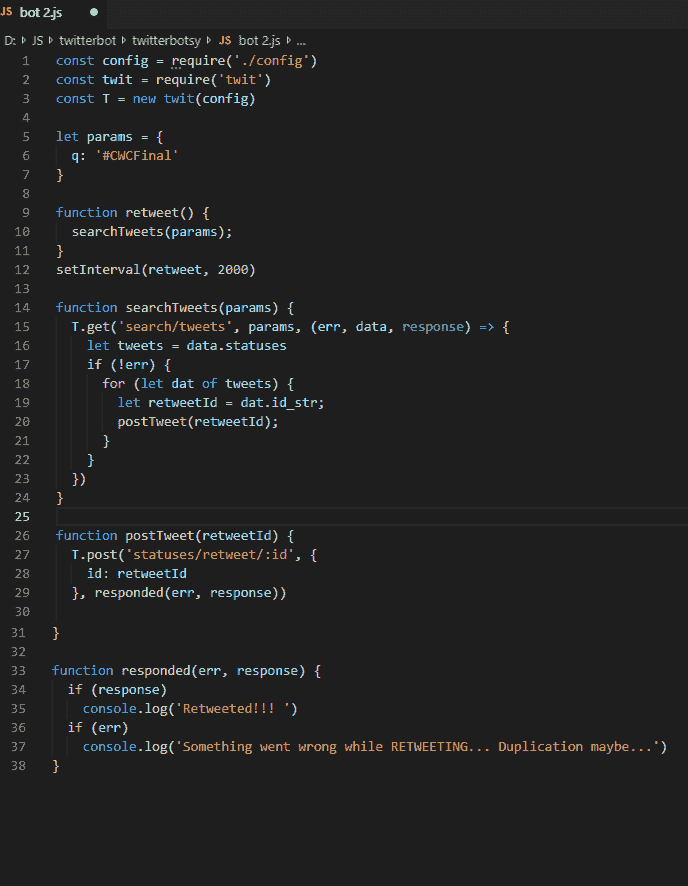

# 用 nOdejs (javascript)创建一个简单而有效的 Twitter BOt

> 原文：<https://dev.to/lelouchb/create-a-simple-yet-effective-twitter-bot-in-nodejs-javascript-71m>

用 nOdejs (javascript)创建一个简单而有效的 Twitter BOt

让我们开始制作我们的第一个 twitter 机器人，它可以转发、收藏、发布、关注、取消关注人们。在这篇文章中，我只关注设置你的账户和转发功能，其他功能将在我的下一篇文章中介绍。谢谢享用

要开始，您需要这个开发环境:

1.  **Nodejs (npm)** 下载点击这里【https://nodejs.org/en/ T2】安装

1.  您选择的任何代码编辑器(我更喜欢 VScode bcoz，它有许多很棒的扩展，可以帮助新开发人员

**3。Twitter 开发者账户—**

如果你还没有一个..不要担心，这很容易创建。首先，你应该有一个可用的 twitter 帐户，或者你可以为本教程的目的创建一个新帐户。现在去[https://developer.twitter.com/en/apply-for-access](https://developer.twitter.com/en/apply-for-access)

申请一个新帐户，现在我知道这个过程有点无聊和耗时，但只要忍受并完成它。

一旦你设置好了，就去[https://developer.twitter.com/en/apps](https://developer.twitter.com/en/apps)创建一个新的应用程序，现在应用程序的名字可以是任何东西，只要完成步骤，它会要求一个网址，你也可以给任何网址，如你的脸书或 Gmail，没关系。

<figure> 

<figcaption>应该是这样的</figcaption>

</figure>

一旦创建了您的应用程序，现在您就拥有了访问令牌，这些令牌将用于在代码中验证您的帐户。转到密钥和令牌，生成访问令牌和访问令牌密码，这四个字母数字字符串是我们经历这么多麻烦来创建开发者帐户和应用程序的原因。

现在创建一个名为 **config.js** 的新文件，并在其中粘贴这些令牌和密钥，如下所示

**module.exports = {**

**消费者密钥:' '，**

**消费者 _ 秘密:' '，**

**访问令牌:' '，**

**访问令牌密码:' '**

**}**

<figure> 

<figcaption>它应该是这个样子，但是要用你的钥匙和令牌。</figcaption>

</figure>

现在，我经常犯的一个错误是，当我复制和粘贴密钥和令牌时，我在引号之间留了一个空格，以**记住任何结尾都不要有空格**，这将在认证过程中出错。

现在我们有了一个名为 config.js 的文件，我们只需要一个 bot.js(我们将在这里编写代码)和一个 package.json。打开这个文件所在的文件夹，生成 bot.js 文件。

那么我们还在等什么呢

转到您的终端或命令行，打开存储这个 config.js 文件的文件夹，并写入

**NPM init-*y*T3】**

*确保你的主文件是 bot.js*

这将在该文件夹中创建一个 package.json 文件。现在让我们在命令行中安装 twit，我们将在编码中使用这个包

npm 安装--保存 twit

现在如果你检查你的 package.json 文件，它应该有 twit 依赖项。

现在我们终于可以开始真正的编码了，这是你们期待已久的时刻。打开 bot.js

首先，我们需要如下所示的配置文件和 twit 模块

我们已经导入了 twit 模块，在下一行中，我们正在创建这个 twit 模块的一个实例。

现在下一步是使用 get 和 post 方法，这是 twit 模块中最基本也是最重要的方法，还有 stream 方法，但是我们将只限于 get 和 post，至少在本文中是这样。

所以我想转发包含特定参数的推文，比如应该是#ironman 或#marvel 或@edsheeran 等。因此，首先我们将创建一个函数 retweet，在该函数中，我们将使用 get 方法根据参数搜索 tweet，最后使用 post 方法转发这些帖子。

这是我们将做的所有魔术的功能

首先，params 对象指定了我们搜索的所有参数，这里 **q** 是必需的，其他的是可选的，您可以在 Twitter API 文档中找到所有的参数(下面的链接)

然后我们将使用

T.get('搜索/推文'，参数，回叫功能)

search/tweets，使用参数搜索 tweets，并启动回调函数，这样我们就可以看到是否得到了错误、响应或数据。数据是我们想要的东西，因为它包含所有不同类型的数据，所以我将它存储在一个名为 tweets 的变量中，你可以通过书写来查看这些数据

console . log(tweets)；

你可以玩这些数据，看看，推文中的实际文本和许多其他东西

但是我只需要 id_str，这是 twit 的 post 方法中所需要的，一旦我在 tweets 中存储了所有数据，我就使用一个循环，有许多不同的 id_str，我想使用它们中的每一个

现在我们有了 id_str，它存储在变量 retweetId 中，并在 post 方法中使用

t . post(' status/retweet/:id '，{id: retweetId}，回调函数)

在这里，status/retweet/:id 是使用存储在 retweet 变量中的 tweetId 进行 retweets 的元素。回调函数被启动，如果它给出一个错误，我在控制台中打印它，或者如果我得到一个响应，我在控制台中打印 retweet 成功。

最后，我在 setInterval 中调用这个函数，所以它在固定的时间间隔内继续初始化，**记住，如果你调用这个函数太快，twitter 可能会认为你滥用 API，并可以终止你的帐户**。

现在在命令行中调用程序

**node bot.js**

看看神奇的事情发生了(如果没有错误的话)

好了，伙计们，这都在下一篇文章中，我将从这里继续，将包括关注，取消关注，发推文，收藏推文，转发评论以及部署到云服务器，这样你就不必在命令行中一次又一次地调用它，所以请耐心等待。快乐编码

如果你有任何问题或疑问，请随意评论，我会尽快回复你。

编写上述代码的一个好方法是

此外，如果代码中有任何错误，请在评论中告诉我。

我上面的 GitHub 源代码是

[勒鲁什布/博特西](https://github.com/lelouchB/botsy/blob/master/bot.js)

[https://raw . githubusercontent . com/lelouchB/botsy/master/bot . js](https://raw.githubusercontent.com/lelouchB/botsy/master/bot.js)

Twitter 文档

[文档](https://developer.twitter.com/en/docs)