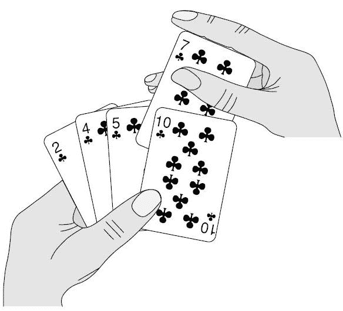
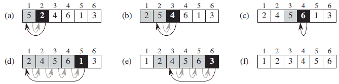

# 使用 Javascript 进行插入排序

> 原文：<https://dev.to/supunkavinda/insertion-sort-with-javascript-4ohn>

你觉得算法很酷吗？你最喜欢的语言是 Javascript 吗？

[](https://res.cloudinary.com/practicaldev/image/fetch/s--mnP9v_Ad--/c_limit%2Cf_auto%2Cfl_progressive%2Cq_66%2Cw_880/https://gifimage.net/wp-content/uploads/2017/11/go-go-go-gif-13.gif)

在这篇文章中，我将写如何开始学习算法，为什么你作为一个开发者需要理解算法，以及其他一些主题。作为我们的第一个算法，我将使用插入排序，这对于初学者来说很容易理解。

# 排序数组

```
var arr = [6,3,2,1,7,4]; 
```

Enter fullscreen mode Exit fullscreen mode

在 javascript 中，对这个数组进行排序相当容易。

```
arr.sort(); 
```

Enter fullscreen mode Exit fullscreen mode

以这种方式排序是一种高级方法。这是 Javascript 提供的功能。在本文中，我们将以一种**算法的方式**来看待排序问题。

有很多算法可以对数组进行排序。**插入排序**就是其中之一。插入排序是开始理解算法的好方法。(*排序是计算机科学中的一个基本操作*

# 算法

算法是一种计算过程，它接受一个输入并产生一些输出。例如，您将一个未排序的数组输入到排序算法中。然后，你得到一个排序后的数组。(这就是我们在这里要做的)

创建算法是为了解决特定的计算问题。好的算法快速高效地解决它们。我稍后会解释“好”的含义。

# 一个 Dev 的算法？

这很难解释。但是，理解一个算法确实会帮助你在开发东西的时候用一种新的方式去思考。它将帮助您快速编写代码。而且，它让你的大脑快速思考，为你提供最好的结果。( [Quora 关于这个话题的讨论](https://www.quora.com/Is-it-important-for-a-programmer-to-learn-algorithms))

# 插入排序

让我们进入问题！

**问题**:排序数组
**输入**:数组数字(未排序)
**输出**:排序数组

插入排序是解决计算机世界中“排序问题”的有效算法。它的工作原理与我们对一手扑克牌进行分类的方式完全一样。

*   首先，你有你的一套卡片在桌子上。
*   然后，你得到一个并把它拿在手里。
*   接下来，你得到另一个并与第一个进行比较，并将其添加到正确的位置。
*   然后，你得到第三张牌，并把它放在相对于其他两张牌的正确位置上。
*   同样的过程还在继续...
*   最后你会有一手分类好的牌。

[](https://res.cloudinary.com/practicaldev/image/fetch/s--F_N0jZdf--/c_limit%2Cf_auto%2Cfl_progressive%2Cq_auto%2Cw_880/https://www.dotnetlovers.cimg/coolnikhilj22a2b418fe-0d4f-4c2d-828c-09e0a74ad630.jpg%3F1/15/2016%25202:05:48%2520AM)

你应该注意的一件事是**手里的牌总是被排序**。

[](https://res.cloudinary.com/practicaldev/image/fetch/s--0t8NFnlc--/c_limit%2Cf_auto%2Cfl_progressive%2Cq_auto%2Cw_880/http://www.java2novice.cimg/insertion-sort.png)

# Javascript 中的插入排序

让我们用 Javascript 实现我们用英语讨论的内容。(只是 7 条规则)

```
function insertionSort(arr) {
    for (var i = 1, len = arr.length; i < len; i++) {
        key = arr[i];
        j = i - 1;
        while (j >= 0 && arr[j] > key) {
            arr[j + 1] = arr[j]
            j--;
        }
        arr[j + 1] = key;
    }
    return arr;
} 
```

Enter fullscreen mode Exit fullscreen mode

## 功能的用法

```
var arr = [3,1,5,6,2];
console.log(insertionSort(arr)); 
```

Enter fullscreen mode Exit fullscreen mode

# 解释...

*   我们向函数中发送一个未排序的数组。
*   `for (var i = 1, len = arr.length; i < len; i++)`从索引 1 到`len - 1`循环。所以，我们不使用循环的第一个元素。
*   `key = arr[i]`保存变量中的值。`key`是我们将要插入手中的“牌”。
*   `j = i - 1`，首字母 j 为`i - 1`，是`i`之前的索引。
*   如果索引`j`的值大于我们的密钥，则`while (j >= 0 && arr[j] > key)`循环遍历我们手中的牌。
*   `arr[j + 1] = arr[j]`，将我们检查的元素(索引 j)向右移动一次。
*   `j--`，减少 j .所以，我们可以检查前一个元素。如果`j < 0`，while 循环结束，因为我们手里没有更多的牌。
*   `arr[j + 1] = key`，将我们的卡插入正确的位置。(`j + 1`被使用是因为，在 while 循环中，`j`比它应该减少的次数多了一次)

### 用例子逐个循环...

当开始理解一个有循环的算法时，最好的方法是通过一个例子一个循环地进行。它给你一个算法真正做什么的概念。

让我们开始第一个循环。

*   `[3,1,5,6,2]`是我们未排序的数组。(5 个元素，指数 0 至 4)
*   对于从索引 1 到 4 的循环(`[1,5,6,2]`元素)

#### 先进行循环

*   `i`是 1
*   `key`是`1`
*   `j`为 0
*   `arr[j]`是 3
*   `arr[j]`>T1】

因此，我们将元素 3 向右移动一次。现在我们有了数组`[3,3,5,6,2]`。

*   `j--`。现在`j`是-1。`j < 0`。因此，当循环终止时
*   `arr[j + 1] = key`等于`arr[0] = 1`。

在第一次循环之后，我们有了数组`[1,3,5,6,2]`

我们只是将卡片“1”插入手中的正确位置(我们手中只有[3])

### 秒为循环

*   `i`是 2
*   `key`是`5`
*   `j`是 1
*   `arr[j]`是 3
*   `arr[j]`<T1】
*   当循环不运行时

在第二个 for 循环之后，我们有相同的数组`[1,3,5,6,2]`。

### 第三为循环

*   `i`是 3
*   `key`是`6`
*   `j`是 2
*   `arr[j]`是 5
*   `arr[j]`<T1】
*   当循环不运行时

在第二个 for 循环之后，我们有相同的数组`[1,3,5,6,2]`。

### 第四次为循环

这是有趣的部分。

现在我们手里有`[1,3,5,6]`(排序)。`2`是我们正在检查的元素。我们将把它插入正确的位置。

*   `i`是 4
*   `key`是`2`
*   `j`是 3
*   `arr[j]`是 6
*   `arr[j]`>T1】
*   循环运行时
    *   向右移动`6`一次。现在我们有了`[1,3,5,6,6]`
    *   `5 > 2`，向右移动`5`一次。`[1,3,5,5,6]`
    *   `3 > 2`，向右移动`3`一次。`[1,3,3,5,6]`
    *   `1 < 2`，那是 2 的位置！插在`1`之后。现在我们有了`[1,2,3,5,6]`。

我们刚刚使用插入排序对数组进行了排序！

# 分析算法(像计算机科学家:D 一样思考)

当我们对同一个问题有多种算法时(例如:有插入排序、合并排序、选择排序等。对于“排序问题”)，我们将需要分析每个算法，并找到最佳的一个。

一般来说，分析算法意味着预测算法需要的资源。有内存、带宽、计算机硬件使用等事实。最常见的是**计算时间**被用来分析一个算法。*花的时间越多越不好*。在分析一个算法的时候，需要考虑很多事情。

在本文中，我将解释一种分析我们创建的算法的简单方法。对于这项任务，您需要理解这些概念。

*   如果计算机有对数组排序的指令会怎样？所以，只需要一个简单的命令。(这不是 Javascript 里的`arr.sort()`。`.sort()`在 Javascript 中使用插入排序对数组进行排序，如果元素个数小于 10)。在真实的计算机中，我们只有算术、条件、数据移动等指令。
*   我们将使用 RAM 模型，它逐个执行指令，没有并发操作。
*   使用插入排序法对一千个数字进行排序比三个数字要花时间。在现代计算机中，这种差异是可以协商的。但是，如果我们有 10 亿，这很重要。
*   插入排序需要更多的时间来排序，这取决于输入数组的排序程度。
*   插入排序所花费的时间取决于您有多少输入(*输入大小*)，以及每次执行有多少步骤。

# 最坏和最好的情况

对于插入排序，

**最好的情况**发生在输入数组已经排序的时候。在最好的情况下，运行时间可以表示为`an + b`，其中`a`和`b`为常数，`n`为输入的大小。

**最坏情况**发生在输入数组按降序排序时。对于最坏的情况，运行时间可以表示为`an(2) + bn + c`，它是一个二次函数。

使用输入大小和运行时间等概念创建数学方程，这些概念并不难理解。但是，我不会在这里包括数学计算。

# 接下来是什么？

如果你读到这里，我真的很高兴！这里有一些你可以做的事情。

*   跟着一个教程！(Khanacedemy 就可以了)
*   看一本关于算法的书。(我推荐[这个](https://www.amazon.com/Introduction-Algorithms-3rd-MIT-Press/dp/0262033844)。)
*   继续 Python。然后，用 Javascript 重新创建它。当你在学习算法时，Python 是你可以轻松编写代码的最佳语言。如果你更喜欢算法，那就把它转换成 Javascript(像我一样:)

# **喜欢文章？**

如果你喜欢这篇文章，如果你愿意帮助我，我创建了一个新网站， [Hyvor Groups](https://groups.hyvor.com/) ，这是一个创建群组、加入群组、发布和分享帖子的地方。请加入 Hyvor 小组，分享您的作品，提出问题，并与您的朋友分享网站。

相关团体

1.  [网络开发者小组](https://groups.hyvor.com/WebDevelopment)
2.  [PHP 组](https://groups.hyvor.com/PHP)
3.  [Javascript 组](https://groups.hyvor.com/JS)

请随意创建您自己的群！

谢谢大家！