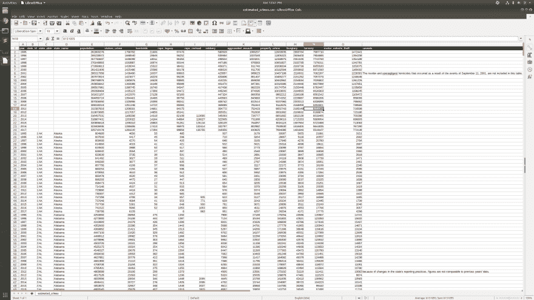
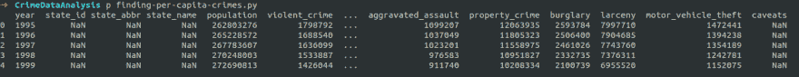
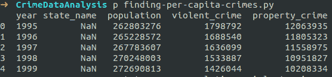
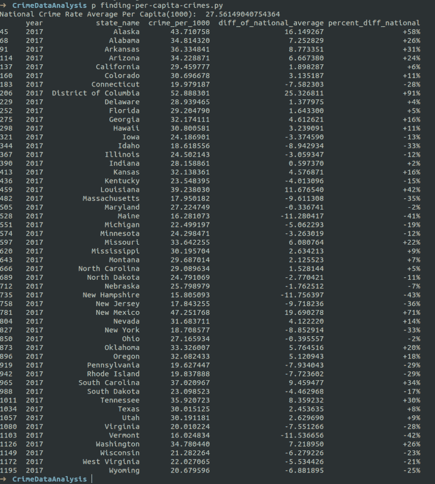

# Python3 和 Pandas 的犯罪数据探索:第 1 部分

> 原文：<https://dev.to/_rich/crime-data-exploration-with-python3-and-pandas-part-1-3445>

## 概述

数据无处不在。犯罪也是。联邦调查局开展了一项名为统一犯罪报告(UCR)的计划，该计划从全美约 18，000 个机构收集犯罪数据。这个数据库是关于美国犯罪的有趣统计数据的金矿。继续学习，了解如何使用 Python 来分析这些数据。我希望您能从这篇文章中学习，然后自己去做一些数据探索。

**完整源代码:**【https://github.com/rbk/Crime-Data-Analysis T2】

## 我们会用到的数据工具

众所周知，数据科学家使用 Python 进行机器学习和数据清理。您可能不知道的是，Python 中有一些很棒的库，可以对 JSON、CSV 和其他数据类型执行操作。

你很快就会爱上熊猫。不，不是你在动物园看到的可爱的熊猫，是蟒蛇皮包裹的熊猫。Pandas 是一个库，它使处理大量数据变得轻而易举，您将在下一节看到这一点。熊猫建在 Numpy 的上面。我建议把它们都检查一下:

*   [https://pandas.pydata.org/](https://pandas.pydata.org/)
*   [https://www.numpy.org/](https://www.numpy.org/)

## 下载数据集

获取数据集开始。您可以使用对您来说最简单的方法来下载数据集。这是我们将使用的数据集的 URI:

[http://S3-us-gov-west-1 . Amazon AWS . com/CG-d4b 776d 0-d898-4153-90 c8-8336 f 86 BD FEC/estimated _ crimes . CSV](http://s3-us-gov-west-1.amazonaws.com/cg-d4b776d0-d898-4153-90c8-8336f86bdfec/estimated_crimes.csv)

该数据集包含 1995 年至 2017 年全美报告的犯罪事件的估计计数。

[](https://res.cloudinary.com/practicaldev/image/fetch/s--pXv_m789--/c_limit%2Cf_auto%2Cfl_progressive%2Cq_auto%2Cw_880/https://s3.amazonaws.com/blog.richardkeller.net/posts/crime-data-analysis-01/Screenshot%2Bfrom%2B2019-07-13%2B12-41-54.png)

在深入研究代码之前，还有一件事...免责时间。

## 关于从该犯罪数据集得出结论的免责声明

犯罪数据集是一段时间内事件报告的汇编。术语“犯罪率”是给定人口中每个人的犯罪数量。值得注意的是，这没有考虑到与一个城市或州的安全相关的数百个风险因素。例如，新墨西哥州的犯罪率可能高于平均水平，但从统计数据来看，新墨西哥州并不是一个危险的居住地。这些数据没有考虑到人口密度、经济状况、就业率和警察的有效力量。

此外，你不能因为某个州的犯罪率低于平均水平，就认为它更安全。这种说法站不住脚的原因是，某些地区的犯罪可能因为犯罪本身而没有被报道。

好了，免责声明到此为止...

## 到码时间了！

女士们，先生们，启动您的 IDE 或编辑器或 Jupyter 笔记本。我们一行一行地前进。您应该有一个名为`estimated_crimes.csv`的 CSV 文件文件夹。在这个文件夹中，你需要一个 Python 文件。我一般用`main.py`。这段代码将在 Python3 中。你还需要 pip 安装熊猫:

```
pip install pandas 
```

## 目标

在接下来的步骤中，我们将把 FBI 的 CSV 文件转换成一个新的 CSV 文件，该文件包含新的列，有助于我们直观地理解数据。具体来说，我们将确定全国的平均犯罪率，然后比较美国各州的犯罪率，以显示相对于全国平均水平的百分比差异。

### 第一步:将 CSV 加载到熊猫数据框架中

我们需要做的第一件事是控制我们的数据。在其原始格式下，使用起来有点笨拙。Pandas 是将数据转换成更容易处理的不同形式的首选工具。

在处理 CSV 文件时，你必须知道的关于熊猫的第一个技巧是惊人的`read_csv`功能。read_csv 函数将任何 csv 文件加载到 Pandas 数据帧中。从这个数据框架中，我们可以使用各种 pandas 函数来操作和查询数据。

```
import pandas

# Read the CSV into a Dataframe data = pandas.read_csv('estimated_crimes.csv') 
```

数据读入变量后，我们可以使用`head`函数打印数据帧的前 5 行:

```
# Print the first 5 lines of the dataframe print(data.head()) 
```

**输出**

[](https://res.cloudinary.com/practicaldev/image/fetch/s--yDcjSBm8--/c_limit%2Cf_auto%2Cfl_progressive%2Cq_auto%2Cw_880/https://s3.amazonaws.com/blog.richardkeller.net/posts/crime-data-analysis-01/df-head-01.png)

现在，在继续之前，让我们删除我们现在不需要的数据列。为此，使用`usecols`选项读取 CSV。`usecols`告诉 read 函数只使用指定的列列表:

```
import pandas

# Which columns to use columns = ['year', 'state_name', 'population', 'violent_crime', 'property_crime']

# Get the data into a dataframe from csv data = pandas.read_csv('estimated_crimes.csv', usecols=columns) 
```

现在，当您打印数据时，更容易可视化。

```
# Print the first 5 lines of the dataframe print(data.head()) 
```

**输出**

[](https://res.cloudinary.com/practicaldev/image/fetch/s--XvNXMq6Z--/c_limit%2Cf_auto%2Cfl_progressive%2Cq_auto%2Cw_880/https://s3.amazonaws.com/blog.richardkeller.net/posts/crime-data-analysis-01/df-head-02.png)

### 第二步:过滤数据

现在你已经有了数据框架中的数据，你已经释放了熊猫的力量！熊猫的第二招是`query`功能。使用查询功能，我们可以过滤 CSV 文件，只包含特定年份的行。

使用我们上面的数据框架:

```
data = data.query('year == 2017') 
```

如果这还不能让你对使用熊猫感到兴奋，我不知道还有什么能让你兴奋。运行此查询函数后，我们的数据应该只包含 year 列为 2017 的行。

我们需要添加的另一个过滤器是删除 state 列为 null 的行。在这个特定的 CSV 中，最上面的行是已编译的国家统计数据，因此没有填写 state 列。我们可以使用 pandas `notnull`函数过滤这些行:

```
data = data[data['state_name'].notnull()] 
```

state 列为 null 或 NaN 的任何行都将从数据帧中删除。

### 第三步:用`apply`添加新的数据列

既然我们已经清理了数据。我们将添加三列。使用 pandas `apply`函数，我们可以分两步在数据中创建新列。

第一步是定义你的函数。该函数将从数据帧中取出每一行。例如，下面的函数将计算每一行中每 1000 人的犯罪率。

```
def crime_per_capita(row, number_of_people):
    total_crimes = row['violent_crime'] + row['property_crime']
    population = row['population']
    count = (total_crimes/population)*number_of_people
    return count 
```

我们的 dataframe 现在可以使用这个函数通过使用`apply`来创建一个新列:

```
data['crime_per_1000'] = data.apply(crime_per_capita, args=(1000,), axis=1)
print(data.head()) 
```

运行打印头将显示每 1000 人中犯罪数量的新列。

接下来，我们将计算全国犯罪率，然后使用全国犯罪率来比较各个州的犯罪率。一旦我们计算出美国各州的全国平均犯罪率的百分比差异，我们将能够很快看到美国各地犯罪率的差异。

```
 # 1 Get National Average total_population = data['population'].sum()
total_crimes =+ data['violent_crime'].sum() + data['property_crime'].sum()
national_average_per_cap = (total_crimes/total_population)*1000

# 2.0 Add column of diff to national average def compute_diff(row):
    diff = row['crime_per_1000'] - national_average_per_cap
    return diff

data['diff_of_national_average'] = data.apply(compute_diff, axis=1)

# 2.1 Add column of percent diff compared to national average def compute_percent(row):
    percent = (row['crime_per_1000']/national_average_per_cap)*100
    if percent > 100:
        return "+" + str(int(percent-100)) + "%"
    return "-" + str(100 - int(percent)) + "%"

data['percent_diff_national'] = data.apply(compute_percent, axis=1) 
```

## 得出结论

[](https://res.cloudinary.com/practicaldev/image/fetch/s--SjOJEQa4--/c_limit%2Cf_auto%2Cfl_progressive%2Cq_auto%2Cw_880/https://s3.amazonaws.com/blog.richardkeller.net/posts/crime-data-analysis-01/df-head-all-03.png)

从上面的数据我们可以看出:

*   俄亥俄州和马里兰州的犯罪率最低，比平均水平低 2%。这意味着每 1000 人中报告的犯罪比全国平均水平要低。
*   马里兰州 2017 年人均犯罪最少。
*   哥伦比亚特区的犯罪率几乎是全国平均水平的两倍(比全国平均水平高出 91%)。

使用这个数据集和许多其他数据集，数据探索的可能性是无限的。请记住，在对这样的一维数据做出安全性假设之前，你应该留意免责声明。有数百个因素决定了一个城市或社区的实际安全。

最后，我们查看了来自联邦调查局 UCR 网站的一个名为“estimated_crimes.csv”的数据集。我们使用 Pandas python 库来过滤和转换数据，以便更容易阅读。然后我们得出了一些关于数据的结论。

请继续关注第 2 部分，我们将深入研究犯罪数据集。

### 资源和参考文献

*   [1][https://crime-data-explorer . fr . cloud . gov/explorer/state/California/crime/1995/2017](https://crime-data-explorer.fr.cloud.gov/explorer/state/california/crime/1995/2017)
*   [https://www.fbi.gov/services/cjis/ucr](https://www.fbi.gov/services/cjis/ucr)
*   [https://crime-data-explorer.fr.cloud.gov/downloads-and-docs](https://crime-data-explorer.fr.cloud.gov/downloads-and-docs)
*   https://definitions.uslegal.com/c/crime-rate/->“基于人口的利率没有考虑到风险的变化。”