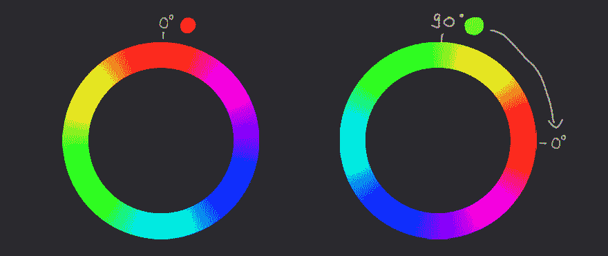

# 彩色头像泡泡

> 原文：<https://dev.to/iamschulz/colorful-avatar-bubbles-1go8>

我想和你分享一个方便的小代码片段，它可以创建类似材料设计的用户头像。我想对我的用户进行颜色编码，所以每个名字都必须有独特的颜色。我见过一些懒惰的方法，它们给字母表中的每个字母分配一种颜色，但是我也想包括数字和非拉丁字符。所以我们需要找到一种方法来支持整个 unicode 表。

但是在我们到达那里之前，让我们从一些简单的事情开始。神通本身。准确的说是伯特的头像。

```
<p class="chip" aria-label="Burt's user picture">Burt</p> Burt 
```

<svg width="20px" height="20px" viewBox="0 0 24 24" class="highlight-action crayons-icon highlight-action--fullscreen-on"><title>Enter fullscreen mode</title></svg> <svg width="20px" height="20px" viewBox="0 0 24 24" class="highlight-action crayons-icon highlight-action--fullscreen-off"><title>Exit fullscreen mode</title></svg>

```
.chip {
    --chip-size: 48px;
    --bg-color: gray;

    display: inline-block;
    width: var(--chip-size);
    height: var(--chip-size);
    border-radius: 50%;
    font-family: sans-serif;
    font-size: 0;
    font-weight: normal;
    line-height: var(--chip-size);
    text-align: center;
    vertical-align: middle;
    overflow: hidden;
    color: white;
    background: var(--bg-color);

    &::first-letter {
        font-size: calc(var(--chip-size) / 2);
    }
} 
```

<svg width="20px" height="20px" viewBox="0 0 24 24" class="highlight-action crayons-icon highlight-action--fullscreen-on"><title>Enter fullscreen mode</title></svg> <svg width="20px" height="20px" viewBox="0 0 24 24" class="highlight-action crayons-icon highlight-action--fullscreen-off"><title>Exit fullscreen mode</title></svg>

等待...为什么他的头像在一个`p`标签里面？为了只显示他的首字母，我们使用了`::first-letter`伪类，这需要一个段落。
现在，伯特只有一个无聊的灰色圈子。那让他很难过，所以让我们给他点颜色看看！

使用 Hex 或 RGB 等传统颜色模型需要我们在跟踪亮度的同时，通过混合三个颜色通道来获得合适的颜色。但幸运的是还有 HSL。HSL 代表色调/饱和度/亮度，让我们独立控制这三个值。这对我们来说是完美的，因为我们可以通过预定义饱和度和亮度，然后计算色调，来管理背景和字体之间的对比度，而不是颜色本身。色调值表示色轮的顺时针旋转。这意味着 0 到 360 之间的任何值都会产生一个单独的色调。

[](https://res.cloudinary.com/practicaldev/image/fetch/s--hWSG0Waz--/c_limit%2Cf_auto%2Cfl_progressive%2Cq_auto%2Cw_880/https://thepracticaldev.s3.amazonaws.com/i/269pjcvff7bi5h6m6eav.jpg)T3】

```
generateColor() {
let hsl = [
    hueValue,
    this.string.length > 0 ? "100%" : "0%",
    "42%"
];
return "hsl(" + hsl.join() + ")";
} 
```

<svg width="20px" height="20px" viewBox="0 0 24 24" class="highlight-action crayons-icon highlight-action--fullscreen-on"><title>Enter fullscreen mode</title></svg> <svg width="20px" height="20px" viewBox="0 0 24 24" class="highlight-action crayons-icon highlight-action--fullscreen-off"><title>Exit fullscreen mode</title></svg>

现在我们需要`hueValue`。但我们只有名字。我们如何从一个普通的旧字符串中获得一个颜色值？

字符串是一系列字符，每个字符在 unicode 表中都有一个数值。这是一个好的开始。我们可以简单地将所有的 unicode 位置相加，但最终可能会得到相当大的数字。唯一合理的输入色调值的数字是在 0 到 360 之间，所以我们要转换我们的值。

为了防止数字过大，我们将旋转每个字符的色轮，然后从那里继续到下一个字符。为了旋转轮子(阅读:序列化我们的字符值在一个圆上的位置),我们将使用一些快速数学:正弦函数。这给了我们一个介于-1 (270)和 1 (90)之间的数字。我们用它的绝对值去掉负值，然后乘以 360，得到 HSL 值的度数。

```
let hash = 0;

for (let i = 0; i < this.string.length; i++) {
    hash = Math.abs(
        Math.sin(
            this.string.charCodeAt(i) + hash
        ) * 360
    )
} 
```

<svg width="20px" height="20px" viewBox="0 0 24 24" class="highlight-action crayons-icon highlight-action--fullscreen-on"><title>Enter fullscreen mode</title></svg> <svg width="20px" height="20px" viewBox="0 0 24 24" class="highlight-action crayons-icon highlight-action--fullscreen-off"><title>Exit fullscreen mode</title></svg>

我们走吧！我们可以从任何字符串中生成一个唯一的、看似随机的颜色值，同时仍然保持其可读性。伯特现在非常开心。

完整的密码如下:
[https://codepen.io/iamschulz/embed/RdYKaY?height=600&default-tab=result&embed-version=2](https://codepen.io/iamschulz/embed/RdYKaY?height=600&default-tab=result&embed-version=2)