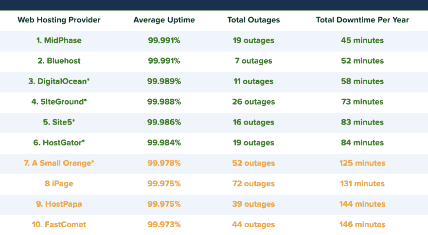
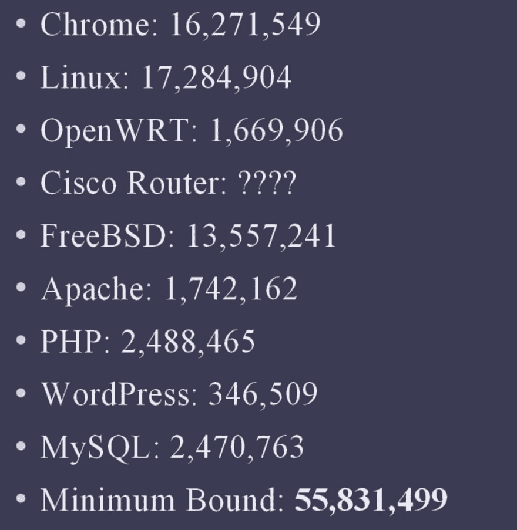

# 减少接触你无法控制的东西...当你可以的时候

> 原文：<https://dev.to/jkvyff/keeping-code-working-as-a-web-dev-1j0a>

我只想问一个问题，为什么我们写的东西可以完美的表演，但仍然是垃圾。

系统设计中有一个概念叫高可用性。经常用来提供对系统按预期执行的水平的期望的简写是“五个 9”或 99.999%的正常运行时间，大约。许多领域都以系统可用性为目标，甚至更高(医院、航空设备和卫星软件)。

哇，多么美好的梦想，但是 WebDev 呢？我希望能够编写代码并在这些级别上执行，但是我在分布式硬件(服务器、路由器)和分布式软件(包、链接、库)中工作。让我们从托管我们站点的数据中心开始。

<figure>

<figcaption>https://hostingfacts.com/average-hosting-uptime-study/</figcaption>

</figure>

哎呀，最高的平均分只有四个 9，而我们甚至还没有写任何代码。

至少谷歌处理他们自己的主机，并且已经解决了这个问题。

> G 套件@ G Suite谷歌日历目前正在经历服务中断。敬请关注更新或关注此处:[goo.gl/NOZTZ](https://t.co/2SGW3X1cQn)2019 年 6 月 18 日下午 14:39109209

..哦不

> <video loop="" controls=""><source src="https://video.twimg.com/tweet_video/D9WfflxX4AAn2tM.mp4" type="video/mp4"></video>Chip Wolf@ Chip Wolf uk[@ gsuite](https://twitter.com/gsuite)14:43PM-18 Jun 2019

看起来 G-Cal 停机了三个多小时，这是今年的第三个 9。

作为 web 开发人员，我们习惯于依赖如此多的依赖项，以至于我们甚至无法正确估计有多少行代码正在运行。

几年前，一名开发人员凯西·穆拉托里试图计算出一个典型的 web 堆栈需要引入和使用多少代码，结果止步于 5600 万行。当然，人们不会使用通过这个堆栈引入的所有函数和方法，但是它确实使得一些问题很难或者不可能实际测试。

<figure>

<figcaption>https://www.youtube.com/watch?v=kZRE7HIO3vk</figcaption>

</figure>

我的观点不是我们不应该使用这些技术。但是只要意识到你带来了什么，如果你不理解它在更深层次上是如何运行的，试着限制你带来项目的代码，因为作为一个 web 开发人员，假设你的代码是完美的，你已经达到了四个 9 或者更差。

资源

*   [https://en.wikipedia.org/wiki/High_availability](https://en.wikipedia.org/wiki/High_availability)
*   [https://hostingfacts.com/average-hosting-uptime-study/](https://hostingfacts.com/average-hosting-uptime-study/)