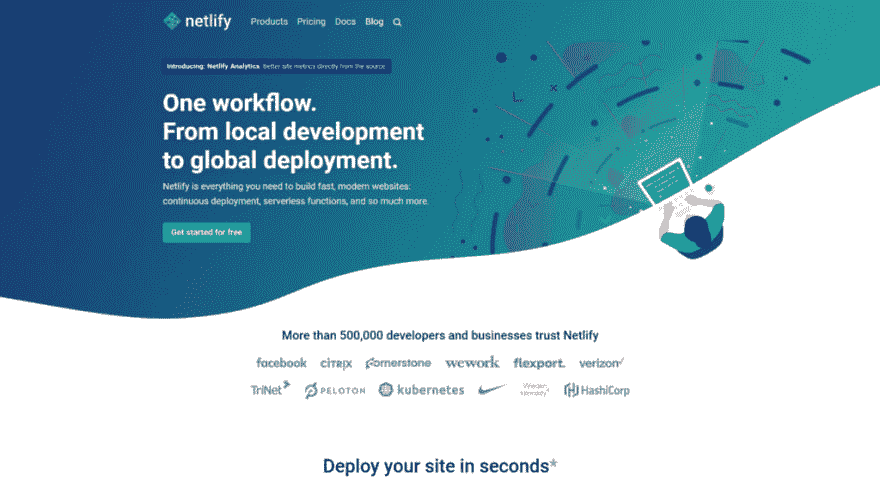
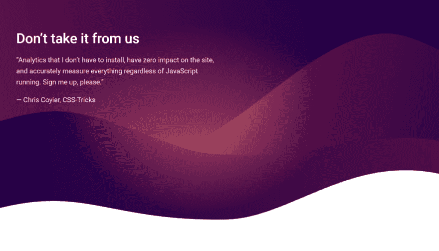
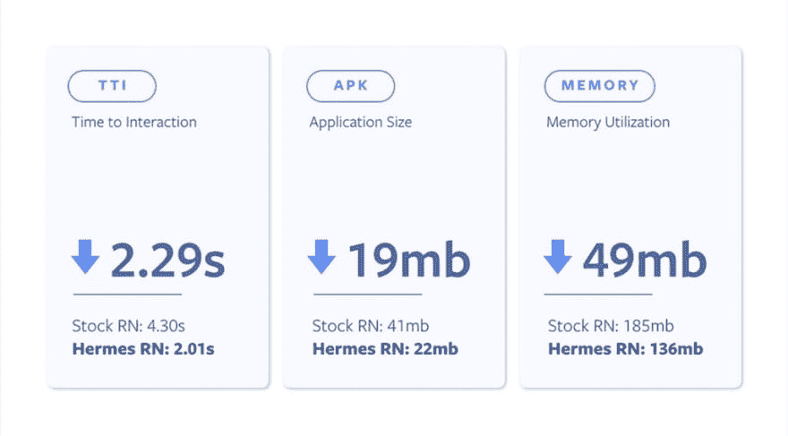
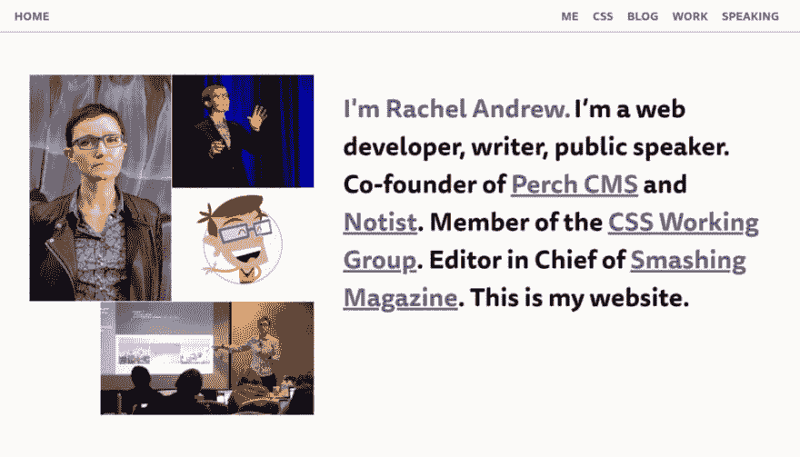

# 前端新闻#9: Firefox 68，Netlify Analytics，Hermes for React Native 和本周开发者

> 原文：<https://dev.to/adriansandu/front-end-nexus-9-firefox-68-netlify-analytics-hermes-for-react-native-and-developer-of-the-week-4fa>

<figure> 

<figcaption>于[https://youtu.be/DdTwOiAle7o](https://youtu.be/DdTwOiAle7o)</figcaption>

</figure>

在 YouTube 上查看该集

大家好，欢迎收看新一轮的前端新闻。这是我今天为你们准备的:

*   Mozilla 发布 Firefox 68
*   Netlify 推出新的分析服务
*   脸书开源爱马仕

我还想提到几个软件更新，我将为本周开发者介绍一个新的部分。所以请陪我到最后，找出所有的细节。

一如既往，我也为那些喜欢听而不是读的人准备了视频版本。如果你喜欢这种格式，如果你也能订阅 YouTube 频道，我将不胜感激。

[https://www.youtube.com/embed/DdTwOiAle7o](https://www.youtube.com/embed/DdTwOiAle7o)

### Mozilla 发布 Firefox 68

<figure> 

<figcaption>图片来自</figcaption>

</figure>

Mozilla 发布了他们的火狐浏览器 68 版本。该公司继续兑现他们的承诺，提供更加安全和隐私的浏览体验，因为更新包括许多安全修复，以及一系列推荐的扩展，这些扩展已经过彻底的安全性，可用性和实用性审查。

这个版本中还有许多新功能。最明显的一个是关于阅读器视图，因为更新将黑暗模式扩展到整个浏览器区域，包括侧栏、工具栏和控件。

我在上一集提到了 WebRender 变得可用。该更新仅适用于使用 NVIDIA 显卡的电脑。Firefox 68 扩展了对英特尔和 AMD GPUs 的支持，使使用 Windows 10 的每个人都可以使用 WebRender。

企业用户现在有了更广泛的可用策略，比以前更容易定制浏览器来满足每个公司的特定需求。例如，IT 经理现在可以自定义或完全禁用新的选项卡页面，可以关闭搜索建议，或者可以按 ID 和网站管理扩展。

开发者也没有被遗忘。现在可以选择运行全页色彩对比审计，识别页面上所有未通过色彩对比检查的元素。现在完全支持 CSS Scroll Snap 模块，以及新的`about:compat`选项，其中列出了网站特定的解决方法，并且可以关闭。这些变通办法是针对 Firefox 的各种形式的网站崩溃的临时修复，而网站会在适当的时候修复它们。有了`about:compat`，现在很容易看到 Firefox 中所有活跃的变通办法，网站开发人员也很容易出于测试目的禁用给定的变通办法。

有关此更新的完整详细信息可以在下面的链接中找到:

*   [https://blog . Mozilla . org/blog/2019/07/09/latest-Firefox-release-available-today-for-IOs-and-desktop/](https://blog.mozilla.org/blog/2019/07/09/latest-firefox-release-available-today-for-ios-and-desktop/)
*   [https://www.mozilla.org/en-US/firefox/68.0/releasenotes/](https://www.mozilla.org/en-US/firefox/68.0/releasenotes/)
*   [https://hacks . Mozilla . org/2019/07/Firefox-68-bigints-contrast-checks-and-the-quantum bar/](https://hacks.mozilla.org/2019/07/firefox-68-bigints-contrast-checks-and-the-quantumbar/)
*   [https://developer . Mozilla . org/en-US/docs/Mozilla/Firefox/Releases/68](https://developer.mozilla.org/en-US/docs/Mozilla/Firefox/Releases/68)

### 网络生活分析

JAMstack 是 web 开发领域的新宠儿，而 Netlify 是部署静态生成网站的最知名平台。

随着 Netlify 宣布其全新的分析功能，该平台的用户现在有了一个新的强大工具。这项服务领先于所有竞争对手的地方在于，它只是服务器端的，没有任何客户端 JavaScript 或任何其他跟踪工具。数据是通过为您的网站流量提供服务的应用交付网络从 HTTP 请求中收集的。

我想每个人都和 CSS Tricks 的克里斯·科伊尔(Chris Coyier)站在同一条线上——“我不必安装的分析工具，对网站的影响为零，无论 JavaScript 运行与否，都可以准确地衡量一切。请帮我报名。”

对于部署到 Netlify 的任何站点，可以直接从仪表板启用分析服务，每个站点每月的费用为 9 美元。

来源和参考资料:

*   [https://www.netlify.com/products/analytics/](https://www.netlify.com/products/analytics/)
*   [https://www.netlify.com/blog/2019/07/10/netlify-analytics-准确-洞察-无绩效-影响/](https://www.netlify.com/blog/2019/07/10/netlify-analytics---accurate-insights-without-performance-impacts/)

### 脸书开源爱马仕

Hermes 是一个开源 JavaScript 引擎，针对在 Android 上运行 React 原生应用进行了优化。从 React Native 的 60.0.2 版本开始，开发人员可以启用一个标志来激活 Hermes，并在他们的应用程序中使用它。

脸书声称，“对于许多应用程序来说，简单地启用爱马仕将会改善启动时间，减少内存使用和更小的应用程序大小。”官方页面对运行在谷歌 Pixel 上的 MatterMost React 原生应用进行了基准测试。

<figure> 

<figcaption>图片来源:[https://code.fb.com/android/hermes/](https://code.fb.com/android/hermes/)</figcaption>

</figure>

交互时间减少了 2.29 秒，从 4.30 秒减少到 2.01 秒。应用程序大小减少了 19MB，从 41MB 减少到 22MB。内存利用率也降低了 49MB，从 185MB 降至 136MB。

这是一个很好的整体改进，但是真正的考验将来自开发人员社区。

来源和参考资料:

*   [https://code.fb.com/android/hermes/](https://code.fb.com/android/hermes/)
*   [http://facebook.github.io/react-native/docs/hermes](http://facebook.github.io/react-native/docs/hermes)

### 值得注意的软件更新

我有两个主要的软件版本要告诉你。

第一个是更新到 9.0 版本的 NextJS。第二个是最近更新到 13.0 版本的标准 JS。在那之后也发布了两个小补丁，在这一集制作的时候，当前版本是 13.0.2。

*   next js 9.0:[https://nextjs.org/blog/next-9](https://nextjs.org/blog/next-9)
*   标准 JS:[https://standardjs.com/changelog.html#1300-2019-07-10](https://standardjs.com/changelog.html#1300---2019-07-10)

### 本周开发者

今天，我将在节目中开辟另一个新的部分——本周开发者，在这里，我将介绍那些在为用户建设更好的网络和为开发者建设更好的行业方面做出杰出贡献的人。

<figure> 

<figcaption>来源:[https://rachelandrew.co.uk/](https://rachelandrew.co.uk/)</figcaption>

</figure>

我想从雷切尔·安德鲁开始这一部分。她是 CSS 工作组的特邀专家、Google 开发者专家(GDE)以及 CSS 网格开发和集成背后的主要力量之一。她的名字出现在 23 本书的封面上(截至此刻)以及无数发表在互联网上的文章上。

她现在是著名的 Smashing Magazine portal 的主编，她喜欢谈论和撰写关于布局的一般内容，尤其是 CSS Grid，以及在支持旧浏览器的同时可以使用所有新的 CSS 功能的所有方法。

<figure> 

<figcaption>来源:[https://www.smashingmagazine.com/author/rachel-andrew/](https://www.smashingmagazine.com/author/rachel-andrew/)</figcaption>

</figure>

雷切尔也喜欢跑步——她计划在 2019 年参加三次铁人三项赛——她还在学习她的小型飞机私人飞行员执照。多棒啊。

> 瑞秋安德鲁@ rachelandruw今天早上出发跑上一座巨大的山丘——黑山小道半程马拉松。应该是一些美景。[trailevents.co/events/black-m…](https://t.co/QajTWoK4xy)2019 年 7 月 13 日上午 04:5808

如果你想联系瑞秋，雇佣她的服务或者邀请她在某个活动上发言，最好的方式就是通过她的网站——https://rachelandrew.co.uk/

### 今日问题

在我们新的“本周开发者”栏目中，你希望看到的下一个人是谁？请在评论区或在[https://twitter.com/frontendnexus.](https://twitter.com/frontendnexus.)上留下你的建议

这一版就这么多了。在 https://twitter.com/frontendnexus[的 Twitter 上关注 Front End Nexus](https://twitter.com/frontendnexus)，一旦有新的更新，我们将立即通知您。我还想鼓励你在 https://www.youtube.com/channel/UCgACtqiDmnSaskDIBsK54ww[的](https://www.youtube.com/channel/UCgACtqiDmnSaskDIBsK54ww)订阅 YouTube 频道。一旦该频道达到 100 名订户，我可以解锁更多的选项，因此非常感谢您的支持。

祝您度过愉快而富有成效的一周，我们下次再见！

* * *