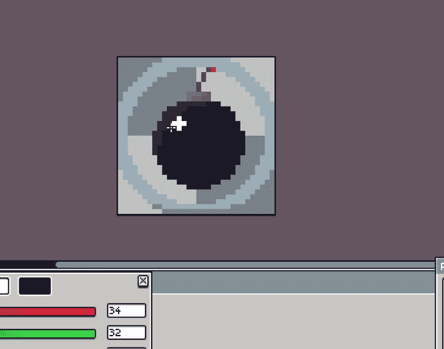

# 疯狂:游戏开发日志#3

> 原文：<https://dev.to/nuculabs_dev/mad-game-devlog-3-4lff>

大家好！

我没什么好说的，所以我长话短说。

我们已经增加了 Android 构建支持，并且正在努力在 Google Play 上建立一个内部测试应用。

为了让游戏可以在 Android 上运行，我们还添加了移动控件，我有机会制作它们。

这是放置炸弹的按钮:

为了简化我们的生活，我们使用了 Unity 标准资产包中的 CrossPlatformInput 模块，这使我们能够以最少的代码和配置支持 PC、控制台和移动设备。

游戏的当前状态在敌人、爆炸和用户界面方面有一些小问题，我们希望尽快修复。

* * *

我要感谢来自 Cosmigo 的 Jan，他在我购买 Cosmigo Pro Motion 时给予了我惊人的客户支持。