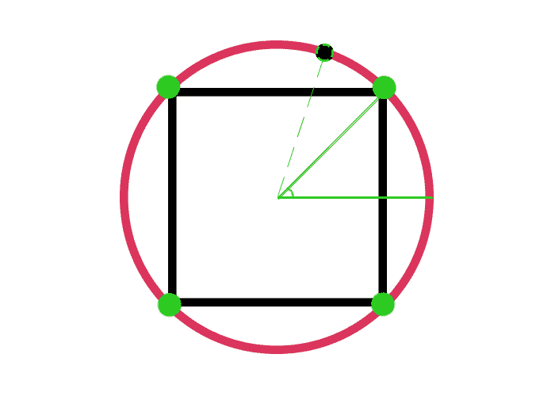
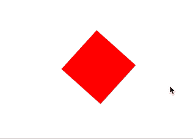

# WebGL 月份。简单动画

> 原文：<https://dev.to/lesnitsky/webgl-month-simple-animation-5hc3>

## 第十三天。简单动画

这是一系列与 WebGL 相关的博文。每天都会有新帖子

[](https://github.com/lesnitsky/webgl-month)
[T6】](https://twitter.com/lesnitsky_a)

[加入邮件列表](http://eepurl.com/gwiSeH),让新邮件直接进入你的收件箱

[此处提供源代码](https://github.com/lesnitsky/webgl-month)

建造于

[](https://github.com/lesnitsky/git-tutor)

嘿👋欢迎来到 WebGL 月。

所有以前的教程都是基于静态图像，让我们添加一些运动！

我们需要一个简单的顶点着色器

📄src/shaders/rotating-square . v . glsl

```
attribute vec2 position;
uniform vec2 resolution;

void main() {
    gl_Position = vec4(position / resolution * 2.0 - 1.0, 0, 1);
} 
```

片段着色器

📄src/shaders/rotating-square . f . glsl

```
precision mediump float;

void main() {
    gl_FragColor = vec4(1, 0, 0, 1);
} 
```

新入口点

📄index.html

```
 </head>
    <body>
      <canvas></canvas>
-     <script src="./dist/texture.js"></script> +     <script src="./dist/rotating-square.js"></script>
    </body>
  </html> 
```

📄src/rotating-square.js

```
import vShaderSource from './shaders/rotating-square.v.glsl';
import fShaderSource from './shaders/rotating-square.f.glsl'; 
```

📄web pack . config . js

```
 entry: {
          'week-1': './src/week-1.js',
          'texture': './src/texture.js',
+         'rotating-square': './src/rotating-square.js',
      },

      output: { 
```

获取 WebGL 上下文

📄src/rotating-square.js

```
 import vShaderSource from './shaders/rotating-square.v.glsl';
  import fShaderSource from './shaders/rotating-square.f.glsl';
+ 
+ const canvas = document.querySelector('canvas');
+ const gl = canvas.getContext('webgl');
+ 
```

全屏显示画布

📄src/rotating-square.js

```
 const canvas = document.querySelector('canvas');
  const gl = canvas.getContext('webgl');

+ const width = document.body.offsetWidth;
+ const height = document.body.offsetHeight;
+ 
+ canvas.width = width * devicePixelRatio;
+ canvas.height = height * devicePixelRatio;
+ 
+ canvas.style.width = `${width}px`;
+ canvas.style.height = `${height}px`; 
```

创建着色器

📄src/rotating-square.js

```
 import vShaderSource from './shaders/rotating-square.v.glsl';
  import fShaderSource from './shaders/rotating-square.f.glsl';
+ import { compileShader } from './gl-helpers'; 
  const canvas = document.querySelector('canvas');
  const gl = canvas.getContext('webgl');

  canvas.style.width = `${width}px`;
  canvas.style.height = `${height}px`;
+ 
+ const vShader = gl.createShader(gl.VERTEX_SHADER);
+ const fShader = gl.createShader(gl.FRAGMENT_SHADER);
+ 
+ compileShader(gl, vShader, vShaderSource);
+ compileShader(gl, fShader, fShaderSource); 
```

创建程序

📄src/rotating-square.js

```
 compileShader(gl, vShader, vShaderSource);
  compileShader(gl, fShader, fShaderSource);
+ 
+ const program = gl.createProgram();
+ 
+ gl.attachShader(program, vShader);
+ gl.attachShader(program, fShader);
+ 
+ gl.linkProgram(program);
+ gl.useProgram(program); 
```

获取属性和统一位置

📄src/rotating-square.js

```
 import vShaderSource from './shaders/rotating-square.v.glsl';
  import fShaderSource from './shaders/rotating-square.f.glsl';
- import { compileShader } from './gl-helpers'; + import { setupShaderInput, compileShader } from './gl-helpers'; 
  const canvas = document.querySelector('canvas');
  const gl = canvas.getContext('webgl');

  gl.linkProgram(program);
  gl.useProgram(program);
+ 
+ const programInfo = setupShaderInput(gl, program, vShaderSource, fShaderSource); 
```

创建顶点以绘制正方形

📄src/rotating-square.js

```
 import vShaderSource from './shaders/rotating-square.v.glsl';
  import fShaderSource from './shaders/rotating-square.f.glsl';
  import { setupShaderInput, compileShader } from './gl-helpers';
+ import { createRect } from './shape-helpers';
+ import { GLBuffer } from './GLBuffer'; 
  const canvas = document.querySelector('canvas');
  const gl = canvas.getContext('webgl');
  gl.useProgram(program);

  const programInfo = setupShaderInput(gl, program, vShaderSource, fShaderSource);
+ 
+ const vertexPositionBuffer = new GLBuffer(gl, gl.ARRAY_BUFFER, new Float32Array([
+     ...createRect(canvas.width / 2 - 100, canvas.height / 2 - 100, 200, 200),
+ ]), gl.STATIC_DRAW); 
```

设置属性指针

📄src/rotating-square.js

```
 const vertexPositionBuffer = new GLBuffer(gl, gl.ARRAY_BUFFER, new Float32Array([
      ...createRect(canvas.width / 2 - 100, canvas.height / 2 - 100, 200, 200),
  ]), gl.STATIC_DRAW);
+ 
+ gl.vertexAttribPointer(programInfo.attributeLocations.position, 2, gl.FLOAT, false, 0, 0); 
```

创建索引缓冲区

📄src/rotating-square.js

```
 ]), gl.STATIC_DRAW);

  gl.vertexAttribPointer(programInfo.attributeLocations.position, 2, gl.FLOAT, false, 0, 0);
+ 
+ const indexBuffer = new GLBuffer(gl, gl.ELEMENT_ARRAY_BUFFER, new Uint8Array([
+     0, 1, 2, 
+     1, 2, 3, 
+ ]), gl.STATIC_DRAW); 
```

过程分辨率和设置视口

📄src/rotating-square.js

```
 0, 1, 2, 
      1, 2, 3, 
  ]), gl.STATIC_DRAW);
+ 
+ gl.uniform2fv(programInfo.uniformLocations.resolution, [canvas.width, canvas.height]);
+ 
+ gl.viewport(0, 0, canvas.width, canvas.height); 
```

并最终发出平局呼叫

📄src/rotating-square.js

```
 gl.uniform2fv(programInfo.uniformLocations.resolution, [canvas.width, canvas.height]);

  gl.viewport(0, 0, canvas.width, canvas.height);
+ gl.drawElements(gl.TRIANGLES, indexBuffer.data.length, gl.UNSIGNED_BYTE, 0); 
```

现在让我们想想如何旋转这个正方形

实际上我们可以放入圆中，每个顶点的位置可以用`radius`、`cos`和`sin`来计算，我们所需要的就是给每个顶点加上一些德尔塔角

[](https://res.cloudinary.com/practicaldev/image/fetch/s--qYhzZr8X--/c_limit%2Cf_auto%2Cfl_progressive%2Cq_auto%2Cw_880/https://git-tutor-assets.s3.eu-west-2.amazonaws.com/rotation.png)

让我们重构我们的 createRect 助手，将角度考虑在内

📄src/rotating-square.js

```
 const programInfo = setupShaderInput(gl, program, vShaderSource, fShaderSource);

  const vertexPositionBuffer = new GLBuffer(gl, gl.ARRAY_BUFFER, new Float32Array([
-     ...createRect(canvas.width / 2 - 100, canvas.height / 2 - 100, 200, 200), +     ...createRect(canvas.width / 2 - 100, canvas.height / 2 - 100, 200, 200, 0),
  ]), gl.STATIC_DRAW);

  gl.vertexAttribPointer(programInfo.attributeLocations.position, 2, gl.FLOAT, false, 0, 0); 
```

📄src/shape-helpers.js

```
- export function createRect(top, left, width, height) { + const Pi_4 = Math.PI / 4;
+ 
+ export function createRect(top, left, width, height, angle = 0) {
+     const centerX = width / 2;
+     const centerY = height / 2;
+ 
+     const diagonalLength = Math.sqrt(centerX ** 2 + centerY ** 2);
+ 
+     const x1 = centerX + diagonalLength * Math.cos(angle + Pi_4);
+     const y1 = centerY + diagonalLength * Math.sin(angle + Pi_4);
+ 
+     const x2 = centerX + diagonalLength * Math.cos(angle + Pi_4 * 3);
+     const y2 = centerY + diagonalLength * Math.sin(angle + Pi_4 * 3);
+ 
+     const x3 = centerX + diagonalLength * Math.cos(angle - Pi_4);
+     const y3 = centerY + diagonalLength * Math.sin(angle - Pi_4);
+ 
+     const x4 = centerX + diagonalLength * Math.cos(angle - Pi_4 * 3);
+     const y4 = centerY + diagonalLength * Math.sin(angle - Pi_4 * 3);
+ 
      return [
-         left, top, // x1 y1
-         left + width, top, // x2 y2
-         left, top + height, // x3 y3
-         left + width, top + height, // x4 y4 +         x1 + left, y1 + top,
+         x2 + left, y2 + top,
+         x3 + left, y3 + top,
+         x4 + left, y4 + top,
      ];
  } 
```

现在我们需要定义初始角度

📄src/rotating-square.js

```
 gl.uniform2fv(programInfo.uniformLocations.resolution, [canvas.width, canvas.height]);

  gl.viewport(0, 0, canvas.width, canvas.height);
- gl.drawElements(gl.TRIANGLES, indexBuffer.data.length, gl.UNSIGNED_BYTE, 0); + 
+ let angle = 0; 
```

和一个将在每一帧被调用的函数

📄src/rotating-square.js

```
 gl.viewport(0, 0, canvas.width, canvas.height);

  let angle = 0;
+ 
+ function frame() {
+     requestAnimationFrame(frame);
+ }
+ 
+ frame(); 
```

每一帧 WebGL 只是遍历顶点数据并渲染它。为了使它呈现不同的 smth，我们需要更新这些数据

📄src/rotating-square.js

```
 let angle = 0;

  function frame() {
+     vertexPositionBuffer.setData(
+         gl, 
+         new Float32Array(
+             createRect(canvas.width / 2 - 100, canvas.height / 2 - 100, 200, 200, angle)
+         ), 
+         gl.STATIC_DRAW,
+     );
+ 
      requestAnimationFrame(frame);
  } 
```

我们还需要更新每帧的旋转角度

📄src/rotating-square.js

```
 gl.STATIC_DRAW,
      );

+     angle += Math.PI / 60;
+ 
      requestAnimationFrame(frame);
  } 
```

并发出平局呼叫

📄src/rotating-square.js

```
 angle += Math.PI / 60;

+     gl.drawElements(gl.TRIANGLES, indexBuffer.data.length, gl.UNSIGNED_BYTE, 0);
      requestAnimationFrame(frame);
  } 
```

酷！我们现在有一个旋转的正方形！🎉

[](https://res.cloudinary.com/practicaldev/image/fetch/s--5eRymp4j--/c_limit%2Cf_auto%2Cfl_progressive%2Cq_66%2Cw_880/https://git-tutor-assets.s3.eu-west-2.amazonaws.com/rotation.gif)

我们刚刚做的可以用[旋转矩阵](https://en.wikipedia.org/wiki/Rotation_matrix)简化

如果你对线性代数不熟练，不要担心，我也是，有一个特殊的软件包😉

📄package.json

```
 "webpack-cli": "^3.3.5"
    },
    "dependencies": {
+     "gl-matrix": "^3.0.0",
      "glsl-extract-sync": "0.0.0"
    }
  } 
```

我们需要定义一个统一的旋转矩阵

📄src/shaders/rotating-square . v . glsl

```
 attribute vec2 position;
  uniform vec2 resolution;

+ uniform mat2 rotationMatrix;
+ 
  void main() {
      gl_Position = vec4(position / resolution * 2.0 - 1.0, 0, 1);
  } 
```

并且增加顶点位置

📄src/shaders/rotating-square . v . glsl

```
 uniform mat2 rotationMatrix;

  void main() {
-     gl_Position = vec4(position / resolution * 2.0 - 1.0, 0, 1); +     gl_Position = vec4((position / resolution * 2.0 - 1.0) * rotationMatrix, 0, 1);
  } 
```

现在我们可以摆脱顶点位置更新

📄src/rotating-square.js

```
 import { setupShaderInput, compileShader } from './gl-helpers';
  import { createRect } from './shape-helpers';
  import { GLBuffer } from './GLBuffer';
+ import { mat2 } from 'gl-matrix'; 
  const canvas = document.querySelector('canvas');
  const gl = canvas.getContext('webgl');

  gl.viewport(0, 0, canvas.width, canvas.height);

- let angle = 0;
+ const rotationMatrix = mat2.create(); 
  function frame() {
-     vertexPositionBuffer.setData(
-         gl, 
-         new Float32Array(
-             createRect(canvas.width / 2 - 100, canvas.height / 2 - 100, 200, 200, angle)
-         ), 
-         gl.STATIC_DRAW,
-     );
- 
-     angle += Math.PI / 60; 
      gl.drawElements(gl.TRIANGLES, indexBuffer.data.length, gl.UNSIGNED_BYTE, 0);
      requestAnimationFrame(frame); 
```

而是使用旋转矩阵

📄src/rotating-square.js

```
 const rotationMatrix = mat2.create();

  function frame() {
+     gl.uniformMatrix2fv(programInfo.uniformLocations.rotationMatrix, false, rotationMatrix);
+ 
+     mat2.rotate(rotationMatrix, rotationMatrix, -Math.PI / 60); 
      gl.drawElements(gl.TRIANGLES, indexBuffer.data.length, gl.UNSIGNED_BYTE, 0);
      requestAnimationFrame(frame); 
```

### 结论

在我们的 shape helper refactor 中，看似复杂的数学，用 matrix math 变得非常简单。GPU 执行矩阵乘法的速度非常快(它在硬件级别上对这种运算进行了特殊优化)，因此可以使用变换矩阵进行许多变换。这是一个非常重要的概念，尤其是在 3d 渲染领域。

今天就到这里，明天见！👋

* * *

这是一系列与 WebGL 相关的博文。每天都会有新帖子

[](https://github.com/lesnitsky/webgl-month)
[T6】](https://twitter.com/lesnitsky_a)

[加入邮件列表](http://eepurl.com/gwiSeH),让新邮件直接进入你的收件箱

[此处提供源代码](https://github.com/lesnitsky/webgl-month)

建造于

[](https://github.com/lesnitsky/git-tutor)