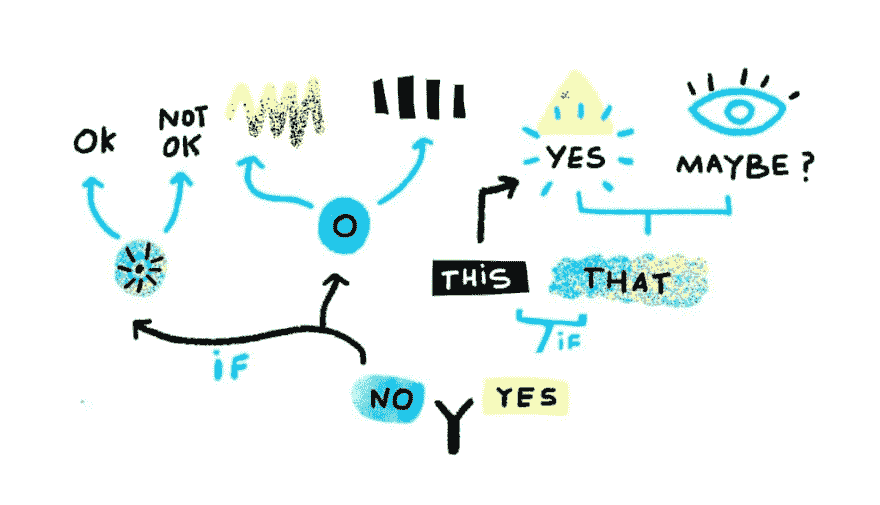
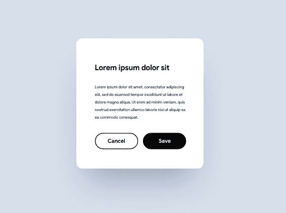
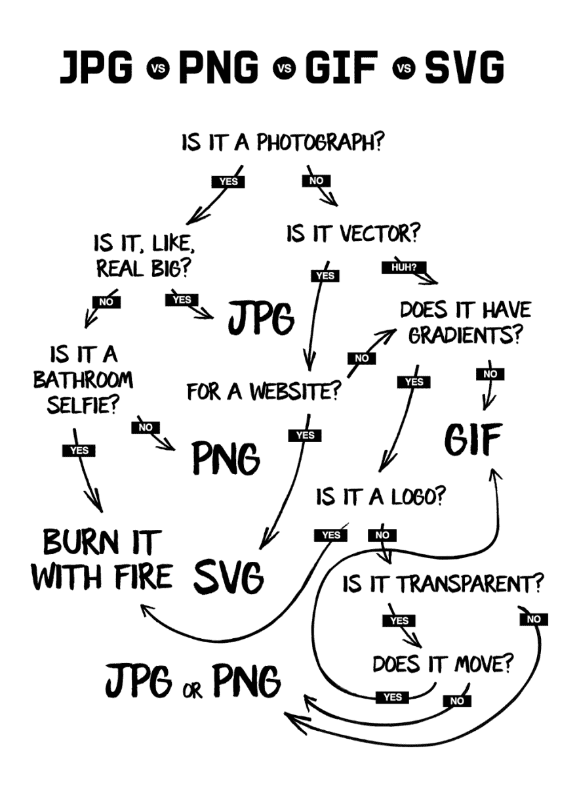

# 谷歌的黑暗模式，框架运动，UX 写作——以及本周更多的 UX 链接

> 原文：<https://dev.to/uxcollective/google-amp-s-dark-patterns-framer-motion-ux-writing-and-more-ux-links-this-week-2e9d>

#### *每周精选的设计链接，由你在 UX 集体的朋友带给你。*

[**老实说，看情况**](https://dev.to/fabriciot/honestly-it-depends-1hca-temp-slug-3308433) →

没有设计变更是不可能完成的。但是每一个设计上的改变都意味着对产品的其他部分、品牌认知和体验 KPI 的涓滴影响。

*   [**亲爱的谷歌**](https://bradleytaunt.com/stop-crawling-google/) →我阻止你进入我的网站——彻底分析谷歌 AMP 的黑暗模式。
*   [**混沌设计**](http://mrmrs.cc/writing/chaos-design/) →在机器人抢走我们的工作之前，我们能不能请它们帮我们做点好事？
*   [**反应灵敏的路线图**](https://matthewstrom.com/writing/responsive-roadmaps) →现实的地图不是现实。即使最好的地图也是不完美的。

### 来自社区的故事

[**复杂的用户体验**](https://uxdesign.cc/complex-user-experiences-9a8ca46d4b36) →

复杂很难定义，但我们看到它就能认出来。

[**交互设计及其 5 个维度**](https://uxdesign.cc/interaction-design-and-its-dimensions-39ca7e1d09f0) →

为什么动画只是设计 5 个维度中的 1 个。

[**构建设计系统:排版**](https://uxdesign.cc/building-a-design-system-where-to-start-part-4-typography-5065b8d360c) →

一个稳固的设计系统的积木之一。

### 引人深思

*   [**经验策略需要斜**](https://uxdesign.cc/experience-strategy-needs-to-be-oblique-b37a2c54faba) →
*   **→**
***   [**为什么客户支持是 UX 的工作**](https://uxdesign.cc/customer-support-is-a-ux-job-d179a3b8946) →**

 **### 新闻&观点

*   [**STEM 榜样**](https://medium.com/nevertheless-podcast/stem-role-models-posters-2404424b37dd) →科学界令人惊艳的女性榜样海报。
*   [**网飞常去的地方**](https://netflixhangouts.com/) →在无人察觉的情况下观察网飞的工作。
*   [**insta gram+AI**](https://www.technologyreview.com/f/613930/instagram-is-using-ai-to-stop-people-posting-abusive-comments/)→insta gram 使用 AI 阻止辱骂性评论。
*   [**DYI 社交**](https://runyourown.social/) →如何为你的朋友经营一个社交网站。

[**徐志摩**](https://uxdesign.cc/jpg-vs-png-vs-gif-vs-svg-aefeca89f61) →

### 工具&资源

*   [**成帧器动作**](https://www.framer.com/blog/posts/introducing-framer-motion/)→React 的生产就绪动作库。
*   [**塑造**](https://basecamp.com/shapeup)→base camp 的制作者免费赠送的书。
*   **→免费野兽派画板，跳上潮流。**
***   [**口袋偏见**](https://pocket-biases.glideapp.io/) →口袋里的每一个认知偏见。**

 *** * *****