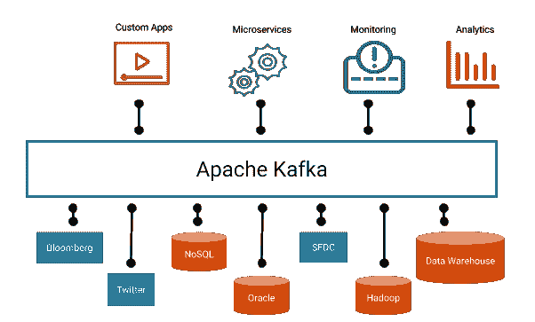
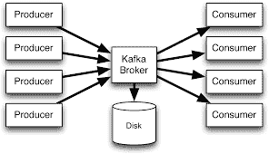

# 阿帕奇卡夫卡术语

> 原文：<https://dev.to/anji4246/apache-kafka-terminology-449f>

<figure> 

<figcaption>阿帕奇卡夫卡</figcaption>

</figure>

### 阿帕奇卡夫卡基础

Apache Kafka 是一个分布式消息传递系统，通过发布-订阅(pub-sub)模式提供快速、持久、高度可伸缩和容错的消息传递。Kafka 具有更高的吞吐量、可靠性和复制特性。它专为大数据应用、实时数据管道和流媒体应用而打造。

Apache **Kafka** 最初由 LinkedIn 开发，随后于 2011 年初开源。2014 年 11 月，几名在领英从事**卡夫卡**工作的工程师创建了一家名为 Confluent 的新公司，专注于**卡夫卡**。

卡夫卡作为一个分布式系统运行在一个集群中(一组相似的事物或人紧密地放置或发生在一起)。集群中的每个节点被称为一个 Kafka *代理*。

卡夫卡的基本架构是围绕几个关键术语组织的:主题、生产者、消费者和经纪人。

### 卡夫卡术语

**卡夫卡经纪人**

Kafka 在集群中作为分布式系统运行。群集中有一个或多个服务器可用。集群中的每个节点称为一个 Kafka 代理。

当数据到达时，代理负责接收和存储数据。代理还在请求时提供数据。

Kafka broker 更确切地说是一个消息代理，它负责协调不同计算机系统之间的对话，保证将消息传递给正确的一方。

**卡夫卡主题**

主题代表属于一个组/类别的消息的逻辑集合。生产者发送的数据存储在主题中。消费者订阅他们感兴趣的特定主题。一个主题可以有零个或多个消费者。

简而言之，主题是记录发布到的类别或提要名称。

**卡夫卡消息**
T3】在卡夫卡那里，消息代表了数据的基本单位。每条消息都表示为一条记录，由两部分组成:键和值。不管数据类型如何，Kafka 总是将消息转换成字节数组。

许多其他消息传递系统也有办法在消息中携带其他信息。Kafka 0.11 为此引入了记录头。

**分区**

主题分为一个(默认为一个)或多个分区。一个分区位于一个物理节点上，并保存它接收到的消息。一个分区可以复制到主/从关系中的其他节点上。给定分区只有一个*【领导者】*节点接受所有读写操作，如果出现故障，将选择一个新的领导者。其他节点只是复制来自*【leader】*的消息，以确保容错。

Kafka 确保分区内的严格排序，即消费者将按照生产者发布数据的顺序收到数据。

**Kafka 生产者**

生产者是向 Kafka 主题发布消息流的实体。生成器可以发布到一个或多个主题，并且可以选择存储数据的分区。

Kafka 自带用 Java 编写的 producer，但是还有很多其他的 Kafka 客户端库支持 C/C++、Go、Python、REST 等等。

**卡夫卡消费者**

消费者是接收数据的订阅者或读者。Kafka 消费者是有状态的，这意味着他们负责记住光标位置，这被称为偏移量。

**卡夫卡消费群**
T3】消费群是执行一项任务的一群相关的消费者。

每个消费群体必须有一个唯一的 id。每个消费者群体都是一个或多个 Kafka 主题的订户。每个消费者组维护其每个主题分区的偏移量。

**Kafka 生产者**

生产者是消费/读取来自 Kafka 主题的消息并处理消息馈送的实体。消费者可以从一个或多个主题或分区进行消费。

**卡夫卡偏移量**

偏移量是要发送给消费者的下一条消息在分区内的位置。Offset 用于唯一标识分区内的每条记录。

**卡夫卡消费滞后**

卡夫卡消费者滞后是卡夫卡生产者和消费者之间有多少滞后的指标。

在 Kafka 中，数据存储在一个或多个主题中。每个主题由一个或多个分区组成。当写入数据时，代理实际上将数据写入特定的分区。在写入数据时，它会跟踪每个分区中的最后一个“写入位置”。这称为最新偏移。每个分区都有自己独立的最新偏移量。

就像代理跟踪它们在每个分区中的写位置一样，每个消费者跟踪它正在消费其数据的每个分区中的“读位置”。这就是所谓的消费者补偿。这种消费者补偿被周期性地持久化(对 ZooKeeper 或 Kafka 本身的一个特殊主题),因此它可以经受住消费者崩溃或不干净的关机，并避免重新消耗太多的旧数据。

消费者补偿和最新补偿之间的差异被称为**滞后**

*原载于 2019 年 7 月 13 日*[*【http://techmonks.org】*](http://techmonks.org/kafka-terminology/)*。*

* * *