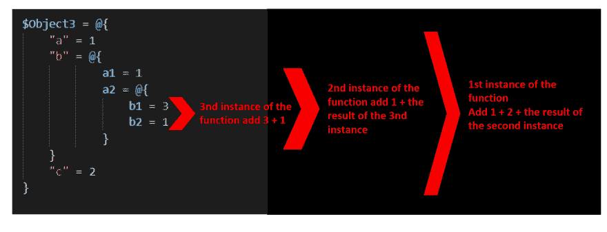

# PowerShell 中的递归

> 原文：<https://dev.to/omiossec/recursion-in-powershell-2b85>

在 PowerShell 中处理复杂的数据集似乎很困难。这些数据集具有不可预测的结构，不容易解析。这种情况下，当您需要提取一个活动目录组的所有成员，其中成员可以是用户，也可以是包含用户和组的组。来自 web 服务和 API 的数据也是如此。

如何在 PowerShell 中处理这些没有固定结构的数据集？

如果你认为 PowerShell 脚本是一系列连续指令，那就很难了。为了解决这个问题，您必须应用一种叫做递归的编程设计模式。

简而言之，递归是一个调用自身的函数。毕竟，当函数定义被加载到内存中时，它在任何地方都是可用的，包括在函数内部。

让我们举一个简短的例子。

```
$object1  =  @{  "a"  =  1  "b"  =4  "c"  =  2  } 
```

<svg width="20px" height="20px" viewBox="0 0 24 24" class="highlight-action crayons-icon highlight-action--fullscreen-on"><title>Enter fullscreen mode</title></svg> <svg width="20px" height="20px" viewBox="0 0 24 24" class="highlight-action crayons-icon highlight-action--fullscreen-off"><title>Exit fullscreen mode</title></svg>

这很简单，如果我想把这里所有的值加起来，我要做的就是枚举这些值，就像这样

```
$a  =  0  ForEach($item  in  $Object1.GetEnumerator())  {  $a  +=  $item.value  }  $a 
```

<svg width="20px" height="20px" viewBox="0 0 24 24" class="highlight-action crayons-icon highlight-action--fullscreen-on"><title>Enter fullscreen mode</title></svg> <svg width="20px" height="20px" viewBox="0 0 24 24" class="highlight-action crayons-icon highlight-action--fullscreen-off"><title>Exit fullscreen mode</title></svg>

我们可以从创建一个函数来处理数据集
开始

```
Function  add-ObjectValue  {  [CmdletBinding()]  Param(  [Parameter(Mandatory,  ValueFromPipeline)]  [ValidateNotNullOrEmpty()]  [object]  $Object  )  $count  =  0  ForEach($item  in  $Object.GetEnumerator())  {  $count  +=  $item.value  }  return  $count  }  $object1  |  add-ObjectValue 
```

<svg width="20px" height="20px" viewBox="0 0 24 24" class="highlight-action crayons-icon highlight-action--fullscreen-on"><title>Enter fullscreen mode</title></svg> <svg width="20px" height="20px" viewBox="0 0 24 24" class="highlight-action crayons-icon highlight-action--fullscreen-off"><title>Exit fullscreen mode</title></svg>

它将返回 7

但是，如果数据集中发生了变化，会发生什么呢？

```
$Object2  =  @{  "a"  =  1  "b"  =  @{  a1  =  1  a2  =  3  }  "c"  =  2  } 
```

<svg width="20px" height="20px" viewBox="0 0 24 24" class="highlight-action crayons-icon highlight-action--fullscreen-on"><title>Enter fullscreen mode</title></svg> <svg width="20px" height="20px" viewBox="0 0 24 24" class="highlight-action crayons-icon highlight-action--fullscreen-off"><title>Exit fullscreen mode</title></svg>

```
$object2  |  add-ObjectValue 
```

<svg width="20px" height="20px" viewBox="0 0 24 24" class="highlight-action crayons-icon highlight-action--fullscreen-on"><title>Enter fullscreen mode</title></svg> <svg width="20px" height="20px" viewBox="0 0 24 24" class="highlight-action crayons-icon highlight-action--fullscreen-off"><title>Exit fullscreen mode</title></svg>

我们得到一个错误

```
Method  invocation  failed  because  [System.Collections.Hashtable]  does  not  contain  a  method  named  'op_Addition'.  +  $count  +=  $item.value  +  ~~~~~~~~~~~~~~~~~~~~~  +  CategoryInfo  :  InvalidOperation:  (op_Addition:String)  [],  RuntimeException 
```

<svg width="20px" height="20px" viewBox="0 0 24 24" class="highlight-action crayons-icon highlight-action--fullscreen-on"><title>Enter fullscreen mode</title></svg> <svg width="20px" height="20px" viewBox="0 0 24 24" class="highlight-action crayons-icon highlight-action--fullscreen-off"><title>Exit fullscreen mode</title></svg>

不能将整数添加到另一个对象类型中。

让我们试试别的东西

```
Function  add-ObjectValue  {  [CmdletBinding()]  Param(  [Parameter(Mandatory,  ValueFromPipeline)]  [ValidateNotNullOrEmpty()]  [object]  $Object  )  if  ($Object.getType().Name  -eq  "Hashtable")  {  $count  =  0  ForEach($item  in  $Object.GetEnumerator())  {  $count  +=  $item.value  }  return  $count  }  } 
```

<svg width="20px" height="20px" viewBox="0 0 24 24" class="highlight-action crayons-icon highlight-action--fullscreen-on"><title>Enter fullscreen mode</title></svg> <svg width="20px" height="20px" viewBox="0 0 24 24" class="highlight-action crayons-icon highlight-action--fullscreen-off"><title>Exit fullscreen mode</title></svg>

现在没有更多的错误，但它没有把所有的数字相加。这是在函数中引入递归的时刻。

基本上，递归是一个函数调用自己。该函数的目标是将哈希表中的数字相加。对于数据集中的每个散列表基金，我们需要返回其数字的总和。

```
Function  add-ObjectValue  {  [CmdletBinding()]  Param(  [Parameter(Mandatory,  ValueFromPipeline)]  [ValidateNotNullOrEmpty()]  [object]  $Object  )  if  ($Object.getType().Name  -eq  "Hashtable")  {  $count  =  0  ForEach($item  in  $Object.GetEnumerator())  {  if  ($item.value.getType().Name  -eq  "int32")  {  $count  +=  $item.value  }  elseif  ($item.value.getType().Name  -eq  "Hashtable")  {  $count  +=  add-ObjectValue  -Object  $item.value  }  }  return  $count  }  } 
```

<svg width="20px" height="20px" viewBox="0 0 24 24" class="highlight-action crayons-icon highlight-action--fullscreen-on"><title>Enter fullscreen mode</title></svg> <svg width="20px" height="20px" viewBox="0 0 24 24" class="highlight-action crayons-icon highlight-action--fullscreen-off"><title>Exit fullscreen mode</title></svg>

如果找到的值是一个哈希表，该函数将调用自身对哈希表数字求和并返回一个整数。如果同一个哈希表包含另一个哈希表，函数也会调用自己返回一个整数。

换句话说，每个哈希表都将创建它的函数实例，将哈希表转换为 sum。

它可以处理复杂得多的数据集

```
$Object4  =  @{  "a"  =  1  "b"  =  @{  a1  =  1  a2  =  @{  b1  =  3  b2  =  @{  c1  =  3  c2  =  @{  d1=5  }  }  }  }  "c"  =  @{  d1  =  1  d2  =  @{  e1  =  1  e2  =  @{  f1  =1  f2  =  @{  g1=1  g2  =  @{  h1  =  1  h2  =  @{  i1  =  1  i2  =  1  }  }  }  }  }  }  }  $object4  |  add-ObjectValue  20 
```

<svg width="20px" height="20px" viewBox="0 0 24 24" class="highlight-action crayons-icon highlight-action--fullscreen-on"><title>Enter fullscreen mode</title></svg> <svg width="20px" height="20px" viewBox="0 0 24 24" class="highlight-action crayons-icon highlight-action--fullscreen-off"><title>Exit fullscreen mode</title></svg>

简单来说，每当递归找到一个哈希表并返回一个整数时，它都会创建一个函数实例。

[](https://res.cloudinary.com/practicaldev/image/fetch/s--0dv1XsjR--/c_limit%2Cf_auto%2Cfl_progressive%2Cq_auto%2Cw_880/https://thepracticaldev.s3.amazonaws.com/i/lr4x1v7b6yg8eqqry3k2.PNG)

递归很容易实现。对于一个非程序员来说，困难的部分是理解这个概念，并认识到何时需要使用它。

递归非常适合处理树形结构中的层次结构。您可以在活动目录中的组成员、虚拟机表示、网络分段等对象中找到它

它们都有一个共同的模式；对象之间嵌套的一对多关系。

使用递归可以节省您的时间，并且是处理这种数据集的最优雅的解决方案。