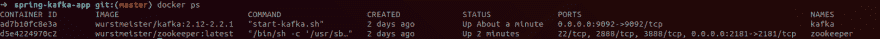
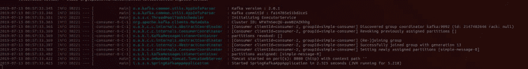
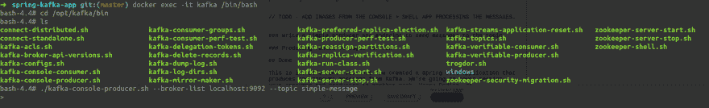
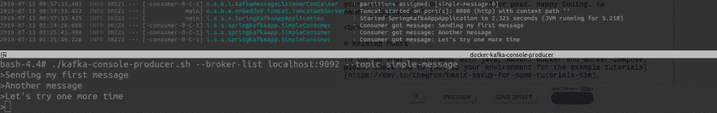
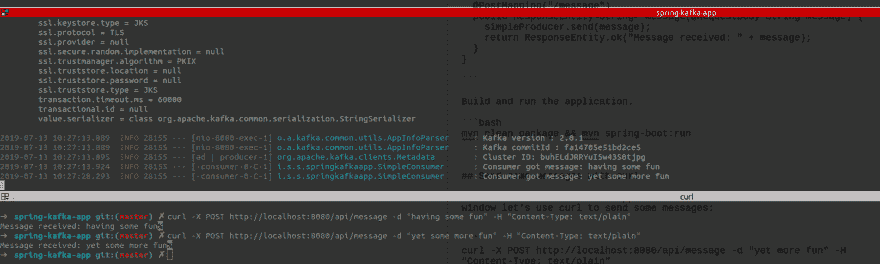

# 最简单的春天卡夫卡生产者和消费者

> 原文：<https://dev.to/thegroo/spring-kafka-producer-and-consumer-41oc>

现在让我们构建并运行一个简单的例子，一个 Kafka 消费者，然后一个 Kafka 生产者使用 spring-kafka。如果您需要本文中使用的 Kafka、spring boot 或 docker 的帮助，或者想要查看本文中的示例应用程序，请查看下面的[参考资料](#references)部分。

第一步是创建一个简单的 [Spring Boot maven 应用程序](https://dev.to/thegroo/spring-boot-crash-course-21nm)，并确保对 pom.xml
具有 spring-kafka 依赖性

```
<dependency>
  <groupId>org.springframework.kafka</groupId>
  <artifactId>spring-kafka</artifactId>
</dependency> 
```

<svg width="20px" height="20px" viewBox="0 0 24 24" class="highlight-action crayons-icon highlight-action--fullscreen-on"><title>Enter fullscreen mode</title></svg> <svg width="20px" height="20px" viewBox="0 0 24 24" class="highlight-action crayons-icon highlight-action--fullscreen-off"><title>Exit fullscreen mode</title></svg>

### 创造春天的卡夫卡消费

现在让我们用 spring-kafka 编写一个最简单的 Kafka 消费者，使用 spring-boot 默认配置。

创建一个名为`SimpleConsumer`的类，并添加一个带有`@KakfaListener`注释的方法。

```
package io.stockgeeks.springkafka.springkafkaapp;

import org.springframework.kafka.annotation.KafkaListener;
import org.springframework.stereotype.Service;

@Service
public class SimpleConsumer {
  @KafkaListener(id = "simple-consumer", topics = "simple-message")
  public void consumeMessage(String message) {
    System.out.println("Got message: " + message);
  }
} 
```

<svg width="20px" height="20px" viewBox="0 0 24 24" class="highlight-action crayons-icon highlight-action--fullscreen-on"><title>Enter fullscreen mode</title></svg> <svg width="20px" height="20px" viewBox="0 0 24 24" class="highlight-action crayons-icon highlight-action--fullscreen-off"><title>Exit fullscreen mode</title></svg>

这是它，这是所有需要的，因为我们依赖于弹簧启动默认配置。

### 启动卡夫卡和动物园管理员

正如我们在另一篇文章的[中看到的细节，我们将使用 docker-compose 运行我们的本地 Kafka 进行开发，让我们启动我们的 Kafka 和 Zookeeper 容器:](https://dev.to/thegroo/one-to-run-them-all-1mg6) 

```
docker-compose up -d 
```

<svg width="20px" height="20px" viewBox="0 0 24 24" class="highlight-action crayons-icon highlight-action--fullscreen-on"><title>Enter fullscreen mode</title></svg> <svg width="20px" height="20px" viewBox="0 0 24 24" class="highlight-action crayons-icon highlight-action--fullscreen-off"><title>Exit fullscreen mode</title></svg>

确保容器正在运行:

```
docker ps 
```

<svg width="20px" height="20px" viewBox="0 0 24 24" class="highlight-action crayons-icon highlight-action--fullscreen-on"><title>Enter fullscreen mode</title></svg> <svg width="20px" height="20px" viewBox="0 0 24 24" class="highlight-action crayons-icon highlight-action--fullscreen-off"><title>Exit fullscreen mode</title></svg>

你应该看看卡夫卡和动物园管理员在跑:

[](https://res.cloudinary.com/practicaldev/image/fetch/s--5cxfidl---/c_limit%2Cf_auto%2Cfl_progressive%2Cq_auto%2Cw_880/https://thepracticaldev.s3.amazonaws.com/i/n4imhs85mag9fwmc7ieg.png)

### 运行 app

现在让我们编译并运行应用程序，如果您需要更详细的说明请查看[这篇文章](https://dev.to/thegroo/spring-boot-crash-course-21nm)，运行以下命令来构建并运行应用程序:

```
mvn clean package 
```

<svg width="20px" height="20px" viewBox="0 0 24 24" class="highlight-action crayons-icon highlight-action--fullscreen-on"><title>Enter fullscreen mode</title></svg> <svg width="20px" height="20px" viewBox="0 0 24 24" class="highlight-action crayons-icon highlight-action--fullscreen-off"><title>Exit fullscreen mode</title></svg>

让我们运行它:

```
mvn spring-boot:run 
```

<svg width="20px" height="20px" viewBox="0 0 24 24" class="highlight-action crayons-icon highlight-action--fullscreen-on"><title>Enter fullscreen mode</title></svg> <svg width="20px" height="20px" viewBox="0 0 24 24" class="highlight-action crayons-icon highlight-action--fullscreen-off"><title>Exit fullscreen mode</title></svg>

应用程序将启动，您将在标准输出上看到消费者的配置、正在使用的 Kafka 版本和一条消息`Started SpringKafkaApplication in x seconds`。

[](https://res.cloudinary.com/practicaldev/image/fetch/s--EMfsAVgu--/c_limit%2Cf_auto%2Cfl_progressive%2Cq_auto%2Cw_880/https://thepracticaldev.s3.amazonaws.com/i/befpvuucezpd6la8hlvd.png)

确保应用程序保持运行，不要关闭它正在运行的终端窗口。现在让我们用 Kafka 控制台生成器生成几条消息，并查看我们的消费者处理消息并注销它们。

### 使用 Kafka 控制台生成器生成消息

打开一个新的终端，进入 Kafka 运行容器，这样我们就可以使用控制台生成器:

```
docker exec -it kafka /bin/bash 
```

<svg width="20px" height="20px" viewBox="0 0 24 24" class="highlight-action crayons-icon highlight-action--fullscreen-on"><title>Enter fullscreen mode</title></svg> <svg width="20px" height="20px" viewBox="0 0 24 24" class="highlight-action crayons-icon highlight-action--fullscreen-off"><title>Exit fullscreen mode</title></svg>

一旦进入容器`cd /opt/kafka/bin`，我们使用的这个特定图像中 Kafka 的命令行脚本就位于这个文件夹中。如果您使用不同的 docker 映像，这些脚本可能在其他位置。

运行控制台生成器，这将使您能够向 Kafka 发送消息:

```
./kafka-console-producer.sh --broker-list localhost:9092 --topic simple-message 
```

<svg width="20px" height="20px" viewBox="0 0 24 24" class="highlight-action crayons-icon highlight-action--fullscreen-on"><title>Enter fullscreen mode</title></svg> <svg width="20px" height="20px" viewBox="0 0 24 24" class="highlight-action crayons-icon highlight-action--fullscreen-off"><title>Exit fullscreen mode</title></svg>

[](https://res.cloudinary.com/practicaldev/image/fetch/s--d9qxjKsx--/c_limit%2Cf_auto%2Cfl_progressive%2Cq_auto%2Cw_880/https://thepracticaldev.s3.amazonaws.com/i/qeg8lzfxbdg65e4r3dg3.png)

控制台现在将阻塞，您可以编写您的消息并按回车键，每次您这样做时，都会向`simple-topic`产生一条消息。尝试发送几条消息，并在 shell 中观察应用程序的标准输出，在 shell 中运行 Spring Boot 应用程序来处理消息并打印它们。

[](https://res.cloudinary.com/practicaldev/image/fetch/s--6eRbT4YU--/c_limit%2Cf_auto%2Cfl_progressive%2Cq_auto%2Cw_880/https://thepracticaldev.s3.amazonaws.com/i/4na7ngkvae1m3nwr4lgg.png)

### 写一个简单的生产者

是时候创造我们的春天了。创建一个名为`SimpleProducer`的类，我们将再次为生产者使用默认值，就像我们为消费者所做的那样。

```
package io.stockgeeks.springkafka.springkafkaapp;

import org.springframework.kafka.core.KafkaTemplate;
import org.springframework.stereotype.Service;

@Service
public class SimpleProducer {

  private KafkaTemplate<String, String> simpleProducer;

  public SimpleProducer(KafkaTemplate<String, String> simpleProducer) {
    this.simpleProducer = simpleProducer;
  }
  public void send(String message) {
    simpleProducer.send("simple-message", message);
  }
} 
```

<svg width="20px" height="20px" viewBox="0 0 24 24" class="highlight-action crayons-icon highlight-action--fullscreen-on"><title>Enter fullscreen mode</title></svg> <svg width="20px" height="20px" viewBox="0 0 24 24" class="highlight-action crayons-icon highlight-action--fullscreen-off"><title>Exit fullscreen mode</title></svg>

### 写一个端点

现在让我们创建一个简单的端点，它将接收一条文本消息并将其发布到 Kafka，我们现在总是返回 200 OK。

```
package io.stockgeeks.springkafka.springkafkaapp;

import org.springframework.http.ResponseEntity;
import org.springframework.web.bind.annotation.PostMapping;
import org.springframework.web.bind.annotation.RequestBody;
import org.springframework.web.bind.annotation.RequestMapping;
import org.springframework.web.bind.annotation.RestController;

@RestController
@RequestMapping("/api")
public class MessageApi {

  private final SimpleProducer simpleProducer;

  public MessageApi(SimpleProducer simpleProducer) {
    this.simpleProducer = simpleProducer;
  }

  @PostMapping("/message")
  public ResponseEntity<String> message(@RequestBody String message) {
    simpleProducer.send(message);
    return ResponseEntity.ok("Message received: " + message);
  }
} 
```

<svg width="20px" height="20px" viewBox="0 0 24 24" class="highlight-action crayons-icon highlight-action--fullscreen-on"><title>Enter fullscreen mode</title></svg> <svg width="20px" height="20px" viewBox="0 0 24 24" class="highlight-action crayons-icon highlight-action--fullscreen-off"><title>Exit fullscreen mode</title></svg>

构建并运行应用程序。

```
mvn clean package && mvn spring-boot:run 
```

<svg width="20px" height="20px" viewBox="0 0 24 24" class="highlight-action crayons-icon highlight-action--fullscreen-on"><title>Enter fullscreen mode</title></svg> <svg width="20px" height="20px" viewBox="0 0 24 24" class="highlight-action crayons-icon highlight-action--fullscreen-off"><title>Exit fullscreen mode</title></svg>

> 现在，在开发机器上运行应用程序时，您很有可能会出错，这是因为您的应用程序运行在正常的主机网络中，而 Kafka 和 zookeeper 运行在“docker 网络”中。
> 
> 有一些方法可以解决这个问题，最好的方法是在启动容器时将您的开发机器主机名传递给 docker-compose。如果您从这个项目打开 docker-compose 文件，它在`KAFKA_ADVERTISED_LISTENERS: ... LISTENER_DOCKER_EXTERNAL`处有一个条目，就像`${DOCKER_HOST_IP:-kafka}:9092`一样。这告诉 compose 尝试使用默认情况下传递的主机名或 Kafka，检查 compose 文件中的注释以了解如何修复它，并检查下面的参考资料部分以了解更多详细信息。

## 用 curl 发送一些消息

现在，确保观察应用程序终端，在另一个终端窗口中，让我们使用 curl 发送一些消息:

```
curl -X POST http://localhost:8080/api/message -d "yet more fun" -H "Content-Type: text/plain" 
```

<svg width="20px" height="20px" viewBox="0 0 24 24" class="highlight-action crayons-icon highlight-action--fullscreen-on"><title>Enter fullscreen mode</title></svg> <svg width="20px" height="20px" viewBox="0 0 24 24" class="highlight-action crayons-icon highlight-action--fullscreen-off"><title>Exit fullscreen mode</title></svg>

您应该在执行 curl 的同一个终端上看到响应，还要检查消费者处理消息并将其打印到运行应用程序的终端上。

[](https://res.cloudinary.com/practicaldev/image/fetch/s--pDZKQdLb--/c_limit%2Cf_auto%2Cfl_progressive%2Cq_auto%2Cw_880/https://thepracticaldev.s3.amazonaws.com/i/6g06gzs7x0ynapj35vki.png)

## 搞定

就这样，结束了。现在，您已经创建了最简单的 Spring Boot 应用程序，它可以生成和使用来自 Kafka 的消息。它看起来如此简单的原因是我们依赖于 Spring Boot 和 spring-kafka 的默认配置。

如果你想知道更多关于 Spring Boot 或卡夫卡是如何工作的，请看看下节课的链接，在那里你会找到一些更详细的参考资料。

我们将在另一篇文章中测试你的消费者和生产者。快乐编码。

# 参考文献

[本文中创建的应用程序的源代码](https://github.com/stockgeeks/spring-kafka-app)。

要使用 java、maven、docker 和 docker-compose 设置您的环境，请查看示例教程中的[如何设置您的环境。](https://dev.to/thegroo/basic-setup-for-some-tutorials-51m)

如果你需要一些关于卡夫卡的快速介绍:[卡夫卡速成班](https://dev.to/thegroo/kafka-crash-course-7j7)

关于如何使用 docker-compose 进行本地开发的一些见解，请查看这篇文章: [One to run them all](https://dev.to/thegroo/one-to-run-them-all-1mg6) 在这里您还将学习一些有用的 Kafka 命令。

如果你刚到 Spring Boot，请看看 [Spring Boot 速成班](https://dev.to/thegroo/spring-boot-crash-course-21nm)

[Docker 编写环境变量](https://docs.docker.com/compose/environment-variables/)来理解 Kafka 广告监听器的配置。