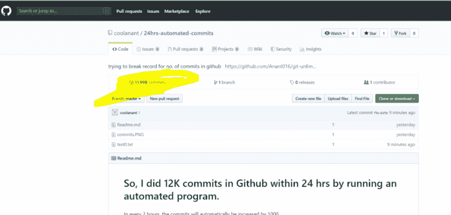
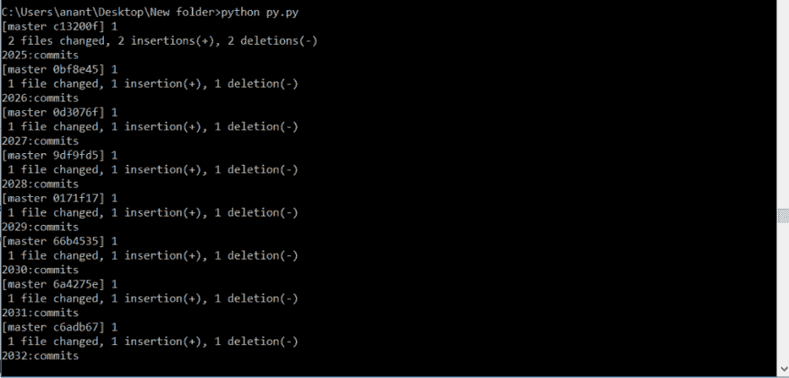

# 我如何在 24 小时内在 Github 中提交 12K

> 原文：<https://dev.to/anu27580168/how-i-did-12k-commits-in-github-within-24-hrs-36jj>

### 我如何在 24 小时内在 Github 中完成 12K 次提交— Python 自动化

### 因此，我通过运行一个自动化的 python 程序，在 24 小时内在 Github 中完成了 12K 次提交。

我不会说这是一个非常有用的工具，但它更有用！！！！！玩的东西，找点乐子，去其他的——哇啊啊啊啊啊

警告:这些不是实际的贡献--这是一个黑客，玩得开心。:P

> 查看我的作品——
> 
> 每隔 2 小时，提交将自动增加 1000。
> 
> 看我的作品。给⭐️👏

[冷却剂/24 小时自动提交](https://github.com/coolanant/24hrs-automated-commits)

请点击链接了解更多详情。

> 或者直接使用—

[git-无限提交](https://www.npmjs.com/package/git-unlimited-commit)

* * *