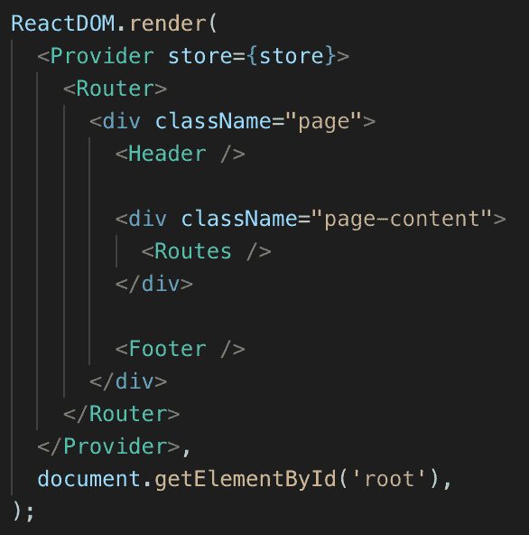
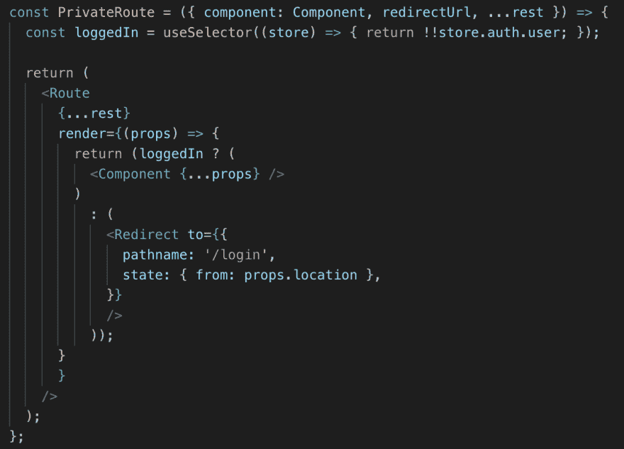

# 角度 vs 反应 132 小时

> 原文：<https://dev.to/taesup/angular-vs-react-in-132-hours-2i9g>

这是另一篇 Angular vs React 比较的博客文章，但是我认为我有一点独特的观点，因为我曾经是 Angular 的开发人员，从 AngularJS 一直到 Angular 7 已经有 6 年了。然而最近几年，我发现自己更经常地使用 React。

关于我的一些背景，我是一个全栈开发人员，在最终找到 AngularJS 之前，我从 jQuery 时代就开始构建 web 应用程序。从那以后，我从事了相当多的 Angular 项目，并对 Angular 有了相当深入的了解。近年来，我有一个中等规模的 React 项目，是一个浏览器扩展。不是一个成熟的 SPA 应用程序，但非常相似。

我还是当地一个名为 DevLeague 的训练营的首席 Web 开发讲师和课程设计师。在 DevLeague，我们教授 Angular 2+和 React，在我们的训练营结束时，我们有一个“期末”项目，学生有两周的时间使用 Angular 或 React 构建一个 web 应用程序。我们的训练营是全职的，一周 6 天，一天 11 小时。因此，构建一个 web 应用程序大约需要一周 66 个小时或者总共 132 个“工作”小时。十有八九，学生们选择 React 是因为它简单易懂，易于使用。

我最近在工作之余有一点空闲时间，所以我决定给自己一个和给学生一样的挑战。用 Angular 构建 web 应用程序很多次了，我想看看用 React 构建同样大小的东西会是什么样子。

这个实验的结果是[收缩.岩石](https://contracting.rocks)。一个工作列表网站，雇主可以在此发布合同工作，承包商可以在此挑选他们感兴趣的工作。他们可以选择全职工作，或者只是找一份偏远的兼职来帮助充实他们的银行账户。这个想法的灵感来自于几份合同工作，当时我也在 [remoteok.io](https://remoteok.io) 找新工作。

在接下来的段落中，我记录了从 Angular 跳到 React 时真正突出的点点滴滴。TLDR:除了一个真正的例外，我可以使用任何一个。

### 表单验证

在我的经历中，最突出的一点是处理表单。Angular 最初是为了更容易地使用表单而构建的，这在他们的文档和两种构建表单的方法中有明显的体现，即模板驱动表单和反应式表单。模板驱动表单是 AngularJS 的延续，其中表单更加静态，验证直接附加到 HTML 元素，而反应式表单更加动态，并由数据模型支持。两者的表单验证也相当广泛，这是我在 React 中构建表单时错过了很多的东西。基本上，每个 HTML 输入都用几个布尔函数扩展，这些布尔函数告诉用户输入是否被用户操作过、从未被用户接触过，以及许多其他有用的输入“状态”

另一方面，React 由于试图接近 HTML5 标准，几乎不支持浏览器已经提供的验证。这意味着对于一个复杂的表单，有些字段是必需的，其他字段依赖于前面的字段，等等；我不得不在 React 内部重新创造出许多有棱角的魔法。

一个有趣的消息是，尽管人们不喜欢 Angular 提供的“双向数据绑定”,但我认为它会减少或取代许多需要用 React 声明的函数。最后，我为所有要附加的输入创建了一个一站式处理函数。这个处理函数将接受新值和一个“name”属性，该属性允许处理函数根据“name”正确地更新 formData 状态

就验证而言，我使用相同的模式创建了一个一站式验证函数，该函数使用略有不同的签名来根据输入本身的要求验证任何输入:required、dependant、toggle 等。

另一个有趣的注意事项是，我构建表单是为了将所有数据保存到 localStorage，这样，如果用户偶然导航离开或者只是决定以后再回到表单，内容仍然会在那里，并且会自动填充正确的字段。与 Angular 相比，这在 React 中实际上要容易得多。考虑到一站式处理函数，在我更新状态时，很容易将任何输入更改保存到 localStorage。

我遇到的问题是试图找出如何在页面加载的所有输入中触发验证函数，以向用户显示任何没有正确填写的输入。最初，我认为将保存的 from 数据加载到 input 元素中的 onChange 会触发附加到每个 input 元素的验证函数。但这并没有发生，所以我需要想另一种方法。然后，我尝试使用 useRef 聚焦所有输入，并立即模糊它们，但这将导致所有输入在同一时间触发，从而只将最后一个错误保存到错误数据模型。我不知道您可以用一个在函数参数中提供前一个状态的方法从 useState 调用 setter 函数，但是我仍然对此有疑问，因为所有的 setter 函数仍然在同一个节拍内触发。

我最终选定了一个单独的重新验证函数，该函数将检查每个输入的错误，将错误收集到一个对象中，然后最终用收集到的错误更新错误数据模型。但是我遇到了一个无限触发函数的问题，因为围绕着重新验证函数的 useEffect 函数最初将重新验证函数作为依赖函数。我可以在这里使用 useCallback，但是随着错误数据在重新验证函数的末尾发生变化，这将导致 useCallback 函数的新副本，这将再次触发 useEffect。useEffect 意味着只在页面重新加载时触发。

我认为这更多的是关于 eslint，exhaustive-deps 警告的问题，以及我不能认识到这将是一种仅仅禁用警告作为答案的情况。最后，使 useEffect 只依赖于一个 reload 变量，当且仅当 localStorage 中有数据时，该变量才被设置为 true，这样可以避免无限地触发 revalidate 函数。

总而言之，用 React，我构建了一个更加符合当前用 Angular 构建反应式表单的方式的表单。一个数据模型保存所有输入数据，另一个数据模型保存每个输入的所有错误。我认为使用 Angular，我只需要前一种数据模型。其余的将由 Angular 的内置库提供。

### 应用状态

在开发应用程序时，我认为我需要 Redux 来创建一个全球应用程序商店。最后，事实证明，对于一个简单的获取一些信息并以有序格式显示在主页上的 SPA，我并不真正需要它。我只全局存储了三部分数据，用户、重定向 URL 和价格。用户是显而易见的，将用户状态保持在全局级别允许组件跟踪用户是否登录，如果是，就改变组件的外观。当用户试图在未经身份验证的情况下导航到某个页面时，会使用重定向 URL。现在我想得更多了，这可能会从全球商店中撤出。最后，每当用户访问职位发布表单本身时，价格实际上是从服务器上拉下来的。因为这是唯一一个使用价格的地方，我可能也会把它从全球商店中取出来。

最后，我真正需要的唯一全局存储是用户，我可能只需要 React 上下文就能完成。我确信对于一个更复杂的应用程序，全球商店会很方便，但是对于我创建的东西和我的大部分经验来说，上下文通常就足够了。

使用诸如 context 和/或 redux 之类的东西的最大缺点(在我看来)是，在确保提供者/消费者处于正确的位置以便将存储传递给组件本身方面，随之而来的是复杂的样板文件。与 Angular 相比，Angular 将状态存储在一个专用的文件中，存储在一个专用的目录中，并使用依赖注入来确保在创建组件之前数据就在那里，我总是问自己，这些数据是否真的值得所有的样板代码。Redux 和 useContext 无疑减少了一些样板文件，但我可以很容易地看到，随着应用程序变得越来越复杂，这种情况会在 HOC 之上膨胀成更高阶的组件。也就是说，Redux 的最新版本现在包括了 useDispatch 和 useSelector 挂钩，简化了一些样板代码，但是上下文样板仍然是必要的。我也想给 Redux 挂钩一个尝试，因为他们是新的。

我做得非常愉快的是，使用 React，如果两个组件需要共享数据，并且在页面上足够接近，我可以将状态提升一个组件，并在它们之间共享数据。当我可以从表单中获取数据，并将其直接插入表单本身旁边的“预览”组件时，这非常方便。这也可以通过 Angular 来实现，但是我遇到了与 React 相同的问题。在组件之间传递数据的所有样板文件真的有必要吗？这就引出了我的下一个话题…

### 元件通讯

角度组件可以通过两种方式相互通信。老派的 AngularJS 方法是将任何需要在两个组件之间共享的数据放入一个“服务”中。从 Angular 2+开始，角度组件可以将数据从一个组件传递到另一个组件。这被称为组件交互，但是它确实在 HTML 本身和 component.ts 文件中包含了相当多的样板代码。

简单来说，这两个组件都需要使用@Input 和@Output 来声明到底要向上或向下传递什么，其中输入是 Javascript 数据类型，输出是发出 Javascript 数据类型的事件发射器。除此之外，需要在组件内部管理输入和输出，即何时发出数据或如何使用传入的数据。最后，两个组件上的 html 都需要与提供给输入和输出的名称参数对齐。对于 React 中的基本道具来说，这需要做大量的工作。

也就是说，有两个关键的区别。使用 React 和 props，您可以动态地创建“输入”,而不必在传入组件中声明每个输入。真性感。其次，由于 Angular 的输出，数据实际上可以双向流动，而使用 React，数据只能向下流动。如果您现在还没有弄明白，这实际上是 Angular 的自定义“双向数据绑定”的工作原理。我跳过了一些东西，比如 HTML 语法如何使用[]作为输入，使用()作为事件，但是我确信文档可以澄清这一点。

因此，虽然我可以用 Angular 构建相同的并排表单和预览，但从经验来看，这比 React 版本要困难得多。很有可能，我会创建一个服务，因为它更简单，但这在技术上违背了服务应该是什么，一个全球商店。

### 路由和守卫

Angular 提供构建 web 应用程序所需的所有工具的方法的一个好处是，我不必考虑(或研究)引入什么路由器，以及它是否能处理我可能遇到的所有情况。对于 React，我决定坚持使用最流行的选项 React 路由器。通读文档之后，我能够为我需要的页面构建一个简单的路由器，但是最让我沮丧的部分是为我想要保护的页面构建“防护”,以防止未经身份验证的用户进入。

在 React Router 中，这主要是通过用自定义组件包装路由组件，然后使用 RenderProps 来决定是否返回包装的路由，或者如果它们没有经过身份验证，则重定向到登录页面。鉴于路由并没有内置到 React proper 中，这似乎是一种迂回的方式来建立一个防护，但它完成了工作。我还将所有的路线放入它们自己的组件中，这样我可以很容易地将所有的路线保存在一个文件中。这有助于路线本身的组织。

回顾过去，我构建的路由器和路由符合我对路由应该是什么样子的想法，这在很大程度上受 Angular 路由工作方式的影响。但是我记得当我第一次学习如何用角形建造守卫的时候，我也遇到过类似的守卫和可观物的问题。总而言之，当谈到开发人员的路由体验时，React 和 Angular 方面实际上都有很多需要改进的地方。

### HTTP 和错误处理

angular 提供的另一个工具是 HTTP 客户端，用于向服务器发出请求。在这个项目中，我坚持使用 fetch，主要是因为它不需要额外的依赖。Fetch 现在是大多数网络浏览器的一部分，所以有很多关于它的文档，使用起来也不太困难。我唯一的问题是，额外调用 response.json()从响应中解析出 json 主体，但这是可以理解的。Angular 的 http 客户端现在可以自动完成这项工作，但这也没什么大不了的。

我最终做的是创建一个函数来帮助上面提到的 JSON 处理，以及一些错误处理。但是我最大的问题是处理错误。Angular 通过拦截器处理 401 或 403 错误的方式很好，当与位于应用程序顶部的组件和保存错误数据的服务一起使用时，可以很容易地创建类似“toast”的警告消息。对于 React，这有点绕弯，因为我有时会直接发出 HTTP 请求而不使用 dispatch，因为结果响应体不需要全局存储。但是如果遇到 401，我现在需要使用分派方法，因为错误本身需要放在全局存储中。

对于我的应用程序，我决定暂时放弃“toast”之类的消息，只在生成 HTTP 请求的组件附近显示错误。这可能对整个 UX 更好，但如果将来需要类似“祝酒词”的信息，这是要记住的。

### 作用域 CSS

默认情况下，Angular 中组件引用的任何 css/scss 文件都会自动确定范围。我发现这是 angular 最好的特性之一。它保持了 css 的模块化，避免了潜在的错误，即一个类名的改变可能会极大地改变网站的外观。

React 也有办法用 CSS 模块做到这一点，但我发现他们实现它的方式在开发者体验方面比 Angular 要笨拙得多。在 React 中，要使用 CSS 作用域特性，需要将样式表导入到组件中(这与 angular 类似)并设置为一个变量(Angular 中不需要)，对于每个 HTML 元素，需要使用预定义的变量设置 className。如果有多个类应用于单个元素，或者如果作用域类与全局级别定义的类混合在一起，这通常会变得冗长。

通常需要创建一个函数来处理 HTML 元素的类名，否则开发人员将不得不忍受一个很长或者很难阅读的 className 属性。而 Angular 只需要将类放在适当的 HTML 元素中，仅此而已。

### 文件结构

拥有一个更有主见的框架或广泛采用的风格指南的好处之一是文件命名和文件结构。作为一名开发人员，花时间试图找到一个文件是浪费时间，所以 Angular 的方法是设置服务、组件、防护和其他内容所在的文件夹，使这变得轻而易举。虽然我跳过的许多 React 项目会根据高级开发人员对大型 spa 的精通程度而有不同的文件结构。

我目前的首选型号如上图所示。其中 actions 和 reducers 有它们自己的文件夹，尽管我现在看到这个，我认为最好将这两个文件夹放在一个更高的 store 文件夹中，这样它们就更接近了。页面间共享组件的文件夹。pages 文件夹，每个页面都有一个文件夹。严格用于该页面的任何组件也可以存在于该文件夹中。最后是路径和样式的文件夹。

### 拥有者的美好

随着两个框架都开始发展，我希望看到的一件事是对浏览器新特性的更好支持。我经常想使用后台同步，但我不太愿意花几个小时试图弄清楚如何将我所有的前端请求放入 serviceworker.js 文件中，在那里它将与可能实际使用它们的组件完全隔离。然后重写所有前端请求，基本上转储到 IndexedDB 中，现在它与应用程序本身完全断开连接。虽然我在 DevLeague 的时候玩过后台同步，但我可以想象出一种方法来让它工作。但是我预见到它会成为 bug 的巢穴，或者是初级开发人员遇到很多挫折的地方。更紧密地集成到 fetch 本身或者 Angular 的 HttpClient 中会让每个人更容易使用和理解。

我还可以看到服务工作者的预缓存功能对于在一个单独的线程中加载任何延迟加载的页面来说是一个福音。这肯定有助于 TTFB(第一个字节的时间)和 TTFR(第一次渲染的时间)。尽管我不太确定这些框架如何能与此紧密结合。我认为这是 WebPack 在生产版本中需要解决的问题。可能有它的插件，只是我还没有看。

幸运的是，这两个框架都有一个预填充的 serviceworker.js 文件和一个 manifest.json 文件，有助于将任何标准 web 应用程序转换为 PWA (Progressive Web App)。这是一个伟大的开始，但我希望看到更多的工作投入到这个方向。

### 结论

最后，我发现在两种框架中构建 web 应用程序的体验几乎是相同的。每个框架都有可以改进的地方，但在大多数情况下，我在 Angular 中熟悉的任何东西，我都可以很容易地在 React 中复制。我也喜欢框架之间相互影响的方式，Angular 现在更加基于组件，整体上更加简单。我相信 Vue.js 在组件类结构方面也采取了同样的方法。另一方面，React 开始将更多的工具引入主库中，并带有“悬念”

我更喜欢 Angular 而不是 React 的一种情况是，如果应用程序有许多需要验证的表单。Angular 真的将这一点融入到了它的 DNA 中，并且真的表现出来了。但我不得不承认，在 React 中构建组件要快得多，因为它很大程度上只是一个文件。此外，加上“钩子”，我已经有一段时间没写过一个基于类的组件了。Hooks 只是让整个生命周期更容易理解和使用。

在我看来，这实际上取决于正在构建的应用程序和开发团队熟悉的框架。与 React 相比，Angular 确实有更高的学习曲线，但这主要是因为有太多的东西需要解开。但是对于企业级团队来说，这是一个更丰富的环境，人们可以快速地加入和退出项目。另一方面，React 更简单，但是需要首席架构师更多的训练，以确保风格指南在所有方面都得到执行。随着 Angular 的新 Ivy 渲染器，Angular 的文件大小和渲染速度不断变得更小和更好。随着 React 新工具的出现，使用它变得越来越有趣。老实说，我会很好地使用这两个框架中的任何一个，只是要从表面上看。

但是我最近也读了很多《苗条》…

如果你已经走到这一步，谢谢你听我漫谈。我也希望被聘用，所以如果你喜欢这篇文章，喜欢我建立的网站，请发电子邮件给我，地址是 [hire@contracting.rock](mailto:hire@contracting.rock) 。

我最初是在 medium.com 写的这篇文章，但由于某种原因，我的帖子和个人资料现在在那里是 404。最初的帖子有很多东西的链接和带反勾的正确包装的代码，但在花了两天时间后，我真的很失望，我没有精力更新这个副本。我很快会回到这个话题，但不是今天。