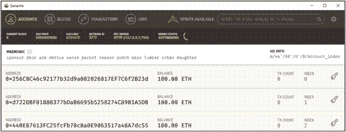
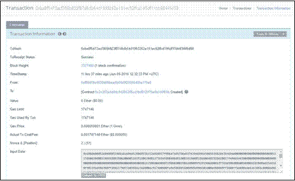
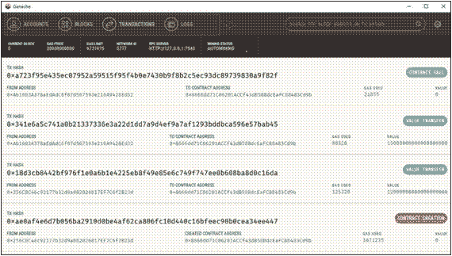
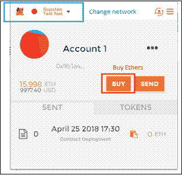
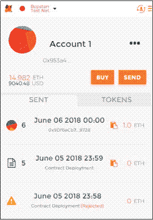

# 管理以太坊智能合约的部署环境

> 原文：<https://dev.to/weg2g/deployment-environments-for-managing-ethereum-smart-contracts-16ha>

以太坊是一个通用的区块链，更适合通过高级脚本描述业务逻辑，也称为智能合约。以太坊被设计为一个更广阔的视野，作为一个试图结合区块链力量的分散式或世界计算机，作为一个信任机器，具有图灵完全契约引擎。虽然以太坊借用了许多最初由比特币引入的思想，但两者之间存在许多分歧。
以太坊虚拟机和智能合约是以太坊的关键元素，并构成其主要吸引力。在以太坊中，智能合约代表一段用高级语言(Solidity，LLL，Viper)编写的代码，并作为字节码存储在区块链中，以便在每个节点中基于堆栈的虚拟机(以太坊虚拟机)中可靠地运行，一旦被调用。与智能合约功能的交互通过区块链网络上的事务发生，它们的有效负载在以太坊虚拟机中执行，共享的区块链状态相应地更新。

对于那些不熟悉区块链技术的人，强烈推荐阅读[从比特币看区块链技术的历史和演变](https://myhsts.org/tutorial-history-and-evolution-of-blockchain-technology-from-bitcoin.php)的文章。此外，如果您希望学习和练习 Hyperledger 区块链开发，请访问[综合 Hyperledger 培训教程](https://myhsts.org/tutorial-comprehensive-blockchain-hyperledger-developer-guide-for-all-professional-programmers.php)页面以获得我们的 Hyperledger 教程文章的大纲。
我们已经写了两套教程来深入探讨以太坊和 Solidity 编程。第一套包括以下九种食谱:

*   [用 DApps 和以太坊 VM 开发以太坊区块链简介](https://myhsts.org/tutorial-learn-about-ethereum-blockchain-development-with-dapps-and-ethereum-vm.php)
*   [用以太坊和 Solidity 编程语言构建拍卖 DApp](https://myhsts.org/tutorial-learn-how-to-build-auction-dapp-with-ethereum-and-solidity-programming-language.php)
*   [通过 Remix IDE 使用以太坊区块链应用](https://myhsts.org/tutorial-learn-how-to-work-with-ethereum-blockchain-applications-through-remix-ide.php)
*   [为以太坊拍卖 DApp](https://myhsts.org/tutorial-learn-how-to-build-bidding-form-in-web3js-for-ethereum-auction-dapp.php) 在 Web3js 中建立投标表格
*   [与 web3js API 和 JSON 合作构建以太坊区块链应用](https://developer.ibm.com/recipes/tutorials/working-with-web3js-api-and-json-to-build-ethereum-blockchain-applications/)
*   管理以太坊智能合约的部署环境
*   [通过 Golang 与 Geth 一起使用以太坊专用网络](https://myhsts.org/tutorial-learn-how-to-work-with-ethereum-private-network-with-golang-with-geth.php)
*   [使用 Solidity 编译器编译和部署以太坊契约](https://myhsts.org/tutorial-learn-how-to-compile-and-deploy-ethereum-contracts-using-solidity-compiler.php)
*   [运行以太坊拍卖 DApp 和坚固性提示](https://myhsts.org/tutorial-learn-how-to-run-ethereum-auction-dapp-with-some-solidity-tips.php)

简而言之，您将学习如何设置和配置以太坊，以及如何使用 Solidity 编程语言开发区块链应用程序。我们探索它的关键组件，包括智能合同和 Web3。JS API 通过拍卖分散应用程序(DApp)一步一步。在第二集中，我们将讨论以太坊区块链的发展和稳定性中更高级的主题，同时一步一步地构建一个托尼·DApp 游戏。具体来说，我们包括松露和毛毛雨。例如，我们向您展示了像 Truffle 这样的工具如何成为构建、测试、调试和部署 DApps 的助手。总之，我们将涵盖四个主要主题:

*   探索松露套房
*   学习 Solidity 的高级特性
*   合同测试和调试
*   使用毛毛雨构建用户界面

第二套包括如下 8 种配方:

*   [安装 Truffle 并设置 Ganache，为 Tontine DApp 游戏编译以太坊智能合约](https://myhsts.org/tutorial-learn-how-to-install-truffle-and-setup-ganache-for-compiling-ethereum-smart-contracts-for-tontine-dapp-game.php)
*   [运行 Tontine 以太坊 DApp 游戏合同](https://myhsts.org/tutorial-learn-how-to-run-tontine-ethereum-dapp-game-contract.php)
*   [设计 Tontine 以太坊 DApp 游戏界面](https://myhsts.org/tutorial-learn-how-to-design-tontine-ethereum-dapp-game-interfaces.php)
*   [通过托尼·DApp 游戏契约以太坊和实体之间的互动](https://myhsts.org/tutorial-learn-about-blockchain-contract-interactions-between-ethereum-and-solidity-via-tontine-dapp-game.php)
*   [在托尼·DApp 游戏中进行块菌单元测试](https://developer.ibm.com/recipes/tutorials/work-with-ethereum-solidity-and-truffle-unit-testing-in-tontine-dapp-game/)
*   [在托尼·DApp 游戏中调试松露和以太坊混音](https://dev.to/weg2g/debugging-with-truffle-and-ethereum-remix-in-tontine-dapp-game-20mi)
*   [用毛毛雨为 Tontine DApp 游戏构建前端应用](https://myhsts.org/tutorial-learn-how-to-build-frontend-blockchain-application-for-Ethereum-dapp-game-with-drizzle.php)
*   [跑步和玩 Tontine 以太坊 DApp 游戏](https://myhsts.org/tutorial-learn-how-to-run-and-play-tontine-ethereum-dapp-game.php)

***<u>重要提示:在制作第二套配方之前，需要理解并完成第一套配方。</u>***

在以太坊中，我们有多种方式来部署智能合约，而无需花费真正的以太。在本菜谱中，我们将介绍如何在以下测试环境中设置和部署您的合同:

*   加纳切
*   混合测试网
*   专用网

### 选项 1–加纳切

如果您正在寻找一个带有图形界面的测试区块链，Ganache(以前的 TestRpc)就是您的选择。这是一个在本地运行的内存区块链(可以把它想象成一个区块链模拟器)。

从官方的 Ganache 库(https://github.com/trufflesuite/ganache/releases)下载并安装适合您的操作系统的版本。

当你运行 Ganache 时，你会得到一个图形化的屏幕，显示关于服务器的一些细节，创建的块，交易，和一个创建的帐户的列表，每个都加载了 100 个以太:
 

要和 Ganache 交互，可以使用 Remix，但是这一次，你要用 Ganache 的 IP 和 RPC 端口指定一个新的 web3 提供者；比如 http://localhost:7545(如果有连接麻烦，尽量用 Remix over HTTP，不要用 HTTPS):
 

Remix 连接到 Ganache 后，像之前一样部署您的智能合约，并通过 Remix 开始投标。在 Ganache 的界面中，您可以可视化事务和创建的块:

 

如果你认为 Ganache 对你来说足够了，你可以在这里停下来，直接跳到运行拍卖 DApp 部分，以便使用 Ganache 运行拍卖 DApp。但是，如果您有兴趣了解其他可能的部署环境，以便选择适合您的环境，请继续阅读。

### 选项 2–测试网

与比特币类似，以太坊的 Testnet 是一个公共网络，致力于在不使用真实以太的情况下在线测试开发者的合同。通过在浏览器上使用一个名为 MetaMask 的插件，你可以加入这个网络，而不需要运行一个完整的节点。让我们看看这怎么可能。

#### 将元掩码连接到测试网络

MetaMask 是一个浏览器插件，允许您的普通浏览器像 web3 浏览器一样工作，与 DApps 进行交互，并在不运行以太坊节点的情况下发送事务。MetaMask 通过将 web3js API 注入每个网页的 JavaScript 上下文来实现这一点。

安装和设置 MetaMask 的必要说明在他们的官方网站上有很好的记录，网址:[https://metamask.io/](https://metamask.io/)。创建完钱包后，点击左上角的网络选择器，切换到 MetaMask 设置中的 Ropsten 测试网络。一旦你连接到 Ropsten，你需要通过选择购买一些硬币来获得一些免费的无价值的乙醚，如下图所示:

 

MetaMask 可以本地(Ganache，Geth)或在线(testnet，Mainnet)连接到任何 RPC 提供程序。要获得使用 MetaMask 的详细分步指南，我建议您参考位于[https://github.com/MetaMask/faq/blob/master/USERS.md](https://github.com/MetaMask/faq/blob/master/USERS.md)的官方文档。

一切就绪；现在，回到您的 Remix 浏览器(您可能需要刷新它)并选择(在 Remix 中)injected web3 作为环境选项，以便直接在线部署您的合同。MetaMask 将发起部署事务并返回合同地址:

 

MetaMask 为每笔交易提供了以太坊以太扫描链接，以便直观显示交易状态和燃气成本等详细信息:
 

该契约很容易在 testnet 中部署。

或者，您可以通过设置一个连接到 testnet 网络的 light 节点，将 Remix 连接到 testnet，如下一节所述。要使用 MetaMask 测试您的拍卖网页，您必须将以下代码片段添加到 auction.js 文件的开头，以检测 MetaMask 注入的 web3 实例:
if (typeof web3！= = ' undefined '){ app . web 3 provider = web 3 . current provider；web3 =新 web 3(web 3 . current provider)；
} else {
//更改为您的 RPC 提供者 IP 和端口 app . web 3 provider = new
web 3 . providers . http provider(' http://127 . 0 . 0 . 1:7545 ')；web 3 = new web 3(app . web 3 provider)；
}

而是只使用 web3.setProvider(新的 web 3 . providers . http provider(" http://127 . 0 . 0 . 1:8545 "))；正如我们在前面的*章节中与区块链的对话一样。*

testnet 网络非常有用，因为它让您对延迟处理和交易成本有了准确的了解。然而，隐含的延迟时间和有限的以太网对经常改变他们的 DApp 代码的开发人员没有帮助，因此下面的第三个选项或 Ganache 更适合作为开始环境。然后，在 Mainnet 上投入生产之前，您可以转到这个 testnet 选项。

### 选项 3–专用网络

尽管以前的环境很容易使用，它抽象掉了所有的细节，但了解事物在粒度级别上是如何工作的仍然是很好的。此外，您可能需要为私有实体部署私有以太坊区块链，以便在生产中或软件开发过程中使用。

让我们建立我们的私有以太网(一种本地主机)，由同一台机器上的两个运行节点组成，这将在下一个菜谱中介绍。

这份食谱是与 Brian Wu 合作编写的，他是华盛顿编码训练营的高级总账讲师。