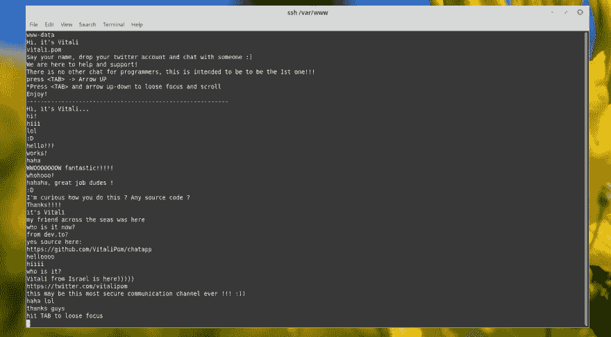

# 通过 SSH 聊天🔥🔥🔥🔥🔥🔥🔥

> 原文：<https://dev.to/vitalipom/chat-over-ssh-54ck>

我用 ssh tunel *实现了我的第一个聊天应用服务器**！！！！！！请请请请请来看我吧！** **

[](https://res.cloudinary.com/practicaldev/image/fetch/s--FGvWc2Kg--/c_limit%2Cf_auto%2Cfl_progressive%2Cq_auto%2Cw_880/https://raw.githubusercontent.com/VitaliPom/chatapp/master/Screen%2520Shot%25202019-07-18%2520at%252021.22.58.png)T3】

```
ssh chat:@www.vitalipom.com 
```

<svg width="20px" height="20px" viewBox="0 0 24 24" class="highlight-action crayons-icon highlight-action--fullscreen-on"><title>Enter fullscreen mode</title></svg> <svg width="20px" height="20px" viewBox="0 0 24 24" class="highlight-action crayons-icon highlight-action--fullscreen-off"><title>Exit fullscreen mode</title></svg>

```
Source code here:
https://github.com/VitaliPom/chatapp 
```

<svg width="20px" height="20px" viewBox="0 0 24 24" class="highlight-action crayons-icon highlight-action--fullscreen-on"><title>Enter fullscreen mode</title></svg> <svg width="20px" height="20px" viewBox="0 0 24 24" class="highlight-action crayons-icon highlight-action--fullscreen-off"><title>Exit fullscreen mode</title></svg>

[](https://res.cloudinary.com/practicaldev/image/fetch/s--Mm3anQFS--/c_limit%2Cf_auto%2Cfl_progressive%2Cq_auto%2Cw_880/https://raw.githubusercontent.com/VitaliPom/chatapp/master/Screen%2520Shot%25202019-07-12%2520at%252019.35.26.png)

想聊天吗？
在这里查看新消息:
【www.vitalipom.com/message.txt T2】