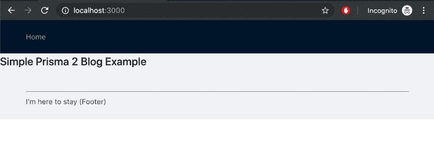
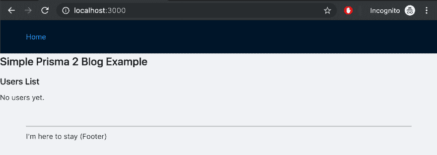
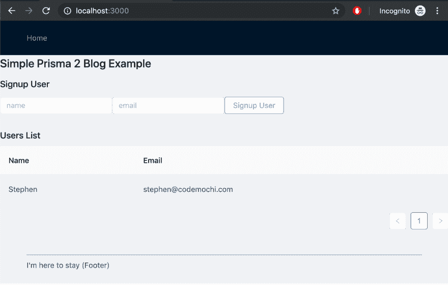
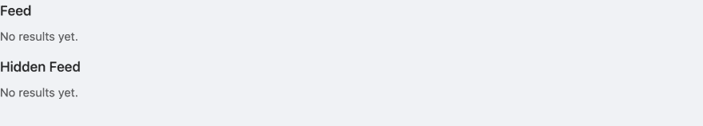
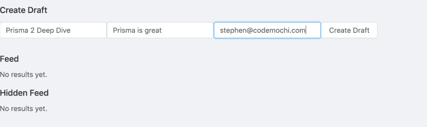
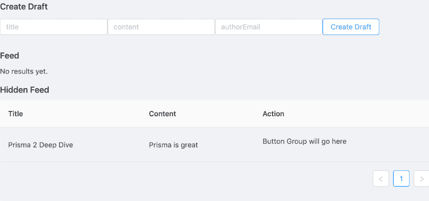
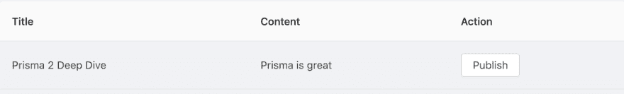
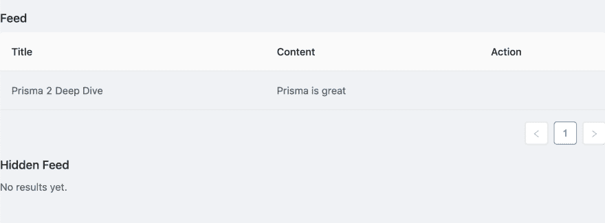
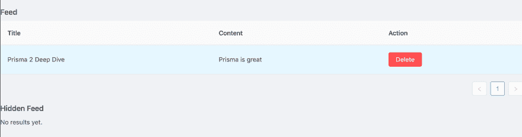
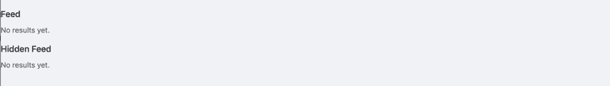

# 用 Next.js、Prisma 2 和 Docker 创建一个 Fullstack 博客应用程序

> 原文：<https://dev.to/codemochi/create-a-fullstack-blog-app-with-next-js-prisma-2-and-docker-part-iii-build-the-ui-45dd>

在本系列的最后一篇文章中，我们将用 Next.js、Prisma 2 和 Docker 构建这个博客网站的 UI。一定要看看前两个帖子，以确保你先赶上了。

# 目录:

**第一部分-设置回购并配置后端**

1.  创建基础回购
2.  创建 Next.js 前端
3.  创建样板 Prisma 2 后端
4.  将我们的网络应用归档

a.创建一个 docker 合成文件

b.为每个容器添加 docker 文件

1.  配置后端

a.将数据库从 SQLite 切换到 MySQL

b.移除未使用的后端样板代码

c.更新 Prisma Nexus 中的后端查询

1.  验证我们的 Docker-Compose 集群工作正常

**第二部分-配置前端**

1.  添加 GraphQL 片段、查询和解析器
2.  添加 GraphQL-Codegen 以生成 React 组件
3.  添加 Apollo 并为 Next.js 创建 HOC
4.  将 React-Apollo 添加到项目根
5.  安装 Antd 为一个美丽的网站布局

**第三部分——构建用户界面(本文)**

1.  创建主布局
2.  创建用户布局组件
3.  创建注册用户组件
4.  创建提要布局组件
5.  创建新的拔模组件
6.  创建发布草稿按钮组件
7.  创建删除帖子按钮组件

像往常一样，确保检查视频演练的结尾。

**第三部分-构建用户界面**

**1。创建主布局**

我们 UI 之旅的第一步是创建一个布局组件，我们将在每个页面上加载它。这将包含页眉，页脚和一个页面的其余部分通过。创建一个主布局文件，并添加以下代码:

`frontend/components/main-layout.tsx`

```
import React, { ReactNode, Component } from 'react'
import { Layout } from 'antd'
import Link from 'next/link'
import Head from 'next/head'

const { Footer, Header, Content } = Layout

type Props = {
  title?: string
  children: ReactNode
}

class MainLayout extends Component<Props> {
  render() {
    const { children, title } = this.props
    return (
      <Layout>
        <Head>
          {title}
          <meta charSet="utf-8" />
          <meta
            name="viewport"
            content="initial-scale=1.0, width=device-width"
          />
        </Head>
        <Header>
          <nav>
            <Link href="/">
              <a>Home</a>
            </Link>
          </nav>
        </Header>
        <Content>{children}</Content>
        <Footer>
          <hr />
          <span>I'm here to stay (Footer)</span>
        </Footer>
      </Layout>
    )
  }
}

export default MainLayout 
```

更新索引页面以添加布局组件。您需要在将来制作的每个页面上添加这种布局，但在我们的示例中，我们只有一个布局:

`frontend/pages/index.tsx`

```
import * as React from 'react'
import { NextPage } from 'next'
import Layout from '../components/main-layout'

const IndexPage: NextPage = () => {
  return (
    <Layout title="Blog Layout">
      <h1>Simple Prisma 2 Blog Example</h1>
    </Layout>
  )
}

export default IndexPage 
```

当你重新加载你的页面时，它应该有一个页眉、页脚和一个灰色的正文:

[](https://res.cloudinary.com/practicaldev/image/fetch/s--3LPH7otL--/c_limit%2Cf_auto%2Cfl_progressive%2Cq_auto%2Cw_880/https://www.codemochi.com/static/0b81ff7f4a7d502a2e44807b37e22fa6/feedf/8a-main-layout.png)

**2。创建一个用户布局组件**

现在，我们已经安装了 Ant Design，配置了 Apollo，并且自动生成了我们的 Apollo 组件，是时候开始制作我们的组件了。让我们从用户布局开始。

`frontend/components/users.tsx`

```
import React from 'react'
import { Table } from 'antd'
import { UsersQueryComponent } from '../generated/apollo-components'

type Props = {}

class UsersList extends React.PureComponent<Props> {
  render() {
    return (
      <UsersQueryComponent>
        {({ loading, error, data }) => {
          if (loading) return <p>Loading...</p>
          if (error) return <p>Error</p>

          if (data && 'users' in data && data.users.length > 0) {
            const feedData = data.users.map(({ name, email }, i) => ({
              key: i,
              name,
              email,
            }))
            const columns = [
              {
                title: 'Name',
                dataIndex: 'name',
                key: 'name',
              },
              {
                title: 'Email',
                dataIndex: 'email',
                key: 'email',
              },
            ]
            return <Table columns={columns} dataSource={feedData} />
          }

          return <p>No users yet.</p>
        }}
      </UsersQueryComponent>
    )
  }
}

export default UsersList 
```

我们使用的是由 GraphQL Codegen 插件自动生成的组件`UsersQueryComponent`。它正在做所有获取我们数据的艰苦工作。我们首先检查它没有被加载并且没有错误，然后我们从`data`对象中提取一个用户列表。

Antd 有一个表格组件，我们可以给它一个对象数组和一个列名列表，它会为我们创建一个漂亮的表格。如果没有任何用户，我们就返回报告。

现在我们可以将那个`UsersList`组件导入到我们的 index.tsx 文件中:

`frontend/pages/index.tsx`

```
import * as React from 'react'
import { NextPage } from 'next'
import Layout from '../components/main-layout'
import UsersList from '../components/users'

const IndexPage: NextPage = () => {
  return (
    <Layout title="Blog Layout">
      <h1>Simple Prisma 2 Blog Example</h1>
      <h3>Users List</h3>
      <UsersList />
    </Layout>
  )
}

export default IndexPage 
```

当我们现在看我们的网页时，我们应该看到它在说我们还没有任何用户。现在让我们通过创建一个注册用户组件来改变这种情况。

[](https://res.cloudinary.com/practicaldev/image/fetch/s--17Y5Ue2p--/c_limit%2Cf_auto%2Cfl_progressive%2Cq_auto%2Cw_880/https://www.codemochi.com/static/1fcff96221b2d734d04326d78d651997/feedf/8b-users-layout.png)

**3。创建注册用户组件**

让我们创建一个名为 signup-user.tsx 的新文件，并添加以下代码:

`frontend/components/signup-user.tsx`

```
import React from 'react'
import { Row, Col, Button, Form, Input } from 'antd'
import {
  SignupUserMutationComponent,
  UsersQueryDocument,
} from '../generated/apollo-components'

type Props = {}
const initialState = { name: '', email: '' }
type State = typeof initialState

class SignupUser extends React.Component<Props> {
  state: State = initialState

  handleChange = (event: React.ChangeEvent<HTMLInputElement>) => {
    const { name, value } = event.target
    this.setState({ [name]: value })
  }

  render() {
    return (
      <SignupUserMutationComponent>
        {createUser => (
          <Form
            onSubmit={e => {
              e.preventDefault()
              createUser({
                variables: { ...this.state },
                refetchQueries: [{ query: UsersQueryDocument }],
              }).then(() => {
                this.setState({ name: '', email: '' })
              })
            }}
          >
            <Row>
              <Col span={6}>
                <Form.Item>
                  <Input
                    placeholder="name"
                    name="name"
                    value={this.state.name}
                    onChange={this.handleChange}
                    type="text"
                  />
                </Form.Item>
              </Col>
              <Col span={6}>
                <Form.Item>
                  <Input
                    placeholder="email"
                    name="email"
                    value={this.state.email}
                    onChange={this.handleChange}
                    type="text"
                  />
                </Form.Item>
              </Col>
              <Col span={6}>
                <Form.Item>
                  <Button htmlType="submit">Signup User</Button>
                </Form.Item>
              </Col>
            </Row>
          </Form>
        )}
      </SignupUserMutationComponent>
    )
  }
}

export default SignupUser 
```

我们使用不同的自动生成组件`SignupUserMutationComponent`来触发我们的 signupUser 突变。`SignupUserMutationComponent`产生了一个我们在这里称为 createUser 的方法，它允许我们在任何我们想要的地方触发一个突变。我们可以在调用这个方法时将变量传递给它，它们将被添加到我们对后端的请求中。

我们创建了一个包含几个输入的 HTML 表单——姓名和电子邮件。当用户在两个输入字段中输入时，我们使用`SignupUser`状态来保存输入。因为输入字段显示 react 组件的当前状态，所以用户并不直接在字段中输入内容，而是触发一个 onClick 触发器，该触发器更新输入字段中反映的状态。

当用户按下提交按钮时，我们使用 onSubmit 触发器来触发 createUser 方法，我们用状态变量填充该方法。

变异启动后，我们有一个 refetchQuery，它将重新运行 users 查询，以确保我们的`UsersList`将拥有刚刚添加的新用户条目。最后，我们清除状态变量 name 和 email，这将清除输入字段。这种方法在 React 中被称为受控组件，是一种非常标准的做事方式，所以如果你对它不熟悉，请查看[官方文档](https://reactjs.org/docs/forms.html)以了解更多细节(或者随时就这个问题或其他问题直接联系我，以便将来发表博文！).

现在您可以将`SignupUser`组件添加到索引页面:

`frontend/pages/index.tsx`

```
import * as React from 'react'
import { NextPage } from 'next'
import Layout from '../components/main-layout'
import UsersList from '../components/users'
import SignupUser from '../components/signup-user'

const IndexPage: NextPage = () => {
  return (
    <Layout title="Blog Layout">
      <h1>Simple Prisma 2 Blog Example</h1>
      <h3>Signup User</h3>
      <SignupUser />
      <h3>Users List</h3>
      <UsersList />
    </Layout>
  )
}

export default IndexPage 
```

现在回到 Next.js 网站，尝试添加一个新用户和电子邮件。您应该看到它被添加到用户列表中，如下所示:

[](https://res.cloudinary.com/practicaldev/image/fetch/s--ieirjpid--/c_limit%2Cf_auto%2Cfl_progressive%2Cq_auto%2Cw_880/https://www.codemochi.com/static/cd17055f95c39016985992152fbce7a0/feedf/8c-signup.png)

**4。创建一个提要布局组件**

我们的博客页面将使用两次提要布局:

*   所有发表的博客帖子
*   所有隐藏的博客帖子

我们想要创建一个`FeedList`组件，这样我们就可以根据传入的`published`布尔值是真还是假来显示其中之一。

创建一个 feed.tsx 文件，并添加以下代码:

`frontend/components/feed.tsx`

```
import React from 'react'
import { Table } from 'antd'
import { FeedQueryComponent } from '../generated/apollo-components'

type Props = {
  published: boolean
}

class FeedList extends React.PureComponent<Props> {
  render() {
    const { published } = this.props
    return (
      <FeedQueryComponent variables={{ published }}>
        {({ loading, error, data }) => {
          if (loading) return <p>Loading...</p>
          if (error) return <p>Error</p>

          if (data && 'feed' in data && data.feed.length > 0) {
            const feedData = data.feed.map(({ id, title, content }, i) => ({
              key: i,
              title,
              content,
              id,
            }))
            const columns = [
              {
                title: 'Title',
                dataIndex: 'title',
                key: 'title',
              },
              {
                title: 'Content',
                dataIndex: 'content',
                key: 'content',
              },
              {
                title: 'Action',
                key: 'action',
                render: () => {
                  return <p>Button Group will go here</p>
                },
              },
            ]
            return <Table columns={columns} dataSource={feedData} />
          }

          return <p>No results yet.</p>
        }}
      </FeedQueryComponent>
    )
  }
}

export default FeedList 
```

`FeedList`组件看起来与我们已经创建的`Users`组件非常相似。我们正在利用像以前一样自动生成的`FeedQueryComponent`,现在我们将创建一个包含 3 列的表格——标题、内容和动作。行动组将有我们的发布和删除帖子的按钮，但我们现在只是把它们剔除了。

现在修改 pages 文件夹中的 index.tsx 文件，使其具有两个`FeedList`组件实例——一次将 published prop 设置为 true，另一次设置为 false。

`frontend/pages/index.tsx`

```
import * as React from 'react'
import { NextPage } from 'next'
import Layout from '../components/main-layout'
import FeedList from '../components/feed'
import UsersList from '../components/users'
import SignupUser from '../components/signup-user'

const IndexPage: NextPage = () => {
  return (
    <Layout title="Blog Layout">
      <h1>Simple Prisma 2 Blog Example</h1>
      <h3>Create User</h3>
      <SignupUser />
      <h3>Users</h3>
      <UsersList />

      <h3>Feed</h3>
      <FeedList published={true} />
      <h3>Hidden Feed</h3>
      <FeedList published={false} />
    </Layout>
  )
}

export default IndexPage 
```

现在导航到 Next.js 网页，您应该看到它有两个提要组件。

[](https://res.cloudinary.com/practicaldev/image/fetch/s--gS1hCRUR--/c_limit%2Cf_auto%2Cfl_progressive%2Cq_auto%2Cw_880/https://www.codemochi.com/static/5d08de72565e11bb5081b4dd6a095baa/feedf/8d-feeds.png)

**5。创建一个新的草稿组件**

现在，我们将创建一个新的草稿组件，以便我们可以制作新的博客帖子。这将与我们已经制作的`SignupUser`组件非常相似。这里的目标是当草稿被创建时，我们将看到它出现在未发布的列表中。

创建一个 new-draft.tsx 文件，并添加以下代码:

`/frontend/components/new-draft.tsx`

```
import React from 'react'
import { Row, Col, Button, Form, Input } from 'antd'
import {
  CreateDraftMutationComponent,
  FeedQueryDocument,
} from '../generated/apollo-components'

type Props = {}
const initialState = { title: '', content: '', authorEmail: '' }
type State = typeof initialState

class NewDraft extends React.Component<Props> {
  state: State = initialState

  handleChange = (event: React.ChangeEvent<HTMLInputElement>) => {
    const { name, value } = event.target
    this.setState({ [name]: value })
  }

  render() {
    return (
      <CreateDraftMutationComponent>
        {createDraft => (
          <Form
            onSubmit={e => {
              e.preventDefault()
              createDraft({
                variables: { ...this.state },
                refetchQueries: [
                  { query: FeedQueryDocument, variables: { published: true } },
                  { query: FeedQueryDocument, variables: { published: false } },
                ],
              }).then(res => {
                console.log(res)
                this.setState({ title: '', content: '', authorEmail: '' })
              })
            }}
          >
            <Row>
              <Col span={6}>
                <Form.Item>
                  <Input
                    placeholder="title"
                    name="title"
                    value={this.state.title}
                    onChange={this.handleChange}
                    type="text"
                  />
                </Form.Item>
              </Col>
              <Col span={6}>
                <Form.Item>
                  <Input
                    placeholder="content"
                    name="content"
                    value={this.state.content}
                    onChange={this.handleChange}
                    type="text"
                  />
                </Form.Item>
              </Col>
              <Col span={6}>
                <Form.Item>
                  <Input
                    placeholder="authorEmail"
                    name="authorEmail"
                    value={this.state.authorEmail}
                    onChange={this.handleChange}
                    type="text"
                  />
                </Form.Item>
              </Col>
              <Col span={6}>
                <Form.Item>
                  <Button htmlType="submit">Create Draft</Button>
                </Form.Item>
              </Col>
            </Row>
          </Form>
        )}
      </CreateDraftMutationComponent>
    )
  }
}

export default NewDraft 
```

代码非常类似于`SignupUser`组件——我们有标题、内容和作者电子邮件的输入，在这些字段中输入值存储在一个状态中，当按下提交按钮时，我们将该状态用作 createDraft 变异中的变量。

注意，我们相信用户会在 authorEmail 字段中添加他们的电子邮件地址。对于真正的应用程序，您永远不会这样做。您可能会让一个用户传递一个 JSON web 令牌(JWT ),该令牌将用户的电子邮件编码在里面，这样您就知道您可以信任您所收到的电子邮件。在这个例子中，我们不会讨论如何使用 JWTs，但是这是可以在我们的应用程序完成后添加的。

我们需要最后一次更新我们的索引页面来添加这个`NewDraft`组件。

`frontend/pages/index.tsx`

```
import * as React from 'react'
import { NextPage } from 'next'
import Layout from '../components/main-layout'
import FeedList from '../components/feed'
import NewDraft from '../components/new-draft'
import UsersList from '../components/users'
import SignupUser from '../components/signup-user'

const IndexPage: NextPage = () => {
  return (
    <Layout title="Blog Layout">
      <h1>Simple Prisma 2 Blog Example</h1>
      <h3>Create User</h3>
      <SignupUser />
      <h3>Users</h3>
      <UsersList />

      <h3>Create Draft</h3>
      <NewDraft />
      <h3>Feed</h3>
      <FeedList published={true} />
      <h3>Hidden Feed</h3>
      <FeedList published={false} />
    </Layout>
  )
}

export default IndexPage 
```

现在转到 Next.js 站点，您应该看到有添加草稿组件。添加一个新帖子，确保与上面的用户的电子邮件相匹配，然后提交。

[](https://res.cloudinary.com/practicaldev/image/fetch/s--rNhPg0lV--/c_limit%2Cf_auto%2Cfl_progressive%2Cq_auto%2Cw_880/https://www.codemochi.com/static/b339a63e1f48d72041696668b71b036b/df66b/8e-new-draft-2-before-add-draft.png)

您应该会看到它被添加到草稿提要列表中。

[](https://res.cloudinary.com/practicaldev/image/fetch/s--mmWTy-M9--/c_limit%2Cf_auto%2Cfl_progressive%2Cq_auto%2Cw_880/https://www.codemochi.com/static/4da8444c7fd730c14dc2baf8a1450665/feedf/8e-new-draft-2-after-add-draft.png)

**6。创建发布草稿按钮组件**

既然有了草稿，就发表吧！我们将创建一个按钮，用一个特定的 post ID 作为输入参数来调用一个发布变异。我们的后端将调用 Prisma 2，这将把帖子的`published`字段从 false 改为 true。

创建一个名为 publish-draft.tsx 的文件，并添加以下代码:

`frontend/components/publish-draft.tsx`

```
import React from 'react'
import { Button } from 'antd'
import {
  PublishMutationComponent,
  FeedQueryDocument,
} from '../generated/apollo-components'

type Props = {
  id: string
}

class PublishDraft extends React.Component<Props> {
  render() {
    const { id } = this.props
    return (
      <PublishMutationComponent>
        {publishDraft => (
          <Button
            onClick={() =>
              publishDraft({
                variables: { id },
                refetchQueries: [
                  { query: FeedQueryDocument, variables: { published: true } },
                  { query: FeedQueryDocument, variables: { published: false } },
                ],
              })
            }
          >
            Publish
          </Button>
        )}
      </PublishMutationComponent>
    )
  }
}

export default PublishDraft 
```

我们像以前一样使用自动生成的 react 组件，并在`PublishMutationComponent`组件中嵌套一个按钮。当按钮被点击时，我们将调用发布变异。我们在这里有一个 refetch 查询来获取已发布和未发布的结果，以确保当一篇文章发布时，两个列表都得到更新。

现在我们需要更新 feed.tsx 文件，将 PublishDraft 添加到操作块中。确保在 feed.tsx 文件的顶部导入`PublishDraft`和`Button`组件。

`frontend/components/feed.tsx`

```
import { Table, Button } from 'antd'
import PublishDraft from './publish-draft'
// Lines omitted for brevity
//
{
  title: 'Action',
  key: 'action',
  render: ({ id }: { id: string }) => {
    return (
      <Button.Group>
        {published ? null : <PublishDraft id={id} />}
      </Button.Group>
    );
  }
} 
```

现在当你访问你的站点时，你会看到在你创建的文章旁边有一个发布按钮。

[](https://res.cloudinary.com/practicaldev/image/fetch/s--sQnZqeEt--/c_limit%2Cf_auto%2Cfl_progressive%2Cq_auto%2Cw_880/https://www.codemochi.com/static/9f2ab54a3ead158d22ded397b01c386c/feedf/8f-add-publish-button.png)

按下 publish 按钮，您会看到它从未发布的表格移动到已发布的表格。太棒了。

[](https://res.cloudinary.com/practicaldev/image/fetch/s--QV-hAFWJ--/c_limit%2Cf_auto%2Cfl_progressive%2Cq_auto%2Cw_880/https://www.codemochi.com/static/9b97a9072ba633983ec2ef058735d45d/9424f/8f-after-publish.png)

7 .**。创建一个删除帖子按钮组件**

我们剩下的最后一个组件是为文章创建一个删除按钮。这个按钮将非常类似于我们创建的`PublishDraft`组件。首先，创建一个名为 delete-post.tsx 的文件，并添加以下代码:

`frontend/components/delete-post.tsx`

```
import React from 'react'
import { Button } from 'antd'
import {
  DeleteOnePostComponent,
  FeedQueryDocument,
} from '../generated/apollo-components'

type Props = {
  id: string
}

class DeletePost extends React.Component<Props> {
  render() {
    const { id } = this.props
    return (
      <DeleteOnePostComponent>
        {deleteOnePost => (
          <Button
            type="danger"
            onClick={() =>
              deleteOnePost({
                variables: { id },
                refetchQueries: [
                  { query: FeedQueryDocument, variables: { published: true } },
                  { query: FeedQueryDocument, variables: { published: false } },
                ],
              })
            }
          >
            Delete
          </Button>
        )}
      </DeleteOnePostComponent>
    )
  }
}

export default DeletePost 
```

我们调用自动生成的`DeleteOnePostComponent`组件，当点击按钮时，我们调用我们的突变。现在我们有了组件，我们可以在我们的`FeedList`组件中使用它。确保我们也导入这个文件顶部的`DeletePost`。

`/frontend/components/feed.tsx`

```
import DeletePost from './delete-post'
// lines omitted for brevity
//
{
  title: 'Action',
  key: 'action',
  render: ({ id }: { id: string }) => {
    return (
      <Button.Group>
        {published ? null : <PublishDraft id={id} />}
        <DeletePost id={id} />
      </Button.Group>
    );
  }
} 
```

现在，让我们转到我们的网站，我们会看到现在有一个删除按钮。如果我们按下删除按钮，应该会删除帖子。

之前:

[](https://res.cloudinary.com/practicaldev/image/fetch/s--H0nHJnBy--/c_limit%2Cf_auto%2Cfl_progressive%2Cq_auto%2Cw_880/https://www.codemochi.com/static/334982a0ddcfb63dc1c6c8a2c5403a28/10811/8g-before-delete.png)

之后:

[](https://res.cloudinary.com/practicaldev/image/fetch/s--0qQuEsmI--/c_limit%2Cf_auto%2Cfl_progressive%2Cq_auto%2Cw_880/https://www.codemochi.com/static/656fd6c15c59cff0a198c34a7f999b92/10811/8g-after-delete.png)

原来如此！我们已经在 Docker 中介绍了使用 Prisma 2 和 Next.js 构建全栈应用程序的所有基础知识。这种配置非常适合开发，您应该毫不犹豫地在此基础上构建自己的全栈 web 应用程序。

将所有东西生产化！

然而，对于生产来说，您应该确保将您的整个代码复制到 docker 容器中，这样您就不会依赖于源代码的卷装载。你可能还想利用一个生产就绪的 MySQL 实例，它具有自动备份、扩展和容错功能，比如 AWS RDS，我之前已经讨论过如何连接到 Prisma 2 。当你到达那个点的时候，还有许多其他的因素需要考虑(比如使用 [CI/CD 管道](https://www.codemochi.com/blog/2019-05-29-serverless-react-gatsby-aws-amplify/)的自动化部署)，但是幸运的是，从一开始就使用 Docker 为将来生产你的应用程序提供了一条清晰的路线。

第三部分视频系列:

*添加主布局到 Next.js*
[https://www.youtube.com/embed/cYzwSyCkyDI](https://www.youtube.com/embed/cYzwSyCkyDI)

*添加用户组件到 Next.js*
[https://www.youtube.com/embed/QXe373DKwPw](https://www.youtube.com/embed/QXe373DKwPw)

*添加注册用户到 Next.js*
[https://www.youtube.com/embed/r74YdvoMBdo](https://www.youtube.com/embed/r74YdvoMBdo)

*添加 Feed 组件到 Next.js*
[https://www.youtube.com/embed/oXBBRjpsijk](https://www.youtube.com/embed/oXBBRjpsijk)

*向 Next.js 添加新的博客草稿组件*
[https://www.youtube.com/embed/Zkxk4OKioyQ](https://www.youtube.com/embed/Zkxk4OKioyQ)

*添加发布博客组件到 Next.js*
[https://www.youtube.com/embed/M98_twxhjeQ](https://www.youtube.com/embed/M98_twxhjeQ)

*添加删除帖子组件到 Next.js*
[https://www.youtube.com/embed/Mk_Ecansafs](https://www.youtube.com/embed/Mk_Ecansafs)

从那里来的还有更多！
[点击这里给我们您的电子邮件，我们会在发布新内容时通知您。](https://gmail.us20.list-manage.com/subscribe?u=37f38485b2c7cff2f3d9935b5&id=e3bc056dde)我们尊重您的电子邮件隐私，我们绝不会向您发送垃圾邮件，您可以随时退订。

最初发布于 [Code Mochi](https://www.codemochi.com/blog/2019-07-12-prisma-2-nextjs-docker/) 。