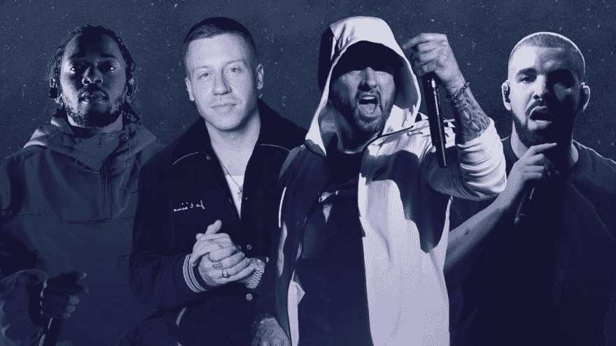

# 程序员能从说唱歌手身上学到什么

> 原文：<https://dev.to/jacobjzhang/what-programmers-can-learn-from-rappers-3cdj>

我很幸运地在纽约皇后区长大，那里有许多世界上最多样化的邮政编码。

这意味着在成长过程中，我接触了很多。显然，我在家里体验了中国语言、文化和烹饪，但我也去了学校、教堂，和当地的爱尔兰、菲律宾和波多黎各孩子一起打篮球。然后我去了布朗克斯科学学校，看到了它的青少年文化和邻近的布朗克斯学校的二分法，然后去了纽约城市大学和福特汉姆大学，看到了两种完全不同的社会经济水平。

也就是说，我的背景让世界上大多数人大开眼界，尽管对纽约人来说这很平常。这些经历也让我接触到了世界上我最喜欢的两种东西——电脑编程和说唱音乐。

尽管乍一看它们似乎完全不相关，但它们确实有一些共同点。否则，沃伦·巴菲特和 Jay-Z 谈论运气的视频就不会如此吸引人了。当然，你不会看到[本·霍洛维茨在他的书的每一章](https://www.amazon.com/gp/product/0062273205/ref=as_li_qf_asin_il_tl?ie=UTF8&tag=algodaily03-20&creative=9325&linkCode=as2&creativeASIN=0062273205&linkId=c2a2b556ed3419faa14c320bd718d9f5)的开头都引用说唱传奇。

那么他们有什么共同之处呢？这是第一步:程序员和说唱歌手想要同样的东西:

*   一种“成功”的感觉，无论是签约，还是加入一家上市软件公司
*   状态，来自白金唱片或 Twitter/Github 提及
*   在他们小圈子里的影响力(如 BET Hip Hop Awards，MET GALA 等。相对于技术会议)

而最有趣的共性是什么？

两种职业都是作家，只是使用不同的媒介来表达他们的思想。

计算机编程和软件开发实际上是把知识和解决方案记在脑子里，并用机器可以理解的符号表达出来。

韵脚和小节是一个人当前心境的诗意回忆录。

他们同样需要[一种流动状态](https://www.amazon.com/gp/product/0061339202/ref=as_li_qf_asin_il_tl?ie=UTF8&tag=algodaily03-20&creative=9325&linkCode=as2&creativeASIN=0061339202&linkId=0ff4800f5bb740d8e6a9eab75462550d)。当 [Kendrick Lamar 写下“婊子不要破坏我的感觉”](https://www.amazon.com/gp/product/B00BYOQFEG/ref=as_li_qf_asin_il_tl?ie=UTF8&tag=algodaily03-20&creative=9325&linkCode=as2&creativeASIN=B00BYOQFEG&linkId=88ce689d08fdb1f6e679de0c95b86618)时，他在谈论处于一种可以创新、创造和利用他的精神力量而不受干扰的心态。如果你是一个开发者，你应该很清楚我在说什么。

由于大多数读到这篇文章的人都是程序员(向阅读这篇博客的少数说唱歌手问好)，我认为探索一些软件工程师可以从嘻哈艺术家身上学到的东西会很有趣。

## 要求、获胜、跟风

> 如果你变得优柔寡断，你将不得不付出代价/这是一个塔拉格达的夜晚，我想我是瑞奇·鲍比/我的建议放弃音乐，获得不同的爱好/所有你*****听起来一样，只是不同的副本-乔伊纳·卢卡斯，破产和愚蠢

兄弟，这些酒吧被低估了。这里有这么多宝石。

没有明确的需求，“空洞无力”的要求会导致项目失败。事实上，它们通常也非常昂贵——所以在开始编码之前，要确保你确切地知道你要构建什么。

第二，瑞奇·鲍比在《塔拉哥达之夜》中一开始就只想着赢。然而，获胜(并试图成为“摇滚明星开发者”)让他陷入了一个充满伤害和麻烦的世界。你最终必须意识到软件是一项团队运动，忍者/摇滚明星/超级明星会打击士气，而不是提高士气。

最后两行对于那些自称为 indie hacker 的[开发者来说尤其如此。你不想成为一个模仿者。](https://indiehackers) [AlgoDaily 不同于任何其他面试网站](https://algodaily.com)——它旨在成为一个终极混合网站，将职业教练、习惯跟踪器和社区整合到一个简单的平台中。如果你和说唱歌手或开发者“听起来一样”，那就去找一个你擅长的领域。

## 肯德里克的职业建议

> 我生来如此，自从有了这样一个，纯洁的概念/我转变成这样，表演成这样，是耶斯华的新武器/我不沉思，我冥想，然后从你他妈的头上下来/这个把孩子们放到床上，这个东西/我得到了，我得到了，我得到了，我得到了/真实，我只是杀了狗屎/因为它在我的 DNA 里-肯德里克·拉马尔，DNA

肯德里克在他的酒吧里放了很多隐藏的宝石，但这是我最喜欢的一个。他在这里说的是**为了达到最佳表现，你需要达到 0 或 100，但绝不要在中间。**

也就是说，你要么需要冥想，要么踢屁股。你需要哄孩子睡觉，或者杀了他们。

这是因为软件工程不仅仅是一个脑力游戏，也是一个体力游戏——长时间无精打采地坐在屏幕前会损害你的身体。如果你真的想在任何时候都达到最佳表现，你需要愿意有时成为一个十足的流浪汉。

Reddit 前首席执行官王宜山(Yishan Wong)在之前[就写过这样的文章:](https://www.quora.com/How-can-I-improve-my-focus-10/answer/Yishan-Wong?fbclid=IwAR3sfYMyX3XhwO3c4socu6HhwS8bVZcaed3dG8gY-AUeJ-EV1XtXI-8_H94&ref=fb_page)

> 非凡的专注并不意味着你能够在醒着的时候工作。在你的“停工期”(你没有工作效率但也没有睡觉的时候)，不要试图做优先级较低的项目。相反，确保你是在偷懒。最专注的人会长时间(几个月，几年)保持专注，而不是整天痴迷于某件事(这可能会导致精疲力竭)，所以确保你的日常安排中包含你故意不做任何有成效的事情的休息时间。这里的想法是不要让你的大脑因为专注而疲劳，而是不断地“重新吸引”它回到你想要专注的事情上。

这就是为什么 AlgoDaily 提倡每天只解决一个问题。不是两个，或者五个，而是一个。一天一个给你剩下的时间去做任何你想做的事情。

> 你知道这永远不会是一个平局，只要看看他们的鞋带/你知道事业起飞，只是要有耐心。

这些话来自肯德里克·拉马尔。

是的，那个肯德里克·拉马尔。HiiiPoWeR、游泳池、Humble 和许多其他热门项目背后的人。如果有一个人可以称得上说唱游戏之王，那就是他。

但是你知道他 8 岁就开始说唱和创作音乐了吗？那是他目睹图帕克和德瑞医生拍摄电影《加州之爱》的时候。从那时起，他明确知道自己想做什么。

然而，他并没有取得商业上的成功，直到 2011 年 Section.80 问世——这意味着他不得不在破产前磨练他的手艺 16 年。

事业需要时间，但是不用担心。如果你每天只做一点点，你的竞争对手很少像你一样准备充分——因为最终，普通人在提高他们的生活地位方面没有任何进展。

## 新的开发者正在尽力

> 我只是人民的一员，不是高高在上，而是平等的/为了更大的利益，我行走在邪恶之中/不要哭泣，妈妈，这是我自己选择的生活/一路上祈祷我不要失去自我/这是为了*****说嘻哈已死/我去地狱复活它/你怎么能不尊重它？-乔·科尔，让纳斯失望

听着，Javascript 是我的第一门编程语言，当老开发者抛弃 Javascript 生态系统时，我感觉并不好。

是的，有一些编写的库没有达到生产使用的标准，似乎每隔几天就有一个新的框架——但是对于新的开发人员来说，正如 J. Cole 所说，“为了更大的利益，我行走在邪恶之中”。

这是新开发人员正在进入的环境——在这个世界中，编程大多是在浏览器中进行的，或者是为浏览器进行的。结果，普通的“不在上面，但在同等水平”的开发人员进入了一个非常混乱的世界，并试图在其中找到意义和他们的凹痕。不容易。

所以给新一波开发者一些尊重吧。他们正在进入一个充满无限可能性的网络，但很少指导(许多人现在通过这样的网站自学)来制作东西。这很困难，会有不好的事情发生，但是也会有好的事情发生。这就是进步。