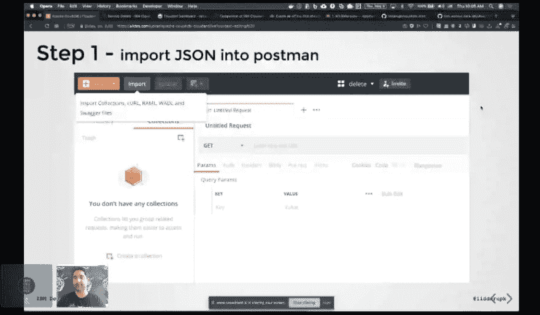
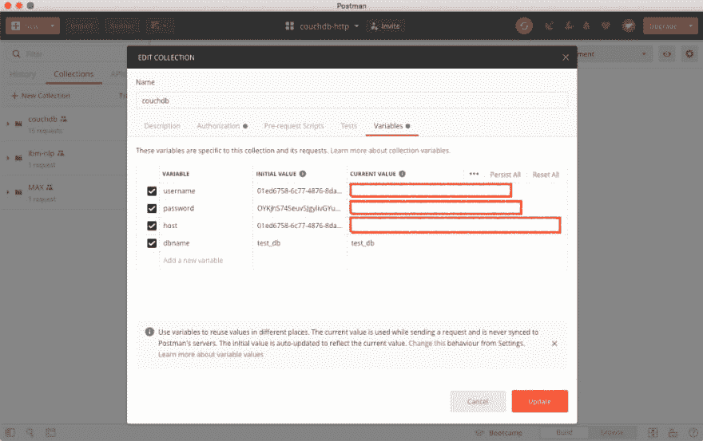
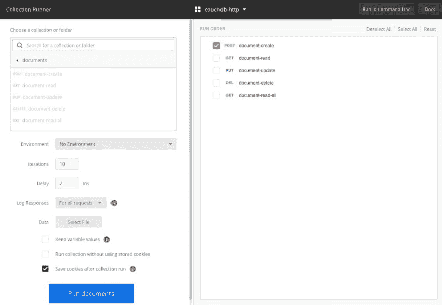
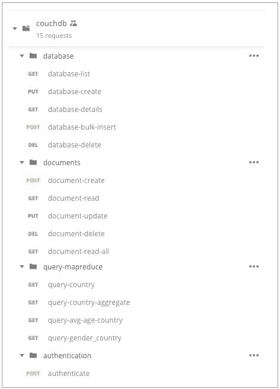

# Postman 是演示 API 和服务的乐趣！我的前三大特色是✨

> 原文：<https://dev.to/upkarlidder/postman-is-a-delight-to-demo-apis-and-services-my-top-3-features-5k6>

我在我的大多数研讨会和演示中广泛使用 Postman。如果你没听说过 [Postman](https://www.getpostman.com/) ，它是一个 API 开发和管理工具。然而，我将它作为一个**客户端来演示外部 API，包括 IBM 认知 API**。

在这次[网络研讨会](https://www.crowdcast.io/e/introduction-to-apache)中，你可以看到我用它来[演示 CouchDB](https://www.crowdcast.io/e/introduction-to-apache) 的不同特性。事实上，车间的大部分都建在邮递员的上面。我真的很想让研讨会简单明了，因为我有两个目标…

1.  每个人都能在指定的时间内完成研讨会吗？
2.  如果不是，我能提供他们可以借鉴的最终解决方案吗？

<figure>

<figcaption>IBM Cloud 网上 CouchDB 简介</figcaption>

</figure>

我大量使用 Postman 的以下功能，让我的生活更轻松…

#### 环境变量

环境变量有两方面的帮助

1.  我将它们设置在文件夹级别，以便该文件夹中的所有请求都可以重用这些变量。
2.  参与者通常必须使用他们自己的 API 密钥，这使得在一个地方设置更容易。

<figure> 

<figcaption>邮递员</figcaption>

</figure>

中的环境变量

#### 重复休息通话

有一个很酷的功能可以多次运行 REST 调用。你甚至可以在两次通话之间设置延迟。在下面的例子中，我运行了 10 次文档创建调用，两次调用之间有 2 毫秒的延迟。这将在 CouchDB 中创建 10 个文档。另一种方法是用这 10 个 POST 调用编写一个脚本，或者用您选择的语言使用 CouchDB SDK。所有好的选择，但这似乎是最简单的网上研讨会/教程。

<figure> 

<figcaption>收藏亚军</figcaption>

</figure>

#### 收藏/文件夹和导出/导入

这是最酷的功能。Postman 有一个概念，即**集合**和这些集合中的**文件夹**。然后，您可以将 REST 调用打包到不同的文件夹中

<figure> 

<figcaption>邮差</figcaption>

</figure>

中的收藏和文件夹

我还使用他们的导出/导入功能将我的研讨会分成多个阶段。以便满足所有层次的参与者。如果研讨会时间较长，这也是一个很好的自然休息点。我见过一些人使用 github 分支和标签做同样的事情。

那么你用 Postman 做什么呢？你有其他工具用于教程和研讨会吗？

感谢 [Max Katz](https://medium.com/u/bf01a11701fe) 和 [IBM 开发人员](https://medium.com/u/262975298e3a)在 CouchDB 上主持网络研讨会。