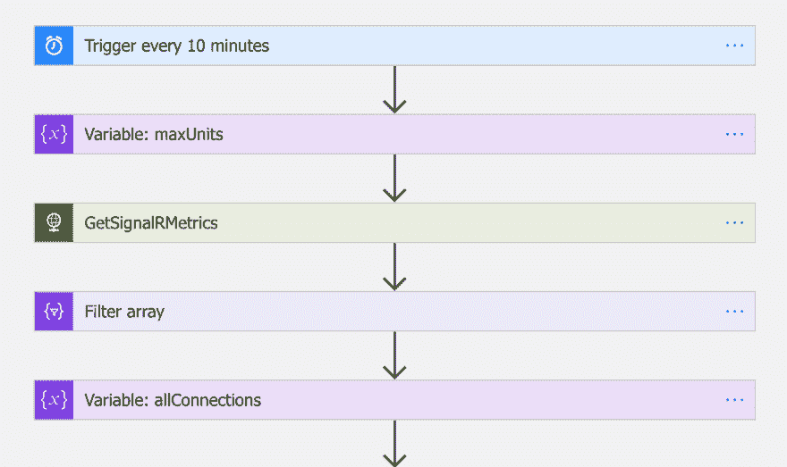
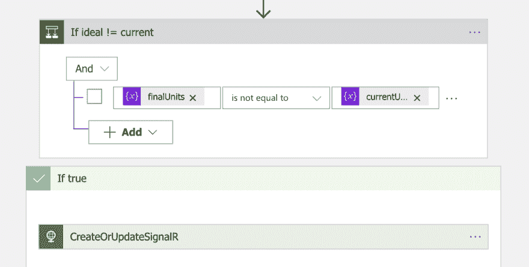

# 使用逻辑应用程序自动扩展 Azure SignalR 服务

> 原文：<https://dev.to/staff0rd/auto-scaling-azure-signalr-service-with-logic-apps-269h>

Azure SignalR 服务没有现成的自动扩展功能。在这篇文章中，我将使用 Azure Logic 应用程序实现我自己的自动缩放。

## 扩展 Azure SignalR 服务

微软[将](https://docs.microsoft.com/en-us/azure/azure-signalr/signalr-concept-scale-aspnet-core) Azure SignalR 服务宣传为扩展 SignalR 实现的简单方式，但是服务本身如何扩展呢？答案是单位:对于每个单位，Standard_S1 sku 接受另外 1，000 个并发连接。为了扩展，使用 Azure 门户、CLI、Azure Powershell 或 REST API 将单元数量提升到最大 100 (100k 并发连接)。

这里需要注意的是，该服务实际上只接受 1、2、5、10、20、50、100 的单位计数。你不能设置一个单位计数，比如说，3 或 60。此外，[定价](https://azure.microsoft.com/en-au/pricing/details/signalr-service/)包括每天每单位系数，这一天包括其中的一部分，因此，如果您将单位计数设置为 100，则当天您将被收取 100 x $ AUD2.21 澳元，即使您立即回滚到 1 个单位。这里的定价不是基于消费。

## 会自动缩放吗？

我不想自己在门户中或通过远程调用来扩展它，而是希望该服务能够基于并发连接数自动扩展，但是该服务不提供开箱即用的功能。

> 它目前不自动缩放。对你来说是不是一个阻碍？
> 
> —安东尼·楚(@ nthonyChu)[2019 年 7 月 6 日](https://twitter.com/nthonyChu/status/1147524475832770560?ref_src=twsrc%5Etfw)

因此，我内心懒惰和好奇的驱动力导致了一个 [Logic 应用程序的创建，它将为我自动扩展 SignalR 服务](https://github.com/staff0rd/azure-signalr-autoscale)，即使这样做不是一个好主意。

## 用逻辑应用程序自动化 Azure

[](https://res.cloudinary.com/practicaldev/image/fetch/s--cpheNeEp--/c_limit%2Cf_auto%2Cfl_progressive%2Cq_auto%2Cw_880/http://staffordwilliams.com/assets/logicapp.png)

[出处和用法在这里](https://github.com/staff0rd/azure-signalr-autoscale)，不过还是来看看这个逻辑 App 在做什么吧。

Logic Apps 没有可用于 SignalR 服务的连接器，因此我们将使用 [Azure REST API](https://docs.microsoft.com/en-us/rest/api/signalr/signalr) 来查询和修改它。我们感兴趣的有三个 REST 端点:

1.  获取 [monitor/metrics/list](https://docs.microsoft.com/en-us/rest/api/monitor/metrics/list) 以查询有多少个并发连接
2.  GET [signalr/get](https://docs.microsoft.com/en-us/rest/api/signalr/signalr/get) 查询当前单位设置；
3.  输入 [signalr/createorupdate](https://docs.microsoft.com/en-us/rest/api/signalr/signalr/createorupdate) 以更新单位计数。

Logic 应用程序中的其他所有东西都是决定我们是否需要调用上面的`PUT`的步骤，以及如果我们需要，我们将设置什么单元计数。

## 在我们扩大规模之前有多少连接？

我用来确定我们需要的单位数量的公式如下:

```
(CurrentConnections + BaseConnections + Buffer) / ConnectionsPerUnit 
```

其中:

*   `CurrentConnections`自上次运行以来，连接的最大连接数是多少
*   `BaseConnections`反映出无论连接数是多少，我们总是需要至少 1 个单元
*   `Buffer`是在扩展之前我们将获得的每单位最大连接数。我最初将它设置为 100，例如，达到 900 个连接将会添加另一个单元。经过测试表明，限制是软的，计数会上升到 10%以上，所以这可能更接近，或只是 0。
*   `ConnectionsPerUnit` = 1000

该公式产生一个理想的单位数，但是 Azure SignalR 服务只允许我们使用 1、2、5、10、20、50 或 100 个单位数，因此我们将选择一个大于或等于理想数的单位数。顺便提一下，我在测试中还发现 0 是一个有效的单元计数，但是这样做会阻止客户端和服务器连接到服务。

## 上下缩放

[](https://res.cloudinary.com/practicaldev/image/fetch/s--8-xaZOT---/c_limit%2Cf_auto%2Cfl_progressive%2Cq_auto%2Cw_880/http://staffordwilliams.com/assets/logicapp-end.png)

一旦我们确定了我们需要的单位数，我们将把它与当前的 SignalR 服务单位数进行比较。如果它们相等，那么就没什么可做的了。如果它们不同，我们将使用新的单元计数调用`createorupdate`端点，此时服务将重新加载，使用以下 HubException 断开所有当前连接:

> 连接终止，出现错误:Microsoft。AspNetCore . signalr . hub 异常:服务器关闭了连接，出现以下错误:ServiceReload

虽然断开连接听起来令人担忧，但实际上这种情况经常发生，客户端应用程序应该已经内置了重新连接实现。

## ARM 模板部署参数化

至少可以说，在设计器中编辑逻辑应用程序是令人沮丧的，因此首先将变量转换为[工作流定义语言参数](https://docs.microsoft.com/en-us/azure/logic-apps/logic-apps-workflow-definition-language#parameters)，然后转换为 [ARM 模板参数](https://docs.microsoft.com/en-us/azure/azure-resource-manager/resource-group-authoring-templates#parameters)非常耗时，但让我们可以从命令行传递参数并更新逻辑应用程序。将 ARM 参数直接嵌入到逻辑应用定义中[不是一个好主意](https://pacodelacruzag.wordpress.com/2017/10/11/preparing-azure-logic-apps-for-cicd/)。

然后，我们可以通过 CLI 调用部署逻辑应用程序，让它每 30 分钟运行一次并自动扩展，如下所示:

```
az group deployment create \
    --resource-group yourResourceGroup \
    --template-file template.json \
    --parameters @parameters.json \
    --parameters scaleInterval=30 
```

## 我会再做一次吗？

现在[已经存在了](https://github.com/staff0rd/azure-signalr-autoscale)，我可以毫不费力地自动扩展 SignalR 服务，但是缺乏对单位数量的精细控制，并且没有消费定价，这使得在给定的一天结束之前扩大规模成本高昂，缩小规模毫无意义。

在 Logic Apps 中构建这是一次学习经历，但是设计师和[工作流定义语言](https://docs.microsoft.com/en-us/azure/logic-apps/logic-apps-workflow-definition-language)有一些缺点，使得进展缓慢且令人沮丧。这包括将浮点数转换成整数的古怪解决方法[和没有函数`floor`或`round`的 WDL。当设计器无法显示动态变量、插入多余的`foreach`步骤、一旦步骤被另一个步骤引用就阻止对其进行重命名，以及无法编辑参数时，我发现自己一直在与设计器抗争。这些问题意味着我经常需要直接编辑底层的 JSON。](https://powerusers.microsoft.com/t5/Building-Flows/Type-Conversion-Errors-decimal-to-int/m-p/289227#M30341)

看看如何在 Azure 函数中使用 Az PowerShell 模块来实现同样的功能是很有趣的。