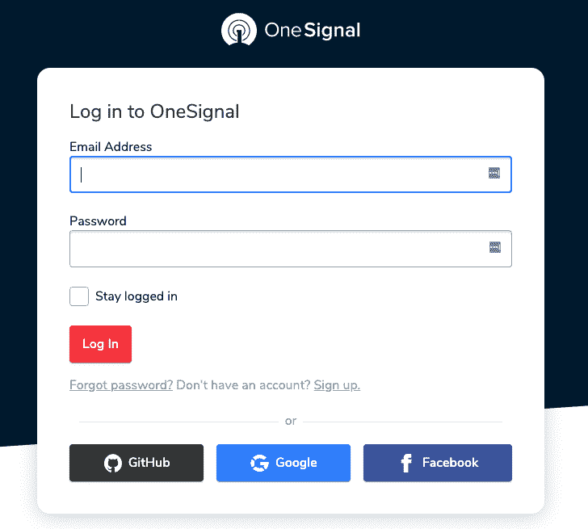
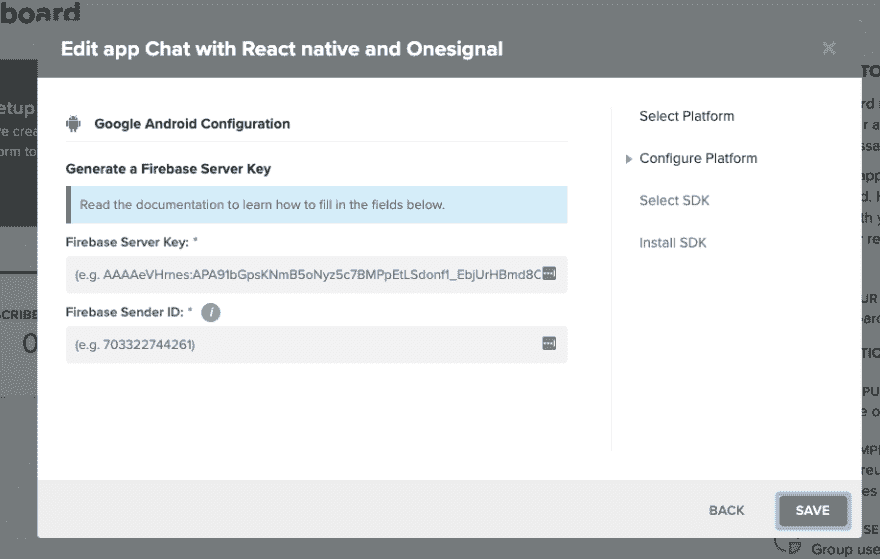
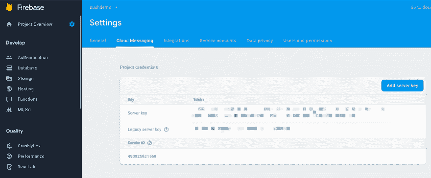
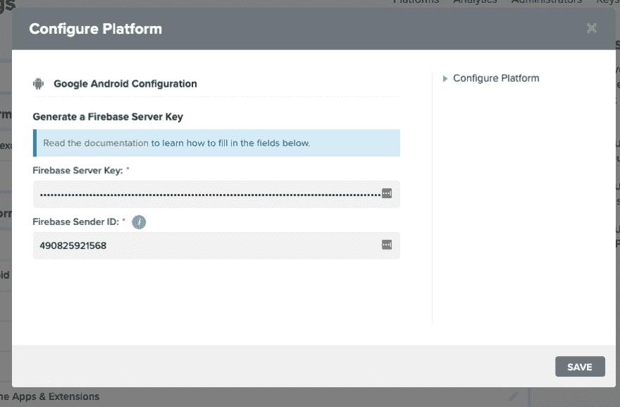
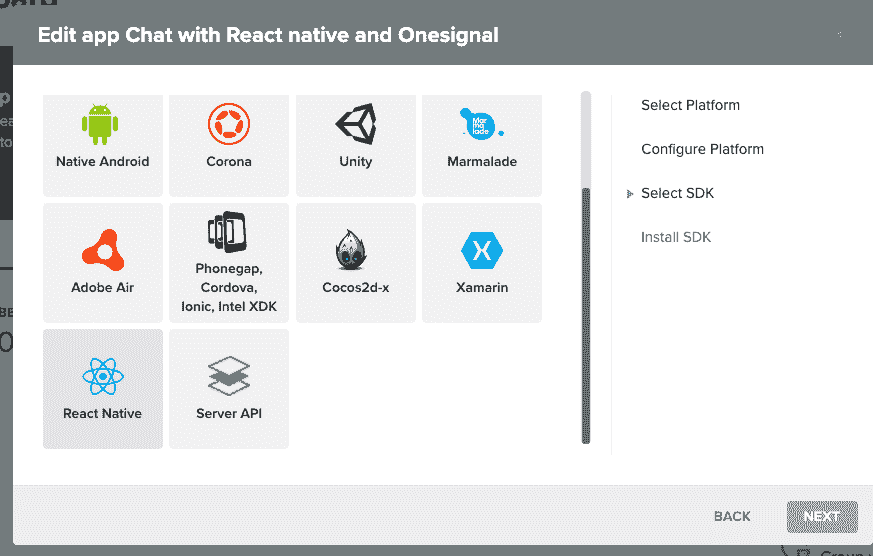
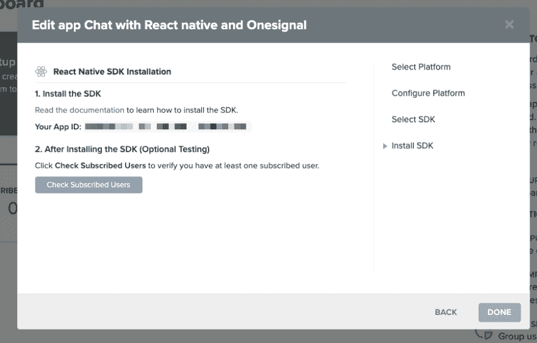
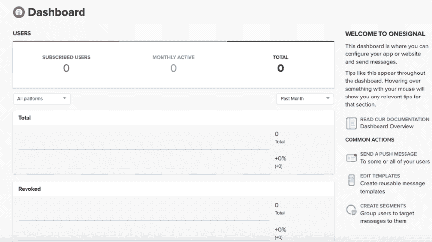

# 如何在 React 本地聊天应用中使用 OneSignal 第三部分

> 原文：<https://dev.to/kris/how-to-use-onesignal-with-a-react-native-chat-app-41ol>

### 获得全反应原生信使克隆体

想为 Android 和 iOS 开发一款有趣的消息应用吗？使用我们外观精美、功能齐全的[社交聊天应用模板](https://www.instamobile.io/app-templates/react-native-chat-app-template/)启动 react 原生聊天应用。它用 React Native 编写，具有强大的现成功能，如群聊、一对一聊天、照片消息和友谊管理。

在本教程中，我们将学习如何集成一个信号推送通知，以反应原生聊天应用程序项目。对于本教程，我们只打算使用 android 设备在 Android 平台上实现它。OneSignal 是一种流行的服务，它可以在设备上实现推送通知，抽象出设备运行的平台等细节。通过使用 OneSignal 插件，移动应用程序可以发送和接收推送通知。因此，我们将在 React 原生聊天应用中实现这种 OneSignal 服务，以实现推送通知。

### 前置要求

基本上，要将一个信号集成为本地信号，我们必须满足以下两个要求:

1.  起始代码
2.  android 硬件设备(因为 Android 模拟器太慢)

### 设置一个信号

第一步，我们将建立我们的单一信号服务。为此，我们需要登录 [Onesignal](https://app.onesignal.com/login) 网站，然后登录我们的 Onesignal 账户。请注意:如果您没有帐户，您可以通过注册他们的网站或使用谷歌、脸书或 Github 登录来轻松创建一个帐户，如下图所示:

登录后，我们需要创建一个新的应用程序。为此，首先，我们需要选择一个平台。这里，我们将选择“Google Android”平台，如下面的代码片段所示:

然后，我们需要 firebase 服务器密钥来建立 OneSignal 和 Firebase 云消息之间的通信，如下图所示:

对于 firebase 服务器密钥，我们需要转到 Firebase 控制台并创建一个 Firebase 应用程序。成功创建 Firebase 应用程序后，我们需要进入“设置”。然后，我们需要导航到“云消息”选项卡，复制**服务器密钥**和**发件人 id** ，如下图所示:

现在，我们需要返回到我们的 OneSignal 平台配置，并将 Firebase **服务器密钥**和**发送方 ID** 粘贴到 OneSignal 表单，如下图所示:

平台配置完成后，我们需要为我们的 OneSignal app 选择 SDK。这里，我们将选择 **React native SDK** 作为我们的应用 SDK。

在选择 SDK 之后，我们获得了用于发送推送通知的 AppID，如下面的屏幕截图所示:

现在，我们需要点击“完成”按钮，导航至我们的 OneSignal 仪表盘，如下图所示:

在此之后，我们需要转到 React native SDK [文档](https://documentation.onesignal.com/docs/react-native-sdk-setup)并向我们的应用程序添加一个信号代码片段代码，如下面的代码片段所示: