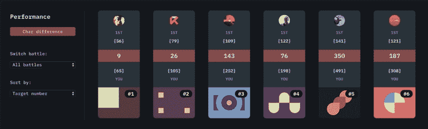
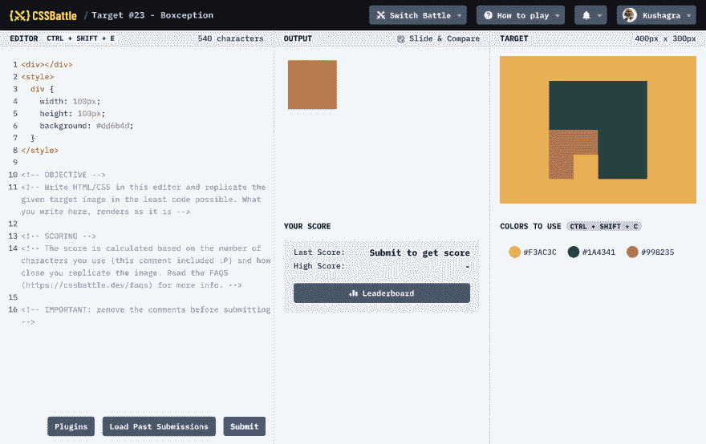

# 介绍 CSSBattle PRO

> 原文：<https://dev.to/chinchang/introducing-cssbattle-pro-4i1i>

我们很自豪地向您介绍 [CSSBattle PRO](https://cssbattle.dev/pro) ，在这里您可以升级您的 CSS battle 🥳.体验对于那些以前没有听说过 CSSBattle 的人来说，CSSBattle 是第一个面向 CSS 爱好者的代码高尔夫游戏。

[CSSBattle PRO](https://cssbattle.dev/pro) 为您提供以下功能:

## 向代码编辑器添加插件🔌

使用插件，您可以添加自定义脚本来增强编辑器，并使其更快地达到优化的解决方案。例如，您可以使用它来自动缩小您的代码或将单位转换为更小的字符单位。这里有一个简单的缩略脚本来帮助你开始:

```
function run(code) {
    processedCode = code
      .replace(/\<\!--\s*?[^\s?\[][\s\S]*?--\>/g,'')
      .replace(/\>\s*\</g,'><')
      .replace(/\/\*.*\*\/|\/\*[\s\S]*?\*\/|\n|\t|\v|\s{2,}/g,'')
      .replace(/\s*\{\s*/g,'{')
      .replace(/\s*\}\s*/g,'}')
      .replace(/\s*\:\s*/g,':')
      .replace(/\s*\;\s*/g,';')
      .replace(/\s*\,\s*/g,',')
      .replace(/\s*\~\s*/g,'~')
      .replace(/\s*\>\s*/g,'>')
      .replace(/\s*\+\s*/g,'+')
      .replace(/\s*\!\s*/g,'!')

  return processedCode;
} 
```

## 高级目标统计📊

使用这些高级统计数据，鸟瞰你在战斗中的表现。看看你哪里表现好，哪里落后。它看起来是这样的:

[](https://res.cloudinary.com/practicaldev/image/fetch/s---utc-2f8--/c_limit%2Cf_auto%2Cfl_progressive%2Cq_auto%2Cw_880/https://cssbattle.dev/blimg/2019/introducing-pro-1.png)

## 灯光主题☀️🌙

这是我们最喜欢的功能之一！你可以在亮暗主题之间切换，随心所欲地定制体验。这是灯光主题的样子:

[](https://res.cloudinary.com/practicaldev/image/fetch/s--MYhnRwdT--/c_limit%2Cf_auto%2Cfl_progressive%2Cq_auto%2Cw_880/https://cssbattle.dev/blimg/2019/introducing-pro-2.png)

## 亲徽🎖

除了以上所有功能，你还会在你的名字旁边得到一个闪亮的`PRO`徽章，无论它出现在 CSSBattle 的哪个地方。 [](https://res.cloudinary.com/practicaldev/image/fetch/s--H0wX8fHL--/c_limit%2Cf_auto%2Cfl_progressive%2Cq_auto%2Cw_880/https://cssbattle.dev/blimg/2019/pro-badge.svg)

## 即将推出的功能

我们还计划很快添加这些功能，这将使您的专业体验更好。

*   **创建公共社区目标**:使用自己的规则为社区创建自己的目标。所有的目标都将由社区来评定，我们每周都会推出新的目标。
*   组织你自己的战斗:与你自己的目标创建你自己的自定义战斗，或者从社区目标中选择。你也可以让它只被邀请，这是一个很好的会议或工作场所。

你可以以 3 美元/月的价格升级到 [CSSBattle PRO](https://cssbattle.dev/pro) (这是一个特别的上市价格)。该价格将来可能会根据功能变化，但如果您决定现在升级，该价格将保持不变。

我们希望你喜欢 CSSBattle PRO！

## 赠品🎁

为了庆祝发布，我们将向转发以下推文的 5 名幸运玩家赠送 1 个月的免费使用权！

> CSS battle@ CSS _ battle🥁玩家！我们为您带来了:“CSSBattle PRO”-升级您的 CSS battle 游戏体验🔥
> 📢[cssbattle.dev/blog/introduci…](https://t.co/1W3IBMcfXI)T15】🎁[赠品]为了庆祝发布，我们将给予转发此推文的 5 名幸运玩家 1 个月的免费使用权！我们走吧！🥳[# CSS battle challenge](https://twitter.com/hashtag/CSSBattleChallenge)⚔️2019 年 7 月 11 日上午 09:29[](https://twitter.com/intent/tweet?in_reply_to=1149249241530929152)[](https://twitter.com/intent/retweet?tweet_id=1149249241530929152)8[](https://twitter.com/intent/like?tweet_id=1149249241530929152)3