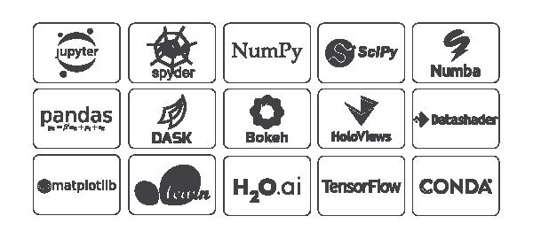
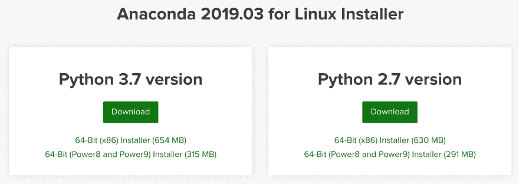
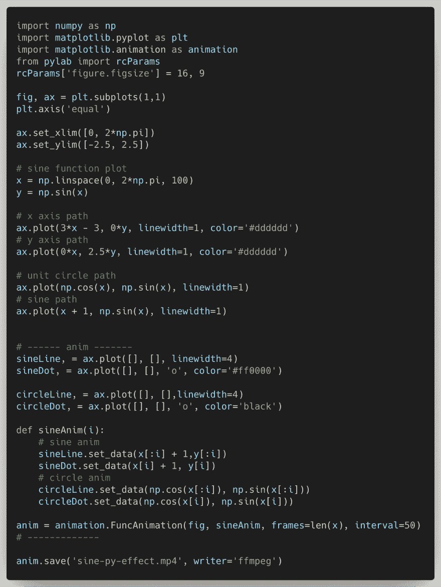
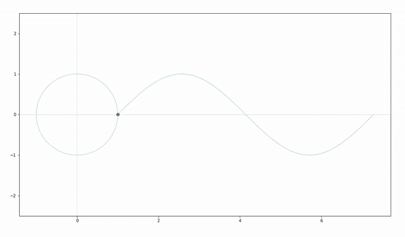

# 使用 Python 实现正弦函数可视化

> 原文：<https://dev.to/avantcontra/sine-function-visualization-using-python-2ogo>

**【编码德鲁伊】**系列是我的**横向编程**练习笔记，每一部分都围绕一个主题像数学、物理、电子、图形、声音等。，用几种编程语言实现。

* * *

**编码德鲁伊**
部分:数学
章节:三角函数
部分:Python

*在其他部分，我用 [MaxMSP](https://www.patreon.com/posts/sine-function-28131990/) 、 [JavaScript(React)](https://www.patreon.com/posts/sine-function-28178275) 、 [Unity3D](https://www.patreon.com/posts/sine-function-28291611) :* 可视化了三角函数(正弦和单位圆)

这次我用 Python 来实现。

为了快速的目标，直接 Google“python 数据可视化 lib”这些关键词，得到 lib，在 github 中按星数排序，找到老强 [Matplotlib](https://matplotlib.org/) 。所以，这是如此愉快的决定。

**matplopplib 安装**

考虑到后续练习，我选择了 [Anaconda](https://www.anaconda.com) 提供的全家桶安装方式。它包括一堆与科学数据分析相关的库，包括 Matplotlib。

由于最近没有固定的工作计算机和位置，我部署了一个远程开发环境(VSCode Remote rocks！).代码在 Azure 服务器上部署和运行。我只是用一个旧笔记本编辑代码，查看效果。因此，我选择 Linux 版本作为服务器环境。

**注意**，这里首选左边的 Python 3.x 版本，因为 Matplotlib 3.0 及以上版本只支持 Python 3。

> Matplotlib 3.0 仅适用于 Python 3。
> 
> 对于 Python 2 支持，Matplotlib 2.2.x 将继续作为 LTS 版本，并更新了错误修复，直到 2020 年 1 月 1 日。

然后你可以在 Matplotlib 安装后开始编码。

(其实写了几行，发现远程开发 Python，还是不方便实时查看结果图形。于是我也在浏览器里直接安装了 [Jupyter 笔记本](https://jupyter.org/)和编码，所见即所得。)

此外，还安装了 ffmpeg，将 Matplotlib 获得的动画保存到 mp4。
还用 Anaconda 安装了 ffmpeg。
`conda install -c conda-forge ffmpeg`

用 Matplotlib，正弦函数动画部分，其实代码不在少数。最多的其实就是坐标配置，以及画一些辅助线之类的。

基本上是根据教程和一些参考文章来编码的。这个库的特点，大部分思想都集中在数学公式本身的算法逻辑上。

一篇不错的参考文章:
[用 Matplotlib 制作的动画](https://towardsdatascience.com/animations-with-matplotlib-d96375c5442c)

**最终效果**:

* * *

空谈是廉价的。给我看看代码！

“编码德鲁伊”系列的这个演示是在这里开源的:
[https://github.com/avantcontra/coding-druid](https://github.com/avantcontra/coding-druid)

你可以在我的网站[floatbug.com](https://www.floatbug.com)找到更多资源。
或者你可以**在我的[店里给我买杯咖啡](https://www.patreon.com/avantcontra)**。你的鼓励是我前进的动力！

干杯~

反政府人员

*   网址:[floatbug.com](https://www.floatbug.com)
*   Github: [avantcontra](https://github.com/avantcontra)
*   Facebook:[avantt entra](https://facebook.com/avantcontra)
*   推特: [avantcontra](https://twitter.com/avantcontra)
*   Instagram: [avantcontra](https://www.instagram.com/avantcontra)
*   给我买一个提议