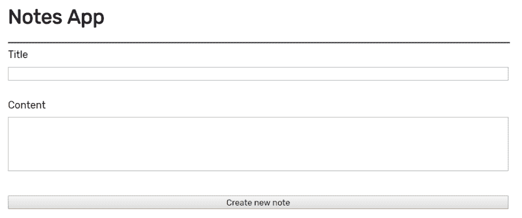
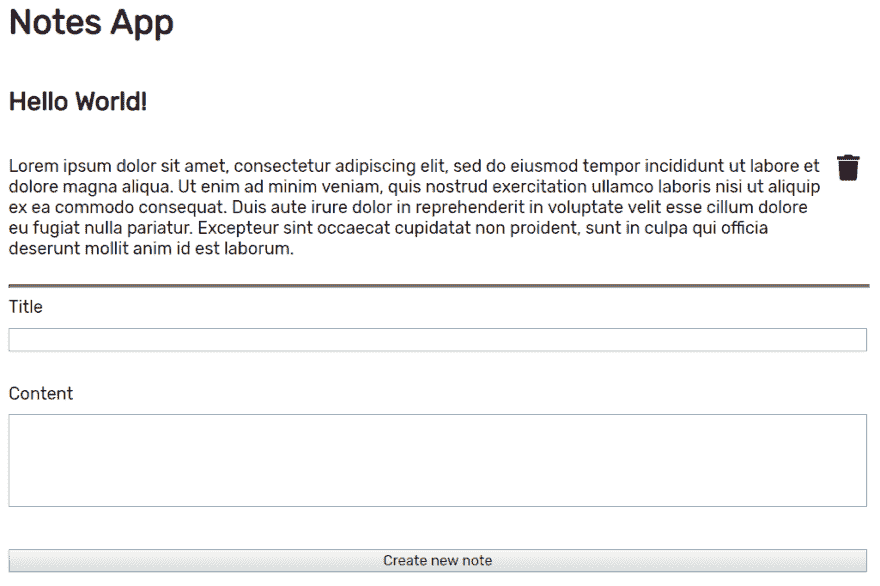

# 注意 App -第 2 部分:React 站点

> 原文：<https://dev.to/akhilaariyachandra/note-app-part-2-the-react-site-29mn>

> PS -这是最初贴在我的[博客](https://akhilaariyachandra.com/note-app-part-2-setup-the-react-site/)上的。如果您想了解 React 和 JavaScript 的更多信息，请查看它！

**TL；dr**——克隆并运行[源代码](https://github.com/akhila-ariyachandra/note-web)。

在本系列的第二部分中，我们将创建一个带有 React 的站点，使用我们的节点 API 来创建和查看注释。在之前的[帖子](https://akhilaariyachandra.com/post/note-app-part-1-setup-the-node-api)中，我们为应用程序创建了 API。

# 先决条件

*   来自前一个 [post](https://akhilaariyachandra.com/post/note-app-part-1-setup-the-node-api) 的节点 API 必须启动并运行
*   按照我的[指南](https://akhilaariyachandra.com/post/getting-started-in-react-with-parcel-js)设置项目
*   对[反应钩子](https://reactjs.org/docs/hooks-intro.html)的基本了解

# 设置

首先，我们需要用捆绑器设置 React 项目。我们将要使用的捆扎机是[包裹](https://parceljs.org/)，因为它需要很少的设置。跟随我的[向导](https://akhilaariyachandra.com/post/getting-started-in-react-with-parcel-js)开始吧。

在您完成设置 React with Parcel 后，我们将需要一些附加的依赖项。

```
yarn add axios formik react-icons 
```

<svg width="20px" height="20px" viewBox="0 0 24 24" class="highlight-action crayons-icon highlight-action--fullscreen-on"><title>Enter fullscreen mode</title></svg> <svg width="20px" height="20px" viewBox="0 0 24 24" class="highlight-action crayons-icon highlight-action--fullscreen-off"><title>Exit fullscreen mode</title></svg>

```
yarn add sass -D 
```

<svg width="20px" height="20px" viewBox="0 0 24 24" class="highlight-action crayons-icon highlight-action--fullscreen-on"><title>Enter fullscreen mode</title></svg> <svg width="20px" height="20px" viewBox="0 0 24 24" class="highlight-action crayons-icon highlight-action--fullscreen-off"><title>Exit fullscreen mode</title></svg>

*   `axios`用于对 API 进行请求
*   `formik`用于通过处理表单使创建新便笺更容易
*   `react-icons`将需要一个用于删除注释按钮的图标
*   将需要`sass`来编译`.scss`文件，我们将使用它来设计应用程序的样式

让我们创建一个`axios`的实例，这样我们就不必为所有网络请求输入基本 URL。在`src`文件夹中创建另一个文件夹`services`，在该文件夹中创建`api.js`文件并添加以下代码。

```
import axios from "axios";

const api = axios.create({
  baseURL: "http://localhost:8080"
});

export default api; 
```

<svg width="20px" height="20px" viewBox="0 0 24 24" class="highlight-action crayons-icon highlight-action--fullscreen-on"><title>Enter fullscreen mode</title></svg> <svg width="20px" height="20px" viewBox="0 0 24 24" class="highlight-action crayons-icon highlight-action--fullscreen-off"><title>Exit fullscreen mode</title></svg>

我们还需要改变应用程序的字体和标题。在`index.html`中添加链接到**魔方**字体文件和一个新标题。在`<head>`和`</head>`之间加上这些。

```
<link
  href="https://fonts.googleapis.com/css?family=Rubik&display=swap"
  rel="stylesheet"
/>

<title>Note App</title> 
```

<svg width="20px" height="20px" viewBox="0 0 24 24" class="highlight-action crayons-icon highlight-action--fullscreen-on"><title>Enter fullscreen mode</title></svg> <svg width="20px" height="20px" viewBox="0 0 24 24" class="highlight-action crayons-icon highlight-action--fullscreen-off"><title>Exit fullscreen mode</title></svg>

最后`src/index.html`应该是这个样子。

```
<!DOCTYPE html>
<html lang="en">
  <head>
    <meta charset="UTF-8" />
    <meta
      name="viewport"
      content="minimum-scale=1, initial-scale=1, width=device-width, shrink-to-fit=no"
    />

    <link
      href="https://fonts.googleapis.com/css?family=Rubik&display=swap"
      rel="stylesheet"
    />

    <title>Note App</title>
  </head>
  <body>
    <div id="root"></div>
    <script src="index.js"></script>
  </body>
</html> 
```

<svg width="20px" height="20px" viewBox="0 0 24 24" class="highlight-action crayons-icon highlight-action--fullscreen-on"><title>Enter fullscreen mode</title></svg> <svg width="20px" height="20px" viewBox="0 0 24 24" class="highlight-action crayons-icon highlight-action--fullscreen-off"><title>Exit fullscreen mode</title></svg>

# 便签 App

现在我们可以开始处理反应部分了。

首先，我们需要想出如何存储笔记列表。我们可以使用`useState`来存储列表，但是我们将使用`useReducer`来简化和捆绑更新列表的所有不同方式。

在`src/App.js`中，将反应输入更改为

```
import React, { useReducer } from "react"; 
```

<svg width="20px" height="20px" viewBox="0 0 24 24" class="highlight-action crayons-icon highlight-action--fullscreen-on"><title>Enter fullscreen mode</title></svg> <svg width="20px" height="20px" viewBox="0 0 24 24" class="highlight-action crayons-icon highlight-action--fullscreen-off"><title>Exit fullscreen mode</title></svg>

然后让我们声明初始状态和减速器

```
const initialState = {
  notesList: []
};

const reducer = (state, action) => {
  let { notesList } = state;

  switch (action.type) {
    case "refresh":
      notesList = [...action.payload];
      break;
    case "add":
      notesList = [...notesList, action.payload];
      break;
    case "remove":
      notesList = notesList.filter(note => note._id !== action.payload._id);
      break;
  }

  return { notesList };
}; 
```

<svg width="20px" height="20px" viewBox="0 0 24 24" class="highlight-action crayons-icon highlight-action--fullscreen-on"><title>Enter fullscreen mode</title></svg> <svg width="20px" height="20px" viewBox="0 0 24 24" class="highlight-action crayons-icon highlight-action--fullscreen-off"><title>Exit fullscreen mode</title></svg>

最初我们将在状态中保存一个空数组。reducer 将有三个动作，`"refresh"`在应用加载时获取笔记列表，`"add"`向列表添加新的笔记，`"remove"`删除笔记。在`"add"`和`"remove"`的情况下，我们可以在做了它们之后刷新整个列表，但是这是不必要的，也是对网络调用的浪费。

将状态添加到`App`和

```
const App = () => {
  const [state, dispatch] = useReducer(reducer, initialState); 
```

<svg width="20px" height="20px" viewBox="0 0 24 24" class="highlight-action crayons-icon highlight-action--fullscreen-on"><title>Enter fullscreen mode</title></svg> <svg width="20px" height="20px" viewBox="0 0 24 24" class="highlight-action crayons-icon highlight-action--fullscreen-off"><title>Exit fullscreen mode</title></svg>

接下来，我们需要在应用程序加载时加载笔记列表。我们可以用钩子。我们需要导入之前创建的`useEffect`和`axios`实例。

```
import React, { useReducer, useEffect } from "react";
import api from "./services/api"; 
```

<svg width="20px" height="20px" viewBox="0 0 24 24" class="highlight-action crayons-icon highlight-action--fullscreen-on"><title>Enter fullscreen mode</title></svg> <svg width="20px" height="20px" viewBox="0 0 24 24" class="highlight-action crayons-icon highlight-action--fullscreen-off"><title>Exit fullscreen mode</title></svg>

在`App`中的`return`前添加以下代码。

```
const getAllNotes = async () => {
  try {
    const response = await api.request({ url: "/note" });

    dispatch({ type: "refresh", payload: response.data });
  } catch (error) {
    console.error("Error fetching notes", error);
  }
};

useEffect(() => {
  getAllNotes();
}, []); 
```

<svg width="20px" height="20px" viewBox="0 0 24 24" class="highlight-action crayons-icon highlight-action--fullscreen-on"><title>Enter fullscreen mode</title></svg> <svg width="20px" height="20px" viewBox="0 0 24 24" class="highlight-action crayons-icon highlight-action--fullscreen-off"><title>Exit fullscreen mode</title></svg>

我们在这里所做的就是在组件挂载时获取注释列表，并使用带有`"refresh"`的 reducer 更新状态。`useEffect`中`[]`的第二个参数防止这个效果多次运行。

现在我们正在加载笔记，我们需要显示它们。在`return`中，添加以下内容

```
<main>
  <h1>Notes App</h1>

  {state.notesList.map(note => (
    <div key={note._id} className="note">
      <div className="container">
        <h2>{note.title}</h2>
        <p>{note.content}</p>
      </div>
    </div>
  ))}
</main> 
```

<svg width="20px" height="20px" viewBox="0 0 24 24" class="highlight-action crayons-icon highlight-action--fullscreen-on"><title>Enter fullscreen mode</title></svg> <svg width="20px" height="20px" viewBox="0 0 24 24" class="highlight-action crayons-icon highlight-action--fullscreen-off"><title>Exit fullscreen mode</title></svg>

我们目前没有要加载的注释，所以让我们在页面上添加一个页脚，在这里我们可以创建新的注释。

首先我们需要导入`formik`,这将使处理表单更加容易。

```
import { Formik } from "formik"; 
```

<svg width="20px" height="20px" viewBox="0 0 24 24" class="highlight-action crayons-icon highlight-action--fullscreen-on"><title>Enter fullscreen mode</title></svg> <svg width="20px" height="20px" viewBox="0 0 24 24" class="highlight-action crayons-icon highlight-action--fullscreen-off"><title>Exit fullscreen mode</title></svg>

然后让我们添加 UI 和逻辑来创建新的注释。将此内容添加到`<main>`标签之后。

```
<footer>
  <Formik
    initialValues={{ title: "", content: "" }}
    validate={values => {
      let errors = {};

      if (!values.title) {
        errors.title = "Title is required";
      }

      if (!values.content) {
        errors.content = "Content is required";
      }

      return errors;
    }}
    onSubmit={async (values, { setSubmitting, resetForm }) => {
      try {
        const response = await api.request({
          url: "/note",
          method: "post",
          data: {
            title: values.title,
            content: values.content
          }
        });

        dispatch({ type: "add", payload: response.data });
        resetForm();
      } catch (error) {
        console.error("Error creating note", error);
      } finally {
        setSubmitting(false);
      }
    }}
  >
    {({
      values,
      errors,
      touched,
      handleChange,
      handleBlur,
      handleSubmit,
      isSubmitting
    }) => (
      <form onSubmit={handleSubmit}>
        <label for="title">Title</label>
        <input
          type="text"
          name="title"
          id="title"
          onChange={handleChange}
          onBlur={handleBlur}
          value={values.title}
        />
        {errors.title && touched.title && errors.title}

        <br />

        <label for="content">Content</label>
        <textarea
          rows={5}
          name="content"
          id="content"
          onChange={handleChange}
          onBlur={handleBlur}
          value={values.content}
        />
        {errors.content && touched.content && errors.content}

        <br />

        <button type="submit" disabled={isSubmitting}>
          Create new note
        </button>
      </form>
    )}
  </Formik>
</footer> 
```

<svg width="20px" height="20px" viewBox="0 0 24 24" class="highlight-action crayons-icon highlight-action--fullscreen-on"><title>Enter fullscreen mode</title></svg> <svg width="20px" height="20px" viewBox="0 0 24 24" class="highlight-action crayons-icon highlight-action--fullscreen-off"><title>Exit fullscreen mode</title></svg>

`formik`将处理表单中的所有值，包括验证和提交以创建注释。

我们还需要将`main`和`footer`分开，所以在它们之间添加这个。

```
<hr /> 
```

<svg width="20px" height="20px" viewBox="0 0 24 24" class="highlight-action crayons-icon highlight-action--fullscreen-on"><title>Enter fullscreen mode</title></svg> <svg width="20px" height="20px" viewBox="0 0 24 24" class="highlight-action crayons-icon highlight-action--fullscreen-off"><title>Exit fullscreen mode</title></svg>

最后，我们需要能够删除创建的笔记，所以我们将为每个笔记添加一个删除按钮。首先我们需要在`return`之前添加删除功能。

```
const removeNote = async id => {
  try {
    const response = await api.request({
      url: `/note/${id}`,
      method: "delete"
    });

    dispatch({ type: "remove", payload: response.data });
  } catch (error) {
    console.error("Error deleting note", error);
  }
}; 
```

<svg width="20px" height="20px" viewBox="0 0 24 24" class="highlight-action crayons-icon highlight-action--fullscreen-on"><title>Enter fullscreen mode</title></svg> <svg width="20px" height="20px" viewBox="0 0 24 24" class="highlight-action crayons-icon highlight-action--fullscreen-off"><title>Exit fullscreen mode</title></svg>

我们需要一个删除注释的图标，所以我们将从`react-icons`导入一个。

```
import { FaTrash } from "react-icons/fa"; 
```

<svg width="20px" height="20px" viewBox="0 0 24 24" class="highlight-action crayons-icon highlight-action--fullscreen-on"><title>Enter fullscreen mode</title></svg> <svg width="20px" height="20px" viewBox="0 0 24 24" class="highlight-action crayons-icon highlight-action--fullscreen-off"><title>Exit fullscreen mode</title></svg>

然后更改音符组件。

```
<div key={note._id} className="note">
  <div className="container">
    <h2>{note.title}</h2>
    <p>{note.content}</p>
  </div>

  <button onClick={() => removeNote(note._id)}>
    <FaTrash />
  </button>
</div> 
```

<svg width="20px" height="20px" viewBox="0 0 24 24" class="highlight-action crayons-icon highlight-action--fullscreen-on"><title>Enter fullscreen mode</title></svg> <svg width="20px" height="20px" viewBox="0 0 24 24" class="highlight-action crayons-icon highlight-action--fullscreen-off"><title>Exit fullscreen mode</title></svg>

作为应用程序的最后一部分，让我们添加一些样式。用下面的代码在`src`中创建`App.scss`。

```
body {
  font-family: "Rubik", sans-serif;
  max-width: 800px;
  margin: auto;
}

main {
  .note {
    display: flex;
    flex-direction: row;
    align-items: center;

    .container {
      display: flex;
      flex-direction: column;
      flex: 1;
    }

    button {
      font-size: 1.5em;
      border: 0;
      background: none;
      box-shadow: none;
      border-radius: 0px;
    }

    button:hover {
      color: red;
    }
  }
}

hr {
  height: 1px;
  width: 100%;
  color: grey;
  background-color: grey;
  border-color: grey;
}

footer > form {
  display: flex;
  flex-direction: column;
  width: 100%;
  max-width: 800px;

  input,
  button,
  textarea {
    margin: 10px 0px 10px 0px;
    font-family: "Rubik", sans-serif;
  }

  textarea {
    resize: none;
  }
} 
```

<svg width="20px" height="20px" viewBox="0 0 24 24" class="highlight-action crayons-icon highlight-action--fullscreen-on"><title>Enter fullscreen mode</title></svg> <svg width="20px" height="20px" viewBox="0 0 24 24" class="highlight-action crayons-icon highlight-action--fullscreen-off"><title>Exit fullscreen mode</title></svg>

然后在`App.js`中导入。

```
import "./App.scss"; 
```

<svg width="20px" height="20px" viewBox="0 0 24 24" class="highlight-action crayons-icon highlight-action--fullscreen-on"><title>Enter fullscreen mode</title></svg> <svg width="20px" height="20px" viewBox="0 0 24 24" class="highlight-action crayons-icon highlight-action--fullscreen-off"><title>Exit fullscreen mode</title></svg>

最后你的`App.js`应该是这样的。

```
// src/App.js
import React, { useReducer, useEffect } from "react";
import api from "./services/api";
import { Formik } from "formik";
import { FaTrash } from "react-icons/fa";
import "./App.scss";

const initialState = {
  notesList: []
};

const reducer = (state, action) => {
  let { notesList } = state;

  switch (action.type) {
    case "refresh":
      notesList = [...action.payload];
      break;
    case "add":
      notesList = [...notesList, action.payload];
      break;
    case "remove":
      notesList = notesList.filter(note => note._id !== action.payload._id);
      break;
  }

  return { notesList };
};

const App = () => {
  const [state, dispatch] = useReducer(reducer, initialState);

  const getAllNotes = async () => {
    try {
      const response = await api.request({ url: "/note" });

      dispatch({ type: "refresh", payload: response.data });
    } catch (error) {
      console.error("Error fetching notes", error);
    }
  };

  const removeNote = async id => {
    try {
      const response = await api.request({
        url: `/note/${id}`,
        method: "delete"
      });

      dispatch({ type: "remove", payload: response.data });
    } catch (error) {
      console.error("Error deleting note", error);
    }
  };

  useEffect(() => {
    getAllNotes();
  }, []);

  return (
    <div>
      <main>
        <h1>Notes App</h1>

        {state.notesList.map(note => (
          <div key={note._id} className="note">
            <div className="container">
              <h2>{note.title}</h2>
              <p>{note.content}</p>
            </div>

            <button onClick={() => removeNote(note._id)}>
              <FaTrash />
            </button>
          </div>
        ))}
      </main>

      <hr />

      <footer>
        <Formik
          initialValues={{ title: "", content: "" }}
          validate={values => {
            let errors = {};

            if (!values.title) {
              errors.title = "Title is required";
            }

            if (!values.content) {
              errors.content = "Content is required";
            }

            return errors;
          }}
          onSubmit={async (values, { setSubmitting, resetForm }) => {
            try {
              const response = await api.request({
                url: "/note",
                method: "post",
                data: {
                  title: values.title,
                  content: values.content
                }
              });

              dispatch({ type: "add", payload: response.data });
              resetForm();
            } catch (error) {
              console.error("Error creating note", error);
            } finally {
              setSubmitting(false);
            }
          }}
        >
          {({
            values,
            errors,
            touched,
            handleChange,
            handleBlur,
            handleSubmit,
            isSubmitting
          }) => (
            <form onSubmit={handleSubmit}>
              <label for="title">Title</label>
              <input
                type="text"
                name="title"
                id="title"
                onChange={handleChange}
                onBlur={handleBlur}
                value={values.title}
              />
              {errors.title && touched.title && errors.title}

              <br />

              <label for="content">Content</label>
              <textarea
                rows={5}
                name="content"
                id="content"
                onChange={handleChange}
                onBlur={handleBlur}
                value={values.content}
              />
              {errors.content && touched.content && errors.content}

              <br />

              <button type="submit" disabled={isSubmitting}>
                Create new note
              </button>
            </form>
          )}
        </Formik>
      </footer>
    </div>
  );
};

export default App; 
```

<svg width="20px" height="20px" viewBox="0 0 24 24" class="highlight-action crayons-icon highlight-action--fullscreen-on"><title>Enter fullscreen mode</title></svg> <svg width="20px" height="20px" viewBox="0 0 24 24" class="highlight-action crayons-icon highlight-action--fullscreen-off"><title>Exit fullscreen mode</title></svg>

# 运行 app

让我们通过运行命令
来启动应用程序

```
yarn dev 
```

<svg width="20px" height="20px" viewBox="0 0 24 24" class="highlight-action crayons-icon highlight-action--fullscreen-on"><title>Enter fullscreen mode</title></svg> <svg width="20px" height="20px" viewBox="0 0 24 24" class="highlight-action crayons-icon highlight-action--fullscreen-off"><title>Exit fullscreen mode</title></svg>

当你参观`http://localhost:1234/`时，你应该看看

[](https://res.cloudinary.com/practicaldev/image/fetch/s--Zm3Ht0u8--/c_limit%2Cf_auto%2Cfl_progressive%2Cq_auto%2Cw_880/https://res.cloudinary.com/dv1ustbp5/image/upload/v1562848897/blog/note%2520app%2520part%25202/Running_the_app_wcxyxe.png)

创建注释后，它应该如下所示

[](https://res.cloudinary.com/practicaldev/image/fetch/s--qMoW8NWe--/c_limit%2Cf_auto%2Cfl_progressive%2Cq_auto%2Cw_880/https://res.cloudinary.com/dv1ustbp5/image/upload/v1562849314/blog/note%2520app%2520part%25202/note_preview_vuh5hp.png)