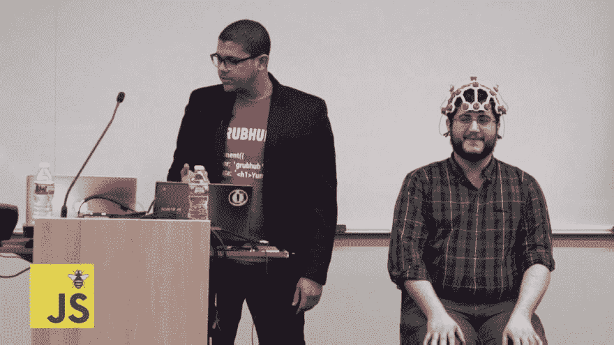
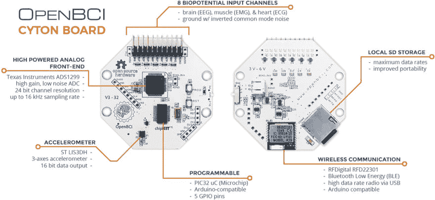
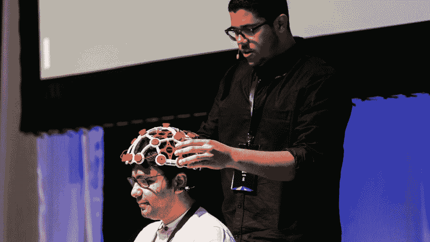
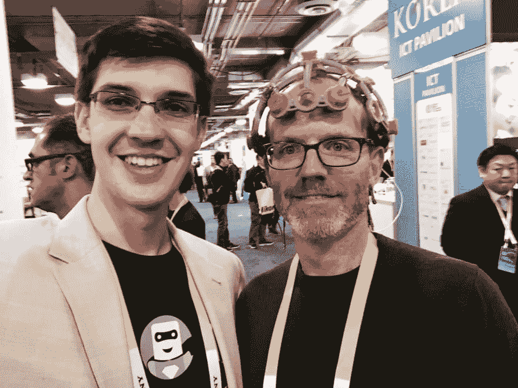

# 神经 JavaScript——解读人脑

> 原文：<https://dev.to/thisdotmedia/neurojavascript-reading-the-human-brain-5hb7>

阿历克斯·卡斯蒂洛( [@castillo__io](https://twitter.com/castillo__io) )是网飞的一名软件工程师，祖籍多明尼加共和国。他可能听起来像一个典型的工程师，但在业余时间，Alex 致力于 NeuroJavaScript。他通过 [OpenBCI 项目](http://openbci.com/)(开放脑计算机接口)对人类大脑的研究有朝一日可能会拯救你的生命。事实上，他的软件已经被医生用来在手术过程中可视化神经反馈。

近年来，对人脑有意义的研究仅限于科学家和医生。造成这种情况的主要原因是高昂的入门费用、缺乏设备以及入门教育有限。举例来说，从历史上看，检测大脑电活动的脑电图传感器至少要花费 3 万美元。

现在，一个负担得起的解决方案出现了，它被称为 OpenBCI。OpenBCI 是一个开源的大脑计算机接口，它为任何想尝试这项技术的人提供硬件和软件。

工程师、艺术家或任何表示感兴趣的人从来没有机会以一种能够对科学和医疗行业产生影响的方式来研究人体。OpenBCI 允许任何感兴趣的人购买从人体提取数据所需的生物传感器和头盔。这与 JavaScript、数据可视化和机器学习等技术相结合，提供了改变科学和医学世界的门户。

虽然 OpenBCI 是技术不可知的，可以用于任何语言(C、python、java 等)，但 Alex 创造了 NeuroJavaScript 这个术语，以宣传他在 JavaScript 社区中使用 OpenBCI 所做的工作。

“对于 JavaScript 开发人员来说，OpenBCI 使科学工作变得像与另一个 API 交互一样简单。研究人类大脑的科学家已经了解科学，JavaScript 行业充满了聪明和热情的人，他们能够用技术来帮助发展科学，以进一步推进发现。作为技术人员，我们现在可以获得科学，但因为我们不是科学家，我们能够以不同的方式处理同样的问题。这有望让我们以世界尚未想象的方式解决问题。”

通过向大众提供技术，并允许那些不是特别专注于大脑研究等特定领域的制造商和创新者，我们能够推动技术的发展，使其成长，以便我们能够更多地了解人类大脑，并为医疗行业做出贡献。愿景和希望是能够比以前更快地诊断疾病，识别人类大脑的模式及其工作方式，正如亚历克斯所说，“利用我们自己身体的能量和数据的海洋”。

NeuroJavaScript 仍然是一个新概念，可以使用更多的开源贡献者。目前，在网络浏览器中可视化脑电波的工作正在进行，但我们离通过这些传感器理解人类情感不远了。想象一下，通过过滤脑电波来诊断疾病，这种方式允许我们识别某些疾病。想象一下这样一个世界，你可以在早期发现疾病，因为这项技术在你家里就可以使用。在这个世界里，躁郁症患者能够理解是什么触发了他们大脑的变化。

用 OpenBCI 创建的工具、技术和设备已经在当今的医疗领域得到应用。一个故事讲述了一名医生如何使用手术患者眼睛周围的传感器，以便他可以在手术过程中确定他所做的是否影响神经。电信号使他能够更好地进行手术。

我们甚至还没有开始挖掘以 OpenBCI 为首的潜在和突破性的医疗变革。这些新兴项目将会以一种好的方式扰乱医疗市场，修补工程师们可能都不理解。大多数工程师关心的是技术和让世界变得更美好，而不是向医院出售大型机器能赚多少钱。这种利他主义的观点本身以积极的方式改变了市场动态。

Alex 与从事 OpenBCI 工作的神经科学家在 NeuroJavaScript 方面密切合作，以帮助推动这个生态系统向前发展。如果你有技术专长，但没有科学背景，这是一个很好的起点。

“我热衷于帮助人们，并利用尖端技术对世界产生影响”。

你可以通过关注 github 上的 [NeuroJavaScript](https://github.com/NeuroJS) 和 [OpenBCI](https://github.com/OpenBCI) 以及访问 OpenBCI [社区页面](http://openbci.com/community/)来参与其中。有一个技术不可知论者社区，任何感兴趣的人都可以看到其他人为了获得灵感而做的所有事情。

*本文由李美玲(*[)@ lady leet](http://twitter.com/ladyleet)*)撰写，他是谷歌开发专家、JavaScript 开发人员，也是* [This Dot Labs](http://thisdot.co/labs)* 的联合创始人，这是一家框架不可知的公司，专注于通过指导&咨询来帮助公司提升他们在前端开发方面的专业知识。*