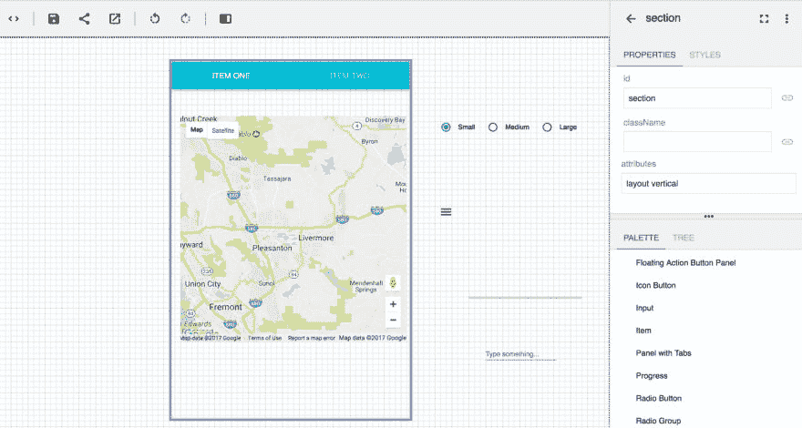
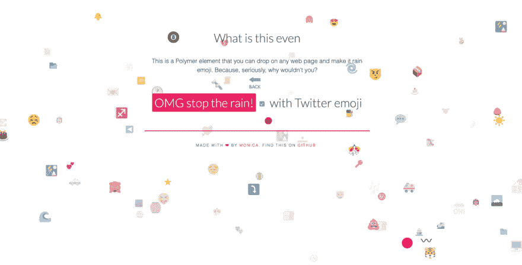

# 不用代码构建应用程序？Web 组件的未来

> 原文：<https://dev.to/thisdotmedia/building-apps-with-no-code-a-web-component-future-dl8>

技术在我们眼前不断进步，速度之快超出了我们的消费和理解能力。在过去的几年里，我们在网站建设能力方面取得了长足的进步。今天，web 开发变得更加容易，因为您可以在 web 上搜索代码片段，然后复制并粘贴到您的站点上。不幸的是，这种方法仍然很混乱，使用这种方法的人通常会将大量代码粘贴到他们不理解的页面上。

我们构建网站的方式在不断变化，进步正在帮助我们过渡到一个开发世界，任何人都可以通过简单的拖放功能来构建复杂的应用程序。是什么促成了这一点？它是 web 组件。可能很难理解，用很少的代码甚至不用代码就能创建出全功能的应用程序，但是有了致力于促进这种范式转变的头脑，我们离这一目标就不远了。谷歌的聚合物项目是致力于这一倡议的项目之一。

Web 组件是可共享的代码片段，您可以在任何应用程序中轻松使用。它们是一种封装元素(如 input 元素或 button 元素)内部的样式和结构的方法。使用 web 组件，您可以打包复杂样式的组件，如日期选择器，并在 web 上使用它们。尽管 web 组件仍然是一个相当新的概念，但是它们的标准化正在创造我们的未来。

在开发标准化过程的同时，Polymer 等项目允许 web 开发人员创建 web 组件，并帮助提供使组件在所有浏览器中工作所需的 polyfills。

Polymer 背后的想法是为 web 开发人员提供一种结构来开发 web 组件并共享它们，而不必担心像处理浏览器兼容性问题这样的任务。定制和创建新的 web 组件是从事 web 组件工作的人试图在社区中培养的东西。Polymer 帮助开发人员使用预构建的 Polymer web 组件并对其进行定制。允许更多地访问 web 组件创建有助于开发生态系统，并使我们更接近主流 web 组件。

Monica ( [@notwaldorf](http://twitter.com/notwaldorf) )自称是谷歌聚合物项目的情绪工程师。在 Google，她致力于通过创建一些特性，让开发人员在开发 web 组件时更加灵活，从而让开发人员的生活变得更加轻松。Monica 曾在各种技术会议上发言，拥有计算机科学背景。

有些人可能想知道为什么谷歌会关心聚合物这样的项目。莫妮卡说，“谷歌对网络组件和聚合物充满热情，因为它们让网络生态系统变得更好。这些举措有助于所有开发者，但也有助于谷歌开发者在内部跨代码库扩展和共享代码。它允许每个人停止再造轮子。”

Monica 回忆起 1995 年，那一年 input 元素第一次出现在浏览器中。input 元素允许 web 开发人员轻松地指定类型，如文本、密码、复选框、单选按钮，甚至今天还有更多。那是 21 年前的事了，浏览器 API 并没有太大变化。目前的浏览器在输入、视频和按钮元素上仍然只有几个元素。

“我们没有任何大的飞跃，比如添加日期选择器，或者跨所有浏览器工作的响应模式。从现在起 20 年后，我们将拥有大量的 web 元素，就像开发人员现在使用输入元素一样，然后，定制元素会感觉很自然，我们会像以前一样使用它们。”

浏览器标准和添加本地元素(如 input 元素)是一个缓慢的过程，这是由于对 API 和跨浏览器团队协议的敏感性。聚合物为人们带来了网络的未来发展，因此生态系统可以更快地移动，我们可以更快地实现更好的网络。

“想想像 jQuery 这样的用于 web 组件的聚合物。如果你生活在 21 世纪，jQuery 使得为 DOM 编写 JavaScript 变得很容易。聚合物对 web 组件做同样的事情。它增加了语法上的甜言蜜语，使得开发平台中缺少的 web 组件和启示变得容易，比如数据绑定和数据传播。”

采用 web 组件的大公司已经成功地使用它们来标准化他们的代码库。如果一个组织有多个项目，他们可以创建一个内部存储库来存放他们的 web 组件，这样团队就可以找到现成的、风格化的组件来用在他们的应用程序中。一个额外的好处是，标准化的组件有助于公司在所有团队和网站上保持一致的品牌和风格。

聚合物组件改变了团队合作的方式。如果一家公司使用聚合物作为实体模型的界面，组织内的设计师将能够将预先制作的元素拖放到页面上，轻松生成有用的实体模型，并与开发团队共享。对于公司来说，更容易的是强制执行严格的指导方针，即他们希望他们的应用程序看起来具有一组特定的视觉元素，这些元素将成为标准。这也使得开发人员更容易用这种方式从模拟中创建 MVP。

谷歌有自己的模型工具，向开发者展示使用聚合物元素的简易性。网站[http://polymer-designer.appspot.com/](http://polymer-designer.appspot.com/)可能有点过时，但是这个工具的第二次迭代正在进行中。模型工具现在是功能性的，允许初学者在不理解 API 的情况下从 API 获得功能。国际化是一个拖放功能，响应性布局和离线存储数据的元素也是如此。你甚至可以不用写一行代码就拥有谷歌地图的功能。

2016 年推出的 Polymer-CLI 项目是谷歌的另一项举措，允许开发者快速开始创建 web 组件。CLI 为开发人员提供快速响应的布局、路线和离线支持服务人员..

“Web 组件也让世界变得更加有趣。你可以创造艺术，或者制作帮助他人创造艺术的组件。我创造的一些最好的 web 组件是表情符号 rain 和 emojilate。Emoji rain 让它在你的页面上降下 Emoji，而 emojilate 拍摄任何图片，并将像素转换为所有 emoji。”

随着 Polymer 等项目的快速发展和 web 组件在现代 web 生态系统中的快速采用，我们可以看到未来将带我们走向何方，并通过现在使用 web 组件在历史上发挥作用。

许多公司已经创建了很棒的免费开源组件供公众使用。一个很好的开始方式是访问[webcomponents.org](http://webcomponents.org)获取定制元素目录。谷歌的聚合物团队已经创建了一套供每个人使用的定制元素，可以在 https://www.webcomponents.org/author/PolymerElements.[的](https://www.webcomponents.org/author/PolymerElements.)找到

*本文由李美玲(*[)@ lady leet](http://twitter.com/ladyleet)*)撰写，他是谷歌开发专家、JavaScript 开发人员，也是* [This Dot Labs](http://thisdot.co/labs)* 的联合创始人，这是一家框架不可知的公司，专注于通过指导&咨询来帮助公司提升他们在前端开发方面的专业知识。*